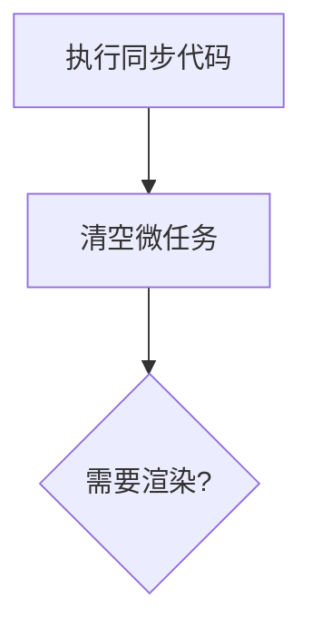
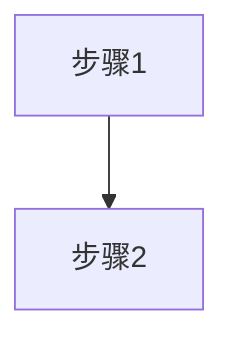

# 前端面试知识体系 — 设计文档

> 面向资深前端开发者的面试复习网站。系统复习 + AI 进阶，拿 Offer 不掉队。
> 构建工具：VitePress · 内容驱动 · 全静态站点 · 视觉优先

---

## 一、产品定位

### 核心理念

**让面临裁员的资深前端在 AI 时代快速重新武装自己。**

传统面试题只解决"现在考什么"，不解决"未来需要什么"。这个站点的独特价值：

```
传统面试站： 八股文 + 刷题 → 拿到 Offer
本 站 点：  体系化复习 + AI 能力进阶 → 拿到 Offer + 不掉队
```

### 目标用户画像

| 属性 | 描述 |
|------|------|
| 身份 | 资深前端开发，经验 5-10 年 |
| 处境 | 即将失业或寻求更好机会，需要重新找工作 |
| 焦虑点 | 基础知识生疏、面试套路不熟、AI 冲击下传统前端价值被质疑 |
| 真实需求 | 短期内系统复习 → 通过面试 → 同时补齐 AI 能力证明自己没掉队 |
| 学习条件 | 每天下班后 2-3 小时，最多 4-8 周准备时间 |

### 核心差异化

> 不是"另一个面试题库"，而是 **"AI 时代资深前端的面试知识体系"**

| 对比项 | 普通面试题站点 | 本网站 |
|--------|---------------|--------|
| 目标 | 刷题通过面试 | 体系化复习 + 能力进阶 |
| 深度 | 题目 + 答案 | 知识体系 + 面试逻辑 + 实战 |
| AI | 无 | 单独模块 + 贯穿各章 |
| 难度分层 | 无 | 🟢🟡🔴 三级递进 |
| 学习路径 | 无 | 4 周/8 周双路线 |
| 进度追踪 | 无 | localStorage 进度环 + 看板 |

---

## 二、内容架构

### 五大模块递进

```
📖 核心基础 →  ⚛️ 框架深入 →  🏗️ 工程架构 →  🤖 AI 开发 →  🎯 面试实战
（HTML/JS/TS） （React/Vue）   （性能/构建/架构） （AI 辅助开发）  （真题/系统设计）
```

### 辅助内容

| 内容 | 位置 | 说明 |
|------|------|------|
| 🧭 学习路线图 | `/roadmap/` | 4 周冲刺 / 8 周系统双路线 |
| 🕸️ 知识体系全景图 | `/graph` | 前端知识体系关联可视化 |
| 📊 学习进度 | `/progress.html` | 个人学习进度看板 |
| 📝 知识测验 | 各模块 quiz 页 | 选择题/判断题巩固 |

### 三级难度递进

| 级别 | 标签 | 前置要求 | 适用场景 |
|------|------|---------|---------|
| 🟢 入门 | `beginner` | 无 | 快速建立知识框架 |
| 🟡 进阶 | `intermediate` | 掌握入门内容 | 深入理解 + 面试高频 |
| 🔴 高级 | `advanced` | 有实践经验 | P7+ 级面试准备 |

---

## 三、内容统计

| 模块 | 预估页数 | 难度分布 |
|------|---------|---------|
| 📖 核心基础 | 20 | 🟢8 + 🟡8 + 🔴4 |
| ⚛️ 框架深入 | 16 | 🟢6 + 🟡6 + 🔴4 |
| 🏗️ 工程架构 | 18 | 🟢6 + 🟡6 + 🔴6 |
| 🤖 AI 辅助开发 | 14 | 🟢6 + 🟡5 + 🔴3 |
| 🎯 面试实战 | 16 | 🟢6 + 🟡6 + 🔴4 |
| 🧭 学习路线图 | 1 | — |
| 🏠 首页 + 其他 | 3 | — |
| **总计** | **88 页** | |

---

## 四、设计原则

### 1. 面试导向
- 每个知识点回答："面试怎么问？" + "怎么答才算好？"
- 标注面试频率：🔥高频 / ⭐中频 / 📌了解
- 附带真题链接和参考回答

### 2. 视觉优先
- **能用流程图说明的，不用段落描述**
- 能用对比表格的，不用列表罗列
- 能用可视化展示关系的，不用文字解释
- **每个页面至少包含一个视觉元素**（流程图/图表/表格/代码对比）

### 3. AI 贯穿
- AI 不只是独立模块，每个技术点都附加 "💡 AI 辅助学习" 提示
- 展示如何用 AI 工具辅助理解、练习和模拟面试
- AI 模块聚焦**开发者的实际生产力提升**，而非 AI 理论

### 4. 渐进式
- 用户可以从首页/路线图两个入口进入
- 每个页面标注难度，方便跳读
- 关联内容通过内部链接 + 全景图打通

### 5. 可执行
- 代码示例必须是可运行的片段
- 面试策略必须有可复用的模板和话术
- 学习路径必须是按天可执行的具体计划

### 6. 保持克制
- 不追求页面数量，追求每个页面的信息密度
- 不添加无意义的交互动效
- 内容胜过形式

---

## 五、视觉系统

### 技术选型

| 方案 | 适用场景 | 示例 |
|------|---------|------|
| **Mermaid.js** | 流程图、时序图、状态图、决策树、泳道图 | 事件循环流程、渲染流水线、面试流程 |
| **自定义 Vue SVG 组件** | 交互式知识图谱、雷达图 | 前端知识体系全景图、工具能力雷达图 |
| **Markdown 表格 + 高亮** | 对比类内容 | 框架对比、存储方案对比 |
| **代码对比块** | Before/After 优化展示 | 优化前后代码、重构对比 |

### Mermaid 集成

通过 `vitepress-plugin-mermaid` 插件支持。

```js
// docs/.vitepress/config.js
import { withMermaid } from 'vitepress-plugin-mermaid'

export default withMermaid({
  mermaid: { theme: 'neutral' }
})
```

之后 Markdown 中直接写：

````markdown

````

### 每个模块的视觉方案

#### 📖 核心基础

| 知识点 | 视觉元素 | 说明 |
|--------|---------|------|
| JS 执行机制 | Mermaid 流程图 | 执行上下文创建 → 编译 → 执行 |
| 事件循环 | Mermaid 时序图 | 调用栈 → Web API → 微/宏任务流转 |
| 原型链 | SVG 关系图 | prototype / __proto__ 指向关系可视化 |
| 浏览器渲染流水线 | Mermaid 流程图 | DOM/CSSOM → Render Tree → Layout → Paint → Composite |
| 跨域方案 | 决策树 + 对比表 | CORS/JSONP/Proxy 场景 × 优缺点矩阵 |
| V8 内存管理 | Mermaid 状态图 | 分代回收状态流转 |
| TS 类型系统 | Mermaid 思维导图 | 类型层级全景 |

#### ⚛️ 框架深入

| 知识点 | 视觉元素 |
|--------|---------|
| React/Vue 生命周期 | Mermaid 时序图 |
| React Fiber 架构 | Mermaid 流程图 |
| Vue 响应式原理 | Mermaid 流程图 |
| Virtual DOM Diff | 流程对比图 |
| 状态管理对比 | 决策树矩阵 |
| 框架选型 | SVG 雷达图 |

#### 🏗️ 工程架构

| 知识点 | 视觉元素 |
|--------|---------|
| Webpack 构建流程 | Mermaid 流程图 |
| Vite HMR 原理 | Mermaid 时序图 |
| Core Web Vitals | 指标卡片 + 阈值表 |
| 性能优化决策树 | Mermaid 决策树 |
| 微前端架构 | 架构分层图 |
| CI/CD 流水线 | Mermaid 流程图 |

#### 🤖 AI 辅助开发

| 知识点 | 视觉元素 |
|--------|---------|
| AI 编程工具对比 | SVG 雷达图 |
| Prompt 公式 | 结构化卡片 |
| AI + 前端工作流 | Mermaid 泳道图 |
| RAG 知识库架构 | 架构图 |
| Agent 架构 | Mermaid 流程图 |

#### 🎯 面试实战

| 知识点 | 视觉元素 |
|--------|---------|
| 面试流程解析 | Mermaid 泳道图 |
| 薪资谈判 | 决策树 |
| 公司面试风格 | 对比表格 + 雷达图 |
| 高频手写题 | 代码对比块 |

### 视觉内容统计

| 视觉类型 | 预计数量 | 覆盖页面 |
|---------|---------|---------|
| Mermaid 流程图 | 30+ | 事件循环、渲染流水线、构建流程等 |
| Mermaid 时序图 | 10+ | 生命周期、HMR、异步流程 |
| Mermaid 决策树 | 5+ | 性能优化、框架选型 |
| Mermaid 泳道图 | 3+ | 面试流程、AI 工作流 |
| 对比表格 | 20+ | 框架对比、存储对比、工具对比 |
| SVG 知识图谱 | 2 | 全景图、关联图 |
| SVG 雷达图 | 3+ | 工具对比、公司对比 |

---

## 六、技术架构

### 选型

| 层面 | 选择 | 理由 |
|------|------|------|
| 框架 | VitePress 1.6 | 内容站最优解，零配置 Markdown，内置搜索 |
| 图表 | Mermaid.js + vitepress-plugin-mermaid | 流程/时序/状态图最广泛支持的社区方案 |
| 交互图表 | 自定义 Vue SVG 组件 | 知识图谱、雷达图等 Mermaid 不适合的场景 |
| 内容格式 | Markdown + YAML frontmatter | 纯文本版本管理，易于扩展 |
| UI 基础 | VitePress Default + 自定义 CSS | 稳定可靠，品牌色定制 |
| 全局组件 | DifficultyBadge（三级难度标签） | 🟢🟡🔴 标签 — 复用 |
| 全局组件 | KnowledgeGraph（知识体系全景） | 前端知识体系 SVG 知识图谱 — 基于 TermGraph 改造 |
| 全局组件 | RadarChart（雷达对比图） | 多维度能力对比 — 新建 |
| 全局组件 | ProgressTracker（浮动进度环） | localStorage + SVG 环形进度 — 复用 |
| 全局组件 | LearningDashboard（学习看板） | 模块级进度展示 — 复用改文案 |
| 全局组件 | ReadingTime（阅读时间） | 文章顶部自动计算 — 复用 |
| 搜索 | VitePress 内置 local search | 零配置全文搜索 |
| 部署 | GitHub Pages + GitHub Actions | 按需部署 |

### 目录结构

```
frontend-interview/
├── DESIGN.md                       # 本设计文档
├── package.json
├── .nvmrc                          # Node 20
├── .gitignore
├── .github/workflows/
│   └── deploy.yml                  # GitHub Actions 自动部署（复用）
├── docs/
│   ├── .vitepress/
│   │   ├── config.js               # 导航栏 + 侧边栏 + 主题（重写）
│   │   └── theme/
│   │       ├── Layout.vue          # 自定义布局（复用）
│   │       ├── index.js            # 注册全局组件（复用模式）
│   │       ├── custom.css          # 全局样式（品牌色替换）
│   │       └── components/
│   │           ├── DifficultyBadge.vue    # 复用
│   │           ├── KnowledgeGraph.vue     # 基于 TermGraph 改造
│   │           ├── RadarChart.vue         # 新建
│   │           ├── ProgressTracker.vue    # 复用（改 STORAGE_KEY）
│   │           ├── LearningDashboard.vue  # 复用（改 PAGE_DEFS）
│   │           └── ReadingTime.vue        # 复用
│   ├── public/
│   │   ├── hero.svg                # 新设计
│   │   ├── logo.svg                # 新设计
│   │   └── favicon.svg
│   ├── index.md                    # 首页（重写）
│   ├── progress.md                 # 学习进度看板（复用改文案）
│   ├── graph.md                    # 知识体系全景图页
│   ├── roadmap/index.md            # 4 周/8 周学习路线图
│   ├── fundamentals/               # 📖 核心基础（20 页）
│   │   ├── index.md
│   │   ├── html-semantic.md
│   │   ├── css-layout.md
│   │   ├── css-responsive.md
│   │   ├── js-execution.md
│   │   ├── js-async.md
│   │   ├── js-prototype.md
│   │   ├── js-event-loop.md
│   │   ├── js-data-types.md
│   │   ├── ts-basics.md
│   │   ├── ts-generics.md
│   │   ├── ts-utility-types.md
│   │   ├── browser-rendering.md
│   │   ├── browser-reflow.md
│   │   ├── browser-cors.md
│   │   ├── browser-security.md
│   │   ├── browser-storage.md
│   │   ├── ts-advanced.md
│   │   ├── v8-engine.md
│   │   ├── memory-management.md
│   │   └── web-worker.md
│   ├── frameworks/                 # ⚛️ 框架深入（16 页）
│   │   ├── index.md
│   │   ├── react-core.md
│   │   ├── react-hooks.md
│   │   ├── vue-core.md
│   │   ├── vue-advanced.md
│   │   ├── framework-comparison.md
│   │   ├── state-management.md
│   │   ├── react-fiber.md
│   │   ├── react-optimization.md
│   │   ├── react-concurrent.md
│   │   ├── vue-compile-optimize.md
│   │   ├── custom-hooks.md
│   │   ├── component-patterns.md
│   │   ├── react-source.md
│   │   ├── vue-source.md
│   │   ├── cross-platform.md
│   │   └── web-components.md
│   ├── engineering/                # 🏗️ 工程架构（18 页）
│   │   ├── index.md
│   │   ├── build-tools-evolution.md
│   │   ├── webpack-core.md
│   │   ├── vite-principles.md
│   │   ├── package-managers.md
│   │   ├── css-engineering.md
│   │   ├── git-workflow.md
│   │   ├── performance-overview.md
│   │   ├── loading-optimization.md
│   │   ├── rendering-optimization.md
│   │   ├── bundle-optimization.md
│   │   ├── frontend-testing.md
│   │   ├── ci-cd.md
│   │   ├── micro-frontend.md
│   │   ├── monorepo.md
│   │   ├── architecture-design.md
│   │   ├── design-patterns.md
│   │   ├── error-monitoring.md
│   │   └── refactoring-strategy.md
│   ├── ai-dev/                     # 🤖 AI 辅助开发（14 页）
│   │   ├── index.md
│   │   ├── ai-tools-overview.md
│   │   ├── prompt-basics.md
│   │   ├── ai-code-gen.md
│   │   ├── ai-debugging.md
│   │   ├── ai-code-review.md
│   │   ├── ai-testing.md
│   │   ├── ai-tool-config.md
│   │   ├── ai-workflow.md
│   │   ├── ai-agent-usage.md
│   │   ├── ai-architecture.md
│   │   ├── prompt-advanced.md
│   │   ├── rag-knowledge-base.md
│   │   ├── build-own-agent.md
│   │   └── ai-interview.md
│   └── interview/                  # 🎯 面试实战（16 页）
│       ├── index.md
│       ├── resume-writing.md
│       ├── interview-flow.md
│       ├── behavioral-questions.md
│       ├── salary-negotiation.md
│       ├── company-selection.md
│       ├── interview-mindset.md
│       ├── handwrite-code.md
│       ├── algorithms-basics.md
│       ├── system-design-1.md
│       ├── system-design-2.md
│       ├── open-questions.md
│       ├── project-deep-dive.md
│       ├── algorithms-advanced.md
│       ├── system-design-3.md
│       ├── leadership.md
│       └── foreign-company.md
```

### 组件清单

| 组件 | 来源 | 改动 |
|------|------|------|
| `DifficultyBadge.vue` | 复用 | 无改动 |
| `KnowledgeGraph.vue` | 基于 TermGraph 改造 | 换节点数据 + 颜色 |
| `RadarChart.vue` | **新建** | SVG 雷达图组件 |
| `ProgressTracker.vue` | 复用 | 改 STORAGE_KEY + PAGE_DEFS + 文案 |
| `LearningDashboard.vue` | 复用 | 改 STORAGE_KEY + PAGE_DEFS + 文案 |
| `ReadingTime.vue` | 复用 | 无改动 |

---

## 七、品牌设计

### 配色方案

```css
:root {
  --vp-c-brand-1: #2563eb;       /* 亮蓝 — 信任感 + 技术感 */
  --vp-c-brand-2: #1d4ed8;       /* hover */
  --vp-c-brand-3: #1e40af;       /* 激活/强调 */
  --vp-c-brand-soft: rgba(37, 99, 235, 0.12);

  --vp-c-accent-1: #f59e0b;      /* 琥珀色 — 面试紧迫感点缀 */
  --vp-c-accent-2: #d97706;

  --vp-home-hero-name-color: transparent;
  --vp-home-hero-name-background: linear-gradient(135deg, #2563eb, #7c3aed, #f59e0b);
  --vp-home-hero-image-background-image: linear-gradient(135deg, #2563eb, #7c3aed, #f59e0b);
  --vp-home-hero-image-filter: blur(72px);

  --vp-font-family-base: 'Inter', 'Noto Sans SC', -apple-system, BlinkMacSystemFont, sans-serif;
  --vp-font-family-mono: 'JetBrains Mono', 'Fira Code', monospace;
}
```

### 配色逻辑

- **亮蓝 (#2563eb)**：核心技术感，建立信任
- **紫色 (#7c3aed)**：AI 模块点缀，延续 ai-knowledge 基因
- **琥珀色 (#f59e0b)**：面试模块点缀，营造紧迫感和提醒注意

---

## 八、首页设计

```
Hero 区
  ┌──────────────────────────────────────────────┐
  │       前端面试知识体系                         │
  │   系统复习 · AI 进阶 · 拿下 Offer              │
  │                                               │
  │  [🧭 开始复习] [📖 核心基础] [🤖 AI 开发]     │
  │              (hero.svg 插图)                   │
  └──────────────────────────────────────────────┘

Features 区（五大模块卡片）
  ┌─────────┐  ┌─────────┐  ┌─────────┐
  │ 📖      │  │ ⚛️      │  │ 🏗️      │
  │ 核心基础│  │ 框架深入 │  │ 工程架构 │
  │ HTML/JS │  │React/Vue│  │ 性能/构建│
  └─────────┘  └─────────┘  └─────────┘
  ┌─────────┐  ┌─────────┐
  │ 🤖      │  │ 🎯      │
  │ AI 开发 │  │ 面试实战│
  │ 辅助编程│  │ 真题/系统│
  └─────────┘  └─────────┘

学习路径区（5 步渐进路径）
  ① 📖 核心基础 → ② ⚛️ 框架深入 → ③ 🏗️ 工程架构
                  ↘            ↙
              ④ 🤖 AI 开发 → ⑤ 🎯 面试实战
```

---

## 九、页面内容规范

### YAML frontmatter

```yaml
---
title: 事件循环 (Event Loop)
description: 浏览器与 Node.js 事件循环机制全解析，含宏任务/微任务执行顺序
difficulty: beginner    # beginner | intermediate | advanced
frequency: high         # high | medium | low — 面试出现频率
---
```

### 文档体结构

```markdown
<DifficultyBadge level="beginner" />

# 标题

## 一句话解释

用一句话说清楚这个知识点是什么。

## 核心流程（视觉优先）



## 深入理解

核心概念的文字解释。

## 代码示例

```js
// 可运行的示例代码
```

## 面试问法

- 🔥 面试中如何考察？
  - 标准回答要点
- ⭐ 进阶追问
  - 加分回答要点

## 💡 AI 辅助学习

> 用这个 Prompt 让 AI 帮你深入理解：
> "我是一名前端开发者，正在复习 [知识点]，请..."

## 关联知识

- [关联页面1](/path/to/page)
- [关联页面2](/path/to/page)
```

---

## 十、后续计划

### Phase A：框架搭建（优先级高）

- [ ] 初始化 VitePress 项目，配置 nav/sidebar
- [ ] 搭建品牌色 custom.css，替换主题
- [ ] 复用/改造 5 个全局组件
- [ ] 新建 RadarChart.vue 组件
- [ ] 配置 Mermaid 插件
- [ ] 编写首页 index.md
- [ ] 配置 GitHub Actions 部署

### Phase B：核心内容（优先级高）

- [ ] 📖 核心基础模块（20 页）
- [ ] ⚛️ 框架深入模块（16 页）
- [ ] 🧭 学习路线图页面

### Phase C：扩展内容（优先级中）

- [ ] 🏗️ 工程架构模块（18 页）
- [ ] 🤖 AI 辅助开发模块（14 页）

### Phase D：面试冲刺（优先级中）

- [ ] 🎯 面试实战模块（16 页）
- [ ] 知识体系全景图 SVG 组件
- [ ] 学习进度追踪 + 看板

### Phase E：体验提升（优先级低）

- [ ] 知识测验（5 个模块 quiz）
- [ ] 相关文章推荐
- [ ] 打印 / PDF 导出优化
- [ ] 内容搜索增强（Pagefind）

---

## 十一、版本记录

| 日期 | 版本 | 变更 |
|------|------|------|
| 2026.07 | v1.0 | 初始设计文档完成，88 页内容规划 |
