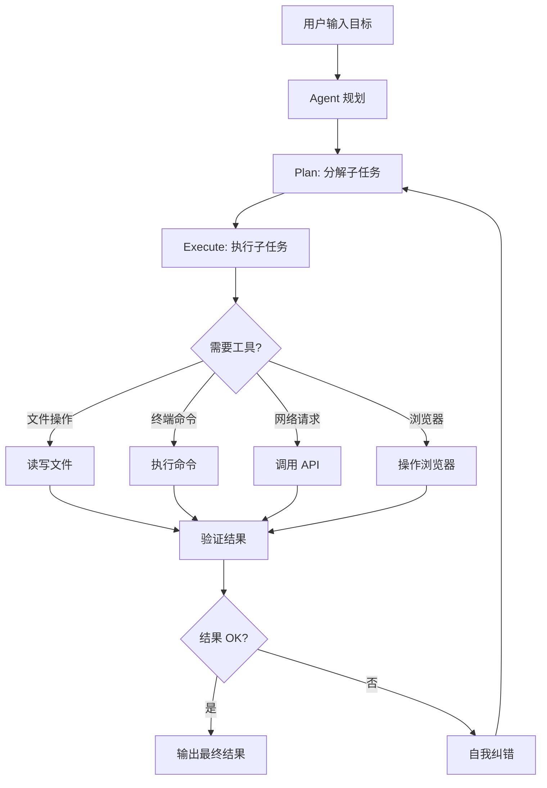
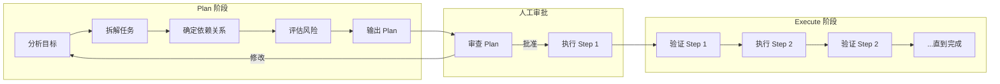
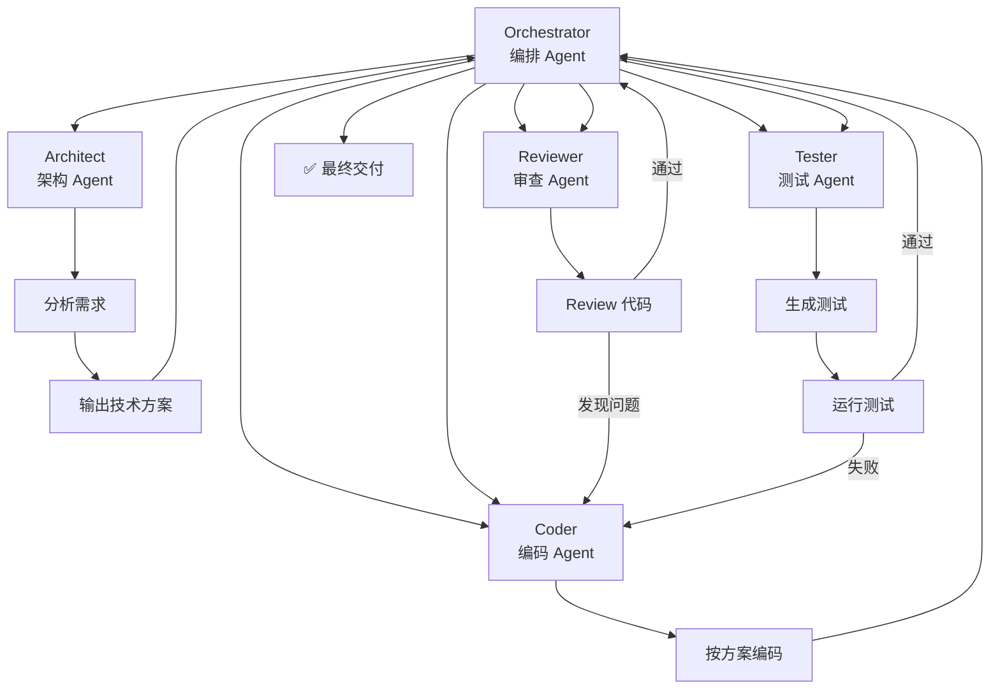
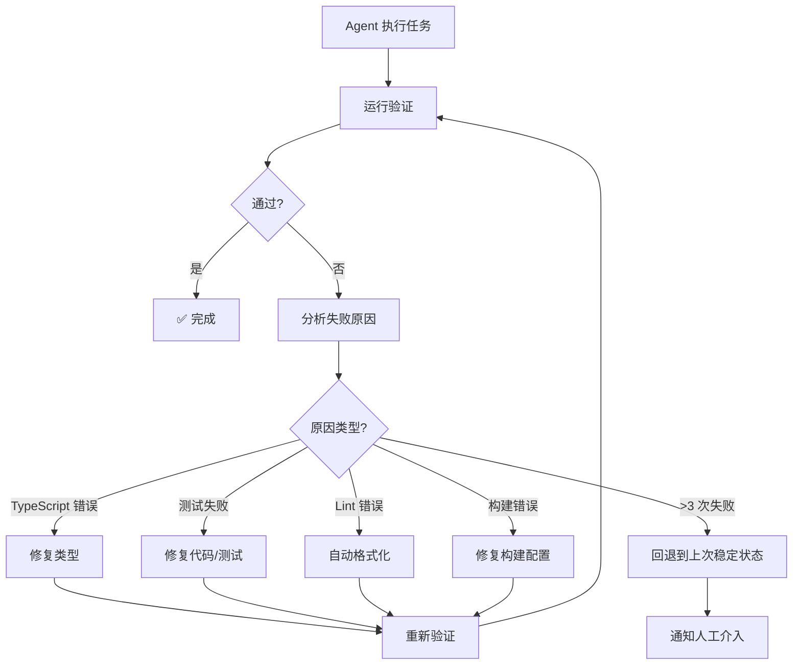

<DifficultyBadge level="advanced" />

# Agent 模式使用

## 一句话解释

Agent 模式是 2026 年 AI 编程的**核心范式转变**——从"你问一句 AI 答一句"的对话模式，进化到**你给一个目标，AI 自主规划、执行、验证、纠错**的自动化模式。

## Agent 的核心能力



**Agent 与普通聊天的区别：**

| 维度 | 普通 AI 聊天 | Agent 模式 |
|------|------------|-----------|
| **交互方式** | 一问一答 | 给目标，自动完成 |
| **规划能力** | 你规划每一步 | AI 自动分解任务 |
| **工具调用** | 无（只能生成文本） | 文件/终端/Git/浏览器 |
| **记忆** | 当前对话 | 可持久化/跨会话 |
| **纠错能力** | 你发现错误后纠正 | AI 自动检测并修复 |
| **执行时长** | 秒级 | 分钟到小时级 |
| **适用场景** | 简单问答/生成 | 复杂任务/自动化流程 |

## 深入理解

### 1. Plan / Execute 分离模式

这是 Agent 最核心的设计模式，**"先想清楚再做"**。



**Cursor Agent 的 Plan/Execute 示例：**

```
User Prompt:
"重构 src/utils/ 下的数据处理函数，使用 pipeline 模式"

Agent Plan 输出:
📋 Plan:
  1. 分析现有函数（5 个文件）
     - formatDate.ts, truncate.ts, validate.ts, transform.ts, filter.ts
  2. 设计 Pipeline 接口
     - compose() / pipe() 函数签名
  3. 逐个重构各函数为可组合的纯函数
  4. 更新测试用例
  5. 验证：运行 tsc + vitest

⏳ 是否需要我执行？(Y/n)
```

### 2. 多 Agent 协作模式

复杂任务不再由单个 Agent 完成，而是**多个 Specialist Agent 协同工作**。



**应用场景：**
- **OpenCode Orchestration**：Orchestrator 分配子任务给 Specialist Agent
- **Cascade（Cursor）**：主 Agent + 子 Agent 协作
- **Claude Code**：单 Agent + Tool Use 深度推理

### 3. 工具调用（Tool Use）

Agent 的能力取决于它能调用的工具种类：

| 工具类别 | 具体能力 | 用途 |
|---------|---------|------|
| **文件系统** | 读/写/编辑/搜索文件 | 代码操作基础 |
| **终端** | 运行命令/脚本/构建 | 执行测试、构建 |
| **Git** | commit/branch/diff/log | 版本管理 |
| **搜索** | 文件搜索/Web 搜索 | 信息检索 |
| **数据库** | 查询/修改 Schema | 数据操作 |
| **浏览器** | 截图/点击/表单 | E2E 测试 |
| **API** | HTTP 请求 | 联调/对接 |

**工具安全性考量：**

```
高风险操作需要人工确认：
✅ 允许：文件读写、运行测试、git commit、搜索
⚠️ 确认：删除文件、修改配置文件、npm publish
❌ 禁止：rm -rf、sudo、生产环境操作
```

### 4. 自主纠错（Self-Healing）

Agent 最具价值的能力之一——**出了问题自己修**。



**实际例子：**
```
Agent: "我正在添加用户列表搜索功能..."
Agent: "执行 TypeScript 检查... ❌ 发现类型错误"
Agent: "分析：SearchBar 组件的 onChange 类型与父组件不匹配"
Agent: "修复：更新类型定义..."
Agent: "重新执行 TypeScript 检查... ✅ 通过"
Agent: "运行测试... ✅ 全部通过"
Agent: "功能已完成"
```

### 5. 2026 年各工具的 Agent 能力对比

| 工具 | Agent 模式 | Cloud Agent | 多 Agent | 工具链 | 最适用场景 |
|------|-----------|------------|---------|--------|-----------|
| **Cursor** | ✅ Plan/Execute | ✅ 7x24 | ✅ Cascade | ✅ MCP | 日常开发 + 异步自动化 |
| **Claude Code** | ✅ 终端 Agent | ❌ | ❌ | ✅ MCP | 复杂重构 + 深度推理 |
| **GitHub Copilot** | ✅ Spark | ❌ | ❌ | ❌ | 轻量生成 |
| **OpenCode** | ✅ Orchestration | ✅ | ✅ Specialist | ✅ Skills | 自定义工作流 |
| **Devin Desktop** | ✅ Plan/Execute | ✅ Cloud | ✅ | ✅ Plugins | 团队协作 |

## 面试问法

- 🔥 **你怎么用 AI Agent 模式？和普通聊天有什么区别？**
  - 回答框架：Plan/Execute 分离 → 自动工具调用 → 自我纠错
  - 核心：**Agent 是"给目标"，普通聊天是"给指令"**

- 🔥 **多 Agent 协作了解吗？**
  - 回答框架：Orchestrator + Specialist Agent 模式
  - 加分点：提到 OpenCode 的 Orchestration / Cursor Cascade

- ⭐ **AI Agent 的局限性？什么场景不适合？**
  - 回答框架：上下文窗口限制、复杂决策需要人判断、安全问题
  - 核心：**Agent 是加速器，架构设计还是需要人做主**

## 💡 AI 辅助学习

**向 AI 提问：**
- "用 Cursor Agent 模式重构一个 React 组件的最佳实践是什么？"
- "OpenCode 的 Orchestration 怎么配置多个 Specialist Agent 协作？"
- "Claude Code 的 Agent 模式和 Cursor 的 Agent 模式有什么本质区别？"
- "我想给 AI Agent 添加自定义工具，通过 MCP 怎么实现？"

## 关联知识

- [AI 工具配置与定制](./ai-tool-config) — Agent 配置/Rules/MCP
- [AI + 前端工作流](./ai-workflow) — Agent 在工作流中的位置
- [构建自己的 AI Agent](./build-own-agent) — 从使用到构建
- [MCP 协议基础](./ai-tool-config#mcp-协议model-context-protocol)
