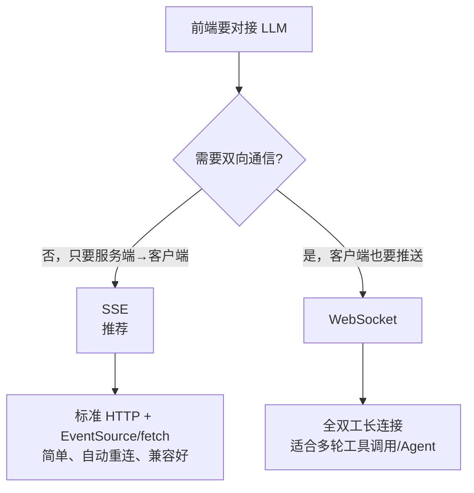
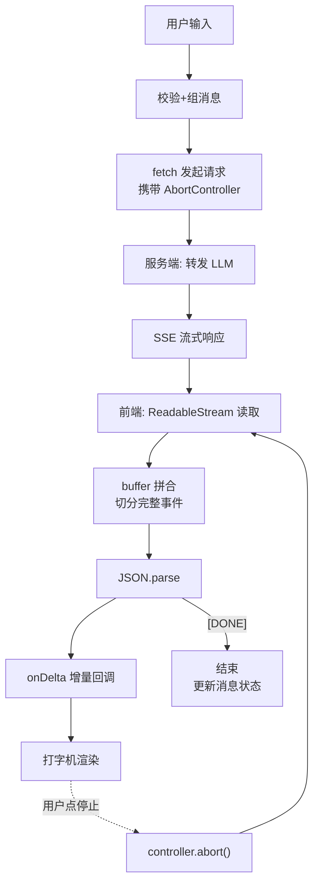

<DifficultyBadge level="intermediate" />

# AI 应用前端开发

## 一句话解释

AI 应用前端开发的核心不是"调 API"，而是**把模型生成的流式数据平滑、可中断、可恢复地渲染到界面上**——SSE 协议、流式解析器、取消请求，这些才是 2026 年 AI 前端岗的真实面试考点。

## 为什么 AI 应用的前端不一样

传统前端等一次 HTTP 响应，AI 应用则要处理**几秒甚至几十秒的生成过程**：

| 维度 | 传统请求 | AI 生成请求 |
|------|---------|------------|
| **响应时长** | 毫秒级 | 秒~分钟级 |
| **返回方式** | 一次性 JSON | 流式分片返回 |
| **用户等待** | Loading 转圈 | 逐字输出（打字机） |
| **中断** | 罕见 | 用户会点"停止生成" |
| **错误时机** | 请求开始即知 | 可能生成一半出错 |

这决定了你必须掌握：**SSE / WebSocket** 二选一 + **手写流式解析器**。

## 传输方式选型



| 对比项 | SSE | WebSocket |
|--------|-----|-----------|
| **方向** | 单向（服务端→客户端） | 全双工 |
| **底层协议** | 普通 HTTP | WS 独立协议 |
| **自动重连** | ✅ EventSource 内置 | ❌ 需自己实现 |
| **跨域** | 普通 CORS 规则 | 需额外握手配置 |
| **中间件兼容** | 好（就是 HTTP） | 有的网关/代理要单独配 |
| **典型场景** | 对话流式输出 | Agent 工具调用、实时协作 |
| **2026 现状** | 90% 的 Chat 应用默认选择 | 复杂 Agent 场景再用 |

<div class="analogy-card">
  <span class="analogy-title">🎬 生活类比：水龙头 vs 对讲机</span>
  <div class="analogy-body">
    <strong>SSE 是"水龙头"</strong>：你拧开龙头（发起请求），水（内容）源源不断流出来，不用你反复问"还有吗？"。<strong>WebSocket 是"对讲机"</strong>：两边随时都能喊话，不只是你听它说。LLM 对话本质是"你问它答"——你只需要一根<em>出水的水管（SSE）</em>；只有当 AI 要主动给你推消息（Agent 实时汇报、协作编辑）时，才需要<em>对讲机（WS）</em>。
  </div>
</div>

**为什么 SSE 是 2026 年 Chat 应用的主流：**
- LLM API 大多是"你问它答"的单向流，不需要客户端推送
- SSE 走标准 HTTP，负载均衡、缓存、监控体系都能复用
- `EventSource` 自带断线重连，省一堆代码

## 手写流式解析器（面试必考）

### 1. 认识 SSE 数据格式

SSE 流按 `\n\n` 分隔事件，每行是 `field: value`：

```
data: {"id":"1","delta":"你好"}

data: {"id":"1","delta":"，世界"}

data: [DONE]

```

**关键坑：`fetch` 的响应是一块块到的，不能一次 `res.json()`，必须流式读取。**

<div class="analogy-card">
  <span class="analogy-title">🎬 生活类比：拼贴撕碎的纸条</span>
  <div class="analogy-body">
    服务器发来的不是一整封信，而是一把<strong>被撕碎的纸条</strong>，还按信封（网络包）一包包送来。<strong>每一包都可能：纸条是半截的（中文被切成两半）、一行话跨两个信封、甚至半句话正好卡在信封口。</strong>所以你要：<em>先收到自己桌上的"待拼区"（buffer），拼出完整的纸条（\n\n 事件）才去读内容；拼不完整的就留在桌上等下一包。</em>
  </div>
</div>

### 2. 用 fetch + ReadableStream 手写解析

> **面试核心代码**：2026 年多家大厂 AI 应用开发岗让候选人现场手写。

```js
async function streamChat(prompt, onDelta, onDone, onError) {
  const res = await fetch('/api/chat', {
    method: 'POST',
    headers: { 'Content-Type': 'application/json' },
    body: JSON.stringify({ messages: [{ role: 'user', content: prompt }] })
  });

  if (!res.ok) {
    const err = await res.json().catch(() => ({}));
    throw new Error(err.message || `HTTP ${res.status}`);
  }

  const reader = res.body.getReader();
  const decoder = new TextDecoder('utf-8');
  let buffer = ''; // 跨 chunk 的缓冲区

  // 读流的核心：异步迭代
  // eslint-disable-next-line no-constant-condition
  while (true) {
    const { done, value } = await reader.read();
    if (done) break;

    // 每块可能是半个字符/半条消息，先拼进 buffer
    buffer += decoder.decode(value, { stream: true });

    // 按空行切分事件
    const events = buffer.split('\n\n');
    buffer = events.pop(); // 最后一段可能不完整，留到下次

    for (const event of events) {
      for (const line of event.split('\n')) {
        if (!line.startsWith('data:')) continue;
        const data = line.slice(5).trim();
        if (data === '[DONE]') {
          onDone?.();
          return;
        }
        try {
          const json = JSON.parse(data);
          onDelta?.(json.delta?.content ?? '');
        } catch {
          // 忽略非 JSON 行（如注释行 : keep-alive）
        }
      }
    }
  }
  onDone?.();
}

// 用法
streamChat(
  '用一句话介绍 Vue 3',
  (text) => console.log('增量:', text),
  () => console.log('完成'),
  (err) => console.error(err)
);
```

**这段代码必须能讲清楚三个设计点：**
1. **`decoder.decode(value, { stream: true })`**：多字节字符可能被拆到两个 chunk，`{stream:true}` 保证不产生乱码
2. **`buffer` 机制**：一条消息可能横跨多个 chunk，必须缓冲到出现完整 `\n\n`
3. **`[DONE]` 哨兵**：服务端约定的结束标志，读到就终止

### 3. 取消请求（AbortController）

AI 生成很慢，用户一定会点"停止"。

```js
const controller = new AbortController();

// 生成按钮
function onSend() {
  streamChatWithSignal(prompt, controller.signal);
}

// 停止按钮
function onStop() {
  controller.abort(); // 触发 reader.read() 抛 AbortError
}

async function streamChatWithSignal(prompt, signal) {
  try {
    const res = await fetch('/api/chat', {
      method: 'POST',
      headers: { 'Content-Type': 'application/json' },
      body: JSON.stringify({ messages: [{ role: 'user', content: prompt }] }),
      signal
    });
    const reader = res.body.getReader();
    // ... 同上解析逻辑
  } catch (err) {
    if (err.name === 'AbortError') {
      console.log('用户取消了生成');
      // 注意：服务端可能已生成一部分，需标记消息为"已中断"
      updateMessageStatus(msgId, 'interrupted');
    } else {
      onError(err);
    }
  }
}
```

**注意点：**
- 取消后要**明确标记消息状态**（如"已停止生成"），而不是悄悄消失
- `AbortController` 是 2026 年浏览器标准，面试别只提"用个 flag"

## 官方 SDK 与手写的取舍

| 方案 | 优点 | 缺点 | 适合场景 |
|------|------|------|---------|
| **Vercel AI SDK** | 开箱即用、内置 React hooks、流式适配 | 依赖重、定制受限 | 快速原型、标准 Chat |
| **手写解析器** | 零依赖、完全可控、面试加分 | 要处理边界情况 | 理解原理、深度定制 |
| **各家云 SDK** | 对接自家模型最省事 | 厂商锁定 | 单一云平台 |

**Vercel AI SDK 用法示例（了解即可）：**

```jsx
import { useChat } from 'ai/react';

function Chat() {
  const { messages, input, handleInputChange, handleSubmit, stop } = useChat({
    api: '/api/chat',      // 内部已处理流式解析
    streamMode: 'text',    // 文本流模式
  });

  return (
    <div>
      {messages.map((m) => <div key={m.id}>{m.content}</div>)}
      <form onSubmit={handleSubmit}>
        <input value={input} onChange={handleInputChange} />
        <button type="submit">发送</button>
        <button type="button" onClick={stop}>停止</button>
      </form>
    </div>
  );
}
```

**面试话术：** "生产项目我会先手写一遍解析器理解原理，再评估是否引入 SDK。手写版 ~50 行，可控性高，避免为一个小功能引入整包依赖。"

## 完整调用链路



## 面试问法

- 🔥 **手写一个 SSE 流式解析器，要求能处理分片乱码**
  - 回答框架：`getReader()` → `TextDecoder({stream:true})` → buffer 拼合 → `\n\n` 切分 → `[DONE]` 结束
  - 核心：**三个边界**（半字、半消息、取消）必须主动提到

- 🔥 **为什么 Chat 应用用 SSE 而不是 WebSocket？**
  - 回答框架：单向流够用 → SSE 走 HTTP 兼容好 → EventSource 自动重连
  - 加分点：补充"Agent 多轮工具调用需要双向时再上 WebSocket"

- ⭐ **怎么实现"停止生成"？**
  - 回答框架：AbortController → abort 触发 AbortError → 标记消息为已中断
  - 加分点：提 `signal` 还能传 `fetch` 之外的其他操作（如延时可取消）

- ⭐ **流式输出中遇到中文乱码怎么排查？**
  - 回答框架：先看是否用 `TextDecoder` 且带 `{stream:true}` → 再看 buffer 拼接是否在 `\n\n` 边界 → 最后看服务端编码声明

## 💡 AI 辅助学习

**向 AI 提问：**
- "手写一个支持重连和心跳的 SSE 客户端，注释详细"
- "Vercel AI SDK 和手写解析器的性能对比分析"
- "我的 fetch 流解析遇到乱码，给出完整调试流程"
- "SSE、WebSocket、轮询三种方案给聊天应用，帮我做技术选型矩阵"

## 关联知识

- [LLM 核心原理](./llm-basics) — Token/上下文/参数的前置基础
- [AI 对话界面工程](./ai-chat-ui) — 拿到增量后如何渲染（防截断/滚动）
- [构建自己的 AI Agent](./build-own-agent) — Agent 场景的双向通信
- [前端 AI 安全](./ai-security) — 流式场景下的注入与泄露风险
