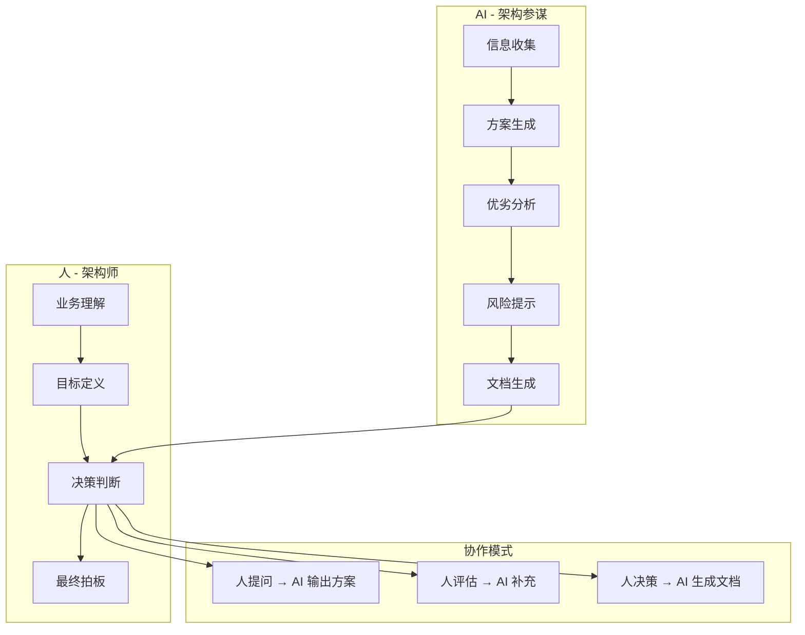
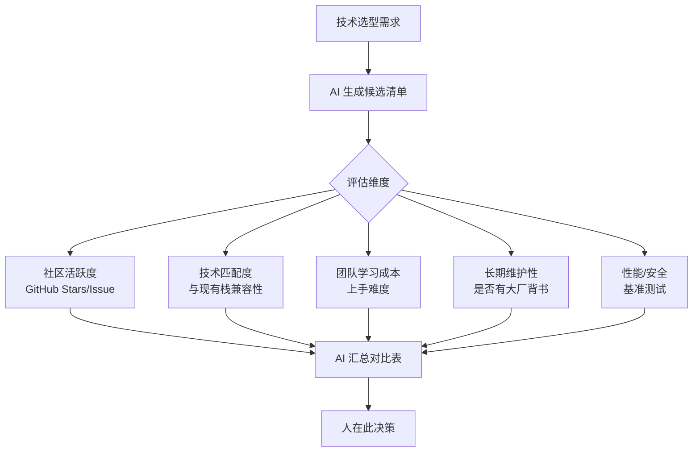

<DifficultyBadge level="advanced" />

# AI 辅助架构设计

## 一句话解释

AI 不能替你做架构决策，但可以是**最好的架构参谋**——它能快速生成多套方案对比、识别设计盲区、生成架构文档、帮你在 30 分钟内完成原本需要几天的调研工作。

## AI 在架构设计中的位置



> **核心原则**：AI 是"参谋"不是"司令"。**架构决策的责任永远在人身上。**

## 深入理解

### 1. 需求分析阶段

**Prompt 模板：**
```
我是一个前端架构师，正在设计一个[项目类型]的架构。
请帮我分析以下需求，识别架构关键约束：

项目背景：[描述]
核心功能：[功能列表]
团队规模：[人数]
技术约束：[已有技术栈]
性能要求：[如 PV/延迟要求]

请输出：
1. 需求中的架构关键约束（前 5 个最重要的）
2. 潜在的技术风险
3. 需要进一步澄清的问题
4. 推荐的技术栈方向（至少 2 套方案对比）
```

**实际案例：**
```
用户输入：
"设计一个企业级低代码平台的前端架构，
核心功能是拖拽生成表单和页面，
团队 8 人（前端 5 + 后端 3），
已有技术栈 React + Ant Design，
目标部署方式私有化部署。"

AI 输出关键约束：
1. 组件可扩展性——用户可能自定义组件
2. 运行时性能——复杂表单可能有 100+ 字段
3. 离线存储——草稿本地保存
4. 多版本管理——发布版本回退
5. 插件化架构——降低团队耦合
```

### 2. 多方案生成与对比

**Prompt 模板：**
```
基于以下需求，请给出 3 套前端架构方案：

需求：[简述]
关键约束：[列表]
技术栈倾向：[如有]

对于每套方案，请从以下维度对比：
1. 架构图（Mermaid）
2. 组件拆分方案
3. 数据流设计
4. 状态管理选型
5. 构建/部署方案
6. 优势
7. 劣势
8. 适用场景
9. 实施难度（1-5）
10. 维护成本（1-5）
```

**输出效果示意：**

| 维度 | 方案 A：微前端 | 方案 B：Monorepo | 方案 C：单体+模块化 |
|------|:------------:|:----------------:|:----------------:|
| **适用场景** | 多团队协作 | 中大型团队 | 中小型团队 |
| **实施难度** | 4/5 | 3/5 | 2/5 |
| **维护成本** | 3/5 | 3/5 | 4/5（后期）|
| **独立性** | ✅ 最高 | ⚠️ 中 | ❌ 低 |
| **推荐** | ⭐ 5 个以上团队 | ⭐ 3-5 人团队 | ⭐ 3 人以下 |

### 3. 技术选型辅助



**Prompt 示例：**
```
我要为前端项目选择状态管理方案，候选有 Zustand、Jotai、Valtio、Pinia。

请从以下维度帮我对比：
1. 包体积（min+gzip）
2. TypeScript 支持度
3. 学习曲线
4. 性能（重渲染优化）
5. 中间件/插件生态
6. DevTools 支持
7. 与服务端状态（React Query/SWR）的配合度
8. 2026 年的社区活跃度趋势

当前项目：React 19 + TypeScript + React Query，
主要场景是中后台表单 + 实时数据列表。
```

### 4. 架构评审辅助

AI 可以模拟架构评审会，帮你发现设计盲区：

```
你是一个架构评审专家，请 Review 以下架构方案：

[粘贴架构方案]

请从以下角度提出质疑：
1. 🔴 阻塞性问题（必须解决才能落地）
2. 🟡 建议性问题（强烈建议改进）
3. 🟢 可选建议（可以做得更好）

每个问题请说明：
- 为什么这是问题
- 可能的后果
- 改进建议
```

**常见 AI 发现的架构盲区：**

| 类别 | 典型问题 | AI 能发现吗？ |
|------|---------|:------------:|
| **性能** | 缺少缓存策略、N+1 查询 | ✅ 能 |
| **安全** | XSS/CSRF 未处理、权限校验缺失 | ✅ 能 |
| **可扩展** | 硬编码配置、模块耦合度高 | ✅ 能 |
| **可测试** | 依赖注入缺失、副作用未隔离 | ✅ 能 |
| **业务** | 业务规则理解偏差 | ❌ 不能 |
| **团队** | 不符合团队技能水平 | ❌ 不能 |

### 5. 架构文档生成

```markdown
Prompt:
"请基于以下架构设计，生成一份完整的架构文档：

架构总结：[一句话描述]
组件树：[列表]
数据流：[描述]
技术选型：[清单]

文档格式：
# 架构设计文档

## 1. 背景与目标
## 2. 总体架构
## 3. 模块/组件设计
## 4. 数据流设计
## 5. 技术选型与理由
## 6. 关键路径设计
## 7. 性能/安全/可扩展性
## 8. 部署方案
## 9. 风险与缓解措施
## 10. 未来规划
"
```

### AI 辅助架构设计的限制

| 限制 | 说明 | 人如何弥补 |
|------|------|-----------|
| **不了解组织文化** | 不知道团队偏好、历史包袱 | 人补充组织上下文 |
| **缺乏业务深度** | 不懂行业特定规则 | 人做业务判断 |
| **可能过度工程** | AI 倾向于复杂方案 | 人保持"够用就好"原则 |
| **信息时效性** | AI 知识可能有截止日期 | 人验证最新信息 |
| **无法承担责任** | 错了是 AI 的锅？不，是你的 | 人始终拥有最终决策权 |

## 面试问法

- 🔥 **AI 能帮你做架构设计吗？你怎么用的？**
  - 回答框架：AI 做方案生成和对比 → 人做决策和判断 → AI 生成文档
  - 核心：**AI 是参谋，人是司令**

- ⭐ **AI 辅助架构设计有什么风险？**
  - 回答框架：过度工程、忽略组织约束、信息时效性
  - 加分点：提到"验证 AI 建议"的具体方法

- 📌 **怎么判断 AI 给的方案好不好？**
  - 回答框架：对照需求清单检查 → 用评审 Prompt 让 AI 自检 → 结合团队实际情况

## 💡 AI 辅助学习

**向 AI 提问：**
- "我要设计一个 B 端中后台项目的架构，帮我生成 3 套方案并对比"
- "帮我 Review 一下这个架构方案，找出潜在问题"
- "我是一个 3 年经验的前端，准备做架构师方向，给我一个学习路线"
- "React + Zustand + React Query 这套技术栈做中后台，有什么架构最佳实践？"

## 关联知识

- [Agent 模式使用](./ai-agent-usage) — AI Agent 架构思维
- [AI + 前端工作流](./ai-workflow) — AI 在架构阶段的工作流位置
- [构建自己的 AI Agent](./build-own-agent) — 用 AI 辅助构建 AI 系统
- [前端系统设计 ①](../interview/system-design-1) — 系统设计面试方法
