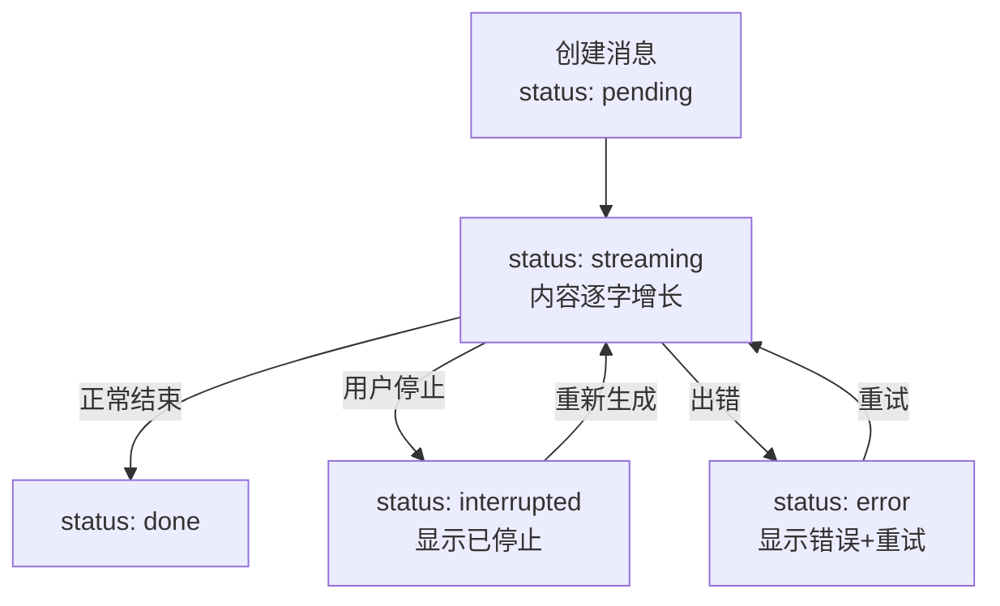
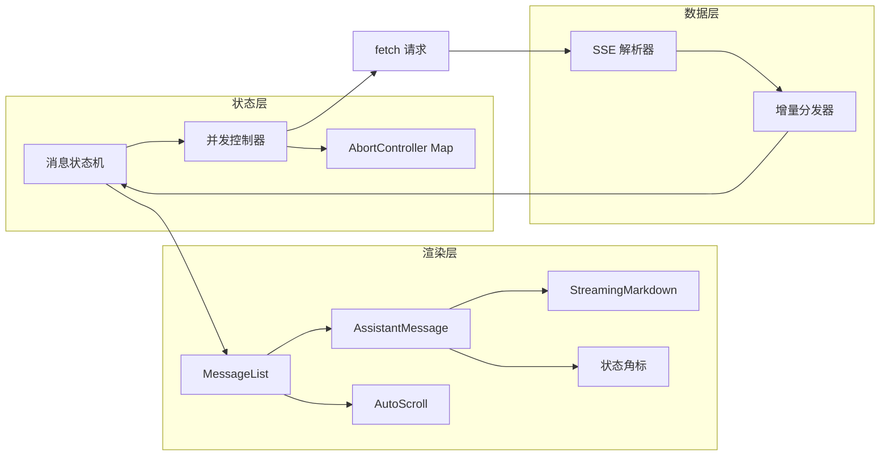

<DifficultyBadge level="intermediate" />

# AI 对话界面工程

## 一句话解释

AI 对话界面工程是**把"流式增量"变成"丝滑对话体验"的 UI 工程**——比普通聊天多出打字机渲染、Markdown 防截断、智能滚动、消息状态机四大难题，是 2026 年 AI 应用前端岗的实战场。

## 消息状态机（一切 UI 的基础）

AI 消息的生命周期比普通消息复杂得多：**生成中、生成完、已中断、出错了**。



**状态定义与渲染策略：**

| 状态 | 含义 | UI 表现 |
|------|------|---------|
| `pending` | 排队/请求中 | 光标闪烁，无内容 |
| `streaming` | 生成中 | 打字机 + 光标 |
| `done` | 完成 | 正常渲染，无光标 |
| `interrupted` | 用户中断 | 内容保留 + "已停止"标签 + 继续按钮 |
| `error` | 失败 | 错误提示 + 重试按钮 |

**反模式提醒：** 很多初版实现只用一个 `loading` boolean，导致"中断"和"出错"无法区分，用户不知道发生了什么。**状态机是 Chat UI 的骨架。**

## 打字机效果的正确实现

```jsx
function AssistantMessage({ message }) {
  // 用 useRef 缓存完整内容，避免每次渲染重新解析
  const [display, setDisplay] = useState('');
  const doneRef = useRef(false);

  // 增量追加，而不是每帧重新渲染全量
  const appendDelta = useCallback((delta) => {
    setDisplay((prev) => prev + delta);
  }, []);

  useEffect(() => {
    // 订阅流式增量（来自上层的解析器回调）
    const unsub = subscribe(message.id, (delta) => {
      doneRef.current = false;
      appendDelta(delta);
    });
    return unsub;
  }, [message.id, appendDelta]);

  // 生成结束后切回完整内容（防止增量回调丢失最后一块）
  useEffect(() => {
    if (message.status === 'done' && !doneRef.current) {
      doneRef.current = true;
      setDisplay(message.content);
    }
  }, [message.status, message.content]);

  return <div className="msg">{display}</div>;
}
```

**三个必须注意的点：**
1. **增量更新 vs 全量覆盖**：全量覆盖每次会重渲染几千字，卡顿
2. **流结束兜底**：网络抖动丢最后一块时，`done` 状态用完整内容补上
3. **React 18 的并发特性**：高频增量更新用 `useTransition` 或节流合并，避免阻塞主线程

## 流式 Markdown 渲染（防截断闪烁）

AI 输出的是 Markdown，但**流式过程中 Markdown 是"半成品"**——代码块还没闭合，表格还差一行。

**经典 Bug 演示：**

```
用户看到的瞬间：      |  渲染器处理：
```js              →  "```" 未闭合 → 整块被当普通文本
const x = 1        →  瞬间闪出一堆乱码
```                →  3 帧后才正常
```

**解决方案分层：**

| 方案 | 做法 | 效果 |
|------|------|------|
| **等待闭合再渲染** | 检测到未闭合的 ``` 时不渲染该块 | 简单，但实时性差 |
| **用 react-markdown 流式适配** | 每次增量重新解析，CSS 过渡动画 | 主流方案 |
| **关闭代码块高亮动画** | 减少闪动感 | 体验兜底 |

**推荐实践：**

```jsx
import ReactMarkdown from 'react-markdown';

function StreamingMarkdown({ content, status }) {
  // 未闭合的代码块先补上闭合标记，避免渲染成纯文本
  const normalized = useMemo(() => {
    const fences = (content.match(/```/g) || []).length;
    if (fences % 2 === 1) return content + '\n```';
    return content;
  }, [content]);

  return (
    <div className={status === 'streaming' ? 'streaming-md' : 'md'}>
      <ReactMarkdown>{normalized}</ReactMarkdown>
      {status === 'streaming' && <Cursor />}
    </div>
  );
}

// CSS：流式时禁止代码块闪烁
.streaming-md pre { transition: none; }
.streaming-md code { animation: none; }
```

**为什么"补闭合"比"等闭合"好：** 用户看到的是**连续的过程**，中途闪一下纯文本再变代码块，比始终正确的代码块更有"顿挫感"。2026 年主流 Chat 产品都采用"即时渲染 + 小动画补偿"。

## 智能滚动（不打断阅读）

AI 回复很长，滚动处理不好会**反复打断用户阅读**。

```jsx
function useAutoScroll(scrollRef, isStreaming) {
  // 用户是否在手动向上翻阅
  const isUserScrolling = useRef(false);
  // 是否应跟随滚动
  const stickToBottom = useRef(true);

  // 监听用户滚动：向上翻 = 放弃跟随
  useEffect(() => {
    const el = scrollRef.current;
    if (!el) return;
    const onScroll = () => {
      const { scrollTop, scrollHeight, clientHeight } = el;
      const dist = scrollHeight - scrollTop - clientHeight;
      if (dist > 120) stickToBottom.current = false;
      else stickToBottom.current = true;
      isUserScrolling.current = true;
    };
    el.addEventListener('scroll', onScroll, { passive: true });
    return () => el.removeEventListener('scroll', onScroll);
  }, [scrollRef]);

  // 增量到来时：若用户在看底部才跟随
  useEffect(() => {
    if (isStreaming && stickToBottom.current) {
      const el = scrollRef.current;
      el.scrollTop = el.scrollHeight;
    }
  }, [isStreaming, scrollRef]);
}
```

**规则一句话：** 用户没在翻历史 → 跟随底部；用户在翻 → 停止打扰，等用户回到底部再跟随。

**加分细节：**
- **防抖**：高频增量时用 `requestAnimationFrame` 合并滚动操作
- **"回到底部"按钮**：用户离开底部时显示一个浮动按钮，点击回到最新
- **避免 `scroll-behavior: smooth` 在流式时开启**：连续跳动会很难受，用瞬时跳转

## 并发与请求控制

一个 Chat 界面同时只能有一个生成请求？不一定——**2026 年的复杂产品支持"停止一个、继续另一个"**，但要处理好竞态。

```js
// 用 AbortController Map 管理多个进行中的请求
const activeControllers = new Map(); // messageId -> AbortController

function sendMessage(messageId, content) {
  const controller = new AbortController();
  activeControllers.set(messageId, controller);

  streamChat(content, {
    signal: controller.signal,
    onDone: () => activeControllers.delete(messageId),
    onError: (err) => {
      if (err.name !== 'AbortError') {
        updateMessageStatus(messageId, 'error');
      }
      activeControllers.delete(messageId);
    }
  });
}

function stopMessage(messageId) {
  activeControllers.get(messageId)?.abort();
  updateMessageStatus(messageId, 'interrupted');
}
```

**竞态场景（面试加分点）：**
- 用户点"重新生成" → 旧的还在流 → **必须先把旧的 abort**
- 用户快速连发两条 → 两条并行还是排队？**产品决策**：多数产品串行（防止模型混淆上下文）
- 中断后立刻重发 → 旧消息的 `onDone` 晚到 → 用 `messageId` 校验，**只更新最新实例**

## 完整架构图



## 面试问法

- 🔥 **流式输出时 Markdown 代码块怎么渲染不闪屏？**
  - 回答框架：未闭合 fence 补全 → react-markdown 增量渲染 → 流式期间禁用代码块动画
  - 加分点：主动聊"用户感知的连续过程比绝对正确更重要"

- 🔥 **自动滚动怎么做才能不打扰用户？**
  - 回答框架：监听 scroll 事件 → 距底部超过阈值视为"用户翻阅" → 停跟随 + 显示回底部按钮
  - 核心：**跟随是默认，不跟随是用户选择**

- ⭐ **消息状态机怎么设计？**
  - 回答框架：pending/streaming/done/interrupted/error 五态 → 每态对应不同 UI 与操作
  - 加分点：强调"中断"和"错误"必须分开，否则重试逻辑会坏

- ⭐ **多消息并发时怎么防止竞态？**
  - 回答框架：messageId + AbortController Map → 重新生成前先 abort 旧的 → 回调校验 messageId
  - 加分点：聊"串行 vs 并行"是产品决策，技术要支持切换

## 💡 AI 辅助学习

**向 AI 提问：**
- "给我一个 React 流式 Markdown 渲染组件，支持代码块防闪烁"
- "Chat UI 的消息状态机用 TypeScript 怎么写类型定义？"
- "自动滚动和打字机效果怎么用 rAF 优化性能？"
- "对比 Cursor、Claude 的聊天界面，它们的流式渲染有什么设计差异？"

## 关联知识

- [AI 应用前端开发](./ai-app-frontend) — 流式数据的获取与解析
- [LLM 核心原理](./llm-basics) — 为什么输出是"增量"的
- [AI 辅助架构设计](./ai-architecture) — Chat UI 的整体架构设计
- [前端 AI 安全](./ai-security) — 渲染 AI 输出的 XSS 防护
