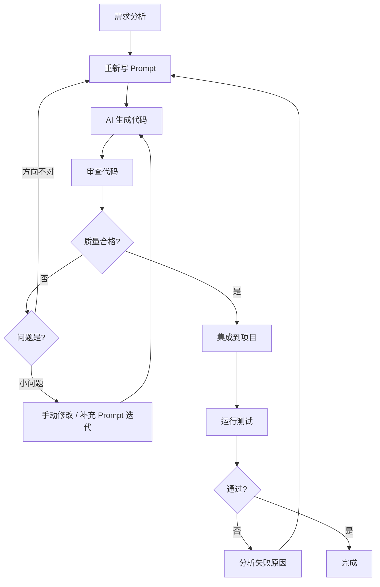

<DifficultyBadge level="beginner" />

# AI 代码生成实战

## 一句话解释

AI 代码生成不是"让 AI 自动写所有代码"，而是**把 AI 当成一个高效的结对编程伙伴**——你设计架构和做决策，AI 负责实现细节。

## 核心流程



## 深入理解

### 1. 代码生成的最佳实践

**分步生成 > 一次性生成**

```
❌ 一个大 Prompt 让 AI 生成完整应用
→ 容易遗漏细节，逻辑混杂

✅ 拆成多步：
Step 1: "先帮我设计这个组件的接口定义"
Step 2: "基于以上接口，实现核心逻辑"
Step 3: "补全测试用例"
```

**先给类型，再要实现**

```
✅ 好做法：
"这是一个类型定义：
interface User {
  id: string
  name: string
  email: string
}
请实现一个 useUser(id) Hook，返回 user/loading/error"
```

**让 AI 先出方案再出代码**

```
✅ 让 AI 先思考：
"我需要实现一个无限滚动列表。
先给我 3 种方案对比（IntersectionObserver / scroll event / 虚拟列表），
分析各自的优缺点和适用场景，
然后我选一种你再出代码。"
```

### 2. 场景模板

**场景一：组件生成**

Prompt：
```
你是一个 React + TypeScript 前端工程师。
请生成一个 SearchableSelect 组件：

功能需求：
- 支持选项搜索过滤
- 支持键盘导航（上下箭头 + 回车选择）
- 点击外部关闭下拉
- 支持单选/多选模式

接口定义：
interface Option {
  value: string
  label: string
}
interface Props {
  options: Option[]
  value?: string | string[]
  onChange: (value: string | string[]) => void
  multiple?: boolean
  placeholder?: string
}

约束：
- 使用 React 18 + TypeScript
- 不要引入 UI 库（自己实现样式）
- 使用 CSS Modules 或 style 对象
- 注意性能（大量选项时不要卡顿）

输出：完整组件代码 + 类型定义 + 使用示例
```

**场景二：API 调用封装**

Prompt：
```
帮我封装一个 API 请求模块：

API 端点：
- GET /api/users?page=1&pageSize=20 返回 { list: User[], total: number }
- GET /api/users/:id 返回 User
- POST /api/users body: CreateUserDTO 返回 User
- PUT /api/users/:id body: UpdateUserDTO 返回 User
- DELETE /api/users/:id

要求：
- 基于 fetch（不要 axios）
- 统一错误处理
- 请求/响应拦截器机制
- TypeScript 泛型
- 支持请求取消（AbortController）

先给我接口类型定义，再给实现。
```

**场景三：类型定义生成**

Prompt：
```
我有一个 JSON 响应格式如下：
{
  "code": 0,
  "data": {
    "list": [
      {
        "id": "u_001",
        "name": "Alice",
        "profile": { "age": 28, "avatar": null, "tags": ["frontend", "react"] }
      }
    ],
    "pagination": { "page": 1, "pageSize": 20, "total": 100 }
  },
  "message": "success"
}

请帮我生成完整的 TypeScript 类型定义，
包括：
- 泛型包装类型 ApiResponse<T>
- 分页类型 Pagination
- 各个实体的类型
- 类型守卫（isSuccess 等）
```

**场景四：测试生成**

Prompt：
```
我有以下工具函数，请帮我写 Vitest 测试用例：

```typescript
// utils/format.ts
export function formatDate(date: Date, format: string): string
export function truncate(str: string, maxLength: number): string
export function debounce<T extends (...args: any[]) => any>(
  fn: T, delay: number
): (...args: Parameters<T>) => void
```

要求：
- 覆盖正常情况、边界情况、错误情况
- 用 describe/it 组织
- debounce 需要测试异步场景（vi.useFakeTimers）
- 测试代码格式规范
```

### 3. AI 生成代码质量检查清单

| 检查项 | 说明 | 严重程度 |
|--------|------|---------|
| **类型安全** | 类型定义是否完整？有无 `any` 滥用？ | 🔴 必须修 |
| **边界情况** | 空值、undefined、极端输入是否处理？ | 🔴 必须修 |
| **错误处理** | try/catch、错误回退、用户提示是否完善？ | 🟡 建议修 |
| **性能** | 有无不必要的重渲染、重复计算、内存泄漏？ | 🟡 建议修 |
| **可维护性** | 命名是否清晰？逻辑是否过于复杂？ | 🟢 可选 |
| **安全性** | 有无 XSS 风险（dangerouslySetInnerHTML）？ | 🔴 必须修 |
| **依赖** | 有无引入不必要的外部库？版本是否兼容？ | 🟡 建议修 |
| **风格匹配** | 是否遵循项目的 ESLint/Prettier 配置？ | 🟢 可选 |

## 面试问法

- 🔥 **AI 生成的代码你敢直接用吗？怎么看质量？**
  - 回答框架：不敢直接→先用上面 checklist 审查（类型/边界/错误）→ 跑测试 → 手动改
  - 核心观点：**AI 生成代码需要开发者把关，这正是资深前端不可替代的地方**

- ⭐ **说说你的 AI 代码生成工作流？**
  - 分步策略：先定义接口 → 再生成核心逻辑 → 再补测试 → 最后集成
  - 迭代策略：先让 AI 出方案 → 审方案 → 再出代码 → 审代码 → 改 Prompt 迭代

## 💡 AI 辅助学习

> 用这个 Prompt 练习审查 AI 生成代码的能力：
> "你是一个 AI 代码生成器。请生成一个有 3-5 个隐藏问题的 React 组件（类型错误/性能问题/内存泄漏/边界情况）。然后我作为开发者来审查并指出问题，你来确认我是否找对了。"

## 关联知识

- [Prompt 基础](./prompt-basics) — 核心 Prompt 结构
- [AI 调试助手](./ai-debugging) — 用 AI 排查 Bug
- [AI + 前端工作流](./ai-workflow) — AI 驱动的全链路开发
