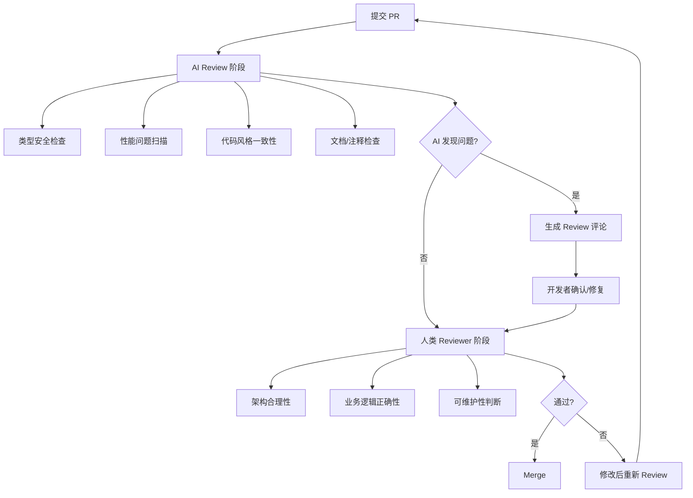

<DifficultyBadge level="beginner" />

# AI 辅助 Code Review

## 一句话解释

AI Code Review 不是让 AI 替代人类 Review，而是**让 AI 做第一道防线**——自动检查类型安全、常见反模式、性能问题，让人 Reviewer 专注于架构和业务逻辑。

## 核心流程



## 深入理解

### 1. AI Review 的核心能力

| 检查维度 | AI 能做什么 | AI 不能做什么 |
|---------|------------|--------------|
| **类型安全** | 检查 `any` 滥用、类型断言、未处理的 null/undefined | 判断泛型设计是否合理 |
| **性能** | 发现无意义的 useMemo、不必要的重渲染、大循环 | 判断整体架构性能取舍 |
| **安全** | 检测 XSS (dangerouslySetInnerHTML)、注入风险、暴露密钥 | 理解业务安全策略 |
| **代码风格** | ESLint/Pretier 之外的约定检查（命名/结构） | 判断代码是否符合团队规范 |
| **文档** | 检查缺失的 JSDoc、注释与代码不一致 | 判断注释是否需要 |
| **测试** | 检查是否缺少对应测试、测试覆盖率盲区 | 判断测试用例是否充分 |

### 2. Review Prompt 模板

**模板一：全方位 Review**

```
请对这个 PR 做 Code Review：
PR 描述：[功能描述]

影响范围：
- src/components/Table.tsx（重构）
- src/hooks/useTableSort.ts（新增）
- src/utils/table-helpers.ts（修改）

Review 重点：
1. 类型安全 —— 有无 any / 不安全的类型断言
2. 性能 —— 有无不必要的重渲染 / 计算
3. 可维护性 —— 命名 / 职责划分 / 复杂度
4. 测试覆盖 —— 边缘情况是否覆盖

变更代码：
```diff
// paste the diff here
```
```

**模板二：安全检查 Prompt**

```
请专门做安全检查，关注：
1. XSS 风险（dangerouslySetInnerHTML / innerHTML）
2. 数据注入（拼接 SQL / 命令）
3. 敏感信息暴露（API key / token）
4. 权限验证遗漏
5. 用户输入未校验

代码：[完整代码]
```

**模板三：性能 Review**

```
请审查以下代码的性能问题：
React 18 + TypeScript 项目。

重点关注：
1. 不必要重渲染（缺少 React.memo / useMemo / useCallback）
2. 大列表渲染（需虚拟列表？）
3. 重复计算
4. 网络请求（是否需要缓存/去重）
5. 内存泄漏（useEffect cleanup / 定时器）

代码：[代码]
```

### 3. AI Review 实战示例

**场景：useEffect 依赖问题**

```javascript
// AI 会发现的常见问题：
function UserProfile({ userId }) {
  const [user, setUser] = useState(null)

  useEffect(() => {
    fetch(`/api/users/${userId}`)
      .then(res => res.json())
      .then(setUser)
  }, [])  // ⚠️ AI: userId 变化时不会重新请求，这是 Bug
}
```

AI Review 评论：
> **问题**：`useEffect` 依赖数组为空，但内部使用了 `userId`。当 `userId` 变化时，组件不会重新请求数据。
> **建议**：将 `userId` 加入依赖数组，或使用自定义 Hook 封装数据请求逻辑。

**场景：不必要的 useMemo**

```javascript
// AI 会标记的过度优化：
const sortedList = useMemo(() => {
  return [...items].sort((a, b) => a.id - b.id)
}, [items])  // ⚠️ AI: 如果 items 不大，useMemo 不必要的
```

AI Review 评论：
> **建议**：列表不大时 `useMemo` 的开销（内存 + 比较）可能超过收益。如果 `items` 不超过 100 条，直接用 `items.sort()` 即可。

**场景：缺少错误处理**

```javascript
// AI 会标记的风险：
async function submitForm(data) {
  const res = await fetch('/api/submit', {
    method: 'POST',
    body: JSON.stringify(data)
  })
  // ⚠️ AI: 缺少错误处理和 loading 状态
  // ⚠️ AI: 缺少 res.ok 检查
}
```

AI Review 评论：
> **问题**：没有处理 API 请求失败的情况。
> **建议**：添加 try/catch + 错误状态 + loading 状态。检查 `res.ok` 处理非 200 响应。

### 4. AI Review 配置（以 Cursor/Copilot 为例）

Cursor 2026 使用 `.cursor/rules/` 目录（取代旧的 `.cursorrules` 单文件），支持为不同场景编写独立的 Review 规则：

```markdown
# .cursor/rules/review.mdc — Review 规则（2026 新格式）
---
description: Code Review 规则
globs: src/**/*.{ts,tsx}
---

- 不要使用 `any` 类型（用 `unknown` 替代）
- 所有 API 调用必须有错误处理（try/catch 或 .catch）
- 禁止使用 `dangerouslySetInnerHTML`
- `useEffect` 必须有正确的依赖数组，无 lint 警告
- 禁止直接修改 state（必须用 setState / immer）
- 组件超过 200 行应考虑拆分
```

如果使用 Copilot，则配置为 `.github/copilot-instructions.md`：

```markdown
## Code Review Guidelines

- No `any` type — use `unknown` instead
- All API calls must have error handling
- No `dangerouslySetInnerHTML` without explicit approval
- useEffect must have complete dependency arrays
- No direct state mutation
```

AI Review 的局限与应对：

| 局限 | 说明 | 应对 |
|------|------|------|
| **缺乏业务理解** | AI 不知道业务规则，无法判断逻辑是否正确 | Reviewer 专注业务逻辑 |
| **容易 false positive** | AI 可能标记本没问题的地方 | 设置 review rules 过滤已知模式 |
| **上下文长度限制** | 大 PR 可能超出 AI 处理能力 | 拆成小 PR，按文件审查 |
| **对安全的片面理解** | AI 可能漏掉业务层面的安全漏洞 | 结合安全 checklist 复查 |

## 面试问法

- 🔥 **你怎么用 AI 做 Code Review？**
  - AI 做第一道防线：检查类型/性能/安全基础问题
  - 人做第二道：架构/业务逻辑/可维护性
  - 关键：**不是完全依赖 AI，而是用 AI 过滤低级问题，让人聚焦更有价值的 Review**

- ⭐ **AI Code Review 的优势和局限？**
  - 优势：速度快、覆盖全面、不疲劳、一致性高
  - 局限：不懂业务、容易误报、有限上下文

## 💡 AI 辅助学习

> 用这个 Prompt 练习 Code Review：
> "你是一个前端团队的 Tech Lead。请给我一段包含 3-5 个常见问题的 React 代码（类型/性能/安全/可维护性问题各至少一个），
> 我作为开发者来做 Code Review，列出我发现的每个问题的位置、原因和修复方案，你最后打分并补充我遗漏的。"

## 关联知识

- [AI 编程工具对比](./ai-tools-overview) — 工具的 Review 能力对比
- [AI 调试助手](./ai-debugging) — AI 辅助 Bug 定位
- [AI 写测试](./ai-testing) — AI 生成测试用例
