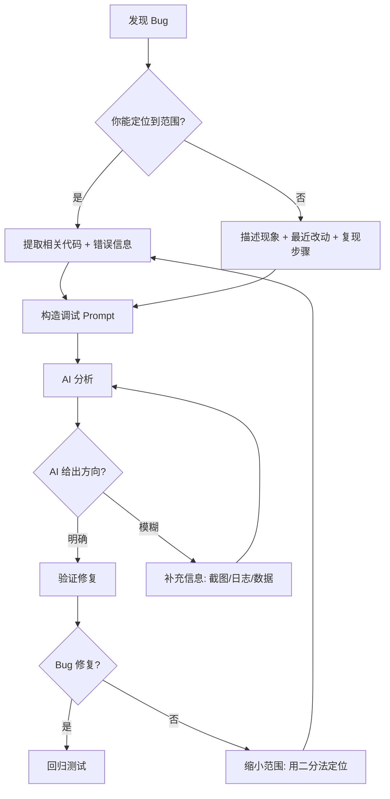

<DifficultyBadge level="beginner" />

# AI 调试助手

## 一句话解释

AI 调试不是把报错扔给 AI 让它改——而是**给 AI 完整的上下文（代码 + 错误 + 预期行为 + 排查思路），让 AI 帮你缩小问题范围**。

## 核心流程



## 深入理解

### 1. 调试 Prompt 公式

````
## Bug 报告
组件/模块：[文件名]
框架版本：[React 18 / Vue 3 / Node 20]

## 预期行为
[应该发生什么]

## 实际行为
[实际发生了什么，附截图/报错]

## 代码片段
```javascript
相关代码（完整函数/组件）
```

## 环境信息
- 浏览器/版本
- Node 版本
- 其他相关依赖版本

## 我已排查
[试过哪些方法/排除了哪些可能]
````

**三种常见调试场景：**

**场景一：运行时错误**
````
收到报错: "Cannot read properties of undefined (reading 'map')"
代码：
```javascript
function List({ items }) {
  return items.map(item => <li>{item.name}</li>)
}
```
组件调用 <List items={undefined} />
请分析原因和修复方案。
````

**场景二：逻辑 Bug**
```
预期：点击"全选"后所有选项被选中
实际：第一次点击正常，取消全选后再点全选无效
代码：[完整代码]
环境：React 18
请分析是什么导致状态不同步。
```

**场景三：性能问题**
```
现象：列表输入框打字卡顿
当前实现：每输入一个字符触发 API 搜索
代码：[完整代码]
请分析性能瓶颈并给出优化方案。
```

### 2. AI 调试策略

| 策略 | 说明 | 适用场景 |
|------|------|---------|
| **逐层缩小** | 先给整体，AI 问哪个部分再局部深入 | 你不确定问题范围时 |
| **二分法** | 提交一半代码，让 AI 分析这半有没有问题 | 大文件/复杂组件 |
| **对比法** | "这段代码和另一段代码行为不同，差异在这里……" | 重构后出现的新 Bug |
| **简化法** | "我把问题抽象成最小复现如下……" | 复杂交互场景的 Bug |
| **历史追溯** | "之前这个功能是好的，改动 X 之后坏了" | 回归 Bug |

**最佳实践：给 AI 看完整的错误栈**

````
❌ 不好的调试 Prompt:
"我的页面报错了，帮我看看"

✅ 好的调试 Prompt:
"Next.js 14 App Router 页面报错：
Error: Hydration failed because the initial UI does not match what was rendered on the server.
相关代码（page.tsx）：
```tsx
export default function Page() {
  return <div>{new Date().toLocaleTimeString()}</div>
}
```
请分析 Hydration 失败的原因并修复。
"
````

### 3. 常见调试场景模板

**模板一：React 组件 Bug**

````
React 18 组件，报错 "Too many re-renders"。
代码：
```tsx
function SearchPage() {
  const [results, setResults] = useState([])
  
  fetch('/api/search').then(res => res.json()).then(setResults)
  
  return <List data={results} />
}
```
请分析什么导致无限重渲染，并修复。
````

**模板二：异步逻辑 Bug**

````
Vue 3 + Pinia，用户登录后状态不同步：
```vue
<script setup>
import { useUserStore } from '@/stores/user'
import { useRouter } from 'vue-router'

const userStore = useUserStore()
const router = useRouter()

async function login() {
  const res = await fetch('/api/login', { method: 'POST' })
  userStore.setUser(res.data)
  router.push('/dashboard')
}
</script>
```
现象：login() 执行后跳转到 /dashboard，但页面上显示"未登录"，
刷新后才正常。请分析原因。
````

**模板三：类型错误**

````
TypeScript 类型错误，不确定怎么正确定义：
```typescript
interface EventMap {
  click: { x: number; y: number }
  focus: { element: HTMLElement }
}

// 想实现一个类型安全的事件发射器
class Emitter<T extends Record<string, any>> {
  on<K extends keyof T>(event: K, handler: (data: T[K]) => void) {}
  emit<K extends keyof T>(event: K, data: T[K]) {}
}

// 但这里类型推导不对
type Test = Emitter<EventMap>
```
帮我修复类型定义，让 on/emit 有完整的类型推导。
````

### 4. AI 调试的局限性

| 局限 | 原因 | 应对 |
|------|------|------|
| 看不到完整项目上下文 | 只有你给的那段代码 | 提供相关模块的入口和类型定义 |
| 不理解业务逻辑 | AI 不熟悉你的业务领域 | 解释业务规则 |
| 可能给出不存在的 API | 幻觉 | 验证 AI 推荐的 API 文档 |
| 难以排查环境问题 | 无法复现你的环境配置 | 提供依赖版本号 + 复现步骤 |
| 安全盲区 | AI 可能忽略安全风险 | 自己把关权限验证等安全逻辑 |

## 面试问法

- 🔥 **你平时怎么用 AI 调试 Bug？**
  - 先自己定位到范围，再给 AI 完整上下文（代码 + 错误 + 预期 + 已排查）
  - 不是直接丢错误让 AI 修，而是**和 AI 一起分析缩小范围**
  - 关键：AI 帮我看"想不到的角度"而非"替我做"

- ⭐ **AI 调试有什么局限？什么情况 AI 帮不上忙？**
  - 缺乏项目上下文、不懂业务逻辑、可能幻觉
  - 环境配置问题、复杂竞态条件、与第三方服务的集成问题

## 💡 AI 辅助学习

> 用这个 Prompt 练习调试能力：
> "你是一个前端技术面试官。请给我一段有隐藏 Bug 的 React 代码（包含竞态条件/闭包陷阱/渲染问题其中一种），
> 我作为开发者尝试定位和修复，你记录我的排查过程并给出反馈。"

## 关联知识

- [Prompt 基础](./prompt-basics) — 调试 Prompt 写法
- [AI 代码生成实战](./ai-code-gen) — 生成与调试配合
- [AI 辅助 Code Review](./ai-code-review) — AI 审查代码质量
