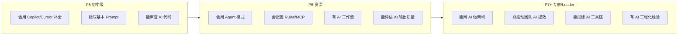

<DifficultyBadge level="intermediate" />

# AI 面试专题

## 一句话解释

AI 正在从两个方向改变前端面试：**面试内容变了**（加入大量 AI 相关考察）**和 面试方式变了**（AI 模拟面试、AI 辅助准备）。2026 年，把 AI 准备好 = 面试成功一半。

## AI 对前端面试的改变

```mermaid
flowchart TD
    subgraph 变化[AI 带来的面试变化]
        A[新增考察维度] --> A1[AI 工具使用经验]
        A --> A2[AI 工作流设计能力]
        A --> A3[AI 输出质量判断]
        
        B[面试形式变化] --> B1[AI 模拟面试官]
        B --> B2[在线 IDE + AI 协作]
        B --> B3[AI 辅助完成 Coding]
        
        C[评价标准变化] --> C1[不仅是"写对"<br/>更是"写得好"]
        C --> C2[不仅是"知道"<br/>更是"会用"]
        C --> C3[不仅是"能答"<br/>更是"能问"]
    end
```

## 深入理解

### 1. 面试中的 AI 相关高频问题

| 类别 | 问题 | 难度 |
|------|------|:----:|
| **工具使用** | 你平时用哪些 AI 工具？怎么用的？ | 🟢 |
| **Prompt 工程** | 你怎么写 Prompt？高质量 Prompt 的要素？ | 🟡 |
| **工作流** | AI 怎么融入你的开发工作流？ | 🟡 |
| **质量判断** | AI 生成的代码你敢直接用吗？怎么审查？ | 🟡 |
| **Agent** | AI Agent 模式了解吗？Chat 模式的区别？ | 🔴 |
| **前沿** | MCP 是什么？RAG 怎么工作的？ | 🔴 |
| **架构** | 你怎么用 AI 辅助做架构设计？ | 🔴 |
| **工程化** | 团队怎么用 AI 提效？碰到过什么问题？ | 🔴 |

### 2. 不同级别的 AI 能力期望



### 3. 用 AI 准备面试

**场景一：AI 模拟面试官**

```
Prompt：
你是一个资深前端面试官，正在面试 P6+ 候选人。
请模拟一场 30 分钟的技术面试，主题是 React 性能优化。

规则：
1. 每次问我一个问题
2. 我回答后，给我反馈（优点/不足/建议）
3. 如果回答太浅，追问深入
4. 最后给我打分和改进建议

开始吧，先问第一个问题。
```

**场景二：AI 生成面试题**

```
你是一个前端面试题库生成器。

请为 [React / Vue / 工程化 / 系统设计 / AI 开发] 方向
生成 10 道面试题，难度分布：3 道初级 + 4 道中级 + 3 道高级。

每道题包含：
- 问题
- 考察的知识点
- 优秀回答的要点
- 常见错误
```

**场景三：AI 帮你写答案框架**

```
面试被问到这个问题：
"[粘贴问题]"

请帮我分析：
1. 面试官想考察什么
2. 回答的框架（分几点）
3. 每个点的关键内容
4. 加分点（可以说出什么来让面试官眼前一亮）
5. 避坑点（不要说什么）
```

**场景四：AI 模拟压力面试**

```
你是一个严格的面试官，请对我进行压力面试。
主题是前端系统设计。

规则：
1. 问一个问题
2. 我回答后，用追问挑战我的方案（"如果 X 不行呢？""你有没有考虑 Y？"）
3. 看看我在压力下能不能保持清晰的思路
4. 面试结束后给我评估

第一个问题：设计一个大型电商的前端架构，你会怎么考虑？
```

**场景五：AI 做项目深挖准备**

```
这是我的项目经历：

[粘贴项目描述]

请帮我在面试中展示这个项目：
1. 用 STAR 框架重新组织
2. 预测面试官可能会深挖的 10 个问题
3. 每个问题的回答策略
4. 可以量化的成果建议
5. 技术亮点的提炼
```

### 4. AI 面试的加分表现

| 加分项 | 具体表现 | 面试官印象 |
|-------|---------|-----------|
| **能用术语** | "Plan/Execute 分离"、"MCP 协议"、"ReAct 模式" | 有深度 |
| **有实践** | "我在项目中配置了 .cursor/rules/，类型错误减少了 40%" | 有落地 |
| **有思考** | "AI 不是替代思考，而是放大你的专业判断" | 有认知 |
| **有边界** | "AI 在 X 场景表现很好，但在 Y 场景我会自己写，因为..." | 有判断 |
| **有热情** | "我正在尝试用 OpenCode 搭建一个多 Agent 编码系统" | 有驱动力 |

### 5. AI 面试避坑

```
❌ "我用 AI 写代码，但我不懂原理" 
→ 暴露了只会用不会思考

❌ "AI 生成的代码我都直接用的"
→ 缺乏安全意识，面试官不敢用你

❌ "Copilot 很厉害，能写所有代码"
→ 过度依赖工具，缺乏独立能力

❌ "我不太用 AI，我觉得它写的不好"
→ 拒绝新技术，不符合 2026 年的要求

✅ 正确姿态：
"我在日常开发中深度使用 AI，但我非常清楚它的局限性。
我会把 AI 当成高效的结对编程伙伴，而不是甩手掌柜。
关键是我的架构设计和技术判断，AI 是加速器。"
```

### 6. 面试评分表（AI 专项）

| 能力维度 | 权重 | P5 | P6 | P7+ |
|---------|:---:|:--:|:--:|:---:|
| AI 工具熟练度 | 15% | ✅ 常用 | ✅ 深度使用 | ✅ 工具链设计 |
| Prompt 工程 | 15% | ✅ 基础 | ✅ 进阶（CoT/Few-shot） | ✅ 工程化 |
| AI 工作流 | 25% | ❌ | ✅ 有 AI 工作流 | ✅ 推动团队 |
| AI 质量判断 | 20% | ✅ 能检查 | ✅ 有 checklist | ✅ 有方法论 |
| Agent / 架构 | 15% | ❌ | ✅ 了解 | ✅ 有实践 |
| AI 前沿认知 | 10% | ❌ | ✅ 关注 | ✅ 有判断 |

## 💡 AI 辅助学习

**向 AI 提问：**
- "帮我模拟一场 30 分钟的前端面试，主题是 React + TypeScript + AI 工具使用"
- "P6 前端面试的 AI 相关问题有哪些？给我一个复习清单"
- "我 3 年后端转前端，AI 时代怎么准备前端面试？"
- "面试官问我'你怎么用 AI 提效'怎么回答才能出彩？"
- "给我 10 道 AI 开发方向的前端面试题和回答要点"

## 关联知识

- [AI 编程工具对比](./ai-tools-overview) — 工具基础
- [Prompt 进阶](./prompt-advanced) — CoT/Few-shot 面试重点
- [Agent 模式使用](./ai-agent-usage) — Agent 面试高频
- [RAG 与知识库搭建](./rag-knowledge-base) — RAG 面试重点
- [构建自己的 AI Agent](./build-own-agent) — 高级面试话题
- [AI + 前端工作流](./ai-workflow) — 工作流面试
