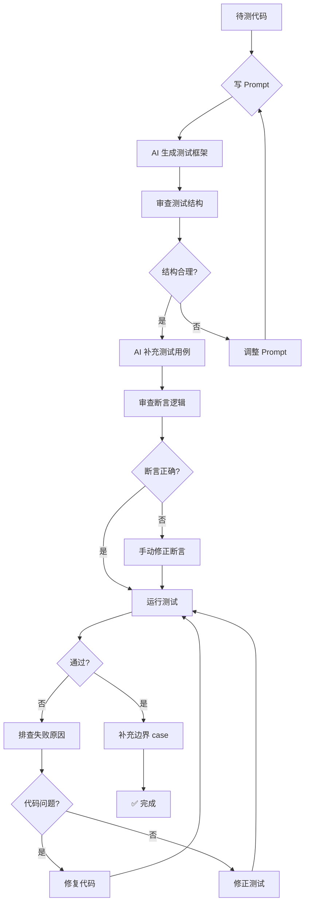

<DifficultyBadge level="beginner" />

# AI 写测试

## 一句话解释

AI 写测试不是"一键生成全部测试"，而是**让 AI 处理测试中最耗时部分**——模板代码、Mock 数据、边界 case 发现——你专注于测试策略和断言的正确性。

## 核心流程



## 深入理解

### 1. 测试生成 Prompt 模板

**模板一：工具函数测试**

````
请用 Vitest 为以下工具函数生成测试用例：

```typescript
// utils/format.ts
export function formatDate(date: Date, format: string): string
export function truncate(str: string, maxLength: number, suffix?: string): string
export function debounce<T extends (...args: any[]) => void>(
  fn: T, delay: number
): (...args: Parameters<T>) => void
```

要求：
1. 覆盖正常情况、边界情况、异常情况
2. 使用 describe/it 组织
3. debounce 需要用 vi.useFakeTimers 测试异步场景
4. 测试文件格式：format.test.ts
5. 不要遗漏类型测试
````

**模板二：组件测试**

````
请用 Vitest + @testing-library/react 为以下组件生成测试：

```tsx
// components/SearchableSelect.tsx
interface Option {
  value: string
  label: string
}
interface Props {
  options: Option[]
  value?: string
  onChange: (value: string) => void
  placeholder?: string
  disabled?: boolean
}
```

测试覆盖：
1. 渲染正常状态
2. placeholder 显示
3. 输入过滤选项
4. 选择选项后触发 onChange
5. disabled 状态下不可交互
6. 空 options 时的降级显示
7. 键盘导航（上下箭头 + 回车）
8. 点击外部关闭下拉

测试文件：SearchableSelect.test.tsx
````

**模板三：Hook 测试**

````
请用 Vitest + @testing-library/react-hooks 为以下 Hook 生成测试：

```typescript
// hooks/useDebouncedValue.ts
export function useDebouncedValue<T>(value: T, delay: number): T
```

测试覆盖：
1. 值立即返回初始值
2. 在 delay 时间内更新不生效
3. delay 时间后值更新
4. 多次更新只触发一次
5. 清理时取消等待中的更新

测试文件：useDebouncedValue.test.ts
````

### 2. AI 生成测试的最佳策略

**策略一：先有代码，再生成测试**

```
✅ 推荐：先把实现写完，让 AI 补测试
→ AI 能基于完整实现生成匹配的测试
→ 避免"测试驱动 AI"导致的测试不稳定
```

**策略二：让 AI 先列 case，再逐个生成**

```
✅ 好做法：
"这个函数有3个参数，请先列出所有需要测试的场景（正常/边界/异常），
然后我们逐个生成测试代码。"
→ 确保测试覆盖全面
→ 避免 AI 遗漏边界 case
```

**策略三：给 AI 看相似测试作为参考**

```
✅ 参考示例法：
"项目中有类似工具函数 abc.test.ts 的测试写法，请参考这个风格
为 def.ts 生成测试。
参考文件内容：[粘贴参考测试]"
→ 保持测试风格一致
→ 减少手动调整格式的工作
```

### 3. Mock 数据生成

```javascript
// AI 可以帮你生成类型安全的 Mock 工厂
import { faker } from '@faker-js/faker'

// 让 AI 生成这样的工厂函数：
export function buildUser(overrides?: Partial<User>): User {
  return {
    id: faker.string.uuid(),
    name: faker.person.fullName(),
    email: faker.internet.email(),
    avatar: faker.image.avatar(),
    role: faker.helpers.arrayElement(['admin', 'user', 'editor']),
    createdAt: faker.date.past(),
    ...overrides
  }
}

// 然后在测试中灵活使用：
const user = buildUser({ role: 'admin' })
const users = Array.from({ length: 10 }, () => buildUser())
```

**Mock 数据 Prompt：**
````
帮我生成 User、Order、Product 三个类型的 Mock 工厂函数。
使用 @faker-js/faker。

类型定义：
```typescript
interface User { id: string; name: string; email: string; role: 'admin' | 'user' }
interface Order { id: string; userId: string; total: number; status: 'pending' | 'paid' | 'shipped'; items: OrderItem[] }
interface Product { id: string; name: string; price: number; category: string; stock: number }
```

每个工厂支持 overrides 参数，生成合理范围的随机数据。
````

### 4. AI 生成测试的检查清单

| 检查项 | 说明 | 🔴 必须 / 🟡 建议 |
|--------|------|------------------|
| **断言是否正确** | AI 可能生成"永远通过的断言"（如 expect(true).toBe(true)） | 🔴 |
| **Mock 是否过时** | AI 可能用旧的 API mock 方式 | 🟡 |
| **边界 case 是否覆盖** | 空值、极值、重复值、超长字符串 | 🔴 |
| **异步逻辑是否正确** | waitFor / act / fakeTimers 使用是否合理 | 🔴 |
| **测试之间是否独立** | 有没有共享的可变状态 | 🔴 |
| **描述是否清晰** | test 描述能否读懂测试意图 | 🟡 |
| **是否测试了实现细节** | 应该测行为（output），不是测实现（internal state） | 🔴 |

### 5. 常见 AI 测试陷阱

```javascript
// ❌ AI 生成的"假测试"（永远通过）
test('should work', () => {
  const result = add(1, 2)
  // AI 可能只生成调用，不验证结果
})

// ❌ AI 测试了实现细节而非行为
test('should call setState', () => {
  // 测试内部状态而非渲染结果
  // 重构后必挂的脆弱测试
})

// ❌ AI 的 Mock 太复杂
test('should fetch data', () => {
  // AI 可能 mock 了整个 fetch 实现
  // 导致测试与真实行为脱节
})
```

**修复方法：**
```javascript
// ✅ 关注行为而非实现
test('should display user name', async () => {
  render(<UserProfile userId="1" />)
  expect(await screen.findByText('Alice')).toBeInTheDocument()
})
```

## 面试问法

- 🔥 **你怎么用 AI 写测试？遇到什么问题？**
  - 用 AI 生成模板代码 + Mock 工厂 + 边界 case 建议
  - 问题是：断言可能不对、测试可能太脆弱、容易测实现而非行为
  - 核心：**AI 生框架，人审质量**

- ⭐ **AI 生成的测试有什么常见坑？**
  - 假测试（缺少断言或断言永远通过）
  - 测试实现细节（脆弱测试）
  - Mock 过重（测试与真实行为脱节）

## 💡 AI 辅助学习

> 用这个 Prompt 练习 AI 测试审查：
> "你是一个 QA 工程师。请给我一段 AI 生成的测试代码，里面故意包含 3 个问题（永远通过的断言、测试实现细节、Mock 太复杂）。
> 我来审查并找出问题，你确认我是否找对了并解释为什么这是问题。"

## 关联知识

- [AI 代码生成实战](./ai-code-gen) — 代码生成配合测试
- [AI 辅助 Code Review](./ai-code-review) — 审查 AI 生成的代码
- [前端测试体系](/engineering/frontend-testing) — 前端测试整体策略
