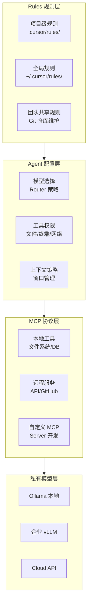
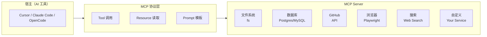

<DifficultyBadge level="intermediate" />

# AI 工具配置与定制

## 一句话解释

2026 年会用 AI 工具不稀奇，**能深度配置 AI 工具、让它适配团队规范和项目上下文**才是区分度所在。配置能力 = 让 AI 从"通用助手"变成"团队专属副驾驶"。

## 配置体系总览



## 深入理解

### 1. Rules 规则系统（2026 标准）

**Cursor 的 `.cursor/rules/` 目录结构：**

```
.cursor/rules/
├── .gitignore
├── review.mdc          # Code Review 规则
├── react-patterns.mdc  # React 最佳实践
├── api-design.mdc      # API 调用规范
├── testing.mdc         # 测试规范
├── typescript.mdc      # TypeScript 约定
└── project-arch.mdc    # 项目架构约束
```

**规则文件格式（.mdc）：**
```markdown
---
description: React 组件编写规范
globs: src/**/*.{tsx,ts}
---

# React 组件规范

- 使用函数组件 + Hooks，不使用 class 组件
- 每个组件文件不超过 200 行
- Props 接口定义以 `Props` 结尾，放在组件文件顶部
- 使用 `useCallback`/`useMemo` 仅当有可衡量的性能收益时
- 状态提升到最近的共同父组件，或使用 Context/状态管理库

## 导入顺序
1. React / 框架
2. 第三方库
3. 内部模块（@/components/、@/hooks/）
4. 样式文件
```

**Copilot 的 `.github/copilot-instructions.md`：**
```markdown
## Project Context
This is a Next.js 15 App Router project with React 19.

## Coding Standards
- Use Server Components by default, Client Components only when needed
- All data fetching uses Server Actions or Route Handlers
- TypeScript strict mode enabled — no `any` type
- CSS Modules for styling, no Tailwind utility classes in this project

## Testing
- Vitest for unit tests, Playwright for E2E
- Test files co-located with source files as `*.test.ts`
```

**Claude Code 的 `CLAUDE.md`：**
```markdown
# CLAUDE.md — Claude Code 项目配置

## 项目概述
Next.js 15 SaaS 平台，Postgres + Prisma ORM

## 编码规范
- TypeScript strict mode
- Server Actions 处理数据变更
- Zod 做表单验证
- 使用 `@/` 路径别名

## 常用命令
- `npm run dev` — 启动开发
- `npm run build` — 构建
- `npm run test` — 运行测试
- `npm run lint` — 代码检查

## 关键约定
- API 路由在 `src/app/api/` 下
- 共享组件在 `src/components/ui/`
- 业务组件在 `src/components/business/`
```

### 2. MCP 协议（Model Context Protocol）

MCP 是 2025-2026 年 AI 工具生态最重要的开放协议之一，让 AI 工具能安全地连接外部工具和数据源。

**MCP 架构：**


**Cursor MCP 配置示例：**
```json
// .cursor/mcp.json
{
  "mcpServers": {
    "database": {
      "type": "stdio",
      "command": "npx",
      "args": ["@cursor/mcp-postgres", "--connection-string", "${DB_URL}"]
    },
    "github": {
      "type": "stdio",
      "command": "npx",
      "args": ["@modelcontextprotocol/server-github", "--token", "${GITHUB_TOKEN}"]
    },
    "playwright": {
      "type": "stdio",
      "command": "npx",
      "args": ["@playwright/mcp"]
    }
  }
}
```

**常用 MCP Server 生态：**

| MCP | 用途 | 安装方式 |
|-----|------|---------|
| `@modelcontextprotocol/server-filesystem` | 文件读写 | `npx` |
| `@modelcontextprotocol/server-github` | GitHub API | `npx` / `npm` |
| `@modelcontextprotocol/server-postgres` | 数据库查询 | `npx` |
| `@modelcontextprotocol/server-brave-search` | 网络搜索 | `npx` |
| `@playwright/mcp` | 浏览器自动化 | `npx` / `npm` |
| `@cursor/mcp-server` | 自定义模型路由 | `pip install` / `npm` |

### 3. Agent 配置

**Cursor 的 Agent 配置：**
```json
// .cursor/config.json
{
  "models": {
    "default": "claude-4-sonnet",
    "router": "cursor-router",
    "fallback": "gpt-5.5"
  },
  "agent": {
    "autoExecute": true,
    "maxTools": 20,
    "timeout": 300,
    "allowCommands": ["npm", "npx", "git", "node"],
    "blockCommands": ["rm -rf", "sudo"]
  },
  "context": {
    "maxFiles": 50,
    "includePatterns": ["src/**/*.{ts,tsx}", "package.json"],
    "excludePatterns": ["node_modules", "dist", ".next"]
  }
}
```

**OpenCode 的 Agent/Skills 配置：**
```javascript
// .opencode/skills/skill.config.js
module.exports = {
  skills: {
    'code-review': {
      category: 'quick',
      prompt: 'Review the PR diff for type safety, performance, and security issues.',
      model: 'claude-4-sonnet',
    },
    'generate-test': {
      category: 'unspecified-high',
      prompt: 'Generate Vitest tests for the provided component with full coverage.',
      model: 'gpt-5.5',
    },
    'refactor': {
      category: 'deep',
      prompt: 'Refactor the selected code following project patterns.',
      model: 'claude-4-opus',
    },
  }
}
```

### 4. 私有模型接入方案

| 方案 | 适用场景 | 配置难度 | 延迟 | 成本 |
|------|---------|---------|:----:|:----:|
| **Ollama** | 个人/小团队 | 低 | 中 | 免费 |
| **vLLM** | 企业级推理 | 高 | 低 | GPU 成本 |
| **OpenRouter** | 多模型路由 | 低 | 中 | 按量付费 |
| **企业 API** | 合规需求 | 中 | 低 | 订阅制 |

**Ollama 集成 Cursor 示例：**
```bash
# 1. 启动本地模型
ollama pull codellama:34b
ollama run codellama:34b

# 2. Cursor 配置使用本地模型
# Settings → Models → Add Custom Model
# Provider: OpenAI-compatible
# Base URL: http://localhost:11434/v1
# Model: codellama:34b
```

## 面试问法

- 🔥 **你如何配置 AI 工具来适配项目规范？**
  - 回答框架：用 Rules 系统定义编码规范 → 用 MCP 连接数据库/GitHub → 配置 Agent 执行权限 → 团队共享配置
  - 核心：**配置越精细，AI 输出质量越高**

- ⭐ **MCP 协议了解吗？你怎么用？**
  - 回答框架：MCP 是 AI 工具连接外部世界的标准协议 → 我配置了数据库/GitHub/浏览器 MCP → 让 AI 能直接操作真实数据而非猜测

- 📌 **用过私有模型接入吗？区别是什么？**
  - 开源模型延迟较高但数据安全，企业场景推荐 vLLM + 量化模型

## 💡 AI 辅助学习

**向 AI 提问：**
- "我用的 AI 工具是 Cursor，帮我写一套适合我项目的 .cursor/rules/ 配置文件"
- "MCP 协议的原理是什么？帮我设计一个自定义 MCP Server"
- "帮我写一个 OpenCode Skill 配置，用于自动修复 ESLint 错误"
- "Ollama + Cursor 怎么配置？有什么推荐的前端编码模型？"

## 关联知识

- [AI 编程工具对比](./ai-tools-overview) — 工具选型基础
- [Agent 模式使用](./ai-agent-usage) — Agent 配置实践
- [AI + 前端工作流](./ai-workflow) — 全链路 AI 配置
- [Prompt 工程进阶](./prompt-advanced) — Prompt 与配置配合
