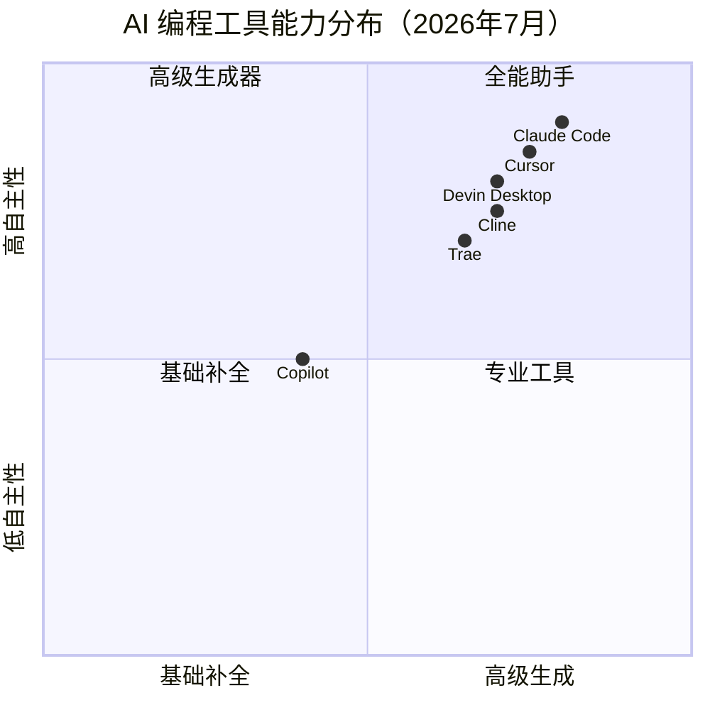
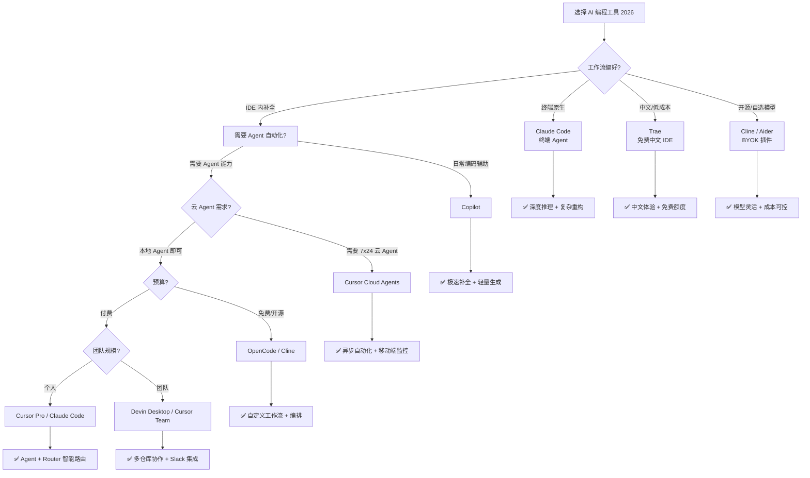

<DifficultyBadge level="beginner" />

# AI 编程工具对比

## 一句话解释

AI 编程工具是**嵌入开发环境的 AI 代码助手**，能在编码过程中提供补全、生成、重构、调试等能力。2026 年，**不会用 AI 编程 = 面试减分项**。

## 核心能力雷达



## 主流工具对比

| 维度 | GitHub Copilot | Cursor | Claude Code | Devin Desktop | Trae | Cline |
|------|---------------|--------|------------|---------------|------|-------|
| **基础模型** | GPT-5.5 / MAI-Code | GPT-5.5 / Claude Opus 4.8 / Sonnet 4 | Claude Opus 4.8 / Sonnet 4 | 多模型（自研 + Claude） | 豆包 + Claude | 任意 OpenAI 兼容 API |
| **代码补全** | ⭐⭐⭐⭐⭐ 极快 | ⭐⭐⭐⭐⭐ Tab 补全标杆 | ⭐⭐（非主打） | ⭐⭐⭐⭐ 准确 | ⭐⭐⭐⭐ | ⭐⭐⭐⭐ |
| **多行生成** | ⭐⭐⭐⭐ | ⭐⭐⭐⭐⭐ Composer 2 | ⭐⭐⭐⭐⭐ Agent | ⭐⭐⭐⭐ | ⭐⭐⭐⭐ | ⭐⭐⭐⭐ |
| **Agent 模式** | ✅ Agent Mode | ✅ Agents Window（多 Agent 并行） | ✅ 终端 Agent（Auto Mode） | ✅ Devin Local/Cloud | ✅ | ✅ |
| **云 Agent** | ✅ Workspace | ✅ 云端全天候运行 | ✅ Claude Code as a Service | ✅ Devin Cloud | ❌ | ❌ |
| **上下文感知** | 工作区级 | 项目级索引（10万行+） | 200K tokens + Git 历史 | 多工作区+多仓库 | 项目级 | 项目级 |
| **自定义规则** | `.github/copilot-instructions.md` | `.cursor/rules/` + Hooks | `CLAUDE.md` + Hooks | Skills/Hooks/Plugins | 规则配置 | 规则 + MCP |
| **多文件编辑** | ✅ | ✅ | ✅ | ✅ | ✅ | ✅ |
| **终端集成** | ❌ | ✅ CLI Debug Mode | ✅（终端原生） | ✅ | ❌ | ❌ |
| **移动端** | ❌ | ✅ iPad/iPhone | ❌ | ✅ 移动端查看 | ✅ TRAE SOLO 手机版 | ❌ |
| **智能路由** | ❌ | ✅ Cursor Router | ❌ | ✅ | ❌ | ✅ Cline v3.2 路由 |
| **价格** | $10/月（个人） | $20/月（Pro） | $20/月（Pro 订阅） | Free / $20 / $200 / Teams | 免费 / $10 | 免费 + API 费（月均 $8-12） |

## 各工具的强项场景

### GitHub Copilot — 最快最稳的补全

适合：**日常编码、快速补全、熟悉 IDE 流程**

```javascript
// 输入注释即可生成
// 定义一个防抖函数，支持立即执行选项
function debounce(fn, delay, immediate = false) {
  let timer = null
  return function(...args) {
    const callNow = immediate && !timer
    clearTimeout(timer)
    timer = setTimeout(() => {
      timer = null
      if (!immediate) fn.apply(this, args)
    }, delay)
    if (callNow) fn.apply(this, args)
  }
}
// Copilot 在输入注释后几乎瞬间补全
```

2026 年 Copilot 已深度集成到 VS Code，支持基于 GPT-5.5 的 Agent 模式（GitHub Spark），以及轻量模型 MAI-Code-1-Flash 实现极速补全。

### Cursor — Agent 时代的标杆

适合：**复杂重构、跨文件修改、7x24 Cloud Agent 自动化**

```markdown
// Cursor 3.x 核心能力：
// 1. Agents Window：本地/worktree/远程 SSH/云端并行跑多个 Agent，tiled 布局统一管理
// 2. Cursor Router：智能路由到性价比最高的模型（Intelligence/Balance/Cost 三档）
// 3. /multitask：并行子智能体处理不同文件，互不干扰
// 4. /worktree + /best-of-n：隔离分支 + 多模型并行评估
// 5. CLI Debug Mode：终端控制面，可做根因定位、侧向追问、配置管理
// 6. Canvases：Agent 直接产出可交互 artifact，而非只有代码
// 7. iPad/iPhone：移动端查看 Agent 进度、Review PR
```

2026 年的 Cursor 已迭代到 **3.x**，不再是"编辑器"，而是**多 Agent 工作台**——Cloud Agents 可以自动执行 PR Review、CI 修复、依赖升级等异步任务；`Composer 2` 模型（2026 年 3 月推出）百万 token 成本较前代下降 86%。

### Devin Desktop（原 Windsurf）— 工程化 Agent

适合：**需要端到端自动化、多仓库协作的团队**

2025 年底，Windsurf 被 Cognition 收购并整合为 **Devin Desktop**。2026 年 7 月起，**Cascade 正式退役**，由 Devin Local 全面替代：
- **Devin Local**：Rust 重写，token 效率提升 30%，原生支持 subagent，替代原 Cascade
- **Devin Cloud**：云端 Agent，Slack 集成，可跨频道/仓库工作
- **Agent Command Center**：任务级 Spaces、浏览器工具、云端 VM handoff 统一到控制台
- **ACP 协议**：开放的 Agent-编辑器通信标准，已被 JetBrains、Google、GitHub 等采纳
- **Plugins 系统**：扩展 Devin 的能力；**MCP 支持**：连接自定义工具链
- 注意：classic setup 已于 6/30 弃用，需迁移到 declarative configuration（blueprints）

### Claude Code（Anthropic）— 终端原生 Agent

适合：**偏好终端工作流、需要深度推理、复杂重构**

2025 年底 Anthropic 推出的 **Claude Code** 已是终端原生 AI 编码 Agent 的行业标杆——2026 年 4 月 **Claude Opus 4.8** 在 SWE-bench Verified 上达到 **80.8%**（行业第一），Stripe 用它 1 天内完成了 5000 万行 Ruby 代码库的全库迁移。

```bash
# Claude Code 典型用法
claude "在 src/utils/ 下实现一个日期格式化工具函数，包含 TypeScript 类型和测试"

# Agent 模式：自动规划执行
claude --agent "将整个 pages/ 目录从 Page Router 迁移到 App Router"
```

特色（v2.1.x）：
- **终端优先**：不依赖 IDE，任何编辑器都能配合
- **Auto Mode + xhigh effort**：全程零干预自主编码，自跑自修
- **Dynamic Workflows**（`/flows`）：后台编排数十到上百个 Agent 并行运行，正面竞争 CrewAI/AutoGen
- **Task Budgets**：为任务设定 token 预算上限，控制成本
- **Git 原生**：自动创建分支、commit、PR
- **Claude Code as a Service**：可集成到 CI/CD 流水线；v2.1.162+ 支持管理员版本控制
- 配套 **Claude Design**：设计稿 → 可交互原型 → 前端代码，一键导出到 Claude Code 继续迭代

### Gemini Code Assist（Google）— VS Code + JetBrains 集成

适合：**GCP 生态用户、需要代码库级上下文理解的团队**

2026 年 Gemini Code Assist 已深度集成到 VS Code 和 JetBrains IDE：

- **Gemini 2.5 Pro**：100 万 token 上下文窗口，可理解整个代码库
- **代码库感知**：不依赖索引，直接理解全仓库代码
- **Google Cloud 集成**：与 Cloud Code、Artifact Registry 深度联动
- **企业安全**：代码不上传第三方服务器，SOC 2 合规
- ⚠️ **注意**：独立的 Gemini CLI 已于 2026 年 6 月退役，功能迁移到 **Antigravity CLI**

### OpenCode — 开源 + Orchestration

适合：**需要自定义 AI 工作流、多 agent 协作、私有化部署**

```javascript
// OpenCode Skills 示例 - 定义 AI 编码规范检查
task(category="quick", load_skills=[], prompt="Review the code in src/components/ for accessibility issues...")
```

2026 年 OpenCode 的差异化在于 **Orchestration**——它不是单 Agent 工具，而是 Agent 编排平台，可以组合多个 Specialist Agent 完成复杂任务。

### Trae（字节跳动）— 免费中文 Vibe Coding

适合：**中文开发者、预算敏感、追求零门槛上手**

字节跳动出品的 AI 原生 IDE，2026 年初注册用户已突破 **600 万**：

- **原生中文**：中文交互体验最好，适合国内团队
- **免费额度大方**：基础功能免费，Pro $10/月
- **TRAE SOLO 手机版**（2026 年 5 月上线）：地铁上丢需求让 AI 写代码，移动端独此一家
- **豆包 + Claude 双模型**：本地自研模型降本，复杂任务可切 Claude

### Cline — 开源性价比之王

适合：**开源项目、BYOK、预算敏感**

VS Code 插件形态（5M+ 安装量，61K+ GitHub Stars），2026 年最火的纯插件 Agent：

- **Cline v3.2 智能路由**：自动选择最便宜的模型，月均 API 费用仅 $8-12
- **完全开源**：代码可审计，社区活跃
- **任意 OpenAI 兼容 API**：可接 DeepSeek/通义/本地 Ollama 等
- **不改变编辑器习惯**：纯插件，无需迁移 IDE

## 工具决策树



## 面试中如何展示 AI 能力

### 面试官常问

> "你平时用 AI 工具吗？怎么用的？"

### 好的回答（展示深度）

✅ **不要说**："会用 Copilot 写代码。"
✅ **要说**：

```
"我日常使用 Cursor + Copilot 组合，针对不同场景选不同工具：
1. Copilot 负责实时补全和简单生成，GPT-5.5 加持下效率极高
2. Cursor Cloud Agent 处理异步任务——比如夜间自动跑测试修复、PR Review
3. Cursor Router 的智能路由帮我节省了约 40% 的 API 花费
4. 我还通过项目级 .cursorrules + Hooks 确保 AI 输出的代码符合团队规范

2026 年 AI 编程已是资深前端的基础技能，
真正的区分度在于：知道什么时候信任 AI、什么时候必须自己 review、怎么设计 Prompt 让 AI 产出高质量代码。"
```

## 💡 AI 辅助学习

> 用这个 Prompt 帮你在面试中展示 AI 能力：
> "你是一个前端技术面试官。我正在面试一个高级前端岗位，请模拟一个关于'AI 工具使用'的面试场景：
> 1. 问我 3 个关于 AI 编程工具的深度问题（不只是'用过没'，而是'怎么评估 AI 输出质量'、'怎么设计 AI 工作流'）
> 2. 给出优秀回答的要点
> 3. 指出初级和高级回答的区别在哪里"

## 关联知识

- [Prompt 基础](/ai-dev/prompt-basics) — 面向开发者的 Prompt 公式
- [AI 代码生成实战](/ai-dev/ai-code-gen) — 从需求到代码的完整 Prompt 模板
- [AI + 前端工作流](/ai-dev/ai-workflow) — 全链路 AI 介入
- [Agent 模式使用](/ai-dev/ai-agent-usage) — Cloud Agent 实践
