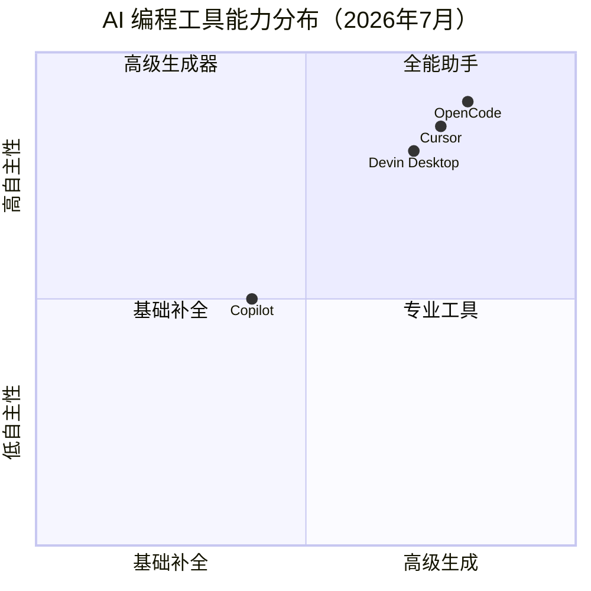
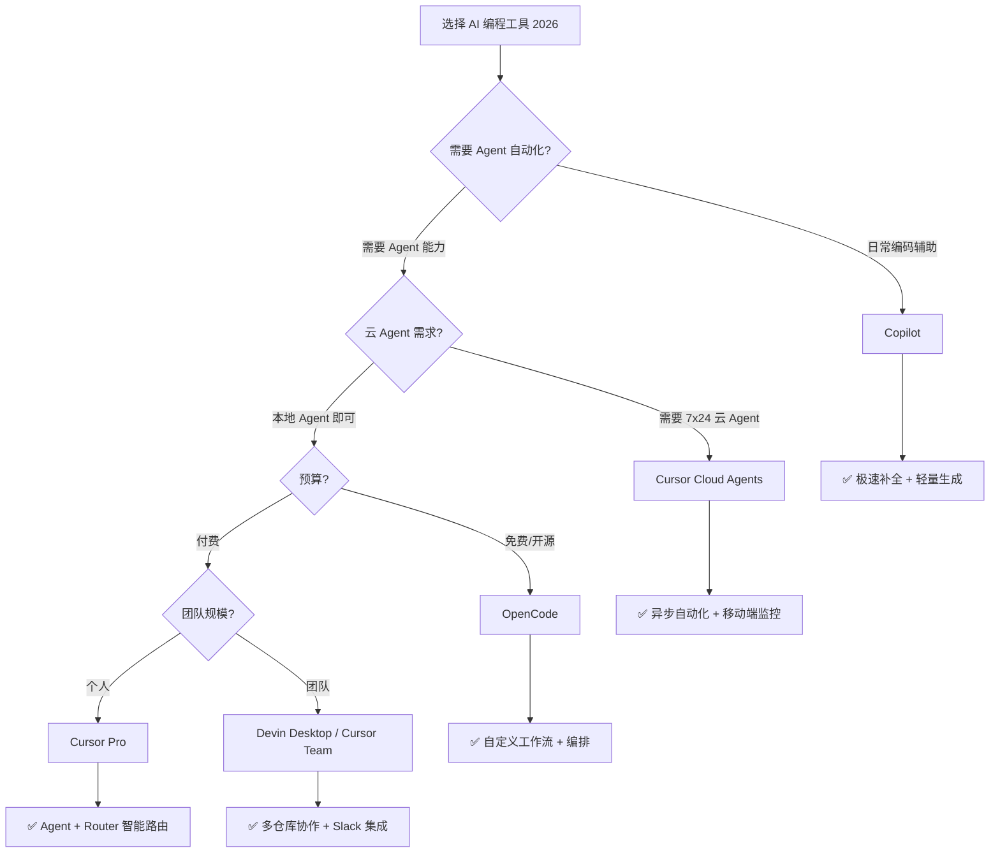

<DifficultyBadge level="beginner" />

# AI 编程工具对比

## 一句话解释

AI 编程工具是**嵌入开发环境的 AI 代码助手**，能在编码过程中提供补全、生成、重构、调试等能力。2026 年，**不会用 AI 编程 = 面试减分项**。

## 核心能力雷达



## 主流工具对比

| 维度 | GitHub Copilot | Cursor | Devin Desktop（原 Windsurf） | OpenCode |
|------|---------------|--------|---------------------------|----------|
| **基础模型** | GPT-5.5 / MAI-Code | Grok 4.5 / Composer | GPT-5.x / Claude 4.x | Claude 4.x / GPT-5.x |
| **代码补全** | ⭐⭐⭐⭐⭐ 极快 | ⭐⭐⭐⭐ 准确 | ⭐⭐⭐⭐ 准确 | ⭐⭐⭐⭐ |
| **多行生成** | ⭐⭐⭐⭐ | ⭐⭐⭐⭐⭐ Composer | ⭐⭐⭐⭐ | ⭐⭐⭐⭐ |
| **Agent 模式** | ✅ GitHub Spark | ✅ Cloud Agents（7x24运行） | ✅ Devin Local / Cloud | ✅ 子代理编排 |
| **云 Agent** | ❌ | ✅ 云端全天候运行 | ✅ Devin Cloud | ✅ |
| **上下文感知** | 当前文件 + 附近 | 全项目索引 + Router 路由 | 多工作区 + 多仓库 | 多文件/多仓库 |
| **自定义规则** | `.github/copilot-instructions.md` | `.cursorrules` + Hooks | Skills / Hooks / Plugins | Skills / Agent |
| **多文件编辑** | ✅ 2026 新增 | ✅ | ✅ | ✅ |
| **终端集成** | ❌ | ✅ | ✅ | ✅ |
| **移动端** | ❌ | ✅ iPad/iPhone 全面支持 | ❌ | ❌ |
| **智能路由** | ❌ | ✅ Cursor Router（Intelligence/Balance/Cost） | ❌ | ❌ |
| **价格** | $10/月（个人） | $20/月（Pro） | $15/月（Devin Desktop） | 开源免费 / 按量付费 |

## 各工具的强项场景

### GitHub Copilot — 最快最稳的补全

适合：**日常编码、快速补全、熟悉 IDE 流程**

```javascript
// 输入注释即可生成
// 定义一个防抖函数，支持立即执行选项
function debounce(fn, delay, immediate = false) {
  let timer = null
  return function(...args) {
    const callNow = immediate && !timer
    clearTimeout(timer)
    timer = setTimeout(() => {
      timer = null
      if (!immediate) fn.apply(this, args)
    }, delay)
    if (callNow) fn.apply(this, args)
  }
}
// Copilot 在输入注释后几乎瞬间补全
```

2026 年 Copilot 已深度集成到 VS Code，支持基于 GPT-5.5 的 Agent 模式（GitHub Spark），以及轻量模型 MAI-Code-1-Flash 实现极速补全。

### Cursor — Agent 时代的标杆

适合：**复杂重构、跨文件修改、7x24 Cloud Agent 自动化**

```markdown
// Cursor 2026 核心能力：
// 1. Cloud Agents：在云端全天候运行 Agent，即使你关掉电脑也在工作
// 2. Cursor Router：智能路由到性价比最高的模型（Intelligence/Balance/Cost 三档）
// 3. Side Chats（/side /btw）：不打断主 Agent 的前提下探索
// 4. iPad/iPhone：移动端查看 Agent 进度、Review PR
```

2026 年的 Cursor 不再是"编辑器"，而是**Agent 运行平台**——Cloud Agents 可以自动执行 PR Review、CI 修复、依赖升级等异步任务。

### Devin Desktop（原 Windsurf）— 工程化 Agent

适合：**需要端到端自动化、多仓库协作的团队**

2025 年底，Windsurf 被 Cognition 收购并整合为 **Devin Desktop**。特色：
- **Devin Local**：本地 Agent 模式，支持 Plan/Execute 分离
- **Devin Cloud**：云端 Agent，Slack 集成，可跨频道/仓库工作
- **Plugins 系统**：扩展 Devin 的能力
- **MCP 支持**：连接自定义工具链

### OpenCode — 开源 + Orchestration

适合：**需要自定义 AI 工作流、多 agent 协作、私有化部署**

```javascript
// OpenCode Skills 示例 - 定义 AI 编码规范检查
task(category="quick", load_skills=[], prompt="Review the code in src/components/ for accessibility issues...")
```

2026 年 OpenCode 的差异化在于 **Orchestration**——它不是单 Agent 工具，而是 Agent 编排平台，可以组合多个 Specialist Agent 完成复杂任务。

## 工具决策树



## 面试中如何展示 AI 能力

### 面试官常问

> "你平时用 AI 工具吗？怎么用的？"

### 好的回答（展示深度）

✅ **不要说**："会用 Copilot 写代码。"
✅ **要说**：

```
"我日常使用 Cursor + Copilot 组合，针对不同场景选不同工具：
1. Copilot 负责实时补全和简单生成，GPT-5.5 加持下效率极高
2. Cursor Cloud Agent 处理异步任务——比如夜间自动跑测试修复、PR Review
3. Cursor Router 的智能路由帮我节省了约 40% 的 API 花费
4. 我还通过项目级 .cursorrules + Hooks 确保 AI 输出的代码符合团队规范

2026 年 AI 编程已是资深前端的基础技能，
真正的区分度在于：知道什么时候信任 AI、什么时候必须自己 review、怎么设计 Prompt 让 AI 产出高质量代码。"
```

## 💡 AI 辅助学习

> 用这个 Prompt 帮你在面试中展示 AI 能力：
> "你是一个前端技术面试官。我正在面试一个高级前端岗位，请模拟一个关于'AI 工具使用'的面试场景：
> 1. 问我 3 个关于 AI 编程工具的深度问题（不只是'用过没'，而是'怎么评估 AI 输出质量'、'怎么设计 AI 工作流'）
> 2. 给出优秀回答的要点
> 3. 指出初级和高级回答的区别在哪里"

## 关联知识

- [Prompt 基础](/ai-dev/prompt-basics) — 面向开发者的 Prompt 公式
- [AI 代码生成实战](/ai-dev/ai-code-gen) — 从需求到代码的完整 Prompt 模板
- [AI + 前端工作流](/ai-dev/ai-workflow) — 全链路 AI 介入
- [Agent 模式使用](/ai-dev/ai-agent-usage) — Cloud Agent 实践
