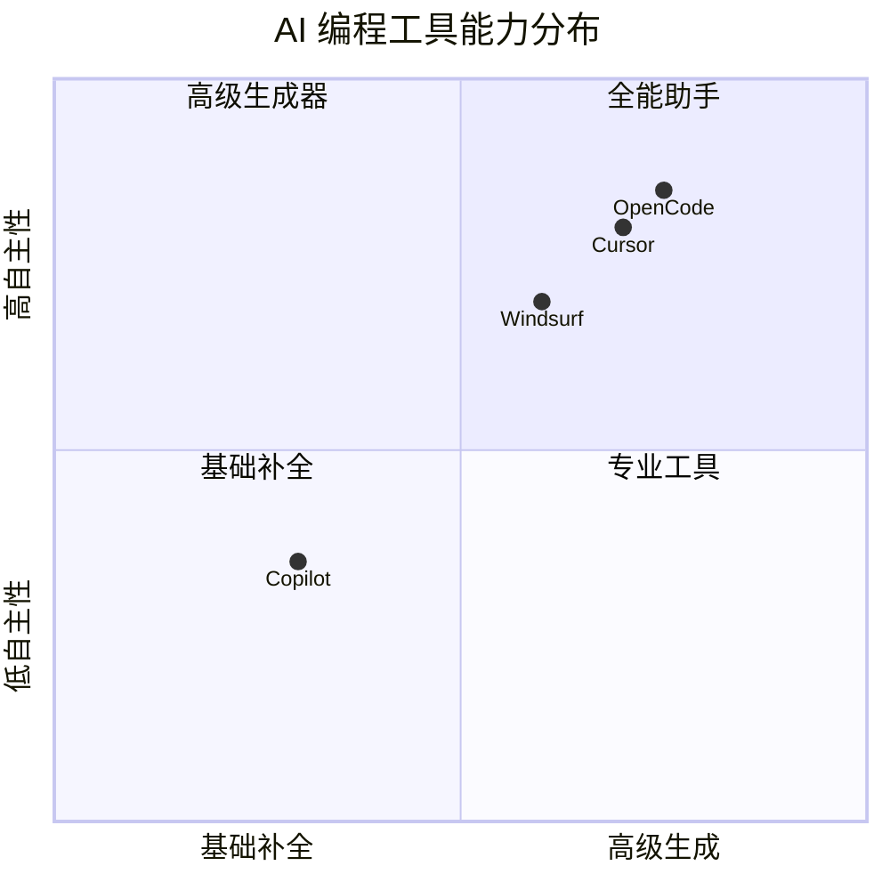
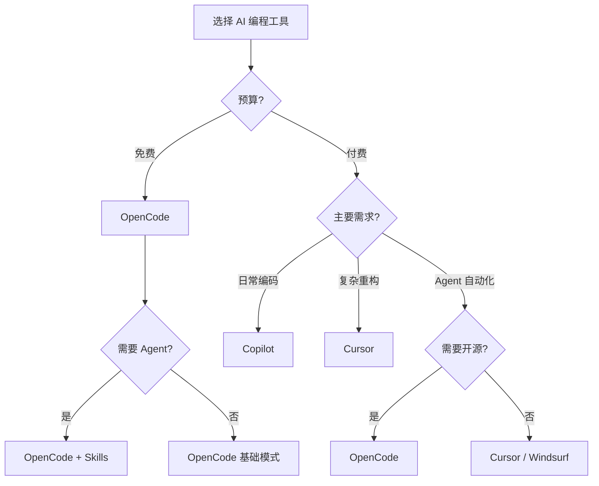

<DifficultyBadge level="beginner" />

# AI 编程工具对比

## 一句话解释

AI 编程工具是**嵌入开发环境的 AI 代码助手**，能在编码过程中提供补全、生成、重构、调试等能力。2026 年，**不会用 AI 编程 = 面试减分项**。

## 核心能力雷达



## 主流工具对比

| 维度 | GitHub Copilot | Cursor | Windsurf | OpenCode |
|------|---------------|--------|----------|----------|
| **基础模型** | GPT-4o / Claude 3.5 | Claude 3.5 / GPT-4o | GPT-4o / Claude | Claude / GPT-4o |
| **代码补全** | ⭐⭐⭐⭐⭐ 极快 | ⭐⭐⭐⭐ 准确 | ⭐⭐⭐⭐ 准确 | ⭐⭐⭐⭐ |
| **多行生成** | ⭐⭐⭐⭐ | ⭐⭐⭐⭐⭐ Tab Tab | ⭐⭐⭐⭐ | ⭐⭐⭐⭐ |
| **Agent 模式** | ✅ 2025 年已发布 | ✅ 强大（自动执行命令） | ✅ Cascade 模式 | ✅ 子代理编排 |
| **上下文感知** | 当前文件 + 附近 | 整个项目索引 | 整个工作区 | 多文件/多仓库 |
| **自定义规则** | `.github/copilot-instructions.md` | `.cursorrules` | `.windsurfrules` | Skills / Agent |
| **多文件编辑** | ❌ | ✅ | ✅ | ✅ |
| **终端集成** | ❌ | ✅ | ✅ | ✅ |
| **价格** | $10/月 | $20/月 | $15/月 | 开源免费 |

## 各工具的强项场景

### GitHub Copilot — 最快最稳的补全

适合：**日常编码、快速补全、熟悉 IDE 流程**

```javascript
// 输入注释即可生成
// 定义一个防抖函数，支持立即执行选项
function debounce(fn, delay, immediate = false) {
  let timer = null
  return function(...args) {
    const callNow = immediate && !timer
    clearTimeout(timer)
    timer = setTimeout(() => {
      timer = null
      if (!immediate) fn.apply(this, args)
    }, delay)
    if (callNow) fn.apply(this, args)
  }
}
// Copilot 在输入注释后几乎瞬间补全
```

### Cursor — 最强的上下文理解

适合：**复杂重构、跨文件修改、理解遗留代码**

```
// Cursor Chat 提问示例
"把这个组件从 Class Component 重构为 Function Component + Hooks，
保持所有 props 类型不变，确保测试通过"
```

### Windsurf — 平衡方案

适合：**需要 Agent 能力但预算有限**

特色 Cascade 模式：自动分析错误 → 定位问题 → 建议修复 → 应用修改，形成完整闭环。

### OpenCode — 开源 + Orchestration

适合：**需要自定义 AI 工作流、多 agent 协作**

```javascript
// OpenCode Skills 示例 - 定义 AI 编码规范检查
task(category="quick", load_skills=[], prompt="Review the code in src/components/ for accessibility issues...")
```

## 工具决策树



## 面试中如何展示 AI 能力

### 面试官常问

> "你平时用 AI 工具吗？怎么用的？"

### 好的回答（展示深度）

✅ **不要说**："会用 Copilot 写代码。"
✅ **要说**：

```
"我日常深度使用 Cursor + Copilot 组合：
1. Copilot 负责实时补全和简单生成，效率极高
2. Cursor Agent 处理复杂任务——比如跨文件重构、写测试、升级依赖
3. 我还自定义了项目级别的.cursorrules，让 AI 生成的代码遵循我们的代码规范
4. 对于重复性工作（写 Storybook / 翻译 i18n / 生成 API 类型），我写了一些 Prompt 模板批量处理

同时我会严格审查 AI 输出的代码——AI 生成敢用、能 review、能优化，
这才是 AI 时代的资深前端价值所在。"
```

## 💡 AI 辅助学习

> 用这个 Prompt 帮你在面试中展示 AI 能力：
> "你是一个前端技术面试官。我正在面试一个 P6 前端岗位，请模拟一个关于'AI 工具使用'的面试场景：
> 1. 问我 3 个关于 AI 编程工具的问题
> 2. 给出优秀回答的要点
> 3. 指出初级和高级回答的区别在哪里"

## 关联知识

- [Prompt 基础](/ai-dev/prompt-basics) — 面向开发者的 Prompt 公式
- [AI 代码生成实战](/ai-dev/ai-code-gen) — 从需求到代码的完整 Prompt 模板
- [AI + 前端工作流](/ai-dev/ai-workflow) — 全链路 AI 介入
