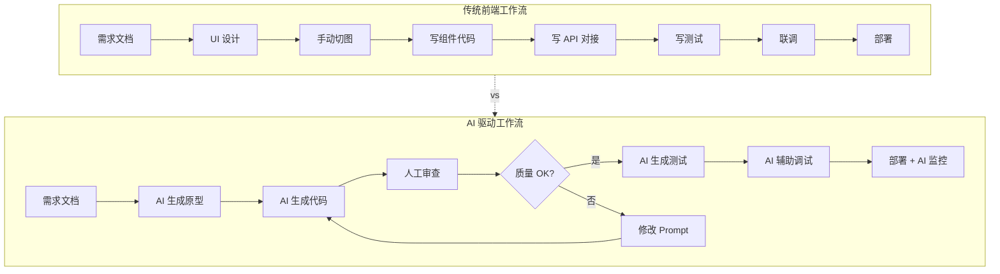
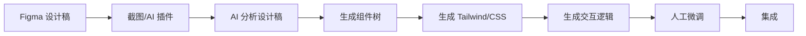
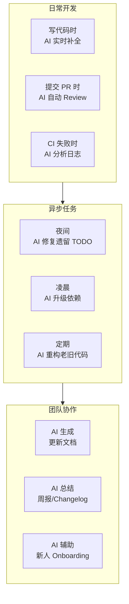
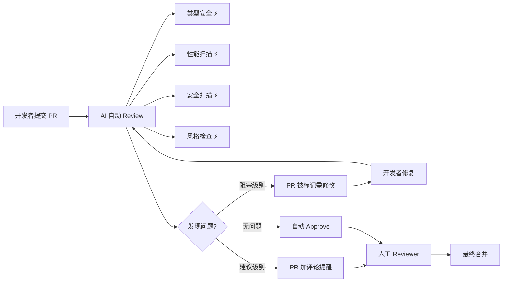

<DifficultyBadge level="intermediate" />

# AI + 前端工作流

## 一句话解释

2026 年的前端开发已经不是"人写代码，AI 辅助"的单向关系，而是**人做决策和设计，AI 做执行和迭代**的双向工作流。掌握 AI 驱动的工作流 = 单人产出翻倍。

## 传统 vs AI 驱动工作流



**效率对比：**

| 阶段 | 传统 | AI 驱动 | 提效 |
|------|:----:|:-------:|:----:|
| 原型设计 | 2-3 天 | 2-3 小时 | **~6x** |
| 页面开发 | 5-7 天 | 1-2 天 | **~4x** |
| API 对接 | 1-2 天 | 2-4 小时 | **~3x** |
| 测试编写 | 2-3 天 | 2-3 小时 | **~6x** |
| Bug 定位 | 1-3 小时 | 10-30 分钟 | **~4x** |
| **综合** | **10-18 天** | **3-5 天** | **~3-4x** |

## 深入理解

### 工作流 1：设计稿 → 代码



**Prompt 示例：**
```
你是一个资深前端工程师。这是一个设计稿截图，请：
1. 分析页面布局结构（Header/Body/Sidebar/Footer）
2. 识别 UI 组件类型（Button/Card/Table/Modal/Form）
3. 生成对应 React + Tailwind 组件代码
4. 注意设计稿中的间距/颜色/字体（用 Tailwind token）

设计稿：[粘贴图片]

额外要求：
- 响应式设计（Mobile/Tablet/Desktop 三档）
- 暗黑模式支持
- 组件拆分粒度合理
```

**常用工具链：**
- **Screenshot to Code**（开源）：截图 → HTML/Tailwind/React
- **Cursor + Claude Vision**：粘贴截图 + Prompt → 组件代码
- **v0.dev / Claude Artifacts**：自然语言描述 → 交互式原型
- **Figma to Code 插件**：直接导出 Figma 设计稿为代码

### 工作流 2：需求 → 架构 → 实现

**完整流程：**

```
第 1 步：需求澄清（人与 AI 对话）
人："我要做一个电商购物车页面"
AI："我来拆解一下需求：展示商品列表、增减数量、删除、计算总价、优惠券、结算跳转..."
人："对，还有库存不足提示和凑单推荐"
AI："好的，更新需求清单..."

第 2 步：AI 生成架构方案
AI 输出：
- 组件树：CartPage → CartList → CartItem / CartSummary / CouponInput
- 数据流：React Context + useReducer
- API 设计：GET/POST/PUT/DELETE /api/cart
- 状态设计：items/loading/error/coupon/selectedIds

第 3 步：人审方案，确认后生成
人："组件树 OK，数据流用 Zustand 替代 Context"

第 4 步：AI 逐步生成代码
→ Step 1: 类型定义 + Store
→ Step 2: CartItem 组件
→ Step 3: CartList 组件
→ Step 4: CartSummary + 优惠券
→ Step 5: API 对接
→ Step 6: 单元测试

第 5 步：集成 + 联调
→ AI 辅助定位联调中的问题
→ AI 补充边界情况处理
```

### 工作流 3：持续 AI 集成（AI 作为团队成员）



**实际案例（Cursor Cloud Agents）：**
```
配置一个 Cloud Agent 每天凌晨 2 点执行：
1. 检查 package.json 中可升级的依赖
2. 运行 `npx tsc --noEmit` 检查类型错误
3. 如果有类型错误，自动修复并创建 PR
4. 在 Slack 通知："依赖升级 PR #xxx 已创建"
```

### 工作流 4：AI 辅助 Code Review 流水线



## 关键原则

```
1. ⚡ 80/20 法则：AI 做 80% 的重复工作，人聚焦 20% 的核心决策
2. 👀 审查第一原则：AI 生成的每一行代码都需要审查
3. 📝 分步优于全量：拆成小任务 → AI 逐步执行 → 人逐步审查
4. 🔄 迭代思维：第一版 AI 生成 → 人修改 → AI 基于修改继续迭代
5. 🧠 保持上下文：不要让 AI 每次都从头开始，保留对话历史
```

## 面试问法

- 🔥 **你的 AI 驱动开发工作流是怎样的？**
  - 回答框架：需求分析→方案设计→代码生成→测试→集成，每个环节 AI 扮演不同角色
  - 加分点：提到"分步策略"+"审查机制"+"迭代优化"

- ⭐ **AI 提效最明显的场景是什么？**
  - 回答框架：重复性模板代码（表单/CRUD/测试）+ 调试定位 + 重构
  - 核心：**AI 不是代替思考，而是减少你不应该花时间做的事**

- ⭐ **AI 无法替代前端工程师的什么？**
  - 回答框架：架构设计决策、用户体验判断、业务理解、代码审查判断
  - 面试官想听：**你知道 AI 的边界在哪**

## 💡 AI 辅助学习

**向 AI 提问：**
- "帮我设计一个从需求到上线的 AI 驱动前端开发工作流，我是独立开发者，一个人负责全栈"
- "我想把我的团队工作流改造成 AI 驱动的，现在我们有设计师、前端、后端，怎么逐步迁移？"
- "设计稿截图转代码的最佳实践是什么？有没有工具链推荐？"
- "Cursor Cloud Agents 自动修复 CI 失败的配置怎么搞？"

## 关联知识

- [AI 编程工具对比](./ai-tools-overview) — 工作流的工具基础
- [AI 工具配置与定制](./ai-tool-config) — 配置 Rules/MCP/Agent
- [Agent 模式使用](./ai-agent-usage) — AI Agent 工作模式
- [AI 辅助架构设计](./ai-architecture) — 方案设计阶段的 AI 辅助
