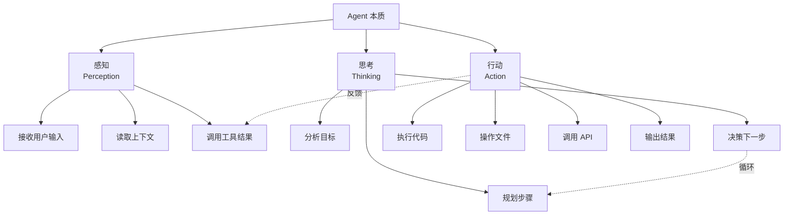
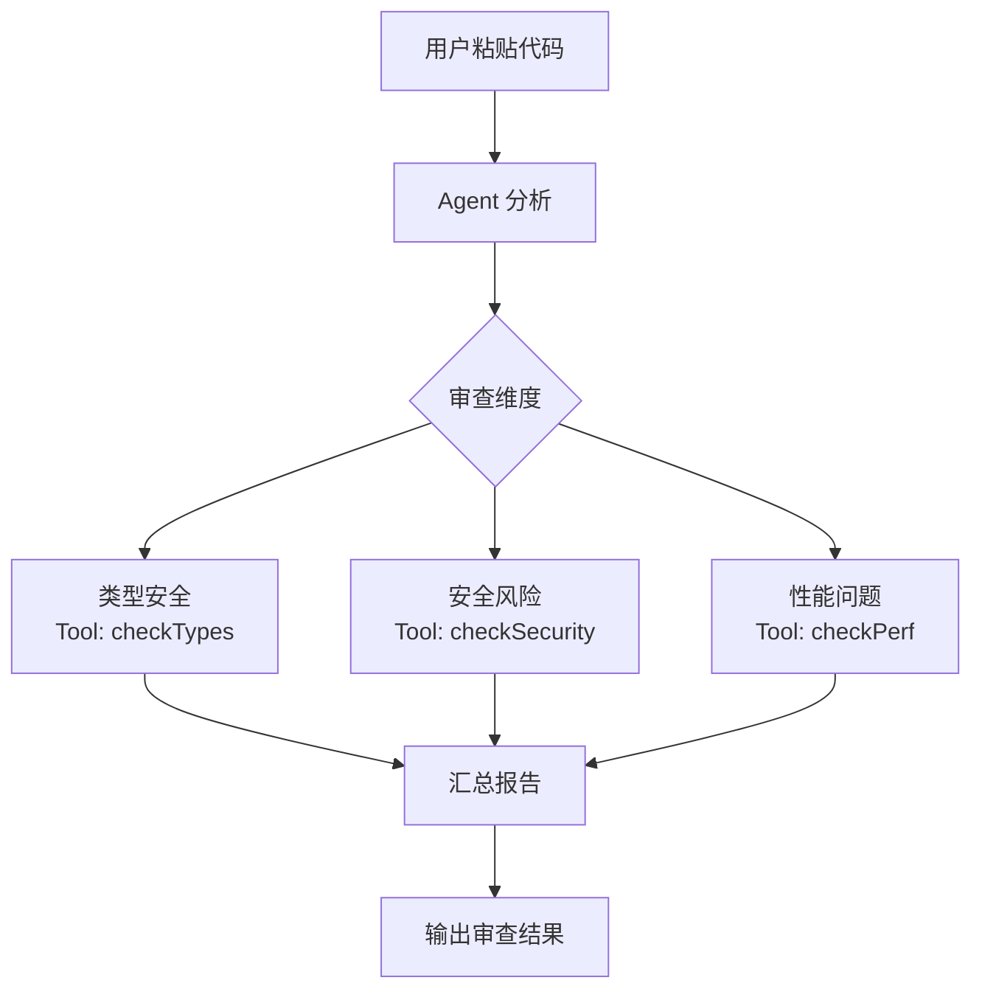
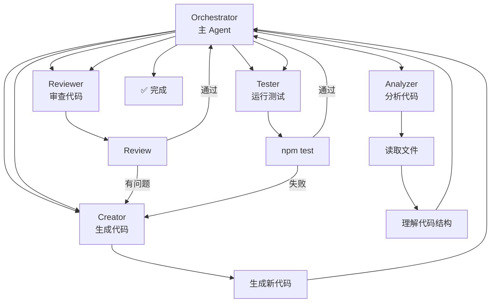

<DifficultyBadge level="advanced" />

# 构建自己的 AI Agent

## 一句话解释

2026 年，构建自己的 AI Agent 不再是 AI 工程师的专利——**前端开发者也能用 LangChain.js / Vercel AI SDK / OpenCode 等框架**，快速构建出能理解代码、自动执行任务的 AI Agent。

## 什么是 Agent

<div class="analogy-card">
  <span class="analogy-title">🎬 生活类比：给机器人装上"大脑-手脚-眼睛"</span>
  <div class="analogy-body">
    传统程序像<strong>自动售货机</strong>：投币（输入）→ 固定掉货（输出），逻辑写死。<strong>Agent 像能自己干活的机器人</strong>：有<strong>眼睛</strong>（感知：读你的需求、看环境）、有<strong>大脑</strong>（思考：分析目标、规划步骤、决定下一步）、有<strong>手脚</strong>（行动：敲代码、改文件、调 API）。<em>而且它会"边走边看"：做完一步，用眼睛确认结果（反馈），再决定下一步怎么走。</em>
  </div>
</div>



**Agent vs 传统程序：**
```
传统程序：输入 → 固定逻辑 → 输出（确定性强）
AI Agent：目标 → 自主规划 + 执行 + 纠错 → 结果（灵活性强）
```

## 深入理解

### 1. Agent 框架对比（2026）

| 框架 | 语言 | 适用场景 | Agent 类型 | 难度 |
|------|:----:|---------|:----------:|:----:|
| **LangChain.js** | TS/JS | 通用 Agent、RAG、多工具 | ReAct / Plan-Execute | 🔴 |
| **Vercel AI SDK** | TS/JS | 前端 AI 应用、Streaming UI | Tool Calling | 🟡 |
| **OpenCode** | TS/JS | 编码 Agent、Orchestration | Multi-Agent | 🟡 |
| **OpenAI Agents SDK** | TS/JS | 轻量 Agent、快速原型 | Tool Calling | 🟢 |
| **Claude Agent Protocol** | 协议 | 构建 MCP Server | 工具层 | 🟡 |
| **CrewAI** | Python | 多 Agent 协作 | Multi-Agent | 🟡 |

### 2. 实战：用 Vercel AI SDK 构建一个代码审查 Agent



**完整代码示例：**
```typescript
// app/api/code-review/route.ts
import { openai } from '@ai-sdk/openai'
import { generateText, tool } from 'ai'
import { z } from 'zod'
import { analyzeCode } from './tools'

// 定义 Agent 的工具
const codeTools = {
  checkTypes: tool({
    description: '检查 TypeScript 类型安全问题',
    parameters: z.object({
      code: z.string().describe('需要检查的代码'),
    }),
    execute: async ({ code }) => {
      // 调用 TypeScript 编译器 API 检查
      return analyzeCode.typeCheck(code)
    },
  }),
  
  checkSecurity: tool({
    description: '检查安全漏洞（XSS/注入/敏感信息）',
    parameters: z.object({
      code: z.string().describe('需要检查的代码'),
    }),
    execute: async ({ code }) => {
      return analyzeCode.securityScan(code)
    },
  }),
  
  checkPerformance: tool({
    description: '检查性能问题',
    parameters: z.object({
      code: z.string().describe('需要检查的代码'),
    }),
    execute: async ({ code }) => {
      return analyzeCode.perfCheck(code)
    },
  }),
}

// Agent 入口
export async function POST(req: Request) {
  const { code } = await req.json()
  
  const result = await generateText({
    model: openai('gpt-5.5'),
    system: `你是一个资深前端代码审查专家。
你需要：
1. 先用 checkTypes 检查类型安全
2. 再用 checkSecurity 检查安全
3. 再用 checkPerformance 检查性能
4. 最后汇总输出报告

报告格式：
## 📋 审查报告
### 🔴 严重问题
### 🟡 建议修改
### 🟢 良好实践
### 💡 优化建议`,
    messages: [{ role: 'user', content: `审查以下代码：\n\n${code}` }],
    tools: codeTools,
    maxSteps: 5, // Agent 最多执行 5 步工具调用
  })
  
  return Response.json({ review: result.text })
}
```

### 3. 实战：用 OpenCode 构建编码 Agent



**OpenCode Skills 配置：**
```javascript
// .opencode/skills/agent-coder.config.js
module.exports = {
  orchestrator: {
    model: 'claude-4-sonnet',
    system: `你是一个编码 Agent 系统的编排者。
负责任务拆解和 Specialist Agent 调度。`,
    maxSteps: 20,
  },
  
  agents: {
    analyzer: {
      category: 'deep',
      model: 'claude-4-haiku',
      prompt: `分析项目结构和代码，输出概要：文件列表、依赖关系、架构模式`,
    },
    coder: {
      category: 'unspecified-high',
      model: 'claude-4-sonnet',
      prompt: `基于分析结果和需求，实现功能代码。遵循项目现有模式。`,
    },
    reviewer: {
      category: 'quick',
      model: 'gpt-5.5',
      prompt: `审查生成的代码：类型安全、性能、边界情况、错误处理`,
    },
  },
}
```

### 4. Agent 设计模式

| 模式 | 描述 | 适合场景 |
|------|------|---------|
| **ReAct** | 思考→行动→观察→再思考 | 需要推理的任务 |
| **Plan-Execute** | 先规划再执行 | 复杂多步骤任务 |
| **Tool Calling** | 模型自主调用工具 | 需要外部数据/操作 |
| **Reflection** | 自我审查输出 | 需要高准确率的场景 |
| **Multi-Agent** | 多个 Specialist 协作 | 大型复杂系统 |

### 5. 状态管理与记忆

<div class="analogy-card">
  <span class="analogy-title">🧩 一句话记住 Agent 的三层记忆</span>
  <div class="analogy-body">
    <strong>"短期=正在做的手头事，工作=桌上的草稿纸，长期=归档的文件夹"</strong> —— <em>短期记忆</em>是当前任务（正在改哪个文件）、<em>工作记忆</em>是桌上的半成品（打开的文件、报错列表）、<em>长期记忆</em>是归档的工程资料（项目结构、技术栈、历史决策）。<strong>最容易忘的是：Agent 崩溃/重启后只剩长期记忆，手头的活全没了——所以关键进度要同步进长期记忆。</strong>
  </div>
</div>

```typescript
// Agent 记忆管理示例
interface AgentMemory {
  shortTerm: {
    currentTask: string
    completedSteps: string[]
    lastAction: string
    lastObservation: string
  }
  longTerm: {
    // 持久化的项目信息
    projectStructure: File[]
    techStack: TechStack
    conventions: Convention[]
    // 从对话中提取的关键决策
    decisions: Decision[]
  }
  workingMemory: {
    // 当前正在处理的代码
    files: Map<string, string>
    errors: Error[]
    testResults: TestResult[]
  }
}
```

### 6. 部署与监控

| 部署方式 | 适合场景 | 示例 |
|---------|---------|------|
| **Vercel Edge Function** | 轻量 Agent API | Vercel AI SDK |
| **Node.js Server** | 长时间运行 | LangChain.js Agent |
| **Docker + K8s** | 企业级 | 多 Agent 编排 |
| **Serverless** | 按需调用 | AWS Lambda |

**监控指标：**
```
Agent 可观测性：
- 成功率：Agent 完成任务的比例
- 平均步数：完成任务需要的工具调用次数
- 工具调用延迟：每个工具的平均耗时
- 错误率：工具调用失败的比例
- Token 消耗：每次会话的 token 数
- 人工介入率：需要人工干预的比例
```

## 面试问法

- 🔥 **你有构建过 AI Agent 吗？怎么设计的？**
  - 回答框架：用什么框架 → 解构了什么任务 → 设计了哪些工具 → 怎么处理错误
  - 加分点：提到"ReAct 模式"、"Plan-Execute 分离"

- 🔥 **Agent 的 Tool Calling 怎么设计的？工具出错了怎么办？**
  - 回答框架：工具定义（输入 Schema + 实现） → 错误捕获 → 重试机制 → 人工兜底

- ⭐ **Multi-Agent 和 Single-Agent 怎么选？**
  - 单一 Agent：简单任务、延迟敏感
  - Multi-Agent：复杂任务、可以并行、职责分离

## 💡 AI 辅助学习

**向 AI 提问：**
- "我想用 Vercel AI SDK 建一个前端代码审查 Agent，帮我写完整的代码"
- "LangChain.js 和 Vercel AI SDK 在构建 Agent 上的区别是什么？"
- "我想用 OpenCode 搭建一个多 Agent 编码系统，Orchestrator + Coder + Reviewer 架构，怎么配置？"
- "Agent 的工具调用失败怎么处理？设计一个合理的重试和兜底机制"

## 关联知识

- [Agent 模式使用](./ai-agent-usage) — Agent 使用经验
- [AI 工具配置与定制](./ai-tool-config) — MCP 工具链
- [RAG 与知识库搭建](./rag-knowledge-base) — Agent + RAG
- [AI + 前端工作流](./ai-workflow) — Agent 在工作流中的位置
- [OpenCode 官方文档](https://ohmyopencode.com) — OpenCode 编排框架
