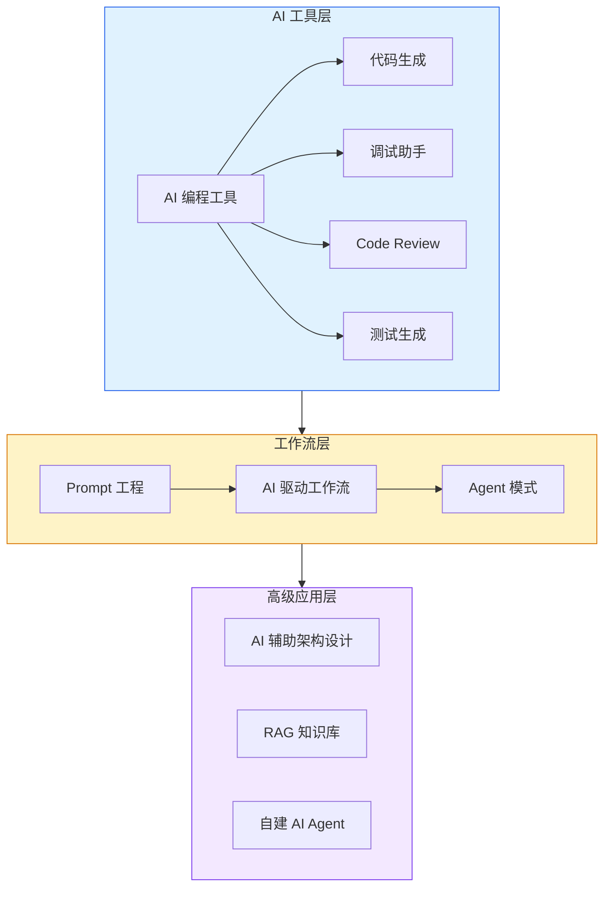

# 🤖 AI 辅助开发

AI 编程工具、Prompt 工程、AI 工作流、Agent、RAG — **2025-2026 年面试的新增热门板块**。共 14 个知识点，从工具使用到自建 AI 系统的完整路径。

<DifficultyBadge level="beginner" /> AI 工具使用经验 · <DifficultyBadge level="intermediate" /> 理解 AI 工作流原理 · <DifficultyBadge level="advanced" /> 构建 AI 应用与 Agent

::: tip 💡 建议
AI 是前端面试的新变量。即使公司不以 AI 为核心业务，**面试官也会关注你如何用 AI 提效**——这是 2026 年 P6+ 候选人的"默认技能"。
:::

---

## 🟢 入门（6 个）

掌握这些，你能在日常开发中高效使用 AI 工具。

  <a href="./ai-tools-overview" class="card">
    <h3>AI 编程工具对比 <Badge type="info" text="🔥高频" /></h3>
    
Cursor/Codeium/Windsurf/GitHub Copilot 优劣势与选型

  </a>
  <a href="./prompt-basics" class="card">
    <h3>Prompt 基础 <Badge type="info" text="🔥高频" /></h3>
    
提示词结构、角色设定、上下文管理、常见技巧

  </a>
  <a href="./ai-code-gen" class="card">
    <h3>AI 代码生成实战 <Badge type="info" text="🔥高频" /></h3>
    
从描述到代码、组件生成、API 调用、类型定义生成

  </a>
  <a href="./ai-debugging" class="card">
    <h3>AI 调试助手 <Badge type="info" text="⭐中频" /></h3>
    
错误信息分析、断点建议、性能问题排查、记忆体管理

  </a>
  <a href="./ai-code-review" class="card">
    <h3>AI 辅助 Code Review <Badge type="info" text="⭐中频" /></h3>
    
自动化 Review 流程、安全检查、最佳实践检查

  </a>
  <a href="./ai-testing" class="card">
    <h3>AI 写测试 <Badge type="info" text="⭐中频" /></h3>
    
单元测试生成、Mock 数据生成、测试覆盖率提升

  </a>

---

## 🟡 进阶（5 个）

深入 AI 工作流，让 AI 成为你的"团队伙伴"而非"打字员"。

  <a href="./ai-tool-config" class="card">
    <h3>AI 工具配置与定制 <Badge type="info" text="⭐中频" /></h3>
    
Rules/Custom Instructions、MCP、Agent 配置、私有模型接入

  </a>
  <a href="./ai-workflow" class="card">
    <h3>AI + 前端工作流 <Badge type="info" text="🔥高频" /></h3>
    
AI 驱动的全链路开发、设计稿→代码、需求→原型→实现

  </a>
  <a href="./ai-agent-usage" class="card">
    <h3>Agent 模式使用 <Badge type="info" text="🔥高频" /></h3>
    
Plan/Execute 模式、多 Agent 协作、工具调用、自我纠错

  </a>
  <a href="./ai-architecture" class="card">
    <h3>AI 辅助架构设计 <Badge type="info" text="⭐中频" /></h3>
    
需求分析、方案生成、技术选型、架构评审

  </a>
  <a href="./prompt-advanced" class="card">
    <h3>Prompt 工程进阶 <Badge type="info" text="⭐中频" /></h3>
    
Chain-of-Thought、Few-shot、结构化输出、记忆与上下文窗口

  </a>

---

## 🔴 高级（3 个）

P7+ 面试前沿方向，具备 AI 系统构建能力。

  <a href="./rag-knowledge-base" class="card">
    <h3>RAG 与知识库搭建 <Badge type="info" text="🔥高频" /></h3>
    
向量数据库、Embedding 模型、检索增强生成、私有知识库

  </a>
  <a href="./build-own-agent" class="card">
    <h3>构建自己的 AI Agent <Badge type="info" text="🔥高频" /></h3>
    
Agent 框架对比、工具链设计、状态管理、部署与监控

  </a>
  <a href="./ai-interview" class="card">
    <h3>AI 面试专题 <Badge type="info" text="⭐中频" /></h3>
    
AI 面试模拟、能力评估、个性化复习计划

  </a>

