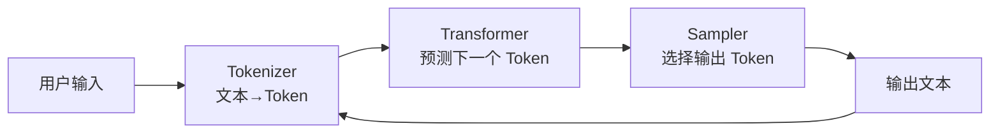
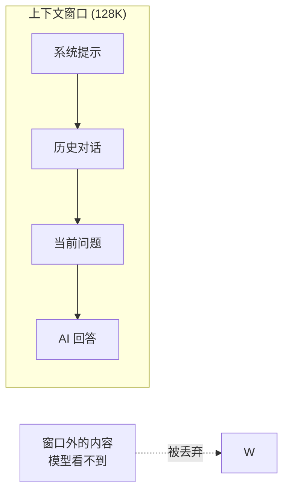
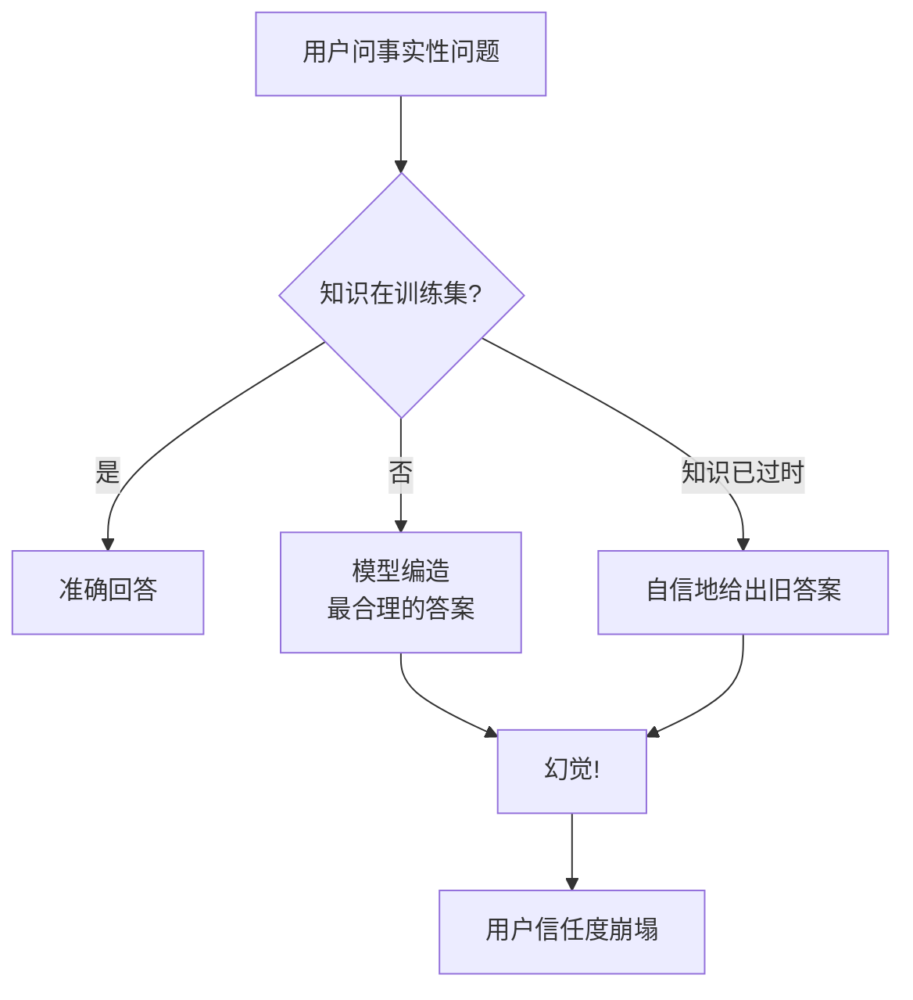
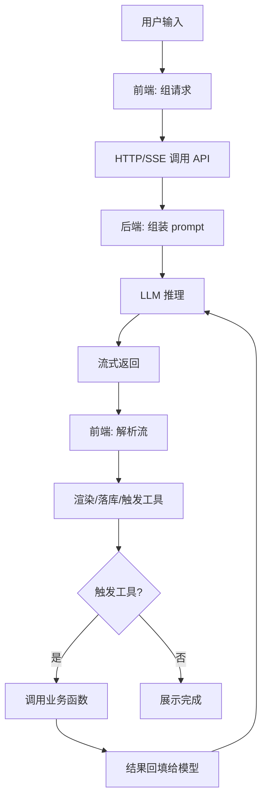

<DifficultyBadge level="beginner" />

# LLM 核心原理

## 一句话解释

LLM（大语言模型）不是"会编程的数据库"，而是**一个根据上文预测下一个 Token 的概率模型**——前端开发者理解这一点，就能解释 80% 的 AI 应用"玄学"现象（为什么回答不稳定、为什么截断、为什么有幻觉）。

## 为什么前端要懂 LLM 原理

2026 年，前端不再只是"调用 AI 接口"，而是真正在**构建 AI 应用**。不懂原理，你会：

- 被用户问"为什么 AI 有时回答不一样"时答不上来
- 不知道"上下文窗口满了"意味着什么、怎么处理
- 面试 AI 应用开发岗时，卡在"Token 是什么"这类送分题



## 核心概念

### 1. Token 化（Tokenization）

模型**不直接读文字**，而是把文本切成 Token（词元）再计算。

<div class="analogy-card">
  <span class="analogy-title">🎬 生活类比：给文本"切麻将牌"</span>
  <div class="analogy-body">
    想象模型读的不是书，而是把文字洗成一副<strong>麻将牌</strong>——每个 Token 就是一张牌。它"看"到的不是一篇文章，而是一长串牌。<em>中文一个字可能占 1~2 张牌，英文一个词也可能拆成 2 张牌——所以"同样意思"，中文和英文的"牌数"（费用）不一样。</em>
  </div>
</div>

| 概念 | 说明 | 前端感知 |
|------|------|---------|
| **Token** | 模型处理的最小单位 | 计费按 Token，不是按字数 |
| **1 个汉字** | 约 1~2 个 Token | 中文对话"消耗"比英文快 |
| **1 个英文单词** | 约 1~2 个 Token | 代码注释也占 Token |
| **Token 上限** | 模型单次能处理的总量 | 超出会被截断/报错 |

**为什么重要：**
- 计费：`输入 Token + 输出 Token` 都是钱
- 限制：模型有**上下文窗口上限**（如 128K/200K），不是"无限记忆"
- 优化：给 AI 的 prompt 越精炼，成本越低、响应越快

### 2. 上下文窗口（Context Window）

模型只能"看到"窗口内的内容，**窗口之外它完全不记得**。

<div class="analogy-card">
  <span class="analogy-title">🎬 生活类比：你的短期记忆只有"10 张便利贴"</span>
  <div class="analogy-body">
    上下文窗口就像你桌子上的<strong>便利贴墙</strong>——一共只能贴 10 张。新内容来了就贴一张，旧的就会被挤掉撕掉。模型不是"忘了"，是<em>它的便利贴墙就那么大</em>。<strong>聊天记录越聊越长，就像便利贴越贴越多——最老的早被挤掉了。</strong>
  </div>
</div>



**前端必踩的坑：**

| 场景 | 问题 | 解法 |
|------|------|------|
| 聊天记录越聊越长 | 窗口满了，最早的对话被遗忘 | 滑动窗口：只保留最近 N 轮 |
| 长文档塞进 prompt | 直接超出上限报错 | 先切片（Chunking）+ 检索相关片段 |
| 多轮带文件上下文 | 模型开始"答非所问" | 监控 `usage`，满了自动摘要压缩 |

**示例：监控上下文用量**

```js
const res = await fetch('/api/chat', {
  method: 'POST',
  body: JSON.stringify({ messages: history })
});
const data = await res.json();
// 响应里带 usage 信息
console.log(data.usage);
// { prompt_tokens: 15234, completion_tokens: 512, total_tokens: 15746 }

// 接近上限时做摘要压缩
if (data.usage.prompt_tokens > 100000) {
  // 把最老的对话交给模型总结成摘要，再拼回去
  history = [summarizedResult, ...history.slice(-10)];
}
```

### 3. 为什么 AI 回答不稳定（采样机制）

模型输出是**概率采样**，不是查表。同样的问题，温度参数不同结果就不同。

<div class="analogy-card">
  <span class="analogy-title">🎬 生活类比：掷骰子，不是查字典</span>
  <div class="analogy-body">
    普通程序是<strong>查字典</strong>：同样输入永远同样输出。模型是<strong>掷骰子</strong>：它心里对"下一个词"有一堆候选，每个候选带一个概率权重。<em>temperature 就是"掷骰子的手劲"——劲小（0.1）基本落在最可能的词上；劲大（1.5）就敢往冷门词上甩。</em>这就是为什么同样的问题，AI 每次回答都不一样。
  </div>
</div>

| 参数 | 作用 | 调大效果 | 典型场景 |
|------|------|---------|---------|
| **temperature** | 随机性 | 更有创意/更发散 | 文案、头脑风暴 |
| **top_p** | 候选词截断 | 更保守 | 代码生成、JSON 输出 |
| **max_tokens** | 输出长度上限 | 越长越慢越贵 | 控制成本、防超时 |
| **seed** | 随机种子 | 固定后结果更稳定 | 测试、对比实验 |

**面试高频问法："怎么让 AI 输出稳定？"**

```
回答框架：
1. 降低 temperature（0~0.2）
2. 固定 seed（如支持）
3. 用结构化输出约束格式（JSON mode / Function Calling）
4. prompt 里写清楚输出规范 + 给 Few-shot 示例
```

### 4. 幻觉（Hallucination）

模型会**一本正经地胡说八道**——因为它生成的是"最像正确答案的文字"，而不是"查证过的事实"。

<div class="analogy-card">
  <span class="analogy-title">🎬 生活类比：爱面子的"民间专家"</span>
  <div class="analogy-body">
    模型就像一个<strong>爱面子又没读过书的人</strong>——被问到不知道的事，它不会说"我不懂"，而是凭直觉编一个<strong>听起来最专业、最合理的答案</strong>，还说得特别自信。<em>它不是故意的，它的训练目标就是"生成像样的文字"，不是"说真话"。</em>所以关键数据不能靠它记忆，要给它资料（RAG）。
  </div>
</div>



**前端如何缓解：**
- **关键数据不靠模型记忆**：用 RAG 检索真实数据喂给模型（见关联知识）
- **要求引用来源**：prompt 里写"只根据提供的资料回答"
- **展示可验证信息**：AI 生成的财务/法规内容必须展示原文链接
- **不确定性引导**："不知道就直说"，比瞎编强

### 5. 结构化输出（JSON Mode / Function Calling）

聊天输出文本不可控，但**业务系统需要结构化数据**。这是 2026 年 AI 应用开发的核心技能。

<div class="analogy-card">
  <span class="analogy-title">🧩 一句话记住三种输出方式</span>
  <div class="analogy-body">
    <strong>"纯文本=自由作文，JSON Mode=填表格，Function Calling=填申请表"</strong> —— 作文你想写啥写啥（<em>容易跑题</em>）；填表格必须按格子来（<em>格式有保证</em>）；填申请表不但格式固定，还规定你必须盖谁的章（<em>参数类型强约束</em>）。
  </div>
</div>

| 方式 | 适用场景 | 可靠性 |
|------|---------|--------|
| **JSON Mode** | 输出固定 JSON 结构 | 高（格式保证） |
| **Function Calling** | 让模型调用你的函数 | 高（参数类型化） |
| **纯文本 + 解析** | 简单场景 | 低（格式易碎） |

**JSON Mode 示例：**

```
System:
你是一个用户意图分析器。只输出 JSON，不要输出任何其他内容。

User:
用户说："帮我把购物车里的 iPhone 退掉，顺便查下物流"

Assistant（JSON Mode 保证格式）:
{
  "intent": "退货",
  "target": "iPhone",
  "actions": ["退货", "查物流"],
  "needs_human": false
}
```

**Function Calling 示例：**

```js
// 声明模型可以调用的函数
const tools = [
  {
    type: 'function',
    function: {
      name: 'get_weather',
      description: '获取指定城市的天气',
      parameters: {
        type: 'object',
        properties: {
          city: { type: 'string', description: '城市名' }
        },
        required: ['city']
      }
    }
  }
];

// 模型可能会返回 "调用 get_weather(city='上海')"
// 而不是直接生成天气文本 —— 由你的代码真正执行
```

## 前端视角的 LLM 调用全景



## 面试问法

- 🔥 **Token 是什么？为什么中文比英文"贵"？**
  - 回答框架：分词机制 → 中文字符在词表中更稀疏 → 1 个汉字可能拆多个 Token
  - 加分点：提到可以用 Tokenizer 工具实测同一句话的中英文 Token 数

- 🔥 **上下文窗口有限，多轮对话怎么处理？**
  - 回答框架：滑动窗口 → 历史摘要压缩 → 关键内容放系统提示
  - 核心：**窗口是硬约束，策略是工程问题**

- ⭐ **怎么让 AI 输出稳定、可解析？**
  - 回答框架：temperature 调低 → JSON Mode/Function Calling → Few-shot 示例
  - 加分点：提到底层是概率采样，所以"一次请求不可复现"是正常的

- ⭐ **AI 产生幻觉怎么办？**
  - 回答框架：RAG 检索增强 → 要求引用来源 → 边界约束（"不知道就说不知道"）
  - 核心：**别让模型靠记忆回答事实问题**

## 💡 AI 辅助学习

**向 AI 提问：**
- "用图表解释 Transformer 的 self-attention 机制，面向前端开发者"
- "我的聊天应用上下文超限了，给出三种压缩策略和代码"
- "Function Calling 和 JSON Mode 分别适合什么场景？给出对比表"
- "为什么同一个 prompt 连续调用结果不同？怎么让它稳定？"

## 关联知识

- [Prompt 基础](./prompt-basics) — 如何写模型更听话的提示词
- [RAG 与知识库搭建](./rag-knowledge-base) — 用检索对抗幻觉
- [AI 应用前端开发](./ai-app-frontend) — 前端如何对接 LLM 流式接口
- [AI 对话界面工程](./ai-chat-ui) — 流式渲染与对话状态管理
