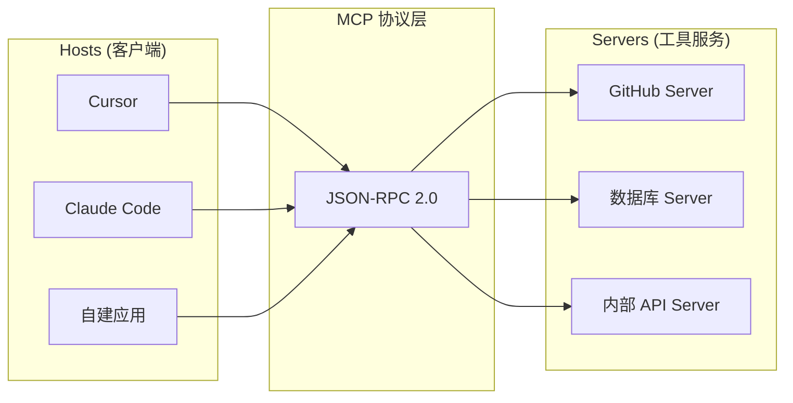
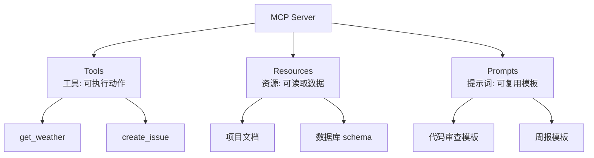
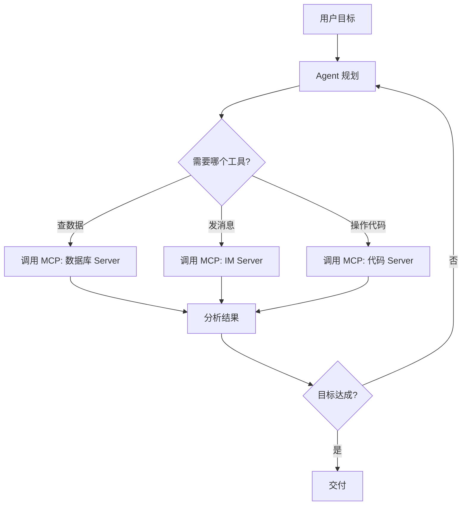

<DifficultyBadge level="intermediate" />

# MCP 协议深度

## 一句话解释

MCP（Model Context Protocol）是 AI 模型与外部工具之间的**"USB-C 接口"**——一套统一协议，让任何 AI 客户端（Cursor、Claude、自建应用）都能插上任何工具服务（数据库、浏览器、内部系统），不用每个客户端写一遍对接代码。

## 为什么 MCP 是 2026 年的分水岭

2025 年前，每个 AI 工具对接外部系统都要**自己发明协议**（Cursor 用自己的 MCP 实现、Copilot 有自己的插件格式）。2026 年 MCP 已成为行业事实标准：

| 维度 | 之前 | MCP 之后 |
|------|------|---------|
| **对接方式** | 每个客户端一套插件格式 | 一套协议到处复用 |
| **工具生态** | 各写各的，不互通 | 一个 MCP Server，全部客户端可用 |
| **开发成本** | 重复造轮子 | 写一次、到处跑 |
| **前端意义** | 无关 | 前端可开发 MCP Server 给团队 AI 用 |



## MCP 架构：Host / Client / Server 三端

| 角色 | 是什么 | 职责 |
|------|--------|------|
| **Host** | 用户使用的 AI 应用 | 管理连接、授权、对话流程 |
| **Client** | Host 内部的连接器 | 与 Server 建立 1:1 连接 |
| **Server** | 暴露工具/资源的服务 | 轻量程序，只做一件事 |

**通信方式：** 基于 JSON-RPC 2.0，支持两种传输：

| 传输方式 | 特点 | 适用 |
|---------|------|------|
| **stdio** | 本地子进程，进程间通信 | 本地开发工具（Cursor/Claude Code） |
| **HTTP + SSE** | 远程服务，可部署 | 团队共享、云端工具 |

## 三类能力：工具 / 资源 / 提示词

MCP Server 可以暴露三种能力，理解区别是面试重点：



| 能力 | 类比 | 特征 | 示例 |
|------|------|------|------|
| **Tools** | 函数 | 有副作用、可执行 | 创建 Issue、发请求、执行命令 |
| **Resources** | 文件 | 只读数据，可订阅更新 | 读取配置、查询文档 |
| **Prompts** | 模板 | 用户主动调用 | 一键"代码审查"、"生成周报" |

**面试回答框架：** "Tools 是让模型**做**，Resources 是让模型**读**，Prompts 是给用户**套模板**。"

## TypeScript 手写一个 MCP Server

> 2026 年面试可能让你现场写一个**最小 MCP Server**，以下是最简可运行版本。

```ts
import { McpServer } from '@modelcontextprotocol/sdk/server/mcp.js';
import { StdioServerTransport } from '@modelcontextprotocol/sdk/server/stdio.js';
import { z } from 'zod';

// 1. 创建 Server
const server = new McpServer({
  name: 'frontend-utils',
  version: '1.0.0'
});

// 2. 注册一个 Tool（工具）
server.tool(
  'to_px',                    // 工具名
  '将 rem/vw 等前端单位换算为 px',  // 描述
  { value: z.number(), unit: z.enum(['rem', 'vw']) }, // 参数 schema
  async ({ value, unit }) => {
    const px = unit === 'rem' ? value * 16 : value * 3.75;
    return {
      content: [{ type: 'text', text: `${value}${unit} = ${px}px` }]
    };
  }
);

// 3. 注册一个 Resource（资源）
server.resource(
  'project-config',           // 资源名
  'config://tailwind',        // URI
  async (uri) => ({
    contents: [{
      uri: uri.href,
      text: JSON.stringify({ theme: 'dark', primary: '#2563eb' }, null, 2)
    }]
  })
);

// 4. 通过 stdio 传输启动
const transport = new StdioServerTransport();
await server.connect(transport);
console.error('MCP Server 已启动');
```

**运行方式：** 在任意 AI 客户端（Cursor / Claude Code）的 MCP 配置里指向这个脚本，就能让 AI 调用 `to_px` 工具。

## 前端如何消费 MCP（浏览器端）

```js
// 前端应用里通过 SSE 连接远程 MCP Server
const client = new Client({ name: 'web-app' });

await client.connect(
  new SSEClientTransport(new URL('https://mcp.example.com/sse'))
);

// 列出可用的工具
const { tools } = await client.listTools();
console.log(tools.map((t) => t.name));
// ['to_px', 'get_weather', ...]

// 调用工具
const result = await client.callTool({ name: 'get_weather', arguments: { city: '上海' } });
```

**注意：** 浏览器端走 SSE 时，如果 Server 本身是 stdio 的，需要一个网关桥接层（2026 年常见做法是写个轻量 Node 网关）。

## MCP 与 Agent 的关系

MCP 是**基础设施**，Agent 是**上层建筑**——Agent 通过 MCP 获得工具能力：



**安全边界（重点）：** MCP 工具默认有权限，2026 年各 Host 都实现了**授权确认**——AI 调用高风险工具（删除、发布、写库）时，会弹窗要求用户确认。设计自己的 Server 时要把"危险操作"设计成独立工具，方便 Host 单独设权限。

## 生态：ACP 与 MCP 的关系

2026 年新出现了 ACP（Agent Communication Protocol）——**Agent 之间的通信协议**。不要混淆：

| 协议 | 解决什么问题 | 类比 |
|------|------------|------|
| **MCP** | 模型 ↔ 工具 | 人手 ↔ 工具 |
| **ACP** | Agent ↔ Agent | 同事 ↔ 同事 |

**面试话术：** "MCP 让 AI 用工具，ACP 让 AI 协作。两者是不同层的协议，未来会共存。"

## 面试问法

- 🔥 **MCP 是什么？解决了什么问题？**
  - 回答框架：USB-C 类比 → 统一协议 → 三类能力（Tools/Resources/Prompts）→ 生态意义
  - 加分点：说出 "JSON-RPC 2.0" 和 "stdio / SSE 两种传输"

- 🔥 **MCP Server 怎么写？最少需要几步？**
  - 回答框架：创建 McpServer → 注册 tool/resource → 连接 transport → 启动
  - 加分点：能写出来 + 说明参数用 zod schema 校验

- ⭐ **Tools / Resources / Prompts 的区别？**
  - 回答框架：做 / 读 / 套模板 一句话对比 + 各自示例
  - 加分点：提 Resources 支持订阅更新

- ⭐ **MCP 的安全风险怎么控制？**
  - 回答框架：工具最小权限 → Host 授权确认 → 危险操作独立成工具
  - 加分点：提 prompt injection 也能通过恶意工具描述注入

## 💡 AI 辅助学习

**向 AI 提问：**
- "用 TypeScript 写一个完整的 MCP Server，包含一个工具和一个资源"
- "MCP 的 stdio 和 SSE 传输有什么区别？什么时候用哪个？"
- "帮我设计一个团队前端组件库的 MCP Server 架构"
- "MCP 和 ACP 的区别是什么？用表格对比"

## 关联知识

- [AI 工具配置与定制](./ai-tool-config) — MCP 的客户端配置用法
- [构建自己的 AI Agent](./build-own-agent) — Agent 如何通过 MCP 获得工具
- [Agent 模式使用](./ai-agent-usage) — 工具调用在 Agent 中的位置
- [前端 AI 安全](./ai-security) — MCP 工具链的安全边界
