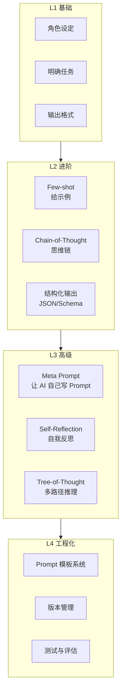
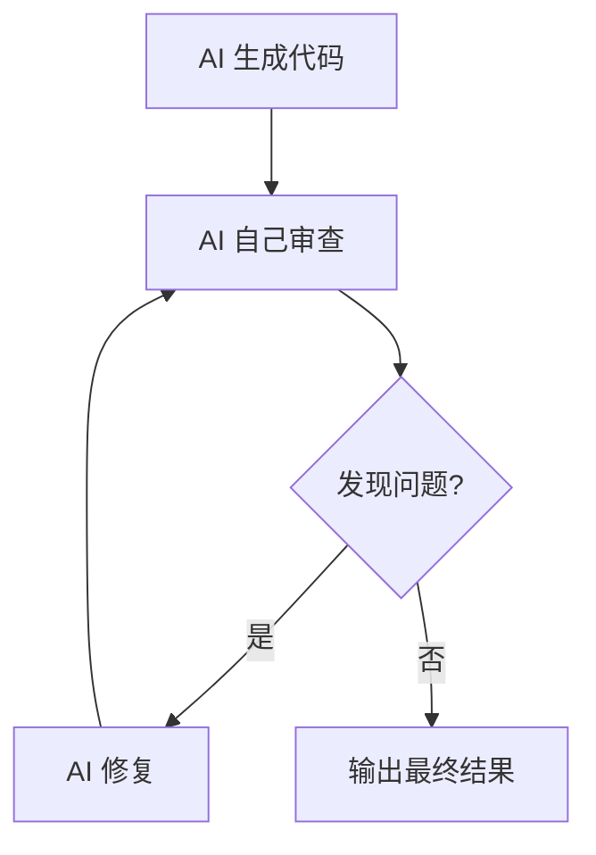

<DifficultyBadge level="advanced" />

# Prompt 工程进阶

## 一句话解释

如果说 Prompt 基础是"让 AI 听懂人话"，那 **Prompt 进阶是让 AI 输出你想要的精确结果**——通过思维链、Few-shot 示例、结构化约束等技术，把 AI 从"偶尔靠谱"变成"稳定可靠"。

## 技术层级



## 深入理解

### 1. Chain-of-Thought（思维链）

**核心思想**：让 AI 在回答之前"想一下"，显著提升复杂推理的准确性。

<div class="analogy-card">
  <span class="analogy-title">🎬 生活类比：教小孩做应用题要"分步写过程"</span>
  <div class="analogy-body">
    你问小孩"小明有 3 个苹果，又买了 5 个，吃了 2 个，还剩几个？"——他直接喊答案可能喊错。但如果你让他<strong>"先算一共买了几个，再算吃掉了几个，最后说还剩几个"</strong>，正确率立刻飙升。<em>AI 也一样：直接问容易"跳步出错"，让它把推理过程一步一步写出来，错误就会在过程中暴露并自我修正。</em>这就是"逐步思考"四个字的魔法。
  </div>
</div>

**零样本 CoT（最简单的魔法）：**
```diff
- "实现一个深拷贝函数"
+ "逐步思考：实现深拷贝需要考虑哪些边界情况？然后写出代码。"
```

**效果对比：**
```
❌ 直接问："React.memo 和 useMemo 有什么区别？"
→ 可能泛泛而谈，遗漏重点

✅ CoT 问法：
"请逐步分析 React.memo 和 useMemo 的区别：
Step 1: 它们各自的作用是什么
Step 2: 它们分别在什么层面做优化
Step 3: 它们的使用场景分别是什么
Step 4: 它们能互相替代吗？为什么？
Step 5: 给出一个实际代码示例展示两者的区别"
→ 结构清晰，覆盖全面
```

**面向前端的 CoT 模板：**
```
请逐步分析以下问题：

问题：[粘贴问题]

分析框架：
1. 核心概念：这个问题的本质是什么
2. 技术原理：底层机制是怎样的
3. 实际应用：在项目中怎么用
4. 常见误区：最容易搞错的地方
5. 面试回答：用 2-3 句话总结

请先输出你的逐步思考，再给出最终答案。
```

### 2. Few-shot 学习

**核心思想**：给 AI 2-3 个输入/输出示例，让它"学会"你要的模式。

<div class="analogy-card">
  <span class="analogy-title">🎬 生活类比：新员工看 3 份"标准答卷"就会干活</span>
  <div class="analogy-body">
    教新同事写周报，你光说"写得规范点"没用——<strong>直接甩给他 3 份老同事的标准周报（Few-shot 示例），他立刻知道格式、语气、详略。</strong>AI 也一样：<em>文字描述是"意会"，示例是"模仿"</em>。给 2~3 个输入/输出对，比写一百字规则更有效，因为它直接"照抄"你的风格。
  </div>
</div>

**代码迁移 Few-shot：**
```
我有一段 jQuery 代码要迁移到 React。请按照以下模式改写：

示例 1:
jQuery: $("#btn").click(() => { $("#result").text("clicked") })
React: const handleClick = () => setResult("clicked")
      ; <button onClick={handleClick}>{result}</button>

示例 2:
jQuery: $(".item").each((i, el) => { $(el).addClass("active") })
React: items.map(item => <div className="active">{item}</div>)

现在请改写：
jQuery: $(document).ready(() => { $.get("/api/data", (res) => { $("#list").html(res.map(item => `<li>${item.name}</li>`)) }) })
```

**Few-shot 最佳实践：**

| 要点 | 说明 |
|------|------|
| **2-3 个示例最有效** | 太少学不会，太多会过拟合 |
| **示例要有代表性** | 覆盖常见的输入变化 |
| **示例要正确** | AI 会模仿你的错误 |
| **边缘情况示例** | 让 AI 学会处理特殊情况 |

### 3. 结构化输出（Schema 约束）

**核心思想**：让 AI 输出**程序可直接解析的结构化数据**，而非自由文本。

**JSON Schema 约束：**
```
请分析以下 React 组件的问题，输出 JSON 格式：

```json
{
  "component": "组件名",
  "issues": [
    {
      "type": "performance | security | maintainability | bug",
      "severity": "critical | major | minor",
      "line": 行号,
      "description": "问题描述",
      "suggestion": "修改建议"
    }
  ],
  "summary": {
    "total_issues": 总问题数,
    "critical_count": 严重问题数,
    "score": "A/B/C/D"
  }
}
```

代码：[粘贴代码]
```

**Markdown 表格输出：**
```
请将以下架构方案按表格对比：

| 维度 | 方案A: [名称] | 方案B: [名称] | 方案C: [名称] |
|---|---|---|---|
| 架构描述 | | | |
| 适用场景 | | | |
| 复杂度 | 1-5 | 1-5 | 1-5 |
| 推荐度 | ⭐ | ⭐⭐ | ⭐⭐⭐ |
```

**TypeScript 类型约束输出：**
```
请生成一个 React 组件代码，类型定义如下：

```typescript
interface UserProfileProps {
  userId: string
  onError?: (error: Error) => void
}

// 输出符合此类型定义的完整组件
```

### 4. 上下文管理

**核心挑战**：AI 的上下文窗口有限（2026 年主流模型 100K-200K token），需要策略性地管理。

| 策略 | 说明 | 适用场景 |
|------|------|---------|
| **滑动窗口** | 只保留最近 N 条消息 | 长对话 |
| **摘要压缩** | 定期总结已讨论内容 | 超长任务 |
| **分层上下文** | 项目级 + 文件级 + 话题级 | 大型项目 |
| **外部存储** | 用文件/MCP 存储上下文 | Agent 场景 |

**滑动窗口实战：**
```
// 当对话太长时，用这条 Prompt 压缩：
"以上是我们的讨论总结。接下来基于这个方向继续：
[粘贴关键决策和当前状态]
现在请：..."
```

### 5. Self-Reflection（让 AI 自我纠错）

<div class="analogy-card">
  <span class="analogy-title">🎬 生活类比：交卷前让自己当 5 分钟"阅卷老师"</span>
  <div class="analogy-body">
    学生写完作文直接交，容易错字连篇；聪明的学生会<strong>角色切换成"阅卷老师"再读一遍</strong>——立刻看出逻辑漏洞和语病。<em>Self-Reflection 就是让 AI 写完代码后，换一个"Code Reviewer"的身份重新审查自己刚写的代码。</em>人容易看自己的东西"自带滤镜"，AI 换个角色反而能发现自己的 bug——因为它本质是换个视角重新推理一遍。
  </div>
</div>



**Self-Reflection Prompt：**
```
你刚刚写了这段代码。现在请以 Code Reviewer 的身份重新审查它：
1. 类型安全：所有类型是否正确？有无 any？
2. 边界情况：空值/undefined/极端输入怎么处理？
3. 性能：有无不必要的重渲染/计算？
4. 错误处理：所有异常路径都处理了吗？
5. 可维护性：命名/结构/注释是否清晰？

代码：[代码]

找出所有问题，然后输出修正后的版本。
```

### 6. Meta Prompt（让 AI 写 Prompt）

最高阶的技巧——**让 AI 帮你写 Prompt**：

```
我需要和 AI 协作完成以下任务，请帮我生成一个优化过的 Prompt：

我的目标：[描述任务]
我的原始 Prompt：[粘贴]

请帮我优化：
1. 结构更清晰（用角色/任务/上下文/格式/约束框架）
2. 增加 Few-shot 示例（如果需要）
3. 增加自检步骤（让 AI 验证输出质量）
4. 指出我原始 Prompt 的问题
```

## 面试问法

- 🔥 **你怎么确保 AI 输出的代码质量稳定？**
  - 回答框架：用 CoT 让 AI 先思考 → 结构化输出约束格式 → Self-Reflection 自检
  - 核心：**Prompt 写得越精确，AI 输出越稳定**

- ⭐ **Few-shot 和 Zero-shot 的区别？怎么选？**
  - Zero-shot 适合简单/通用任务；Few-shot 适合有特定风格/格式要求的任务
  - 新项目用 Few-shot 建立模式，稳定后用 Zero-shot

- 📌 **怎么看 2026 年 Prompt 工程的发展趋势？**
  - 从"写 Prompt"到"设计 Agent 系统"，关注：结构化输出 + 工具调用 + 自我反思

## 💡 AI 辅助学习

**向 AI 提问：**
- "给我一个前端面试中展示 Prompt 工程能力的案例，从基础到进阶到工程化"
- "CoT（思维链）在前端代码生成中怎么用？给我 3 个具体场景的 Prompt 模板"
- "我想系统学习 Prompt 工程，给我一个学习路线图"
- "Self-Reflection Prompt 怎么写？让 AI 写完代码后自我审查"

## 关联知识

- [Prompt 基础](./prompt-basics) — Prompt 核心结构
- [AI 代码生成实战](./ai-code-gen) — 场景化 Prompt 模板
- [AI 工具配置与定制](./ai-tool-config) — 将 Prompt 固化为配置
- [Agent 模式使用](./ai-agent-usage) — Prompt 的 Agent 化应用
