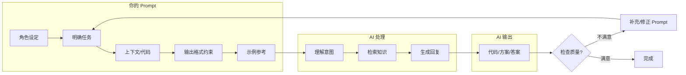

<DifficultyBadge level="beginner" />

# Prompt 基础

## 一句话解释

Prompt 是你和 AI 之间的"编程语言"——**写得越好，AI 输出的代码质量越高**。对前端开发者来说，Prompt 工程就是说清楚"要什么、什么格式、什么约束"。

## 核心流程



## 深入理解

### 1. Prompt 的核心结构

一个好的代码 Prompt 包含五个要素：

| 要素 | 说明 | 示例 |
|------|------|------|
| **角色** | AI 的身份 | "你是一个资深前端工程师" |
| **任务** | 具体要做什么 | "帮我写一个防抖 Hook" |
| **上下文** | 相关代码或背景 | "项目用 React 18 + TypeScript" |
| **格式** | 输出形式 | "返回完整组件代码 + 使用示例" |
| **约束** | 限制和注意事项 | "不要引入额外依赖" |

```markdown
## 一个好 Prompt 的公式

[角色] + [任务] + [上下文] + [格式] + [约束]

示例：
"你是一个前端工程师（角色），
帮我实现一个虚拟列表组件（任务），
项目用 React 18 + TypeScript，列表高度不固定（上下文），
返回完整组件代码 + 类型定义 + 使用示例（格式），
不要用第三方库（约束）"
```

### 2. 面向开发者的 Prompt 公式

**公式一：代码生成**

```
你是一个[技术栈]工程师。
请[任务描述]。
技术要点：[关键约束]
输出：[期望输出格式]
参考：[如果有示例的话提供]
```

实战例子：
```
你是一个 React 前端工程师。
请生成一个图片懒加载组件 LazyImage。
技术要点：
- 使用 IntersectionObserver
- 支持 placeholder 占位
- TypeScript 类型完整
- 支持自定义加载态和错误态
输出：完整组件代码 + types + 使用示例
```

**公式二：Bug 修复**

```
我有以下代码，预期[预期行为]但实际[实际行为]。
环境：[框架版本/浏览器/Node 版本]
代码：
```代码
报错信息：[错误信息]
请分析原因并给出修复方案。
```

**公式三：代码重构**

```
请将以下代码从[旧模式]重构为[新模式]：
要求：
- 保持功能完全一致
- [约束1]
- [约束2]
当前代码：
```代码
请在重构后解释你的关键改动。
```

### 3. 常见问题与优化

| 问题 | 表现 | 优化方式 |
|------|------|---------|
| **太模糊** | 输出泛泛，跟预期差很远 | 加具体示例、加技术约束、指定输出格式 |
| **信息过载** | 一次塞太多需求，AI 遗漏重点 | 拆成多步：先出方案 → 再出代码 → 再优化 |
| **缺失上下文** | AI 假设的情况和你的不符 | 提供相关代码、框架版本、已有实现 |
| **幻觉** | AI 用不存在的 API 或库 | 加约束"只用标准 API"或"给出完整导入路径" |
| **迭代疲劳** | 反复改但效果不好 | 清空对话重来，重新组织 Prompt 结构 |

**Prompt 优化清单：**
- [ ] 角色设定是否明确？
- [ ] 是否有具体示例？
- [ ] 技术栈和版本是否说明？
- [ ] 输出格式是否指定？
- [ ] 负面约束（不要做什么）是否清晰？
- [ ] 是否一次只做一件事？

## 面试问法

- 🔥 **你平时怎么用 AI 工具写代码？**
  - 回答框架：分场景说明（补全/生成/重构/调试）+ 举一个具体例子（重构复杂组件）+ 强调会审查代码
  - 加分点：提到自定义规则 / Prompt 模板 / 多步生成策略

- ⭐ **怎么写出高质量的 Prompt？**
  - 回答框架：角色 + 任务 + 上下文 + 格式 + 约束 = 好 Prompt
  - 加分点：提到"先让 AI 出方案再出代码"的迭代策略 + "Prompt 模板化"的工程思维

- ⭐ **AI 生成的代码你敢直接用吗？**
  - 回答框架：不敢直接→审查 checklist（类型安全/边缘情况/性能/可维护性）→ 修改后合并
  - 核心：**AI 是加速器，不是替代品**

## 💡 AI 辅助学习

> 用这个 Prompt 让 AI 帮你练习写 Prompt：
> "你是一个 Prompt 工程教练。我给你一个前端开发任务，你来判断我的 Prompt 够不够好，指出可以优化的地方。我先来：'帮我写一个组件'——请分析这个 Prompt 的问题并改进。"

## 关联知识

- [AI 编程工具对比](./ai-tools-overview) — 主流工具选型
- [AI 代码生成实战](./ai-code-gen) — 场景化 Prompt 模板
- [Prompt 工程进阶](./prompt-advanced) — CoT、Few-shot、结构化输出
