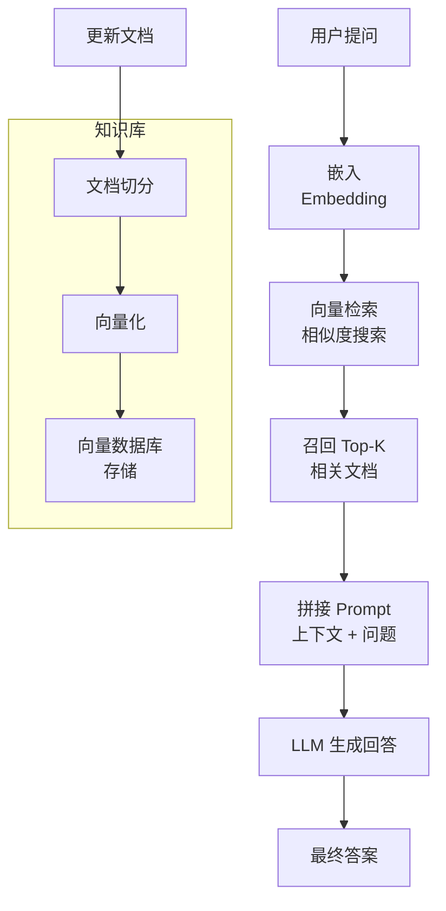
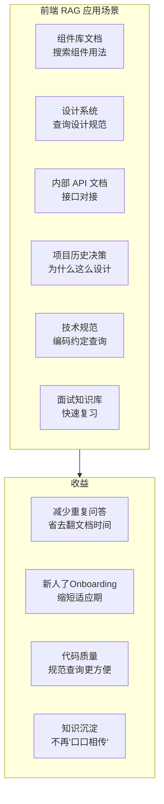
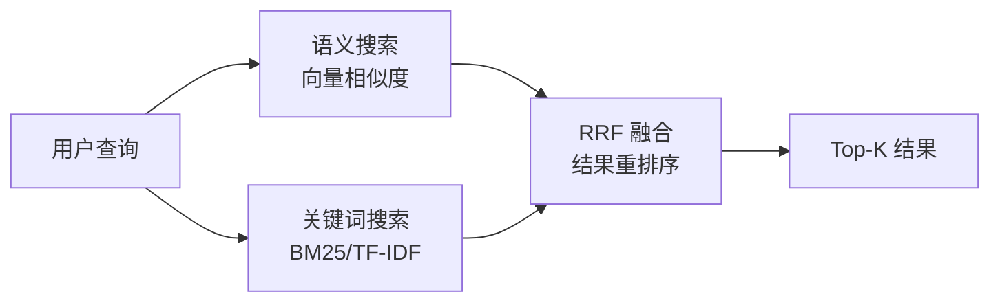

<DifficultyBadge level="advanced" />

# RAG 与知识库搭建

## 一句话解释

RAG（Retrieval-Augmented Generation）就是**给 AI 配一个专属知识库**——当 AI 被问到问题时，先从知识库检索相关文档，再基于检索结果生成回答。2026 年，RAG 已成为企业级 AI 应用的核心架构模式。

## RAG 的核心概念



**RAG 解决了什么问题：**
- LLM 知识有截止日期（2025 年知识 → 不知道 2026 年的新 API）
- LLM 不知道你的私有代码/文档
- LLM 可能产生幻觉（胡编乱造）

## 深入理解

### 1. RAG 的核心组件

| 组件 | 作用 | 前端相关选项 |
|------|------|-------------|
| **文档切分（Chunking）** | 将长文档切成小段 | LangChain / LlamaIndex |
| **Embedding 模型** | 将文本转为向量 | text-embedding-3-small（OpenAI）、BGE-M3（开源） |
| **向量数据库** | 存储和检索向量 | Milvus、Chroma、Pinecone、PGvector |
| **检索策略** | 如何找到最相关的文档 | 语义搜索、混合搜索（语义+关键词） |
| **生成环节** | 基于检索结果生成回答 | GPT-5.5、Claude 4.x |

### 2. 前端团队能用 RAG 做什么



### 3. 搭建一个前端知识库

**Step 1：准备知识源**
```
知识库内容示例：

📁 frontend-knowledge-base/
├── 📄 component-library.md        # 组件库文档
├── 📄 coding-standards.md         # 编码规范
├── 📄 architecture-decisions.md   # 架构决策记录 (ADR)
├── 📄 api-docs/                   # API 文档
│   ├── user-service.md
│   └── order-service.md
├── 📄 project-setup.md            # 项目搭建指南
└── 📄 faq.md                      # 常见问题
```

**Step 2：切分与向量化**

```python
# 使用 LangChain 切分文档
from langchain.text_splitter import RecursiveCharacterTextSplitter

text_splitter = RecursiveCharacterTextSplitter(
    chunk_size=500,      # 每段 500 字符
    chunk_overlap=50,    # 重叠 50 字符保持上下文
    separators=["\n\n", "\n", "。", " ", ""]
)

chunks = text_splitter.split_text(document)
```

**Step 3：存入向量数据库**

```typescript
// 使用 Chroma + OpenAI Embedding（前端可用）
import { ChromaClient } from 'chromadb'
import { OpenAIEmbeddingFunction } from 'chromadb'

const embedder = new OpenAIEmbeddingFunction({
  openai_api_key: process.env.OPENAI_API_KEY,
  model_name: 'text-embedding-3-small'
})

const client = new ChromaClient()
const collection = await client.createCollection({
  name: 'frontend-knowledge',
  embeddingFunction: embedder
})

await collection.add({
  ids: chunks.map((_, i) => `chunk-${i}`),
  documents: chunks,
  metadatas: chunks.map(c => ({ source: 'coding-standards.md' }))
})
```

**Step 4：查询**

```typescript
// 搜索相关知识
const results = await collection.query({
  queryTexts: ["我们的组件命名规范是什么？"],
  nResults: 3
})

// 将结果拼入 Prompt 发给 LLM
const prompt = `
基于以下知识库内容回答问题：

${results.documents.join('\n\n')}

问题：${userQuestion}

请基于以上内容回答，如果知识库中没有相关信息，请说明。`
```

### 4. 2026 年 RAG 进阶技术

**Hybrid Search（混合搜索）：**



**Graph RAG（知识图谱增强）：**
```
传统 RAG：找"相关的文档片段"
Graph RAG：找"相关的实体和关系"

例如问："用户模块和订单模块是怎么交互的？"
→ 传统 RAG 可能找到各自文档片段
→ Graph RAG 能直接返回两个模块之间的调用关系图
```

**Agentic RAG（Agent + RAG）：**
```
Agent 不只是"查一次"，而是：
1. 分析问题需要哪些知识
2. 分别检索
3. 综合分析多源信息
4. 需要时追问用户更多细节
5. 输出结构化答案
```

### 5. 前端开发者能用的 RAG 工具

| 工具 | 类型 | 适用场景 | 难度 |
|------|------|---------|:----:|
| **Cursor Codebase Search** | 内置 RAG | 在 Cursor 中搜项目代码 | 🟢 |
| **GitHub Copilot Chat** | 内置 RAG | IDE 内问答 | 🟢 |
| **Continue.dev** | 开源 IDE RAG | VS Code / JetBrains 自定义 RAG | 🟡 |
| **LangChain** | 框架 | 构建复杂 RAG pipeline | 🔴 |
| **LlamaIndex** | 框架 | 数据索引 + 查询 | 🔴 |
| **Chroma** | 向量 DB | 轻量级本地向量库 | 🟡 |
| **PGvector** | 向量 DB | 已有 Postgres 的项目 | 🟡 |
| **Dify** | 平台 | 可视化 RAG 搭建 | 🟢 |

### 6. RAG 的常见陷阱

| 陷阱 | 表现 | 解决方案 |
|------|------|---------|
| **检索不相关** | AI 拿到无关文档，回答错误 | 优化切分策略 + Embedding 模型 |
| **信息过时** | 知识库没更新，回答过时 | 建立知识库更新流程 |
| **上下文溢出** | 召回太多文档，超出模型窗口 | 限制召回数量 + 优化文档质量 |
| **幻觉仍存** | AI 不基于检索结果，自己编 | 加约束 Prompt "严格基于以下内容回答" |
| **切分不合理** | 关键信息被切分到两段 | 调整 chunk_size + overlap |

## 面试问法

- 🔥 **RAG 的原理是什么？在前端有什么应用场景？**
  - 回答框架：检索 → 增强 → 生成，三个阶段
  - 前端场景：组件库文档、设计系统查询、内部 API 对接、新人 Onboarding

- 🔥 **怎么保证 RAG 检索到的内容是准确的？**
  - 回答框架：Embedding 模型选择 → 切分策略 → 混合搜索 → 结果重排序

- ⭐ **RAG 和 Fine-tuning 的区别？怎么选？**
  - RAG：动态知识、适合频繁更新的场景（API 文档、规范）
  - Fine-tuning：固化知识、适合稳定模式的学习（代码风格、架构模式）

## 💡 AI 辅助学习

**向 AI 提问：**
- "我是一个前端团队，想搭建一个内部知识库 RAG 系统，给我一个最小的技术方案"
- "RAG 的切分策略怎么选？固定大小切分和语义切分有什么区别？"
- "Embedding 模型怎么评估？text-embedding-3-small 和 BGE-M3 哪个适合中文代码文档？"
- "Graph RAG 比传统 RAG 好在哪？前端知识库场景值得上吗？"
- "我想用 Continue.dev 搭一个本地 RAG 环境，怎么配置？"

## 关联知识

- [AI 工具配置与定制](./ai-tool-config) — MCP 连接知识库
- [构建自己的 AI Agent](./build-own-agent) — RAG + Agent 组合
- [AI 辅助架构设计](./ai-architecture) — RAG 在架构决策中的应用
- [AI 面试专题](./ai-interview) — AI 面试知识库
