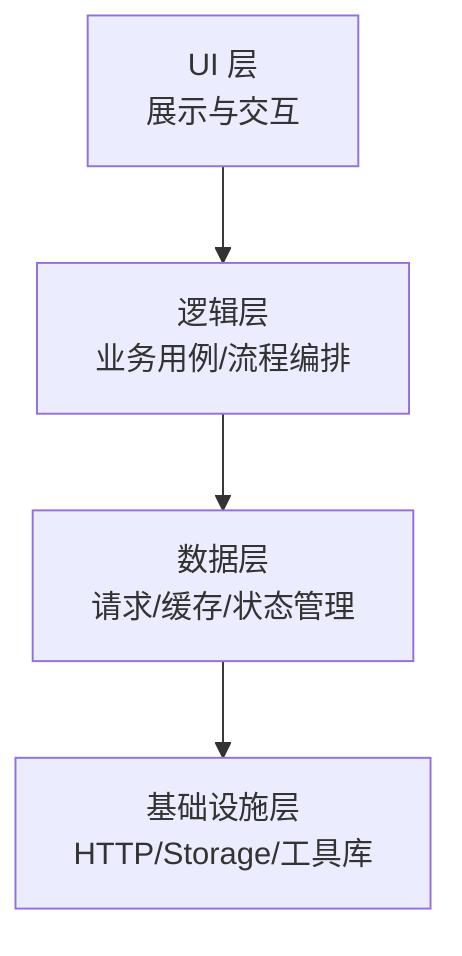
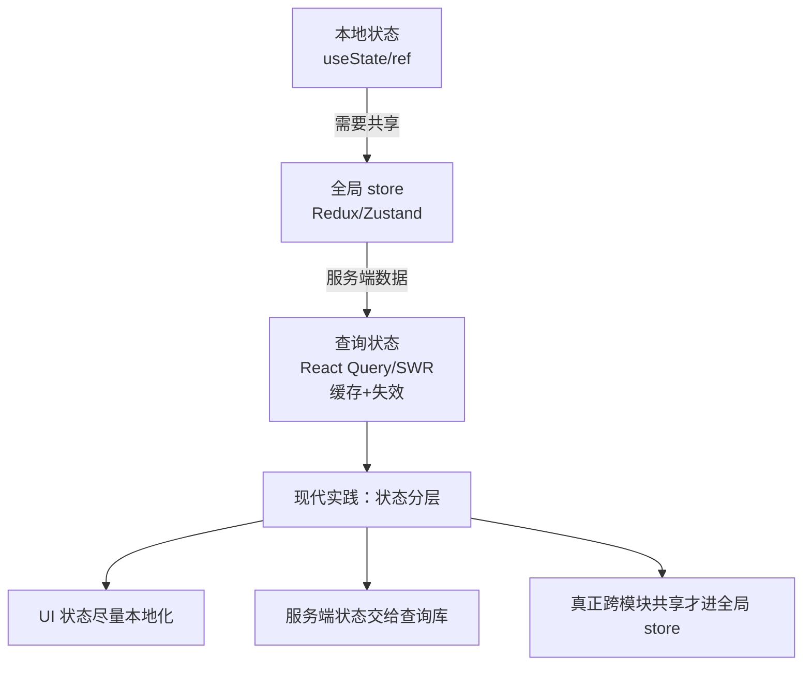
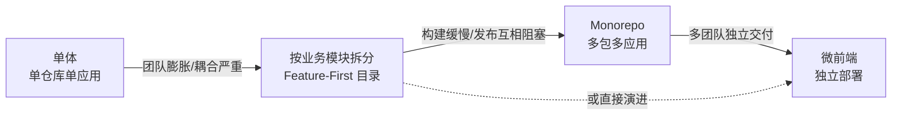

<DifficultyBadge level="advanced" />

# 前端架构设计

## 一句话解释

前端架构设计是围绕**可维护性、可扩展性、可测试性**，对代码的组织方式、依赖方向、状态管理、边界划分做长期决策的过程——它决定项目在规模增长后是"越改越顺"还是"每改一处崩三处"。

## 分层架构

将前端拆成清晰的依赖层，**依赖方向只能向下**（高层依赖低层，低层不知道高层存在）：



| 层 | 职责 | 典型内容 | 常见错误 |
|----|------|---------|---------|
| **UI 层** | 纯展示，只关心"怎么渲染" | 组件、布局、样式 | 把业务逻辑写进组件 |
| **逻辑层** | 业务规则、用例编排、状态流转 | hooks、services、stores | 逻辑散落各处无法复用 |
| **数据层** | 数据获取、转换、缓存、持久化 | API client、repository、cache | 组件直接 fetch 且不收敛 |
| **基础设施层** | 与框架/平台解耦的通用能力 | HTTP 封装、storage、日志、工具 | 业务代码与底层实现耦合 |

**依赖倒置的体现**：UI 层依赖的是逻辑层定义的"接口/抽象"而非具体实现；切换请求库或框架时，只有基础设施层受影响。

```javascript
// ❌ 反例：组件里直接 fetch，逻辑与展示耦合
function UserList() {
  const [list, setList] = useState([])
  useEffect(() => {
    fetch('/api/users').then((r) => r.json()).then(setList) // 逻辑写在组件里
  }, [])
  return <ul>{list.map((u) => <li key={u.id}>{u.name}</li>)}</ul>
}

// ✅ 分层：展示组件只消费 hooks 暴露的状态与动作
function UserList({ useUserList }) {
  const { users, loading, refresh } = useUserList() // 逻辑层
  return loading ? <Loading /> : <ul>{users.map((u) => <li key={u.id}>{u.name}</li>)}</ul>
}
```

## 模块化与内聚

### 按业务划分 vs 按技术划分

| 维度 | 按业务（Feature）划分 | 按技术（层）划分 |
|------|----------------------|------------------|
| 内聚性 | 高——一个功能的所有代码在一起 | 低——一个功能散落多个目录 |
| 改动成本 | 加需求只需动一个模块 | 改一个功能要跨层同步改多处 |
| 复用 | 跨模块复用靠抽公共层 | 同层天然聚集、便于横向复用 |
| 协作冲突 | 不同团队改不同模块，冲突少 | 多人同时改同一层，冲突多 |
| 演进 | 利于按需加载、独立部署 | 目录稳定但耦合难以根除 |

> 前端社区的主流演进方向是 **Feature-First（按业务/领域组织目录）**：`src/features/order` 内部自己再分 `components / hooks / api`，而不是顶层 `src/components` 放所有组件。这是"内聚"思想在工程上的落地。

### 内聚性（Cohesion）判断

- **高内聚**：模块内元素围绕同一个"业务目标"服务，改需求时改动集中在模块内
- **低内聚**：模块内元素各干各的，牵一发动全身、跨模块跳转频繁

```javascript
// 低内聚：一个"订单工具"文件里混着格式化、请求、校验、UI 辅助
export function formatPrice() {}
export function fetchOrder() {}
export function validateAddress() {}
export function getBadgeColor() {}

// 高内聚：按领域职责拆开
// features/order/api.ts   —— 订单请求
// features/order/format.ts —— 订单格式化
// features/order/validate.ts —— 订单校验
```

## DDD（领域驱动设计）在前端

DDD 的核心不是代码，而是**用业务语言建模**，让代码结构反映业务结构。

- **领域（Domain）**：业务问题的空间，如"订单""营销"
- **限界上下文（Bounded Context）**：领域内明确的边界，**同一术语在不同上下文含义可以不同**（订单里的"金额"与财务里的"金额"不是一回事），边界内自洽，边界间通过事件/接口通信
- **聚合（Aggregate）**：一组以根实体为核心的强一致对象
- **领域服务 / 应用服务**：跨聚合的业务规则 vs 用例编排
- **值对象（Value Object）**：不可变、无身份的语义对象（如"地址""金额+币种"）

```javascript
// 前端 DDD 示例：把"金额"建模为值对象，避免散落的 number
class Money {
  constructor(amount, currency) {
    this.amount = amount
    this.currency = currency
  }
  add(other) {
    if (other.currency !== this.currency) {
      throw new Error('货币不一致，无法相加')
    }
    return new Money(this.amount + other.amount, this.currency)
  }
  toDisplay() {
    return new Intl.NumberFormat('zh-CN', { style: 'currency', currency: this.currency }).format(this.amount)
  }
}

// 领域服务：促销规则
class PromotionService {
  apply(money, discount) {
    return money.amount >= discount.minAmount ? money.add(discount.off) : money
  }
}
```

**前端 DDD 的落点**：目录按限界上下文组织（`src/domains/order`、`src/domains/campaign`）；前端与后端的边界通过**防腐层（Anti-Corruption Layer）**隔离——后端 DTO 与前端领域模型解耦，后端字段变动不影响业务层。

## 状态架构演进

| 阶段 | 方案 | 特点 | 问题 |
|------|------|------|------|
| 1 | setState / ref | 本地状态 | 组件间共享难 |
| 2 | 全局 store（Redux/Vuex/Zustand） | 单一数据源、集中管理 | 过度全局化、样板代码多 |
| 3 | 服务端状态框架（React Query/SWR） | 缓存/重试/失效自动管理 | 只解决服务端数据 |
| 4 | 分层状态管理 | **客户端 UI 状态本地化 + 服务端状态交给查询库 + 跨模块共享才进 store** | 需要团队纪律 |



> 2026 年的主流答案是"**状态分层**"：不要把所有状态塞进全局 store，`useState` 解决不了的才交给全局 store，服务端数据交给带缓存的查询库。这是"最小全局状态"原则。

## 可扩展性设计

### 插件化架构

```javascript
// 插件机制：核心只定义插槽（hook），扩展点开放给外部
class EditorCore {
  plugins = []
  use(plugin) {
    plugin.install?.({ editor: this, register: (name, fn) => (this[name] = fn) })
    this.plugins.push(plugin)
    return this
  }
  emit(event, payload) {
    this.plugins.forEach((p) => p.onEvent?.(event, payload))
  }
}

// 示例：为编辑器加"快捷键插件"，核心代码零改动
const shortcutPlugin = {
  install({ register }) {
    register('formatBold', () => { /* 加粗 */ })
  },
  onEvent(event, payload) {
    if (event === 'keydown' && payload.key === 'b' && payload.ctrlKey) {
      payload.preventDefault()
    }
  },
}
const editor = new EditorCore().use(shortcutPlugin)
```

**特征**：核心稳定、扩展开放（开闭原则）、扩展点以接口形式暴露、扩展可独立交付。典型如 Webpack 的 plugin、Monaco 的 contribution point、业务系统里的"表单渲染器"。

### 事件驱动

跨模块、跨应用解耦的核心手段：**发布者不知道订阅者存在**。

```javascript
// 轻量事件总线（配合 EventTarget）
const bus = new EventTarget()
const OrderEvents = {
  created: 'order:created',
  shipped: 'order:shipped',
}

// 下单模块发布
bus.dispatchEvent(new CustomEvent(OrderEvents.created, { detail: { orderId: 1 } }))

// 消息模块订阅（模块间零引用）
bus.addEventListener(OrderEvents.created, (e) => {
  notify(`订单 ${e.detail.orderId} 已创建`)
})
```

**适用**：跨模块通知、微前端应用通信、埋点上报、插件生命周期。注意：事件驱动让数据流隐式化，**用错场景（大量数据依赖）会变成"事件地狱"**，需配合约定与文档治理。

## 架构演进案例：从单体到模块化



演进不是"越高级越好"，而是**跟着组织复杂度走**：

1. **单体阶段**：先跑通业务，不要过早抽象
2. **模块化阶段**：规模上来后按业务拆 Feature，抽公共层，状态分层
3. **Monorepo 阶段**：多应用共享代码、需要原子提交与统一构建
4. **微前端阶段**：多团队独立发布、技术栈异构，才值得引入运行期隔离成本

## 架构设计原则速查

| 原则 | 一句话 | 前端体现 |
|------|--------|---------|
| **单一职责** | 一个模块只做一件事 | 组件只渲染、逻辑放 hooks、请求放 api |
| **开闭原则** | 对扩展开放、对修改关闭 | 插件机制、策略模式替代 if/else |
| **依赖倒置** | 依赖抽象而非实现 | UI 依赖逻辑层接口，不依赖具体请求库 |
| **接口隔离** | 不强迫依赖用不到的东西 | 模块暴露最小 API，不导出整个内部 |
| **最少知识（迪米特）** | 不要和陌生对象聊天 | 模块间只通过明确接口交互 |
| **显式优于隐式** | 依赖要看得见 | 组件 props 显式声明，别靠全局隐式传递 |

## 面试问法

- 🔥 **前端项目如何分层？依赖方向如何控制？**
  - UI/逻辑/数据/基础设施四层，依赖只能向下
  - 用依赖倒置让高层依赖抽象，基础设施可替换
  - 举例：切换请求库只动基础设施层

- 🔥 **按业务划分目录还是按技术划分？**
  - Feature-First：业务功能内聚、改动集中、利于按需加载
  - 顶层 components 会变成"垃圾桶"，跨功能耦合
  - 团队协作与演进效率上是按业务划分胜出

- 🔥 **DDD 在前端如何落地？**
  - 用业务语言建模，目录按限界上下文组织
  - 防腐层隔离后端 DTO 与前端领域模型
  - 值对象/领域服务把散落逻辑收敛到领域内

- 🔥 **状态管理架构怎么演进？**
  - 本地状态 → 全局 store → 服务端状态框架 → 状态分层
  - 现代实践：UI 状态本地化、服务端状态交给查询库、跨模块共享才进 store
  - 避免"所有状态都全局化"

- ⭐ **如何设计可扩展的架构？**
  - 插件化：核心定义插槽，扩展点开放（开闭原则）
  - 事件驱动：发布订阅解耦，跨模块零引用
  - 策略/适配器模式预留变化点

- ⭐ **什么时候从单体拆模块化？**
  - 团队规模膨胀、构建缓慢、发布互相阻塞
  - 演进跟着组织复杂度走，不过早抽象、不过度设计

- ⭐ **依赖倒置和开闭原则在前端的体现？**
  - 依赖倒置：UI 依赖抽象接口而非具体实现
  - 开闭：新功能通过扩展（插件/策略）而非改核心代码

## 💡 AI 辅助学习

> 用这个 Prompt 让 AI 帮你做架构评审：
> "你是一位严格的前端架构评审专家。我们是一个中型 React 项目：目录按 components/hooks/services 分层，所有状态都放在一个全局 store 里，组件里直接写 fetch。请指出这个架构在项目增长到 50 个组件后会暴露的 5 个具体问题，并给出重构优先级排序，说明每项背后的架构原则（如单一职责、依赖倒置、最小全局状态）。"

## 关联知识

- [设计模式在前端](/engineering/design-patterns) — 架构原则在代码层的落地工具
- [微前端实践](/engineering/micro-frontend) — 组织复杂到一定程度后的架构形态
- [Monorepo 工程化](/engineering/monorepo) — 多包/多应用的代码组织方式
- [大型项目重构策略](/engineering/refactoring-strategy) — 架构演进落地时的节奏与风险控制
- [前端测试体系](/engineering/frontend-testing) — 架构可测试性的保障
