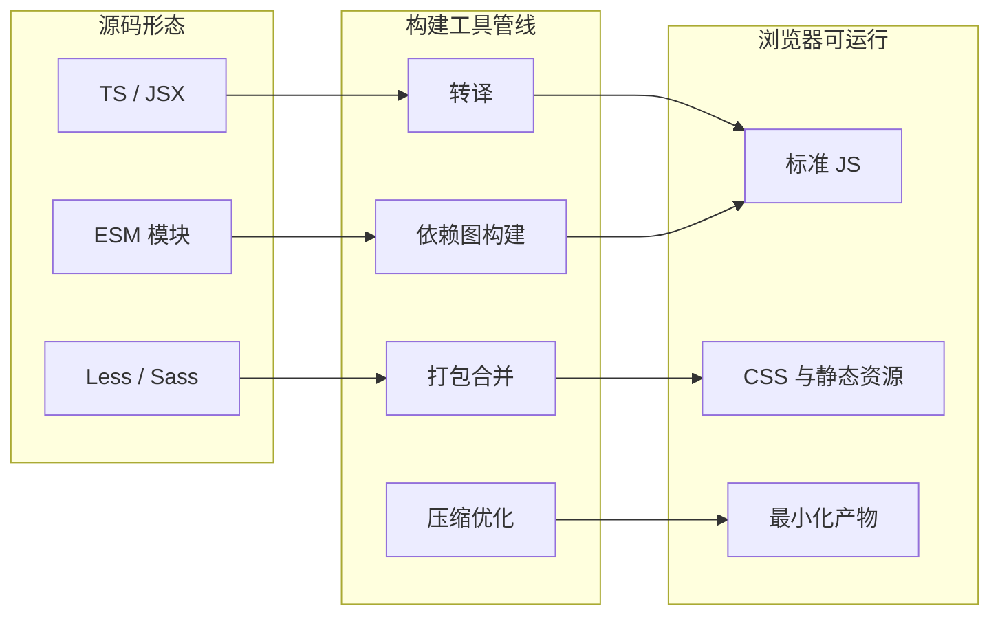
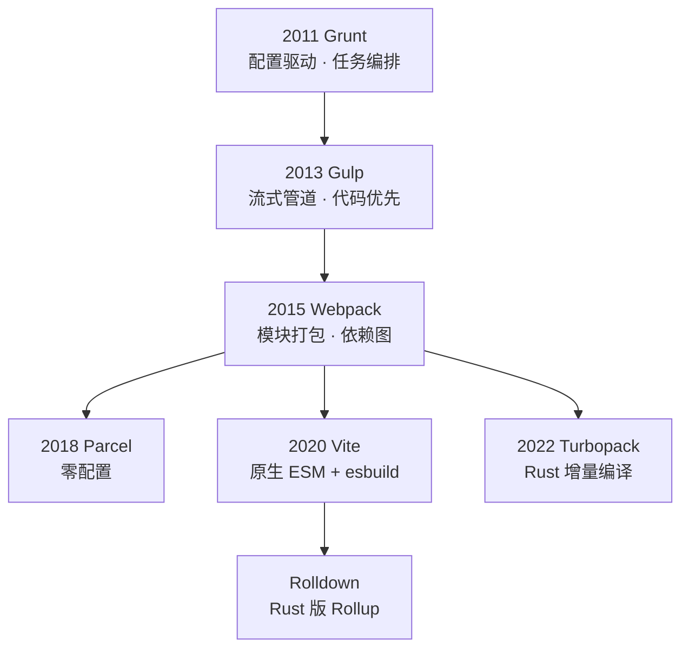
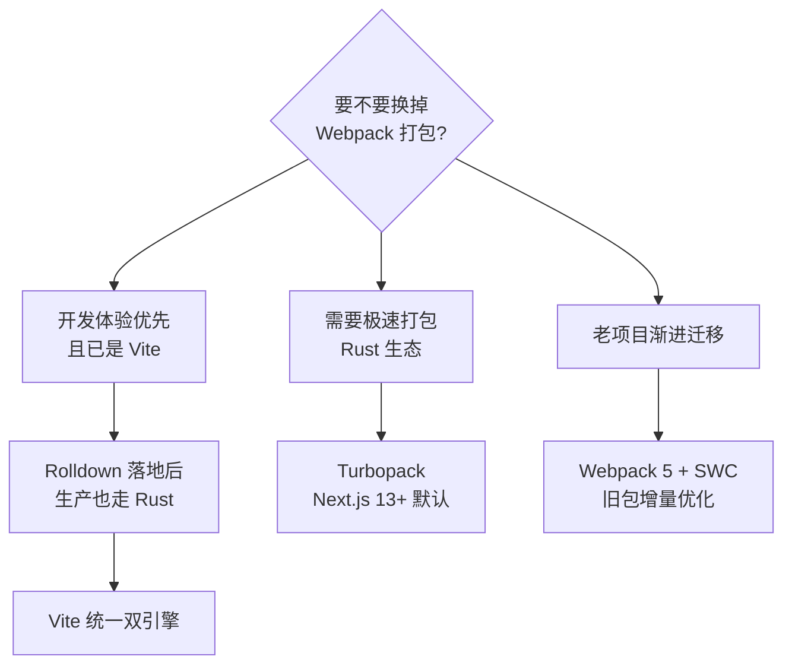

<DifficultyBadge level="beginner" />

# 构建工具演进

## 一句话解释

前端构建工具从"任务编排"（Grunt/Gulp）走向"模块打包"（Webpack），再到"原生 ESM + 极速编译"（Vite/Turbopack），本质是**对浏览器能力、JS 生态成熟度和开发体验的一次次重新定价**。

## 为什么需要构建工具

浏览器无法直接运行 **TS、JSX、ESM、Less/Sass** 等源码形态，构建工具要解决 5 个核心问题：

| 问题 | 说明 | 例子 |
|------|------|------|
| **转译** | 把高级语法转成浏览器能跑的 ES5+ | TS → JS、JSX → JS |
| **依赖解析** | 管理 import/require 的模块关系 | ESM、CommonJS |
| **资源处理** | 图片、字体、CSS 作为一等公民 | url-loader、css-loader |
| **优化产物** | 压缩、混淆、Tree Shaking、分 chunk | Terser、ESBuild |
| **开发体验** | HMR、sourcemap、按需编译 | Vite HMR |



## 演进脉络



### 各代工具的设计哲学

| 工具 | 核心哲学 | 关键贡献 | 代价 |
|------|---------|---------|------|
| **Grunt** | 配置驱动，把命令变成 task | 首创"任务化 + 插件生态" | 配置繁琐、全量执行慢 |
| **Gulp** | 代码优先，内存流式处理 | pipe 管道、Node 代码而非 DSL | 仍是"任务"，不做模块化 |
| **Webpack** | 万物皆模块，一切进依赖图 | Loader/Plugin 体系、Code Splitting | 配置复杂、首次编译慢 |
| **Parcel** | 零配置开箱即用 | 证明"默认体验"的价值 | 可定制性弱、生态浅 |
| **Vite** | 开发用 ESM 原生，构建才打包 | 毫秒级启动与 HMR | 生产仍依赖 Rollup |
| **Turbopack** | Rust 重写、增量编译 | Webpack 兼容层的极速替代 | 生态成熟度仍需时间 |

> 面试记忆点：**Webpack 的贡献不是"打包快"，而是定义了 Loader/Plugin/依赖图这套心智模型**；Vite/Turbopack 真正革新的不是打包，而是**把"全量编译"改成"按需 + 增量"**。

## 打包 vs 原生 ESM

这是理解 Vite 的核心分歧。浏览器原生 ESM 让开发期可以**不用打包**，直接以模块为单位加载：

```javascript
// ✅ 原生 ESM：浏览器直接加载，未用到的模块不会请求
<script type="module" src="/src/main.js"></script>

// ❌ 传统打包：所有依赖合并成一个 bundle，启动就要编译全部
// 200 个模块 → 全部转译 + 打包 → 一次请求回来
```

```javascript
// ✅ Vite 开发期按需编译：浏览器请求哪个模块，才转译哪个
// 请求 /src/views/Home.vue 时，只编译这一个文件并返回 ESM
// ✅ 依赖预构建：把上千个 npm 依赖先用 esbuild 合并成 ESM

// ❌ Webpack 开发期：dev server 启动时就要构建整个依赖图
// 冷启动 5~20s，改一个文件触发全量/半量重编译
```

## 2026 视角：esbuild / Rolldown / Turbopack



| 工具 | 语言 | 定位 | 2026 状态 | 典型使用场景 |
|------|------|------|----------|-------------|
| **esbuild** | Go | 高速转译/打包器 | 稳定，Vite 预构建核心 | Vite dev、Terser 替代 |
| **Rollup** | JS | 面向库的打包器 | 稳定，Vite build 核心 | npm 库、Vite 生产构建 |
| **Rolldown** | Rust | Rollup 的 Rust 重写 | 已进入 Vite 6，逐步接管生产构建 | Vite 未来统一引擎 |
| **Turbopack** | Rust | 类 Webpack 的增量打包器 | Next.js 默认打包器 | Next.js 应用 |
| **SWC** | Rust | 转译器（Babel 替代） | 广泛用于 Webpack 加速 | next dev、编译加速 |

> 2026 记忆点：**Vite 的终局是 Rolldown**——开发和生产共用同一个 Rust 引擎，彻底解决"dev 用 esbuild、build 用 Rollup"的双引擎割裂；**Turbopack 则绑定 Next.js 生态**，两者短期不会替代彼此。

## 现代项目标准构建链

今天的新项目几乎都是"**Vite + pnpm + TypeScript**"起步，理解整条链上每个环节由谁负责，是面试谈架构的基础。

```javascript
// vite.config.ts —— 现代默认配置（Vite 6）
import { defineConfig } from 'vite'
import vue from '@vitejs/plugin-vue'
import tailwindcss from '@tailwindcss/vite'

export default defineConfig({
  plugins: [vue(), tailwindcss()],
  build: {
    rollupOptions: { output: { manualChunks: { vendor: ['vue'] } } },
  },
  optimizeDeps: { include: ['dayjs'] },
})
```

| 环节 | 谁来干 | 干了什么 |
|------|--------|---------|
| **依赖安装** | pnpm | 符号链接 + 内容寻址存储 |
| **TS 转译** | esbuild / oxc | 去类型、转 ESM |
| **SFC/JSX** | Vite 插件 | Vue/React 单文件编译 |
| **样式** | PostCSS + Tailwind | 原子化 + 兼容转换 |
| **生产打包** | Rollup → Rolldown | tree shaking、分包、压缩 |
| **CI 校验** | ESLint + Vitest + commitlint | 质量门禁 |

```javascript
// ❌ 老一代配置心智：大量手写 loader 链与优化项
// webpack.config.js 动辄 200+ 行（loader、splitChunks、devServer...）

// ✅ 新一代配置心智：默认值即最佳实践
// vite.config.ts 几十行即可，复杂点交给插件生态
```

> 演进逻辑：**Webpack 把复杂性集中在一个配置文件里，Vite 把复杂性分散到插件与默认值里**。前者可预测但要精通，后者上手快但要懂插件。

## 心智模型迁移：Webpack → Vite

老项目迁移 Vite 前，把核心概念做一次映射，迁移成本就会很低：

| Webpack 概念 | Vite 对应 | 说明 |
|-------------|----------|------|
| `module.rules` + loader | `plugins` / `vite:xxx` | 转换由插件承担 |
| `HtmlWebpackPlugin` | 内置 HTML 处理 | 无需额外插件 |
| `MiniCssExtractPlugin` | 内置 CSS 抽取 | 生产自动提取 |
| `splitChunks` | `build.rollupOptions.output.manualChunks` | 分包策略 |
| `devServer.proxy` | `server.proxy` | 代理配置一致 |
| `DefinePlugin` | `define`（内置） | 环境变量注入 |
| `resolve.alias` | `resolve.alias` | 路径别名一致 |
| `mode` | `mode` / 内置 production | 生产默认优化 |

> 迁移要点：**老 webpack loader 对应"Vite 插件"，但插件 API 完全不同**——Vite 插件是 Rollup 风格的钩子（`transform`、`resolveId`），不再是 webpack 的 `use` 数组。面试常问"webpack 项目怎么迁 Vite"，答"先做心智映射、再逐个替换插件、用 `vite build --mode` 灰度"。

## 面试问法

- 🔥 **为什么前端需要构建工具？浏览器直接跑源码不行吗？**
  - 三层原因：① **语法层面**浏览器不支持 TS/JSX/新语法/模块化；② **模块层面**需要依赖解析、按需加载、资源处理；③ **工程层面**需要压缩、tree shaking、环境变量、代码分割。核心论点是"**源码是为了人写的，产物才是给浏览器跑的**"。

- 🔥 **Webpack 之前 Grunt/Gulp 解决了什么？它们和 Webpack 的根本区别？**
  - Grunt/Gulp 解决"**任务自动化**"（压缩、合并、监听），但**不做模块化与依赖图**——它们把"源文件列表"当输入，而不是从入口解析依赖。Webpack 从入口出发构建依赖图，才能实现 tree shaking、code splitting、按需加载。一句话：**Gulp 管任务，Webpack 管模块**。

- 🔥 **Vite 为什么开发时快、生产还慢？为什么不直接用 esbuild 打包？**
  - 开发快是因为**原生 ESM 按需加载 + esbuild 预构建 + 缓存**，不用全量编译；生产慢是因为**要做极致的产物优化**（tree shaking、chunk 分割、代码兼容），esbuild 的产物优化和生态（插件、babel 兼容）不如 Rollup。所以 Vite 用 **dev=esbuild+ESM、build=Rollup** 双引擎，并计划用 Rolldown 统一。

- ⭐ **说说 esbuild、Rolldown、Turbopack 的区别和地位？**
  - esbuild 是 Go 写的转译/打包器，靠并行 + 原生速度称王，是 Vite 预构建依赖。Rolldown 是**用 Rust 重写的 Rollup**，目标是 API 兼容 Rollup 并达到 esbuild 速度，将统一 Vite 双引擎。Turbopack 是**类 Webpack 的 Rust 增量打包器**，Next.js 默认，兼容 Webpack 生态，面向大型应用增量构建。

- ⭐ **Webpack 会被淘汰吗？老项目还要不要学它？**
  - 不会被淘汰：**存量项目巨大 + 生态深度绑定**（webpack 5 的 Module Federation 是微前端基石）。Vite 面向"新项目 + 开发体验"，Webpack 面向"复杂老项目 + 兼容性 + 微前端"。面试考察 Webpack 的核心是**心智模型**——理解了 Loader/Plugin/依赖图，迁移到任何工具都很快。

- ⭐ **什么是"依赖预构建"，为什么 Vite 要做？**
  - 原因：① 多数 npm 包是 CJS，浏览器 ESM 无法直接运行，需转成 ESM；② 一个包常依赖几十个子包，直接加载会发起大量请求；③ 用 esbuild 预构建把依赖**扁平化成一个文件**并缓存到 `node_modules/.vite`，命中缓存则毫秒级。预构建产物还统一成 ESM，避免源码和依赖模块格式不一致。

## 💡 AI 辅助学习

> 用这个 Prompt 让 AI 帮你做技术选型推演：
> "你是一名资深前端架构师。团队技术栈是 Vue 3 + 老 Webpack 4 项目（约 300 个页面、需兼容 IE11、要接微前端），现在要权衡迁移到 Vite 6 或升级 Webpack 5。请从构建速度、兼容性、微前端集成、迁移成本、团队学习成本 5 个维度给出对比，并给出分阶段迁移路线图（保留必要的历史包袱）。"

## 关联知识

- [Webpack 核心机制](/engineering/webpack-core) — Loader/Plugin、Tree Shaking、HMR 原理详解
- [Vite 原理与 HMR](/engineering/vite-principles) — 双引擎架构、预构建与毫秒级 HMR
- [包管理器对比](/engineering/package-managers) — npm/yarn/pnpm 与依赖管理
- [Monorepo 工程化](/engineering/monorepo) — 构建缓存与 workspace 依赖管理
- [性能优化全景](/engineering/performance-overview) — 构建产物如何影响页面性能
