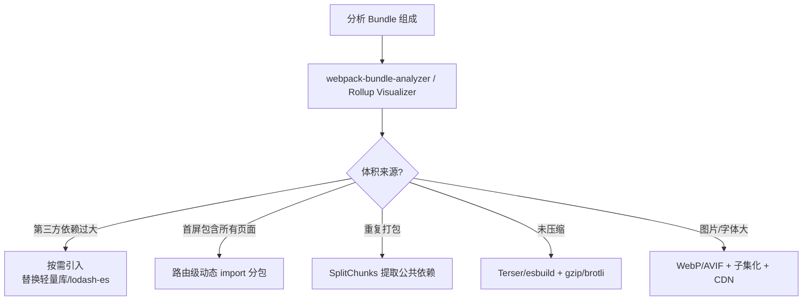

<DifficultyBadge level="intermediate" />

# 包体积优化

## 一句话解释

包体积优化的目标是**让首屏只下载"当前需要的代码"**，手段包括删除死代码（Tree Shaking）、拆分下载时机（Code Splitting）与压缩传输体积（压缩算法）。

## 体积去哪了：依赖分析

先定位体积分布，再对症下药：



## Tree Shaking 原理

Tree Shaking 依赖 **ESM 的静态分析**能力：`import/export` 在编译期就能确定，从而删除未被引用的导出。

```javascript
// math.js —— ESM，可被摇树
export const add = (a, b) => a + b
export const unusedFunc = () => 'never used'  // 会被摇掉

// ❌ 无法被摇树：CommonJS 动态 require
const _ = require('lodash')  // 整个 lodash 都进包

// ✅ 能被摇树：ESM 具名导入
import { add } from 'lodash-es'
```

### sideEffects 配置

`sideEffects` 告诉打包器"这个模块有没有副作用"，没有副作用才能安全删除：

```json
// package.json —— 声明"没有副作用"，放心摇树
{
  "sideEffects": ["*.css", "*.scss", "./src/polyfill.js"]
}
```

```javascript
// ❌ 没声明副作用：打包器保守起见保留全部
// ✅ 声明后：未使用的导出 + 未使用文件被安全删除

// ❌ 反模式：把副作用代码放进"纯导出"文件
import './init'
export const x = 1
// 导入方只 import { x }，init 的副作用可能被误删
// ✅ 正确：副作用代码单独放带 .css 类似声明的文件
```

> **考点**：Tree Shaking 只对 ESM 生效（CJS 是动态的，无法静态分析）；Babel 配置不当会编译掉 ESM 导致摇树失效；`sideEffects: false` 加在**库**的 package.json 中，应用侧不要乱加。

## Code Splitting 策略

代码分割的核心是**动态 import**：把首屏不用的代码拆成异步 chunk，需要时才加载。

```javascript
// 路由级分割：每个路由一个 chunk
const About = () => import('./views/About')
const Settings = () => import('./views/Settings')

// 组件级分割：交互后才加载的重组件
const Editor = React.lazy(() => import('./components/Editor'))

// 公共库单独分包：不常变，利于长缓存
// webpack 默认将 node_modules 中体积 >30KB 的库拆为单独 vendor chunk
```

| 分割类型 | 时机 | 效果 |
|---------|------|------|
| 路由级 | 进入路由时 | 首屏只下载当前页代码 |
| 组件级 | 条件渲染/交互时 | 重组件延迟加载 |
| 第三方库 | 构建时自动 | 独立 chunk，长缓存复用 |
| 入口多份 | 构建时 | 多页面各取所需 |

> **注意**：分包不是越多越好。chunk 过多 → 请求过多、HTTP 往返增加；`preload/prefetch` 与分包配合决定"什么时候真正下载"。

## SplitChunks 配置

`optimization.splitChunks` 决定公共代码怎么分，是 webpack 分包的核心：

```javascript
// webpack.config.js
module.exports = {
  optimization: {
    splitChunks: {
      chunks: 'all',               // 同步+异步代码都参与
      cacheGroups: {
        vendor: {
          test: /[\\/]node_modules[\\/]/,
          name: 'vendor',
          priority: 10,            // 命中优先于默认规则
          reuseExistingChunk: true,
        },
        common: {
          minChunks: 2,            // 至少被 2 个 chunk 引用才提取
          minSize: 20 * 1024,
        },
      },
    },
  },
}
```

> **2026 视角**：Vite 内置 `build.rollupOptions.output.manualChunks` 完成同等能力；Rolldown 目标与 Rollup 配置兼容，迁移成本低。

## CDN 外置：externals 与 DllPlugin 的历史

- **externals**：把 React、Vue 等**直接引 CDN 全局变量**，不打进 bundle，运行时从 `window.React` 取

```javascript
// webpack.config.js
module.exports = {
  externals: {
    react: 'React',
    'react-dom': 'ReactDOM',
  },
}
// HTML 里先引入 CDN 的 react.production.min.js
// 效果：bundle 里不包含 react，体积骤减，但要自己保证版本一致 + 缓存
```

- **DllPlugin**：把稳定依赖提前构建成动态库，增量构建时跳过，属于**构建性能优化**而非体积优化；webpack 5 已基本淘汰（`cache` + hard-source 替代）

| 方案 | 作用对象 | 解决什么 | 现状 |
|------|---------|---------|------|
| externals | 运行时引用 CDN | 体积 | 仍用于 React/Vue 的 CDN 外置 |
| DllPlugin | 构建期预编译 | 构建速度 | 已淘汰，webpack5 cache 替代 |
| SplitChunks | 构建产物分包 | 体积+缓存 | 主流方案 |
| CDN + hash | 分发 | TTFB+缓存 | 必做 |

## gzip / brotli

传输压缩是最便宜的优化——服务端压缩，浏览器解压，**对代码体积几乎无感减负**。

| 压缩算法 | 压缩率 | 压缩耗时 | 支持 |
|---------|--------|---------|------|
| Brotli | 最高（比 gzip 小约 15-20%） | 高 | 现代浏览器全支持 |
| Gzip | 中等 | 低 | 全支持 |

```nginx
# nginx 启用 brotli（需模块），gzip 兜底
brotli on;
brotli_comp_level 5;
brotli_types text/css application/javascript image/svg+xml;
```

> **考点**：压缩对象是**文本类**（JS/CSS/HTML/JSON/SVG），图片字体已压缩过，再压缩徒增 CPU；`Content-Encoding: br` 与 `gzip` 由服务器按 `Accept-Encoding` 协商。

## 图片 / 字体资源优化

| 资源 | 优化手段 | 效果 |
|------|---------|------|
| 图片格式 | WebP/AVIF 替代 JPEG/PNG | 体积减少 50-80% |
| 响应式图片 | `srcset` + `sizes` 按视口选尺寸 | 少传无用像素 |
| 图片压缩 | 有损/无损工具链（sharp、squoosh） | 显著减小 |
| 字体子集化 | `unicode-range` 只下载用到的字形 | 数 MB → 数十 KB |
| 字体格式 | woff2 优先（比 woff 小约 30%） | 传输更小 |

```html
<!-- 响应式图片：按视口宽度选不同尺寸 -->

```

## 依赖瘦身

| 手段 | 说明 |
|------|------|
| BundlePhobia | 引依赖前查包体积/压缩后大小/依赖树 |
| lodash-es | 按需引入 ESM，只打包用到的函数 |
| `dayjs` 替代 moment | moment 约 350KB(未压缩)，dayjs 约 2KB |
| 移除冗余 polyfill | `core-js` 按 browserslist 精准打包 |
| 组件库按需引入 | antd/vant 用 `unplugin-vue-components` 自动按需 |
| bundle-analyzer 定期审计 | 防体积回归，可接 CI 阈值门禁 |

```javascript
// ❌ 引入整个 lodash
import _ from 'lodash'
_.chunk(arr, 2)

// ✅ lodash-es 按需引入，摇树只留 chunk 函数
import chunk from 'lodash-es/chunk'
chunk(arr, 2)
```

## 2026 视角：Rolldown / esbuild 带来的收益

- **esbuild**（Go 编写）：构建速度比 webpack 快 10-100 倍，但生态与插件兼容性弱，主要用于转译压缩（Vite 的依赖预构建）
- **Rolldown**（Rust 编写，基于 Rollup 架构）：Vite 7 的核心底层，**目标是取代 esbuild + Rollup**，插件生态兼容 Rollup
- 对**体积**的收益：原生语言重写的压缩器（oxc/minifier）更快迭代新优化；WebAssembly 更小；配合原生 Tree Shaking 与分析，产物更小

| 工具 | 语言 | 定位 | 体积收益 |
|------|------|------|---------|
| webpack | JS | 老牌全能打包 | 配置复杂，摇树受 Babel 影响 |
| esbuild | Go | 高速转译/压缩 | 产物紧凑 |
| Rollup | JS | 库打包/分析 | 摇树干净，产物小而美 |
| Rolldown | Rust | Vite 底层，兼容 Rollup 生态 | 快 + 产物小而美 |

> **考点**：体积优化的终局是**"按需 + 提前 + 压缩 + 缓存"**四件套，工具只是手段；2026 年面试答"Rolldown 用 Rust 重写、作为 Vite 底层、兼容 Rollup 插件生态"即可切中要害。

## 面试问法

- 🔥 **Tree Shaking 的原理是什么？什么情况下会失效？**
  - 依赖 ESM 静态 import/export，编译期分析可达性，删除未使用导出
  - 失效场景：CommonJS（动态 require）、Babel 把 ESM 转成 CJS、有副作用的模块被保守保留、动态属性访问 `obj[key]`
  - 配合：库声明 `sideEffects: false`，应用侧保证 ESM 链路不被编译打断

- 🔥 **Code Splitting 有哪些方式？为什么要结合 preload/prefetch？**
  - 动态 import（路由/组件级）、SplitChunks 提取公共代码、多入口
  - 分包决定了"代码在哪个 chunk"，preload/prefetch 决定"什么时候下载"——两者配合才能既小又快
  - 反模式：拆得太碎导致请求爆炸；拆得太粗导致首屏仍包含无关代码

- 🔥 **webpack SplitChunks 如何配置？vendor 和 common 缓存组各是什么？**
  - `chunks: 'all'` 让同步异步都参与；`cacheGroups` 定义分组规则（test 匹配 node_modules、minChunks 引用次数、priority 优先级）
  - vendor：第三方库单独成包，变化频率低利于长缓存；common：业务公共代码提取避免重复
  - 注意 `minSize/maxSize` 与请求数平衡

- 🔥 **externals 和 DllPlugin 的区别？DllPlugin 为什么被淘汰？**
  - externals：运行时从 CDN 全局变量取依赖，不打进 bundle（体积优化）
  - DllPlugin：构建期把稳定依赖预编译成 dll，加快增量构建（构建性能优化），不直接减体积
  - 淘汰原因：webpack 5 内置 `cache` 持久化 + hard-source-webpack-plugin 后已无必要，且配置维护成本高

- ⭐ **gzip 和 brotli 的区别？哪些资源适合压缩？**
  - Brotli 压缩率更高（约小 15-20%）但压缩耗时更长，适合构建期/静态资源；gzip 快，适合动态压缩
  - 只压文本类（JS/CSS/HTML/JSON/SVG）；图片字体已压缩，再压浪费 CPU
  - 由 `Accept-Encoding` 协商返回 `Content-Encoding: br`

- ⭐ **如何判断一个依赖该不该引入？**
  - BundlePhobia 查体积/压缩后体积/依赖树
  - 优先级：原生 API 能实现就不引 → 按需引入小工具 → 大而全的库找轻量替代（moment→dayjs）
  - 接入 bundle-analyzer 与 CI 体积阈值门禁防回归

- ⭐ **Rolldown/esbuild 相比 webpack 在体积上的优势？**
  - esbuild 用 Go、Rolldown 用 Rust 重写，转译压缩快数十倍，优化迭代快
  - Rolldown 兼容 Rollup 插件生态，是 Vite 底层，产物摇树干净
  - 体积收益本质来自"更干净的 Tree Shaking + 更紧凑的代码生成"，而非魔法

## 💡 AI 辅助学习

> 用这个 Prompt 练包体积优化：
> "你是一个构建工具专家。我的 Vue3 + Vite 项目 bundle 首屏 1.8MB（gzip 后），包含 element-plus 全量、axios、echarts、lodash。请给出从依赖瘦身、按需引入、分包、压缩到图片/字体层面的完整优化清单，每项标注预计 gzip 后体积收益。"

## 关联知识

- [性能优化全景](/engineering/performance-overview) — Core Web Vitals 与优化决策树
- [加载优化](/engineering/loading-optimization) — 体积变小 + 缓存策略，加载更快
- [Webpack 核心原理](/engineering/webpack-core) — 打包器工作流程
- [Vite 原理](/engineering/vite-principles) — esbuild 预构建与 Rollup 打包
- [构建工具演进](/engineering/build-tools-evolution) — webpack → Vite → Rolldown 演进脉络
