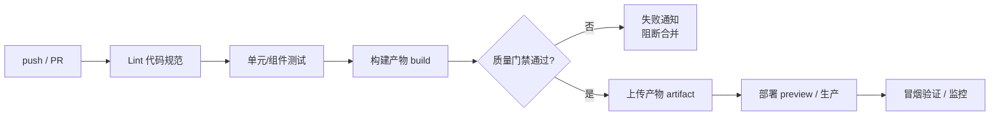
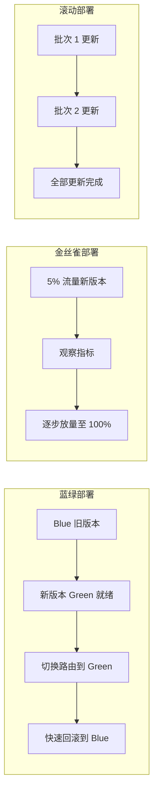

<DifficultyBadge level="intermediate" />

# CI/CD 与工程化

## 一句话解释

CI/CD 把**代码从提交到上线的过程自动化**：持续集成（CI）保证每次提交都经过检查、测试、构建，持续部署/交付（CD）把产物安全地发布到目标环境。

## CI/CD 概念与价值

| 概念 | 英文 | 做什么 | 交付 |
|------|------|--------|------|
| 持续集成 | Continuous Integration | 频繁合并代码并自动验证 | 每次提交都跑检查 |
| 持续交付 | Continuous Delivery | 产物可随时发布，发布动作手动 | 一键可发布 |
| 持续部署 | Continuous Deployment | 通过验证后自动发布到生产 | 全自动上线 |

- **价值**：把"提交 → 上线"从"人工 + 风险"变成"自动化 + 可回滚"，提前暴露集成错误
- **前端典型流水线**：lint（规范）→ test（质量）→ build（产物）→ deploy（发布）
- **质量门禁**：任一环节失败即终止，不通过不上线

## 前端典型 CI 流程



| 阶段 | 工具 | 失败处理 |
|------|------|---------|
| Lint | ESLint / Prettier / stylelint | 阻断 PR，提示修复 |
| 类型检查 | tsc --noEmit | 阻断合并 |
| 测试 | Vitest + Playwright | 阻断合并，生成报告 |
| 构建 | vite build / webpack | 阻断，产物不可用 |
| 部署 | Vercel / 自建 nginx | 回滚上一版本 |
| 监控 | Sentry / 性能监控 | 告警兜底 |

## GitHub Actions 结构

GitHub Actions 的最小单位是 **workflow → job → step**：

```yaml
# .github/workflows/ci.yml
name: CI
on:
  push:
    branches: [main]
  pull_request:

jobs:
  lint-test:            # job：默认并行运行，可独立失败
    runs-on: ubuntu-latest
    steps:
      - uses: actions/checkout@v4
      - uses: pnpm/action-setup@v4
        with:
          version: 9
      - uses: actions/setup-node@v4
        with:
          node-version: 20
          cache: 'pnpm'
      - run: pnpm install --frozen-lockfile
      - run: pnpm lint
      - run: pnpm typecheck
      - run: pnpm test -- --coverage

  build-deploy:         # 依赖 lint-test 通过
    needs: lint-test
    runs-on: ubuntu-latest
    steps:
      - uses: actions/checkout@v4
      - run: pnpm install --frozen-lockfile
      - run: pnpm build
      - uses: actions/upload-artifact@v4   # 产物在 job 间共享
        with:
          name: dist
          path: dist
```

| 概念 | 说明 |
|------|------|
| workflow | 一个 `.yml` 文件定义整套流水线 |
| job | 一个执行单元，`needs` 声明依赖、默认并行 |
| step | 一个动作（命令/复用的 action），共享同一 shell |
| matrix | 矩阵构建：一键跑多版本/多平台 |
| cache | `actions/cache` 缓存 node_modules，构建快数倍 |

### 矩阵构建与缓存

```yaml
jobs:
  test:
    strategy:
      matrix:            # 同时跑 Node 18/20/22 三组
        node-version: [18, 20, 22]
    runs-on: ubuntu-latest
    steps:
      - uses: actions/setup-node@v4
        with:
          node-version: ${{ matrix.node-version }}
          cache: 'npm'   # 自动缓存 ~/.npm，命中后 install 极快
      - run: npm ci
      - run: npm test
```

> **考点**：`actions/cache` + `npm ci`（或 pnpm `--frozen-lockfile`）是提速关键；`on: pull_request` 触发 PR 预检，`on: push` 触发主分支发布。

## 自动化部署

前端静态站点 + 无服务器平台的组合已是主流：

| 平台 | 特点 | 适用 |
|------|------|------|
| Vercel | 零配置、Preview 环境、边缘函数 | Next.js/前端为主 |
| Netlify | 静态托管、表单、分支部署 | 静态站点/SSG |
| GitHub Pages | 免费、简单 | 文档/静态演示 |
| 自建（nginx + 对象存储） | 完全可控、成本低 | 公司内网/复杂场景 |

```bash
# 自建部署示意：本地构建 → 同步到服务器
npm run build
rsync -avz --delete dist/ user@server:/var/www/app/
```

> **2026 视角**：Vercel/Netlify 的 **Preview（预览）部署** 让每个 PR 都有独立 URL，前端团队 review 代码即 review 效果；自建则需自己实现同样的"PR → 预览环境"机制。

## 环境管理

| 环境 | 用途 | 数据/行为 | 谁访问 |
|------|------|----------|--------|
| dev | 本地开发 | 本地 mock 数据 | 开发者 |
| staging（预发布） | 上线前全量验证 | 接近生产 | 测试/产品 |
| prod | 生产 | 真实数据 | 用户 |

```bash
# 环境变量按环境注入，而不是写在代码里
# .env.development / .env.staging / .env.production
VITE_API_BASE=/api
VITE_ENV=production
```

> **考点**：环境隔离的关键是**配置与代码分离**（12-Factor 原则）：环境差异全部走环境变量，代码里不硬编码 URL/密钥；密钥用 CI 的 secrets 存储，绝不入库。

## 发布策略

发布不是"一刀切"，风险越高的系统越需要灰度能力：



| 策略 | 原理 | 回滚 | 适用 |
|------|------|------|------|
| 蓝绿 | 两套环境切换路由 | 秒级切回 | 前后端整体上线 |
| 金丝雀 | 小流量灰度放量 | 快速拉停 | 高风险新功能 |
| 滚动 | 分批逐个更新 | 逐批回退 | 服务集群 |

> 前端常与 CDN/静态资源配合：**蓝绿 = 新旧目录切换 + 缓存刷新**；**金丝雀 = 按用户/地区灰度放量**。回滚成本低到"重新部署旧版本"。

## npm 发包流程

发布 npm 包是工程化的常见场景，核心是**版本号语义化 + 发布前质量门禁**：

```bash
# 1. 质量门禁：测试 + lint + 构建通过
npm test && npm run lint && npm run build

# 2. 语义化版本（SemVer）：major.minor.patch
npm version patch    # 修复 bug → 1.0.1
npm version minor    # 新增功能（向后兼容）→ 1.1.0
npm version major    # 破坏性变更 → 2.0.0

# 3. 发布（files 字段控制发布内容）
npm publish          # 默认发布 latest 标签
npm publish --tag beta   # 预发布：beta/alpha/rc 标签
```

```json
{
  "name": "my-lib",
  "version": "1.2.0",
  "main": "dist/index.js",
  "module": "dist/index.esm.js",
  "types": "dist/index.d.ts",
  "files": ["dist"],
  "sideEffects": false,
  "scripts": {
    "prepublishOnly": "npm test && npm run build"
  }
}
```

> **考点**：`files` 只发布产物（dist），`prepublishOnly` 钩子保证发布前自动跑门禁；`module` 字段指向 ESM 入口让 Tree Shaking 生效；版本回滚 = 发布新版本（不可删除已发布的同版本）。

## 面试问法

- 🔥 **CI 和 CD 的区别？前端 CI 流水线一般包含哪些阶段？**
  - CI 是持续集成（提交自动检查/测试/构建），CD 是持续交付/部署（产物可发布、自动发布）
  - 前端：lint → typecheck → test → build → 上传产物 → 部署 preview → 冒烟验证
  - 每阶段都设质量门禁，任一失败阻断上线

- 🔥 **GitHub Actions 的 workflow/job/step 是什么关系？怎么提速？**
  - workflow 是整套流水线（一个 yml），job 是执行单元（默认并行，needs 声明依赖），step 是具体动作
  - 提速：`actions/cache` 缓存依赖、`matrix` 并行跑多版本、`--frozen-lockfile` 确定性安装
  - 依赖缓存命中 + 复用公共 job 是提速关键

- 🔥 **如何做自动化部署？Vercel/自建各有什么取舍？**
  - Vercel/Netlify：零配置、PR Preview 独立 URL、免运维，适合前端团队
  - 自建：nginx + 对象存储 + CI 同步，可控但需自建 preview 与回滚
  - 共性：构建产物不可变 + 版本目录化，回滚 = 切换旧版本

- 🔥 **dev/staging/prod 环境如何管理？怎么防止密钥泄露？**
  - 环境差异走环境变量（12-Factor），代码里不硬编码 URL/密钥
  - `.env.development/.env.staging/.env.production` 按环境注入，密钥存 CI secrets 绝不入库
  - staging 数据接近生产，用于上线前全量验证

- ⭐ **蓝绿、金丝雀、滚动部署的区别？前端怎么用？**
  - 蓝绿：新旧两套切换，秒级回滚；金丝雀：小流量灰度放量；滚动：分批更新
  - 前端静态资源：蓝绿 = 目录切换 + CDN 刷新；金丝雀 = 按用户/地区灰度
  - 选择依据：风险越高越需要灰度（金丝雀/蓝绿）

- ⭐ **怎么发布一个 npm 包？版本号规则是什么？**
  - prepublishOnly 钩子跑门禁 → npm version 升级 → npm publish（带 tag）
  - SemVer：patch 修 bug、minor 加功能、major 破坏性变更；beta/alpha/rc 用 `--tag`
  - `files` 只发产物、`module` 指向 ESM 利于摇树、发布后不可覆盖同版本

- ⭐ **质量门禁（Quality Gate）一般设什么？覆盖率/体积怎么接入 CI？**
  - lint 规范、typecheck 类型、测试通过、单测覆盖率阈值、bundle 体积阈值（bundle-analyzer）
  - 实现：CI 中跑 coverage 与 CI 比较，不达标即 fail；体积报告对比基线防回归
  - 作用：把"人靠自觉"变成"机器卡口"

## 💡 AI 辅助学习

> 用这个 Prompt 练 CI/CD：
> "你是一个 DevOps 专家。我要给一个 Vue3 + Vite 项目配置 GitHub Actions：提交 PR 跑 lint/test/build，合入 main 后自动部署到 Vercel 并生成 preview URL，还要做单测覆盖率门禁和包体积基线对比。请给出一份完整的 ci.yml，并解释每个 job 的依赖关系与失败时的处理。"

## 关联知识

- [前端测试](/engineering/frontend-testing) — CI 中测试阶段的设计
- [包体积优化](/engineering/bundle-optimization) — 体积基线与质量门禁
- [构建工具演进](/engineering/build-tools-evolution) — 构建脚本与产物
- [Vite 原理](/engineering/vite-principles) — 构建命令与产物配置
