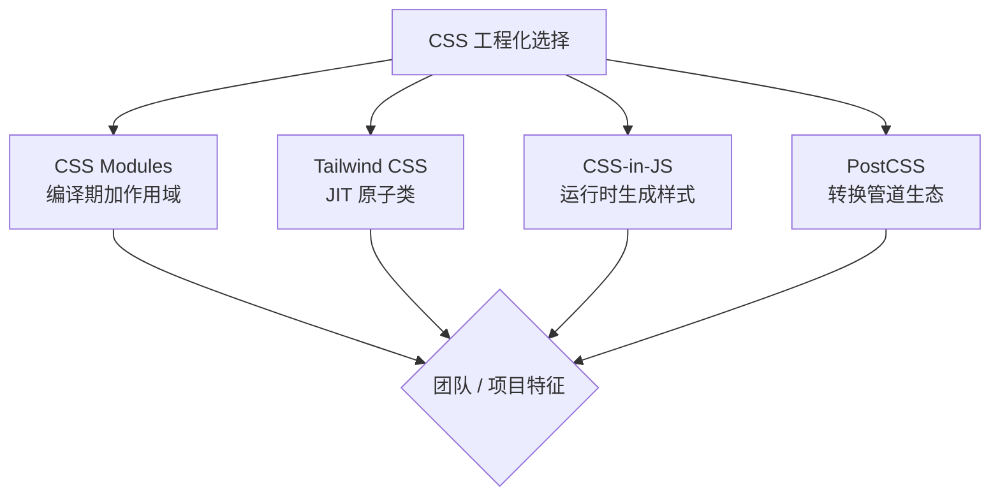

<DifficultyBadge level="medium" />

# CSS 工程化方案

## 一句话解释

CSS 工程化要解决"**作用域、复用、按需、变量**"四个问题，主流四条路线——**CSS Modules**（编译期改类名）、**Tailwind**（原子化 JIT）、**CSS-in-JS**（运行时生成）、**PostCSS**（生态管道），各有取舍。

## 四种方案总览



| 方案 | 核心机制 | 优点 | 缺点 | 代表 |
|------|---------|------|------|------|
| **CSS Modules** | 编译期改写类名加 hash | 作用域隔离、无运行时开销 | 动态样式不直观、学习成本 | `:local` / `composes` |
| **Tailwind CSS** | JIT 扫描生成原子类 | 零冗余、约束设计、快 | 类名可读性差、需约定 | `@apply` / PurgeCSS |
| **CSS-in-JS** | 运行时（或编译期）生成 `<style>` | 动态主题、组件化彻底 | 运行时开销、SSR 注意 | styled-components / Emotion |
| **PostCSS** | 插件化转换管道 | 灵活、生态强 | 只是"管道"，需组合 | Autoprefixer / Tailwind |

## CSS Modules：编译期改写类名

CSS Modules 在构建时把局部类名编译成**带 hash 的全局唯一类名**，配合 JS 模块导入实现作用域隔离。

```css
/* styles.module.css —— 局部作用域 */
.title {
  font-size: 20px;
  color: #333;
}
.title:hover { color: #0070f3; }
```

```javascript
// ✅ 编译后：类名变成 hash，天然隔离
import styles from './styles.module.css'
// 实际类名：_title_abc123_1（webpack css-loader 的 localsConvention）

// ❌ 错误：不用 CSS Modules 时类名全局冲突
// 两个组件都写 .title，会互相覆盖
```

> 原理记忆点：**css-loader 把 `.module.css` 的类名映射成对象（`styles.title` → 编译后类名），并在构建时全局重命名**。`composes` 可以在模块间组合样式，等价于 SCSS 的 `@extend`。

## Tailwind CSS：JIT 原子化

Tailwind 用 **JIT（Just-In-Time）** 模式——构建时扫描源码中的类名字符串，只生成用到的 CSS，产物极小。

```html
<!-- ✅ JIT 原子类：类名即样式 -->
<div class="flex items-center justify-between px-4 py-2 bg-white shadow-md">
  <span class="text-sm font-semibold text-gray-900">标题</span>
  <button class="rounded bg-blue-500 px-3 py-1 text-white hover:bg-blue-600">
    按钮
  </button>
</div>

<!-- ❌ 内联样式：不可复用、无响应式、无法约束 -->
<div style="display:flex;align-items:center;justify-content:space-between;
            padding:8px 16px;background:#fff;box-shadow:0 1px 3px rgba(0,0,0,.1)">
  <span style="font-size:14px;font-weight:600;color:#111">标题</span>
  <button style="border-radius:4px;background:#3b82f6;color:#fff">按钮</button>
</div>
```


### Tailwind vs 内联样式

| 维度 | Tailwind 原子类 | 内联样式 style |
|------|----------------|---------------|
| **响应式** | ✅ `md:flex` | ❌ 无法响应式 |
| **伪类/状态** | ✅ `hover:` `focus:` | ❌ 需 JS 处理 |
| **可复用性** | ✅ 提取组件类名 | ❌ 每处重写 |
| **设计约束** | ✅ 设计令牌（色板/间距） | ❌ 随意取值 |
| **按需打包** | ✅ 只用到的才生成 | ✅ 无（天然内联） |
| **可维护性** | ⚠️ 类名长但稳定 | ❌ 样式散落 JS 中 |

## CSS-in-JS：运行时生成

styled-components / Emotion 把样式写进组件，运行时动态生成并注入 `<style>`。

```javascript
// ✅ styled-components：样式即组件
import styled from 'styled-components'

const Button = styled.button`
  padding: 10px 20px;
  border-radius: 6px;
  background: ${(props) => (props.primary ? '#2563eb' : '#fff')};
  &:hover { opacity: 0.9; }
`
// 渲染：自动生成唯一 class，并注入 <style>

// ❌ 注意运行时开销：每次渲染都要计算样式并注入
// 高性能场景用 babel-plugin-styled-components（编译期生成，减小运行时）
```

| 优点 | 开销 / 注意点 |
|------|--------------|
| 组件与样式同构、无类名冲突 | 运行时解析样式字符串并生成 CSS，**有性能开销** |
| 动态主题（props / 主题 Provider）极方便 | SSR 需 `ServerStyleSheet` 收集样式再注入 HTML |
| 完全继承 JS 能力（逻辑、变量） | 首次渲染比静态 CSS 慢，长列表需谨慎 |
| 自动按组件拆分，天然局部作用域 | 现代实现（如 Emotion 编译模式）已大幅降低开销 |

## PostCSS：插件化生态

PostCSS 本身**不产出 CSS**，而是一个转换管道——CSS 解析成 AST，插件逐个转换后再输出。

```javascript
// postcss.config.js
module.exports = {
  plugins: [
    require('tailwindcss'),     // 原子化
    require('autoprefixer'),    // 自动加浏览器前缀
    require('postcss-preset-env'), // 新语法转兼容
    require('cssnano'),         // 压缩
  ],
}
```

| 常见插件 | 作用 |
|---------|------|
| **Autoprefixer** | 根据 browserslist 自动补 `-webkit-` 等前缀 |
| **postcss-preset-env** | 把未来的 CSS 语法编译成兼容写法 |
| **Tailwind CSS** | 作为 PostCSS 插件运行 |
| **postcss-nested** | 支持嵌套语法（不需要 Sass） |
| **cssnano** | 压缩与优化 |

> 记忆点：**PostCSS 是"基础设施"，它让你把 Tailwind、Autoprefixer、兼容转换组合成一套管道**——这也是 Tailwind 能以插件形式跑在 Vite/Webpack 里的原因。

## 解决样式冲突的三条路

"类名冲突"是 CSS 工程化的第一痛点，历史上依次用三种方式解决：

```css
/* ① 命名约定：BEM —— 靠规范约束 */
/* block__element--modifier */
.button__icon--active { color: #fff; }

/* ② 编译隔离：CSS Modules —— 靠机制保证 */
/* .title 构建后被改写为 ._title_abc123 */

/* ③ 原子化：Tailwind —— 没有"自己的类名"就没有冲突 */
/* 类名即样式，无业务语义，天然不冲突 */
```

| 方式 | 保证手段 | 隔离强度 | 可维护性 | 运行时开销 |
|------|---------|---------|---------|-----------|
| **BEM 命名** | 团队规范 + review | 弱（靠自觉） | 中（类名长） | 无 |
| **CSS Modules** | 构建期改写 | 强（机制） | 高（类名短） | 无 |
| **Tailwind 原子化** | 无业务类名 | 强（天然） | 高（约定化） | 无 |

> 记忆点：**规范是"软约束"，机制是"硬约束"**。BEM 靠人遵守、CSS Modules 靠构建期强制、Tailwind 靠取消自定义类名，三者层层递进——这也是为什么 2026 年的团队要么 CSS Modules 要么 Tailwind，很少再裸用 BEM。

## 方案对比与选型建议

| 方案 | 作用域 | 运行时开销 | 动态化 | 学习成本 | 适用场景 |
|------|-------|-----------|--------|---------|---------|
| **CSS Modules** | ✅ 强 | 无 | 一般 | 低 | 中后台、组件库、样式较复杂的团队 |
| **Tailwind CSS** | ✅ 强 | 无 | 中 | 中（类名语义） | 新项目、快速迭代、设计约束严格 |
| **CSS-in-JS** | ✅ 强 | 有（可优化） | ✅ 强 | 低（会 JS 即可） | 主题定制强、组件化重度场景 |
| **原生 CSS + PostCSS** | ❌ 弱 | 无 | 弱 | 低 | 小型项目、样式简单 |

> 2026 选型趋势：**新项目普遍 Tailwind + CSS Modules 混合**（Tailwind 管通用样式、Modules 管复杂局部样式）；**CSS-in-JS 热度下降**但仍在主题库/设计系统（如 MUI）中大量使用；原生 `@layer`、嵌套语法（原生已支持）正在让 PostCSS 插件变得更轻。原则是：**先锁定"作用域方案 + 管道方案"，再决定要不要原子化**。

## 面试问法

- 🔥 **CSS Modules 的原理是什么？和普通 CSS 有什么不同？**
  - 原理：构建时（css-loader/PostCSS）把 `.module.css` 的类名改写成**全局唯一 hash 类名**（如 `title → _title_abc123`），并通过 JS 导入映射对象取用，实现**局部作用域**，避免命名冲突。与普通 CSS 不同：普通 CSS 类名全局暴露，靠 BEM 命名约定规避冲突；CSS Modules 是**机制层面**保证隔离，无运行时开销，还支持 `composes` 组合与变量复用。

- 🔥 **Tailwind 的 JIT 是怎么工作的？为什么产物小？**
  - JIT（Just-In-Time）：构建时**扫描源码文件**，用正则/语法分析提取所有 class 字符串（含 `md:`、`hover:` 等修饰符），只生成"被用到"的 CSS 规则。产物大小只和"用到的类"有关，与 Tailwind 全量 10 万行无关。原理上的坑：**动态拼接类名无法被扫描到**（如 `` `bg-${color}-500` ``），需要列全可能值或用 safelist。

- ⭐ **Tailwind 和 CSS Modules 能一起用吗？怎么分工？**
  - 可以，也是主流组合：Tailwind 负责**通用/布局/状态**（`flex`、`p-4`、`hover:`），CSS Modules 负责**复杂或业务局部样式**（特殊圆角、渐变、响应式私有样式）。Vite 下两者都经 PostCSS/css 处理，可并存。分工原则：**高频通用样式原子化，低频复杂样式模块化**，避免类名全是长串。

- ⭐ **CSS-in-JS 有什么缺点？怎么优化？**
  - 缺点：① **运行时开销**——每次渲染解析样式模板并注入 `<style>`，长列表/高频渲染卡顿；② **SSR 复杂度**——需收集样式避免闪烁（ServerStyleSheet）；③ 样式在 JS 中增加 bundle 体积。优化：编译期插件（babel-plugin-styled-components / Emotion 编译模式）、`styled` 外提避免重复创建、尽量用静态模板字符串、SSR 时用 extractCritical 抽取样式。

- ⭐ **PostCSS 和 Sass/Less 的区别？**
  - Sass/Less 是**独立的预处理器**，自带语法（变量、嵌套、mixin）并输出 CSS；PostCSS 是**CSS 转换管道**，本身不定义新语法，靠插件做转译/优化/加前缀。二者可共存：Sass 负责写起来舒服，PostCSS 负责兼容与优化（如 `postcss-preset-env` 转新语法、Autoprefixer 加前缀）。现代趋势：**原生 CSS 变量 + 嵌套已普及，Sass 的必要性在下降，PostCSS 作为基础设施地位上升**。

- ⭐ **如何做 CSS 的作用域与命名规范？选哪种方案更稳妥？**
  - 从"隔离强度 + 团队成本"权衡：单页/中后台推荐 **CSS Modules**（隔离机制化、零运行时）；快速产品推荐 **Tailwind**（约束设计 + 按需）；**组件库/主题系统**用 CSS-in-JS（动态主题）或 CSS 变量；小型项目原生 CSS + PostCSS + BEM 即可。稳妥策略：**先上 CSS Modules 建立隔离基线，再按需引入 Tailwind，避免一开始就 CSS-in-JS**（可维护性代价最高）。

## 💡 AI 辅助学习

> 用这个 Prompt 让 AI 帮你选型与迁移：
> "团队要新起一个 Vue 3 中后台项目，预计 50 个页面，有成熟设计规范（色板/间距/字号已定），需要支持暗黑模式动态切换。请对比 CSS Modules、Tailwind、CSS-in-JS（Emotion）、原生 CSS + PostCSS 四种方案的落地细节，给出：1) 每种方案在这个场景下的架构图与关键代码片段；2) 暗黑主题的最优实现方式；3) 最终推荐方案及理由、风险与迁移预案。请用中文。"

## 关联知识

- [Vite 原理与 HMR](/engineering/vite-principles) — CSS 在构建链中的处理
- [Webpack 核心机制](/engineering/webpack-core) — style-loader / css-loader 与 CSS 打包
- [构建工具演进](/engineering/build-tools-evolution) — 资源处理与预处理器
- [架构设计](/engineering/architecture-design) — 组件化与样式体系在架构中的位置
- [前端测试体系](/engineering/frontend-testing) — 样式回归与快照测试
