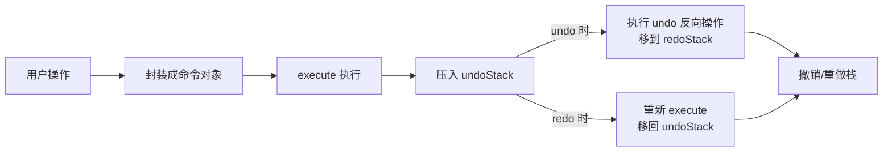

<DifficultyBadge level="advanced" />

# 设计模式在前端

## 一句话解释

设计模式是**解决特定场景的经过验证的代码组织范式**——面试考的不是"背类图"，而是能不能指出每种模式在真实前端项目里的落点，并用 JS 实现。

## 高频模式总览

| 模式 | 一句话 | 前端典型场景 |
|------|--------|-------------|
| **单例** | 全局唯一实例 | 全局 store、请求缓存、配置管理 |
| **工厂** | 用函数统一创建对象 | 组件工厂、创建不同 UI 形态 |
| **观察者 / 发布订阅** | 状态变化通知关注者 | EventEmitter、事件总线、表单联动 |
| **策略** | 算法族可替换 | 表单校验、金额计算、排序规则 |
| **代理** | 控制对目标对象的访问 | Proxy 数据响应式、懒加载、权限 |
| **装饰器** | 不改源码增强行为 | 高阶组件 HOC、日志/埋点包装 |
| **适配器** | 转换接口以复用 | 数据适配、旧 API 兼容 |
| **命令** | 把操作封装成对象 | 撤销/重做、操作队列、编辑器 |

## 单例模式

**思想**：一个类/模块在整个应用里只存在一个实例，并提供全局访问点。

```javascript
// 结合模块作用域实现单例（最常用、最干净）
let instance = null
class Logger {
  constructor() {
    if (instance) return instance
    instance = this
    this.handlers = []
  }
  log(level, msg) { this.handlers.forEach((h) => h(level, msg)) }
  on(handler) { this.handlers.push(handler) }
}
const logger = new Logger()

// 前端场景 1：全局唯一 store
const store = new Map() // 整个应用共享一份状态，任何模块读写同一引用

// 前端场景 2：请求缓存（同 URL 只发一次）
const requestCache = new Map()
function cachedFetch(url) {
  if (requestCache.has(url)) return requestCache.get(url)
  const p = fetch(url).then((r) => r.json())
  requestCache.set(url, p)
  return p
}
```

**面试要点**：前端"单例"很少用 `new` 强约束，而是靠 **ES Module 天然的单例行为**（模块只执行一次）；注意区分"单例"和"全局变量"——单例还要提供合理的访问与初始化时机。

## 工厂模式

**思想**：把"创建对象"的逻辑从使用处抽离，由一个工厂函数/类负责，便于集中控制与扩展。

```javascript
// 组件工厂：根据 type 返回不同的 React 组件
function createField({ type, ...props }) {
  const registry = {
    text: TextField,
    select: SelectField,
    date: DateField,
    upload: UploadField,
  }
  const Component = registry[type]
  if (!Component) throw new Error(`未注册的字段类型: ${type}`)
  return <Component {...props} />
}

// 使用处无需关心创建细节，新增类型只需在 registry 注册
// <Form>{schema.fields.map((f) => createField(f))}</Form>
```

**要点**：工厂与**策略/注册表**经常配合使用；好处是集中创建逻辑、隐藏构造复杂度、便于替换实现（测试时换 mock）。创建"简单"场景别过度用工厂，否则是 YAGNI。

## 观察者 vs 发布订阅

两者经常混用，但严格来说不同：**观察者**是"目标直接通知观察者"（对象间耦合）；**发布订阅**多一层**事件通道**，发布者与订阅者完全解耦。

```javascript
// 手写发布订阅 EventEmitter（面试高频手写题）
class EventEmitter {
  constructor() { this.events = new Map() }

  on(name, fn) {
    if (!this.events.has(name)) this.events.set(name, new Set())
    this.events.get(name).add(fn)
    return () => this.off(name, fn) // 返回取消订阅函数，防泄漏
  }

  once(name, fn) {
    const wrapper = (...args) => { this.off(name, wrapper); fn(...args) }
    return this.on(name, wrapper)
  }

  emit(name, ...args) {
    this.events.get(name)?.forEach((fn) => fn(...args))
  }

  off(name, fn) {
    this.events.get(name)?.delete(fn)
  }

  removeAll(name) {
    if (name) this.events.delete(name)
    else this.events.clear()
  }
}

// 前端场景：业务事件总线、组件间解耦通信、埋点上报
const bus = new EventEmitter()
bus.on('cart:changed', (total) => updateCartBadge(total))
bus.emit('cart:changed', 199)
```

**要点**：前端框架的响应式（Vue 的 `ref`/React 的订阅）本质都是观察者模式；写 `on` 时要**返回取消订阅函数**，防止组件卸载后回调仍被调用（内存泄漏 / 重复触发）。

#### 观察者 vs 发布订阅对比

| 维度 | 观察者（Observer） | 发布订阅（Pub/Sub） |
|------|-------------------|--------------------|
| 参与者 | Subject 直接持有 Observer 列表 | Publisher 与 Subscriber 通过中间事件通道 |
| 耦合 | 主题与观察者互相知道 | 完全解耦，互不知晓对方 |
| 谁负责分发 | 主题对象 | 独立的事件总线 |
| 前端例子 | Vue 响应式依赖、React 订阅 | EventEmitter、跨组件事件总线 |
| 适用 | 单个数据源局部状态 | 跨模块/跨应用解耦通信 |

## 策略模式

**思想**：定义一组可互换的算法（策略），运行时选择，替代大量 `if/else`，天然符合开闭原则。

```javascript
// 表单校验策略：每种规则是一个策略对象
const validators = {
  required: (v) => v !== undefined && v !== '' || '该项必填',
  email: (v) => !v || /^[^@\s]+@[^@\s]+\.[^@\s]+$/.test(v) || '邮箱格式不正确',
  minLength: (min) => (v) => !v || String(v).length >= min || `最少 ${min} 个字符`,
  range: (min, max) => (v) => {
    if (v === undefined || v === null) return true
    const n = Number(v)
    return (n >= min && n <= max) || `需在 ${min}-${max} 之间`
  },
}

function validate(rules, value) {
  for (const rule of rules) {
    const r = rule(value)
    if (r !== true) return r // 返回错误消息
  }
  return true
}

// 用法：配置驱动，新增校验规则只加一个策略，不改校验器
const rules = [
  validators.required,
  validators.minLength(6),
  (v) => v === v.toLowerCase() || '不能含大写字母',
]
console.log(validate(rules, 'abc123'))
```

**要点**：策略模式让"算法选择"从业务代码中剥离；前端常用于表单校验、排序方式、支付渠道、导出格式、金额精度规则等。面试时强调"**用 Map/对象注册替代 if/else 分支**"。

## 代理模式（Proxy 数据响应式）

**思想**：通过代理对象拦截对目标对象的访问/操作，在不修改目标的前提下附加行为（懒加载、缓存、权限、日志）。

```javascript
// 用 Proxy 实现极简响应式（Vue3 响应式核心思想的简化版）
function reactive(target) {
  return new Proxy(target, {
    get(obj, key) {
      track(key)      // 依赖收集：记录"谁"读了这个属性
      return Reflect.get(obj, key)
    },
    set(obj, key, value) {
      const r = Reflect.set(obj, key, value)
      trigger(key)    // 派发更新：通知依赖该属性的订阅者重新执行
      return r
    },
  })
}

const state = reactive({ count: 0 })
// state.count++ 时，依赖它的 UI 自动更新

// 代理模式的另一场景：字段访问防护（如未初始化时抛出明确错误）
const guarded = new Proxy({}, {
  get(_, key) {
    throw new Error(`配置项 ${String(key)} 未初始化，请先调用 init()`)
  },
})
```

**要点**：与**装饰器**的区别——代理控制"访问"，装饰器增强"行为"；前端 Vue3 的 `reactive`、immer 的可写代理、对象访问的越权防护都是代理模式。面试常追问：Proxy 与 `Object.defineProperty` 的差异（能拦截不存在的属性、数组索引、delete、更多操作）。

## 装饰器模式（HOC vs 装饰器）

**思想**：不改源码，把新职责"包"在原对象外一层。前端最典型的是 **React 高阶组件（HOC）**。

```javascript
// 高阶组件：给组件注入日志能力，不改原组件源码
function withLogging(WrappedComponent) {
  return function WithLogging(props) {
    useEffect(() => {
      console.log(`[mounted] ${WrappedComponent.name || 'component'}`)
      return () => console.log(`[unmounted] ${WrappedComponent.name || 'component'}`)
    }, [])
    return <WrappedComponent {...props} />
  }
}
const UserCardWithLog = withLogging(UserCard)

// 函数级装饰（JS 手写）：为异步方法加 try/catch 与埋点
function withAsyncGuard(fn) {
  return async function (...args) {
    try {
      return await fn.apply(this, args)
    } catch (err) {
      reportError(err)
      throw err
    }
  }
}
const safeSubmit = withAsyncGuard(api.submit)
```

**要点**：装饰器（Decorator）是语言/框架层面的"元编程"（如 Vue 的 `@Component`、Angular 的 `@Injectable`），HOC 是 React 用函数组合模拟装饰语义。面试常对比：HOC vs Hooks（HOC 的透传 props 问题、Hooks 更简洁），以及装饰器的"职责叠加"能力。

## 适配器模式

**思想**：把一个接口转换成调用方期望的接口，解决"两边接口对不上"的问题，常用于**数据适配**与老系统兼容。

```javascript
// 后端字段命名/结构变化，前端用适配器收敛，业务层不受影响
function userDTOtoDomain(dto) {
  return {
    id: dto.uid ?? dto.id,               // 不同后端字段名不同
    name: dto.display_name || '未命名',
    fullAddress: [dto.province, dto.city, dto.street].filter(Boolean).join(' '),
    createdAt: new Date(dto.created_at * 1000),
  }
}

// 旧 API 兼容：包装旧接口为新接口（防腐层）
const legacyApiAdapter = {
  getList: (params) => fetchLegacy('/v1/list', { qs: legacyQueryString(params) }),
  submit: (data) => fetchLegacy('/v1/save', { body: legacyFormEncode(data) }),
}
```

**要点**：适配器让"变化"集中在边界处；前端常见于 DTO→领域模型转换、多端（小程序/Web/App）接口差异、图表库数据格式转换、旧版本接口兼容。配合 DDD 的防腐层（Anti-Corruption Layer）使用。

## 命令模式（撤销重做）

**思想**：把"一个操作"封装成一个对象（含执行与撤销），从而支持排队、日志、撤销/重做。

```javascript
// 编辑器操作命令：execute 执行、undo 撤销
class History {
  constructor() {
    this.undoStack = []
    this.redoStack = []
  }
  push(cmd) {
    cmd.execute()
    this.undoStack.push(cmd)
    this.redoStack.length = 0 // 新命令清空重做栈
  }
  undo() {
    const cmd = this.undoStack.pop()
    if (cmd) { cmd.undo(); this.redoStack.push(cmd) }
  }
  redo() {
    const cmd = this.redoStack.pop()
    if (cmd) { cmd.execute(); this.undoStack.push(cmd) }
  }
}

const history = new History()
const insertCmd = {
  execute: () => doc.insert(text), // 快照式：记录插入前位置
  undo: () => doc.remove(text),
}
const deleteCmd = {
  execute: () => doc.delete(range),
  undo: () => doc.restore(snapshot),
}
history.push(insertCmd)
history.push(deleteCmd)
history.undo() // 撤销删除
history.redo() // 重做删除
```

**要点**：命令对象捕获"执行上下文"，让操作可以排队、延迟、宏录制；前端用于富文本/表格编辑器的撤销重做、操作日志、批量任务队列。撤销实现通常是**保存快照**或**反向操作**两种方式。



## 面试问法

- 🔥 **手写一个发布订阅 EventEmitter。**
  - on/once/emit/off/removeAll 五个方法
  - on 返回取消订阅函数防泄漏，once 包一层 wrapper 自动卸载
  - 底层用 Map + Set 存回调

- 🔥 **观察者和发布订阅的区别？**
  - 观察者：目标直接通知观察者，双方有引用
  - 发布订阅：中间多一层事件通道，完全解耦
  - 前端事件总线是发布订阅，Vue 响应式是观察者

- 🔥 **单例模式在前端怎么实现？有哪些坑？**
  - ES Module 天然单例 + 类内缓存实例
  - 应用：全局 store、请求缓存、配置
  - 坑：避免"单例即全局可变"，注意初始化时机与 SSR 场景

- 🔥 **Vue3 响应式为什么用 Proxy 而 Vue2 用 defineProperty？**
  - Proxy 能拦截新增属性、数组索引、delete 等所有操作
  - defineProperty 需要递归劫持已有属性，新增/删除监听不到
  - 都属于代理模式思想

- ⭐ **HOC 和装饰器、Hooks 怎么选？**
  - HOC 是函数组合模拟装饰语义，能叠加职责但有透传/命名冲突问题
  - 装饰器是语言/框架级元编程（Angular/Vue 注解）
  - React 场景优先 Hooks，渲染增强场景用 HOC

- ⭐ **策略模式和 if/else 的区别？怎么替代？**
  - if/else 把算法选择和业务逻辑耦合，新增分支要改原代码
  - 策略模式用对象/Map 注册，符合开闭原则，新增策略不改校验器
  - 表单校验、排序、金额计算等场景适用

- ⭐ **命令模式解决什么问题？**
  - 把操作封装为可执行/可撤销的对象，支持撤销重做与操作队列
  - 实现撤销两种方式：快照 或 反向操作
  - 富文本编辑器、操作日志是典型场景

## 💡 AI 辅助学习

> 用这个 Prompt 让 AI 帮你练习模式识别：
> "你是一位设计模式导师。给我 10 个真实前端场景描述（例如：'两个后端返回不同字段名的用户数据'、'用户快速点击导致重复提交'、'多个表单页面需要统一的校验规则'），每给出一个场景，先让我判断该用什么设计模式，再给出你的答案和一段 10 行左右的 JS 示例代码。最后用一句话总结每个模式的核心适用信号。"

## 关联知识

- [前端架构设计](/engineering/architecture-design) — 设计模式在架构层的组织原则
- [React 优化](/frameworks/react-optimization) — HOC、memo 等模式在 React 中的应用
- [Vue 高级特性](/frameworks/vue-advanced) — 响应式、provide/inject 中的模式思想
- [JS 原型与面向对象](/fundamentals/js-prototype) — 模式的底层语言基础
- [大型项目重构策略](/engineering/refactoring-strategy) — 用模式消除坏味道
