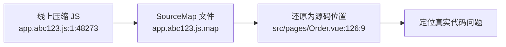
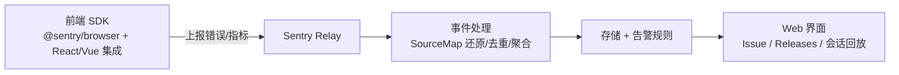

<DifficultyBadge level="advanced" />

# 错误监控与可观测性

## 一句话解释

前端可观测性是把**线上发生了什么**变成**可查询、可定位、可告警**的数据——涵盖错误采集、SourceMap 还原、性能指标、日志上报与告警，是"线上事故处理速度"的工程底座。

## 错误捕获体系

### 四类错误的捕获方式

| 错误类型 | 捕获方式 | 说明 |
|---------|---------|------|
| 同步运行时错误 | `window.onerror` | 捕获全局未处理 JS 异常 |
| Promise 未处理 | `window.addEventListener('unhandledrejection')` | Promise reject 未被 catch |
| 资源加载失败 | `error` 事件（capture 阶段） | img/script/css 加载失败 |
| 框架渲染错误 | React `ErrorBoundary` / Vue `errorCaptured` | 组件树渲染失败 |

```javascript
// 统一错误采集 SDK（核心骨架）
window.addEventListener('error', (event) => {
  if (event.target !== window && event.target !== document) {
    // 资源加载错误：没有 message 与 stack
    report({ type: 'resource', url: event.target.src || event.target.href })
    return
  }
  report({ type: 'js', message: event.message, stack: event.error?.stack, line: event.lineno, col: event.colno })
})

window.addEventListener('unhandledrejection', (event) => {
  report({
    type: 'promise',
    reason: event.reason?.message || String(event.reason),
    stack: event.reason?.stack,
  })
})

// React 错误边界
class ErrorBoundary extends React.Component {
  componentDidCatch(error, info) {
    report({ type: 'react', message: error.message, stack: error.stack, componentStack: info.componentStack })
  }
  render() { return this.props.children }
}

// Vue3 全局错误处理器（捕获组件渲染/生命周期/自定义指令中的错误）
const app = createApp(App)
app.config.errorHandler = (err, instance, info) => {
  report({
    type: 'vue',
    message: err.message,
    stack: err.stack,
    component: instance?.type?.name,
    info, // 例如 'setup function' / 'render function'
  })
}
app.config.warnHandler = (msg) => report({ type: 'vue-warn', message: msg })
```

### 关键细节

- **`window.onerror` 拿不到 `event.error` 时**（跨域脚本）`stack` 为空，且 message 是 `Script error.`——跨域脚本需在 `<script crossorigin>` 配合 CDN 返回 `Access-Control-Allow-Origin` 才能拿到真实栈
- **`unhandledrejection`** 只能在"没被 catch"时触发，所以**养成先 `catch` 兜底、再靠全局兜底**的习惯
- **`error` 事件默认不冒泡**，资源错误必须用 `addEventListener('error', fn, true)` 捕获阶段监听
- 错误去重要在 SDK 侧做（见"日志上报"）

## SourceMap 还原

线上代码是压缩混淆过的，`stack` 里的文件名/行号对不上源码，需要 SourceMap 把"压缩后位置"映射回"源码位置"。



- **为什么线上要传 map**：报错信息才有意义，否则只能看到一串压缩码；框架还可用 `error-stack-parser` + `source-map` 库在服务端还原
- **为什么不能随包发布**：map 会暴露源码（注释、逻辑、商业敏感信息），攻击者能直接读源码
- **标准做法**：map 上传到**私有监控平台**（Sentry/SourceMap 服务），生产 `webpack` 配置 `sourcemap: 'hidden-source-map'` 只保留 `.map` 文件不暴露 `//# sourceMappingURL` 注释；或不发布 map，由 CI 在构建产物里提取并上传后删除

```bash
# webpack 只产出 map 文件、不含映射注释，由 CI 上传到私有存储
output: {
  sourceMapFilename: 'sourcemaps/[file].map',
}
# CI 步骤：上传 map → 从产物中删除 map 再发布
sentry-cli releases files VERSION upload-sourcemaps ./dist/sourcemaps
```

## 性能监控

### Performance API 与 Web Vitals

```javascript
// 采集关键性能指标
const timing = performance.timing
const ttfb = timing.responseStart - timing.navigationStart // 首字节时间

// 使用 PerformanceObserver 订阅指标（不阻塞主线程）
new PerformanceObserver((list) => {
  for (const entry of list.getEntries()) {
    if (entry.entryType === 'largest-contentful-paint') {
      reportMetric({ name: 'LCP', value: entry.startTime })
    }
  }
}).observe({ type: 'largest-contentful-paint', buffered: true })

// 注入性能标记，上报自定义阶段耗时
performance.mark('order:submit-start')
performance.mark('order:submit-end')
const dur = performance.measure('submit', 'order:submit-start', 'order:submit-end').duration
```

| 指标 | 来源 | 衡量 |
|------|------|------|
| **LCP** | PerformanceObserver(LCP) | 最大内容绘制，加载体验 |
| **INP** | PerformanceObserver(Event Timing) | 交互响应（替代 FID） |
| **CLS** | PerformanceObserver(Layout Shift) | 布局稳定性 |
| **FCP / TTFB** | Paint Timing / Navigation Timing | 首屏与首字节 |
| **JS 错误率 / 请求失败率** | 业务埋点 | 可用性 |

### RUM（真实用户监控）

- 在页面中注入 SDK，采集真实用户的指标分布（P75/P90/P95），而非实验室单点值
- **采样策略**：全量或按比例（如 10%），大流量站点必须采样，避免上报压垮服务端
- 与实验室工具（Lighthouse）互补：实验室发现"能优化什么"，RUM 判断"真实用户是否变好"

## 日志采集与上报

### 上报关键策略

| 策略 | 做法 | 目的 |
|------|------|------|
| **批量** | 攒 N 条或 T 毫秒合并成一次上报 | 减少请求数，避免给每个错误发请求 |
| **去重** | 按错误签名（message+file+line+col）聚合计数 | 崩溃风暴时只报一条带 count |
| **采样** | 全量/按比例/按错误严重度分级 | 控制成本与噪音 |
| **降噪** | 忽略已知噪音（如第三方广告 SDK 的报错） | 保证告警质量 |
| **会话关联** | 带上 userId、页面、环境、版本、traceId | 快速定位到具体用户与代码版本 |

```javascript
// 批量上报：把错误收集进队列，定时/满量 flush
const queue = []
function report(payload) {
  queue.push(payload)
  if (queue.length >= 20) flush()
}
let timer
function flush() {
  if (!queue.length) return
  const batch = queue.splice(0, queue.length)
  // sendBeacon：页面卸载时也能可靠发出
  navigator.sendBeacon?.('/collect', new Blob([JSON.stringify(batch)], { type: 'application/json' }))
  timer = setTimeout(flush, 3000)
}

// 错误签名去重（聚合）
function signature(err) {
  return `${err.message}@${err.file}:${err.line}:${err.col}`
}
```

- **为什么用 `navigator.sendBeacon`**：页面关闭/跳转时普通 XHR 会被取消，`sendBeacon` 保证在卸载阶段仍能发出；批量采集也天然契合
- **体积控制**：上报数据要精简，避免把整页内容/大对象序列化进去

## Sentry 架构与接入



**接入要点**：

- 初始化：`Sentry.init({ dsn, environment, release: buildVersion, tracesSampleRate: 0.2 })`
- `release` 绑定代码版本，配合 **Releases** 查看"哪个版本引入了回归"，并做 SourceMap 关联
- `errorHandler` 交给 React 的 `ErrorBoundary`（`Sentry.ErrorBoundary`）、Vue 的 `app.config.errorHandler`
- **自定义 breadcrumb**：记录用户操作路径（点击、路由跳转、接口调用），错误现场还原更强
- **Session Replay**：录制用户操作回放，定位"复现不出"的偶发问题

**自研 vs 第三方**：自研控制数据、但成本高；第三方（Sentry/阿里云 ARMS）开箱即用。面试常考的是**自研采集链路的完整设计**（捕获→增强上下文→去重→批量→发送→存储→告警）。

## 可观测性三支柱与告警

| 支柱 | 回答的问题 | 前端对应 |
|------|-----------|---------|
| **Logs（日志）** | "发生了什么？" | 错误日志、用户行为日志 |
| **Metrics（指标）** | "现在是否正常？" | 错误率、PV、LCP P75、接口成功率 |
| **Traces（链路）** | "这件事耗时在哪？" | 接口调用链、组件渲染耗时、跨应用 traceId |

### 告警策略要点

- **基于指标而非原始日志告警**：对"错误率 > 1%"或"LCP P90 > 3.5s 持续 10 分钟"告警，而不是每条错误都打扰
- **告警分级**：P0（核心链路不可用）→ 电话/IM，P1/P2 → 群消息，避免告警疲劳
- **指标正确性先行**：上报埋点错了，告警系统就是"数字游戏"——先验证采集正确再谈告警
- **事故闭环**：告警 → 定位（traceId/会话）→ 修复 → 发版（release）→ 验证指标回落

## 面试问法

- 🔥 **前端错误监控如何捕获所有类型的错误？**
  - window.onerror 捕获同步运行时错误
  - unhandledrejection 捕获 Promise 未处理
  - capture 阶段的 error 事件捕获资源加载失败
  - ErrorBoundary / errorCaptured 捕获框架渲染错误

- 🔥 **线上报错为什么只有 "Script error."？怎么解决？**
  - 跨域脚本没有 CORS 头时，浏览器只能给出无细节的 Script error.
  - 解决：脚本标签加 crossorigin + CDN 返回 Access-Control-Allow-Origin

- 🔥 **SourceMap 为什么要传、又不能随包发布？**
  - 传 map 才能把压缩位置还原为源码位置定位问题
  - 随包发布会暴露源码，有安全风险
  - 标准做法：map 上传私有监控平台，生产用 hidden-source-map，CI 上传后删除

- 🔥 **日志上报怎么做批量与去重？**
  - 批量：队列攒 N 条/定时 flush，sendBeacon 保证卸载时也能发
  - 去重：错误签名（message+file+line+col）聚合计数，崩溃风暴只报一条带 count
  - 采样与降噪控制成本与噪音

- ⭐ **RUM 和 Lighthouse 有什么区别？**
  - Lighthouse 是实验室指标，一次性、可控环境
  - RUM 是真实用户指标，反映线上分布（P75/P90），用采样采集
  - 互补使用：实验室定位优化方向，RUM 验证真实效果

- ⭐ **可观测性三支柱是什么？前端怎么落地？**
  - Logs：错误日志、行为日志
  - Metrics：错误率、性能分位数
  - Traces：接口调用链、traceId 串联跨应用

- ⭐ **告警怎么做才不会打扰人？**
  - 基于聚合指标（错误率/分位数）而非原始日志
  - 分级告警 P0/P1/P2，避免告警疲劳
  - 先保证埋点与指标正确，再谈告警阈值

## 💡 AI 辅助学习

> 用这个 Prompt 让 AI 帮你设计自研监控系统：
> "你是一位资深前端工程师。我要在团队内自研一套前端监控系统（不用 Sentry），请帮我设计：1) SDK 端错误捕获与上报的完整代码结构（含批量、去重、采样）；2) 服务端接收与存储的最小方案；3) 错误率的告警规则与阈值设定建议；4) 一个线上事故从发生到定位的完整排查流程（含 traceId 怎么贯穿前端-网关-后端）。请给出可直接落地的方案。"

## 关联知识

- [性能优化全景](/engineering/performance-overview) — Web Vitals 与性能指标详解
- [大型项目重构策略](/engineering/refactoring-strategy) — 重构期间靠监控保障质量
- [浏览器安全](/fundamentals/browser-security) — 跨域与 CORS 对错误采集的影响
- [AI 辅助架构设计](/ai-dev/ai-architecture) — AI 辅助监控数据洞察
- [CI/CD 搭建](/engineering/ci-cd) — release 版本管理与灰度发布联动
