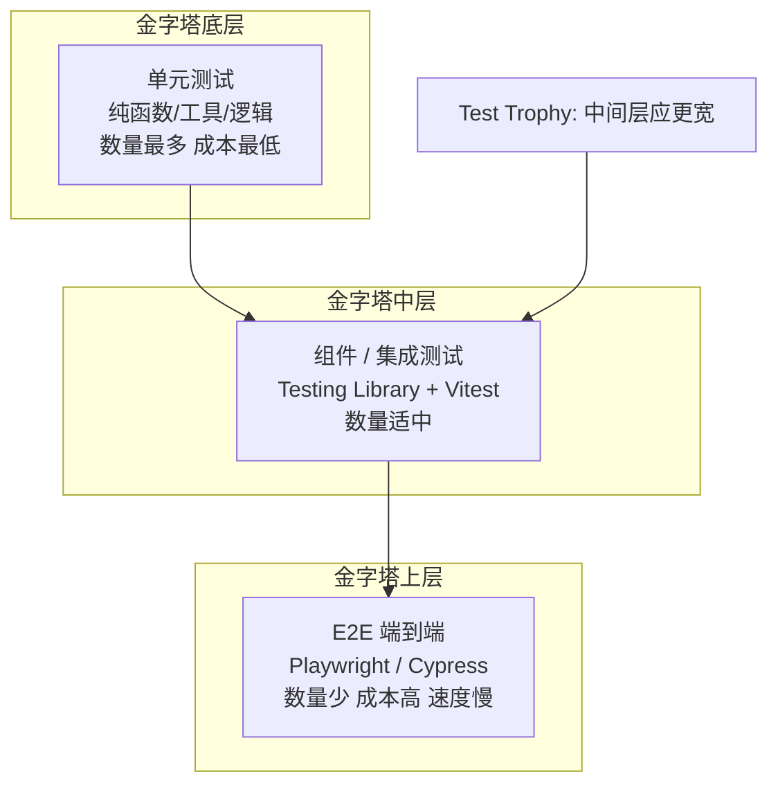

<DifficultyBadge level="intermediate" />

# 前端测试

## 一句话解释

前端测试的目标是**用自动化手段防止回归、约束行为**，核心原则是"测试行为而非实现"，用尽可能低的成本覆盖尽可能多的风险。

## 测试金字塔

分层测试各有取舍，越底层越便宜、越可靠，越上层越接近用户真实行为但越贵越慢：



| 层级 | 工具 | 验证什么 | 成本/速度 |
|------|------|---------|----------|
| 单元测试 | Vitest/Jest | 纯函数、状态逻辑、工具方法 | 低/快 |
| 组件测试 | Testing Library | 组件渲染与交互行为 | 中/中 |
| 集成测试 | Testing Library + MSW | 模块间协作、数据流 | 中/中 |
| E2E 测试 | Playwright/Cypress | 完整用户流程、真实浏览器 | 高/慢 |

> **Test Trophy（测试奖杯）**：Kent C. Dodds 提出，主张把重心放在"中间层"——组件/集成测试（覆盖交互行为），单元与 E2E 作为补充，比纯金字塔更贴合前端。

## Vitest vs Jest

Vitest 是 Vite 生态原生的测试框架，2026 年已成为前端主流新选择。

| 对比项 | Vitest | Jest |
|--------|--------|------|
| 底层 | Vite + esbuild（原生快） | Babel/Jest transform |
| 速度 | 快，ESM 原生支持 | 中，CJS 时代产物 |
| 配置 | 复用 vite.config，零配置起步 | 需独立配置 + babel |
| 模块模拟 | `vi.mock`（原生 ESM 支持） | `jest.mock`（需额外配置） |
| Watch 模式 | 内建，按依赖图精确重跑 | 需 babel-jest + watchman |
| 生态 | 增长快 | 成熟但趋稳 |

```javascript
// Vitest：与 Jest API 几乎同构，迁移成本低
import { describe, it, expect, vi, beforeEach } from 'vitest'
import { fetchUser } from './user'

vi.mock('./api', () => ({
  getUser: vi.fn().mockResolvedValue({ id: 1, name: 'Tom' }),
}))

describe('fetchUser', () => {
  it('返回用户信息', async () => {
    const user = await fetchUser(1)
    expect(user.name).toBe('Tom')
  })
})
```

## 组件测试：Testing Library 哲学

Testing Library 的核心哲学是**像用户一样测试**：不关心组件内部 state 与实现细节，只关心"用户能看到什么、能做什么"。

```javascript
// ❌ 测实现细节：脆弱，重构就挂
expect(wrapper.vm.count).toBe(1)  // 不关心内部 state
wrapper.find('button').trigger('click')  // 不关心具体标签

// ✅ 测用户行为
import { render, screen, fireEvent } from '@testing-library/react'
import Counter from './Counter'

test('点击按钮数字加一', () => {
  render(<Counter />)
  const btn = screen.getByRole('button', { name: /increment/i })
  fireEvent.click(btn)
  expect(screen.getByText('1')).toBeInTheDocument()  // 用户看到的结果
})
```

### 测试优先级：如何选择查询

| 优先级 | 查询方式 | 适用 |
|--------|---------|------|
| 1 | `getByRole` / `getByLabelText` | 语义化、最接近用户感知 |
| 2 | `getByPlaceholderText` / `getByText` | 表单占位/可见文本 |
| 3 | `getByTestId` | 兜底（非语义场景） |

> **考点**：优先用**角色+可访问名**（`getByRole('button', { name })`），其次是文本/占位符，`test-id` 是最后手段——越贴近用户，测试越能捕捉真实问题。

## E2E 测试：Playwright vs Cypress

E2E 在**真实浏览器**里跑完整用户流程，覆盖跨页面、跨模块、真实网络。

| 对比项 | Playwright | Cypress |
|--------|-----------|---------|
| 浏览器 | Chromium/Firefox/WebKit 三引擎 | 主打 Chromium（跨浏览器有限） |
| 架构 | 独立进程驱动，Node 侧断言 | 注入浏览器运行，同步风格 |
| 自动等待 | `locator` 内置自动等待 | 断言自动重试 |
| 网络 mock | `page.route` 灵活 | `cy.intercept` |
| 并行执行 | 天然支持分片并行 | 需商业版/插件 |
| 定位器 | `getByRole` 等强定位器 | `data-cy` 为主 |
| 2026 现状 | **事实主流**，新项目首选 | 存量项目仍多，新项目渐少 |

```javascript
// Playwright：浏览器测试
import { test, expect } from '@playwright/test'

test('登录流程', async ({ page }) => {
  await page.goto('/login')
  await page.getByLabel('用户名').fill('admin')
  await page.getByLabel('密码').fill('secret')
  await page.getByRole('button', { name: '登录' }).click()
  await expect(page).toHaveURL(/\/dashboard/)
  await expect(page.getByText('欢迎回来')).toBeVisible()
})
```

> **2026 视角**：Playwright 凭三引擎支持、稳健的自动等待与并行能力成为 E2E 主流；Cypress 偏存量；组件级 E2E 由 Testing Library 承接，E2E 专注关键用户路径（登录、下单、支付）。

## Mock 策略：vi.mock 与 MSW

正确 mock 让测试**快、稳、隔离**，但 mock 过度会让测试失真。分两层：

| 层 | 工具 | mock 什么 | 场景 |
|----|------|----------|------|
| 模块层 | `vi.mock`/`jest.mock` | 函数/模块返回值 | 单测隔离、控制分支 |
| 网络层 | MSW（Mock Service Worker） | HTTP 请求拦截 | 组件/集成测试真实数据流 |

```javascript
// 模块层：控制 fetch 模块
vi.mock('../api', () => ({
  getData: vi.fn().mockResolvedValue({ list: [] }),
}))

// 网络层：MSW 拦截真实 fetch 请求，服务不启动也能测
import { http, HttpResponse } from 'msw'
import { setupServer } from 'msw/node'

const server = setupServer(
  http.get('/api/users', () => HttpResponse.json({ list: [1, 2, 3] })),
)
beforeAll(() => server.listen())
afterEach(() => server.resetHandlers())
afterAll(() => server.close())
```

> **考点**：MSW 在**网络层**拦截（浏览器里是 Service Worker），组件代码无需感知，比模块 mock 更接近真实；**尽量 mock 少、mock 边界**——只 mock 不稳定的外部依赖（网络、时间、随机），业务代码保持真实。

## 覆盖率指标与测试策略

覆盖率数字本身不是目的，它告诉我们"哪些代码没被测试保护"。

| 指标 | 含义 | 建议 |
|------|------|------|
| 行覆盖率（lines） | 被执行的代码行比例 | 60-80% |
| 分支覆盖率（branches） | if/三元/逻辑分支被执行比例 | 70%+ |
| 函数覆盖率（functions） | 被调用的函数比例 | 高 |
| 语句覆盖率（statements） | 语句执行比例 | 随行覆盖 |

```javascript
// vite.config.ts —— Vitest 覆盖率配置（@vitest/coverage-v8）
export default defineConfig({
  test: {
    coverage: {
      provider: 'v8',
      include: ['src/**/*.{ts,vue}'],
      exclude: ['src/**/*.d.ts', 'src/main.ts'],
      thresholds: {
        lines: 80,
        branches: 70,
        functions: 80,
        statements: 80,
      },
    },
  },
})
```

> **策略**：不要盲目追求 100% 覆盖率（边际成本极高）；用"**高价值代码优先**"——工具函数、核心状态逻辑、支付/权限等关键路径覆盖率优先；UI 外壳用少量冒烟测试兜底。覆盖率接入 CI 作阈值门禁，防止新增代码拉低质量。

## 面试问法

- 🔥 **测试金字塔是什么？各层用什么工具？前端应该怎么分配精力？**
  - 底层单元测试多而便宜，上层 E2E 少而贵；前端建议 Test Trophy——重心放组件/集成测试
  - 工具：单元 Vitest/Jest，组件 Testing Library，E2E Playwright/Cypress
  - 分配：核心逻辑单测 + 关键交互组件测试 + 登录/下单等关键路径 E2E

- 🔥 **Vitest 和 Jest 的区别？为什么选 Vitest？**
  - Vitest 基于 Vite + esbuild，原生 ESM 与速度优势，配置复用 vite.config，`vi.mock` 原生支持 ESM
  - Jest 配置繁琐（babel-jest）、CJS 时代产物，生态成熟但迭代趋缓
  - 迁移成本低（API 同构），Vite 项目首选

- 🔥 **Testing Library 的哲学是什么？为什么不要测实现细节？**
  - "像用户一样测试"：只测可见行为（角色、文本、交互），不测 state 与 DOM 结构
  - 好处：重构内部实现测试不挂，测试真正反映用户价值
  - 查询优先级：getByRole → getByLabelText/getByText → getByTestId

- 🔥 **Playwright 和 Cypress 怎么选？**
  - 三引擎支持（Chromium/Firefox/WebKit）、自动等待、天然并行 → 新项目首选 Playwright
  - Cypress 开发者体验好（可交互调试）但浏览器覆盖有限、并行成本高，偏存量
  - 2026 视角：Playwright 是事实主流，团队迁移趋势明显

- ⭐ **vi.mock 和 MSW 的区别？什么时候用哪个？**
  - vi.mock 在模块层替换导出，速度快但"跳过"了网络代码；MSW 在网络层拦截真实请求，组件代码不感知，更接近真实
  - 用 MSW 测组件/集成（含真实 fetch 流程），用 vi.mock 做纯模块单测或控制边缘分支
  - 原则：mock 少、mock 边界，只 mock 不稳定外部依赖

- ⭐ **覆盖率 100% 就好吗？覆盖率该怎么看？**
  - 不是。100% 覆盖率边际成本极高，且只代表"代码被执行"不代表"行为被验证"
  - 看关键分支与高价值路径覆盖，设 CI 阈值（行 80/分支 70 左右）防回归
  - 用差分覆盖：新提交代码必须保持覆盖率不降

- ⭐ **为什么 E2E 测试要少而精？**
  - E2E 跑真实浏览器，慢、脆、贵（依赖环境稳定、易受第三方影响）
  - 适合关键用户路径（登录、支付、核心流程）做"冒烟保障"，细节行为交给下层测试
  - 分层协作：单测测逻辑、组件测试测交互、E2E 测整体流程，各司其职

## 💡 AI 辅助学习

> 用这个 Prompt 练测试思维：
> "你是一个前端测试专家。我给一个购物车模块写了测试，覆盖了 addToCart 的加法逻辑（单元测试 100% 行覆盖），但用户反馈加购后总价有 bug。请分析为什么单测覆盖率高还会漏 bug，并示范：这个场景应补什么层的测试（组件/E2E），用 Vitest + Testing Library 写出关键用例。"

## 关联知识

- [CI/CD 与工程化](/engineering/ci-cd) — 测试在 CI 流水线中的位置
- [包体积优化](/engineering/bundle-optimization) — 测试代码与产物体积的关系
- [React 优化](/frameworks/react-optimization) — 组件渲染行为的测试关注点
- [JS 异步](/fundamentals/js-async) — 异步逻辑的测试技巧
