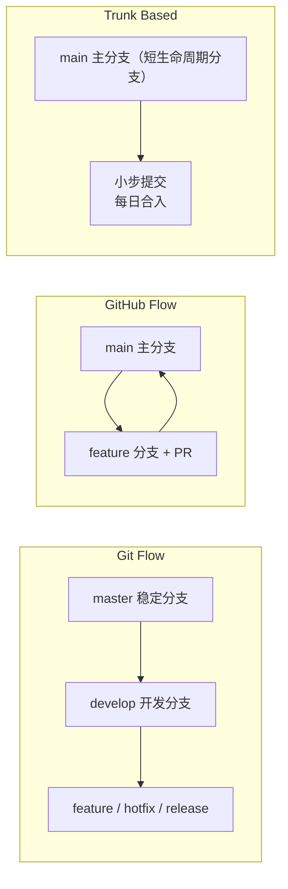
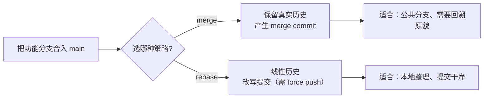

<DifficultyBadge level="medium" />

# Git 工作流

## 一句话解释

Git 工作流解决"**多人在一条代码库上如何并行、如何合入、如何发布**"——主流三选一是 Git Flow（多分支、重流程）、GitHub Flow（PR 驱动、轻量）、Trunk Based（短分支、每日合并），配以统一的 commit 规范与语义化版本保证协作质量。

## 三种工作流对比



| 维度 | Git Flow | GitHub Flow | Trunk Based |
|------|---------|-------------|-------------|
| **主分支** | master + develop | main | main |
| **辅助分支** | feature / release / hotfix | 仅 feature（PR） | 极短 feature / 无 |
| **分支生命周期** | 长 | 短 | 极短（数小时~数天） |
| **发布方式** | release 分支 + tag | 合入即发布 | 频繁小发布 / 特性开关 |
| **适用团队** | 复杂产品、固定版本节奏 | 中小组、持续交付 | CI 成熟、快速迭代团队 |
| **复杂度** | 高 | 低 | 低 |
| **常见问题** | 分支漂移、合入冲突 | 主分支永远可发布压力 | 需要强 CI + 特性开关 |

> 面试记忆点：**Git Flow 重"流程与分支"，GitHub Flow 重"PR 与持续部署"，Trunk Based 重"小步快跑 + 特性开关"**。2026 趋势是团队规模越小、CI 越强，越偏向 Trunk Based；Git Flow 在传统企业/固定发版节奏中仍常见。

## Commit 规范：Conventional Commits

统一 commit message 让历史可读、可生成 changelog、可联动版本号。

```
<type>(<scope>): <description>

# 示例
feat(cart): 增加购物车数量角标
fix(login): 修复 token 过期后跳转死循环
perf(list): 用虚拟列表替换全量渲染
docs(readme): 补充 pnpm 安装说明
```

| type | 含义 | 对版本号影响 |
|------|------|-------------|
| `feat` | 新功能 | minor（次版本） |
| `fix` | 修复 bug | patch（补丁） |
| `perf` / `refactor` / `style` / `docs` | 性能/重构/样式/文档 | 无（patch 可含） |
| `breaking change`（`!` 或 `BREAKING CHANGE:`） | 破坏性变更 | **major（主版本）** |
| `build` / `ci` / `chore` | 构建/CI/杂务 | 无 |

```bash
# ✅ 规范：清晰、可追溯、自动生成 changelog
git commit -m "feat(api): 支持分页参数"
git commit -m "fix(auth): 修复刷新 token 并发竞态" 

# ❌ 不规范：无法检索、无法关联 issue 与 release
git commit -m "update"
git commit -m "fix bug"
git commit -m "123"
```

> 配合工具：`commitlint`（规范校验）、`cz-conventional-changelog`（交互式引导）、`semantic-release`（依据 commit 自动 bump 版本 + 发 changelog + 打 tag）。

## rebase vs merge



```bash
# ✅ merge：不重写历史，保留分支分叉痕迹（公共分支安全）
git checkout main && git merge feat/login

# ✅ rebase：把本地提交线性重放到目标之上（本地整理用）
git checkout feat/login && git rebase main
# 之后 push 需要：git push --force-with-lease

# ❌ 危险：对共享分支做 rebase 再强推
# 会导致其他协作者的历史错乱、重复提交
```

| 维度 | `git merge` | `git rebase` |
|------|-------------|--------------|
| **历史形态** | 保留分叉 + merge commit | 线性、无分叉 |
| **是否改写提交** | 否 | 是 |
| **冲突处理** | 一次性合并冲突 | 每个 commit 依次解决 |
| **公共分支安全** | ✅ 安全 | ❌ 需 force push，危险 |
| **适用场景** | 合入公共分支、保留发版记录 | 本地整理、保持提交整洁 |

> 黄金法则：**公共分支用 merge / squash merge，个人分支合入前用 rebase 保持线性**；`--force-with-lease` 是对共享分支做改写时的安全阀。

## 多人协作常见问题

```bash
# ✅ revert（推荐）：保留历史，产生一个"反向提交"
git revert <commit-hash>   # 公共分支安全，可追溯

# ❌ reset：删除提交历史（公共分支上禁止）
git reset --hard HEAD~2    # 已 push 的分支绝不能用

# ✅ 解决冲突标准流程
git pull --rebase          # 先线性拉取，减少合并冲突
# 冲突后逐个文件解决 → git add → git rebase --continue
```

| 场景 | 正确做法 | 错误做法 |
|------|---------|---------|
| 撤销已 push 的提交 | `git revert` | `git reset`（改写公共历史） |
| 撤销未 push 的本地提交 | `git reset --hard` | `revert`（多此一举） |
| 拉取代码 | `git pull --rebase` | 直接 `git pull`（产生多余 merge） |
| 合入公共分支 | merge / squash merge | rebase 后强推 |
| 救回误删提交 | `git reflog` + `reset` | 放弃（reflog 记录 90 天） |

## PR/MR 流程与分支策略

现代团队普遍用 **PR（Pull Request）** 作为合入主分支的唯一入口——它把"直接 push"替换成"审查 + CI + 合入"的受控流程。

```bash
# ✅ 标准 PR 流程
git checkout -b feat/login              # 从最新 main 拉出分支
git push -u origin feat/login           # 推送远程
# → 在 GitHub/GitLab 发起 PR → 自动跑 CI → review → squash merge → 删除分支

# ✅ 合入前同步主分支（保持线性）
git fetch origin
git rebase origin/main                  # 或：git merge origin/main

# ❌ 不要：直接把未审查的代码 push 到 main
# ❌ 不要：PR 里堆几百个提交、反复 rebase 造成 review 混乱
```

| 分支策略 | 是否直接 push main | 合入方式 | 适合场景 |
|---------|-------------------|---------|---------|
| **直接 push** | ✅ | 无 review | 单人项目、scripts |
| **PR + merge** | ❌ | 保留合并历史 | 需要完整时间线 |
| **PR + squash merge** | ❌ | 一个 commit 进 main | 主分支保持干净、便于回滚 |
| **PR + rebase merge** | ❌ | 线性历史 | 强调提交原子性 |

> PR 最佳实践：**PR 越小越好**（单一职责，便于 review 与回滚）；**标题用 Conventional Commits 规范**（如 `feat(login): 新增邮箱登录`）；合入用 **squash merge** 让 main 保持线性；需要时用 `git push --force-with-lease` 而非 `--force`。

## 语义化版本（SemVer）

```
MAJOR.MINOR.PATCH

1.4.2  →  2.0.0  破坏性变更（BREAKING CHANGE）
2.0.0  →  2.1.0  新增功能（向后兼容）
2.1.0  →  2.1.1  修复 bug（向后兼容）

# 范围标识
^1.4.2  允许 1.x 内升级（不跨 major）
~1.4.2  允许 1.4.x 内升级
1.4.2   精确锁定
```

> 记忆点：**`^` 大版本内兼容、`~` 小版本内兼容**。lock 文件把范围锁定成精确版本，保证 CI/生产可复现；依赖变更引发 breaking change 时，必须升 major 版本并写入 changelog。

## 面试问法

- 🔥 **Git Flow、GitHub Flow、Trunk Based 的区别？你们团队用哪种？**
  - Git Flow：master + develop + feature/release/hotfix 多分支，重流程，适合固定版本节奏的产品；GitHub Flow：只有 main + feature（PR 驱动），合入即发布，适合持续交付；Trunk Based：极短生命周期分支 + 小步合并 + 特性开关，适合 CI 强、快速迭代团队。选型逻辑：**流程成本 vs 发布频率**——发布越频繁、CI 越强，越不需要复杂分支。

- 🔥 **merge 和 rebase 的区别？什么时候用哪个？**
  - merge 保留分叉历史、产生 merge commit、不改写提交，**公共分支安全**；rebase 把提交线性重放、改写历史、需要 force push，**本地整理更干净**。原则：个人分支合入前 rebase 整理，公共分支用 merge/squash；**绝不对已共享的分支 rebase 后强推**。squash merge 是折中：合并成一个 commit 保持主分支线性。

- 🔥 **revert 和 reset 的区别？线上出了 bug 怎么回滚？**
  - reset 是**回退指针**（删除提交），revert 是**反向提交**（保留历史并撤销内容）。线上已 push 的代码必须用 `git revert <commit>`——产生一个新的反向提交，**不破坏其他协作者的历史**；未 push 的本地提交可以用 reset。线上流程：先 revert → 打 hotfix 分支修 bug → 发版 → 再 cherry-pick 修复到主分支。

- ⭐ **Conventional Commits 有什么用？怎么和版本号联动？**
  - 让 commit message 结构化（`type(scope): desc`），用途：① 生成可读 changelog；② 关联 issue/release 追溯；③ 通过 `semantic-release` 依据 `feat`/`fix`/BREAKING CHANGE **自动 bump 版本并发版**（feat→minor，fix→patch，breaking→major）。配合 commitlint 在 CI 强制校验，保证规范不漂移。

- ⭐ **解决冲突的流程？怎么减少冲突？**
  - 流程：`git pull --rebase` → 逐文件解决冲突（保留两侧意图）→ `git add` → `git rebase --continue`。减少冲突：① 高频小步合入主分支（Trunk Based）；② 避免多人改同一模块（模块边界清晰）；③ 及时同步主分支；④ 用 `--force-with-lease` 而非 `--force`。面试加分：冲突解决要**同时看两侧变更意图**，而不是简单选一方。

- ⭐ **什么是语义化版本？`^` 和 `~` 的区别？**
  - SemVer 是 `MAJOR.MINOR.PATCH`：breaking change 升 MAJOR、新增功能升 MINOR、bug 修复升 PATCH。`^1.4.2` 允许 1.x 内升级（不跨 major），`~1.4.2` 只允许 1.4.x。**升级 major 必须用户显式决定**，因此破坏性变更要写进 changelog。配合 lock 文件，范围解析与精确安装各司其职。

## 💡 AI 辅助学习

> 用这个 Prompt 让 AI 帮你设计工作流：
> "我们是一个 12 人的前端团队，产品每两周发版一次，CI 用 GitHub Actions，已经全面用 pnpm + 自动化测试。请：1) 设计一套适合的 Git 工作流（在 GitHub Flow 与 Trunk Based 之间权衡并给理由）；2) 制定 commit 规范 + commitlint 配置；3) 设计'从提交到发版'的完整流程（含 hotfix 流程、语义化版本与 changelog 自动生成）；4) 给出团队公约中常见的坑与禁忌清单。请用中文。"

## 关联知识

- [CI/CD 搭建](/engineering/ci-cd) — 提交触发流水线与发布策略
- [Monorepo 工程化](/engineering/monorepo) — 多包协作与版本管理
- [重构策略](/engineering/refactoring-strategy) — 分支隔离与渐进式迁移
- [微前端实践](/engineering/micro-frontend) — 多仓/单仓下的协作模式
- [错误监控](/engineering/error-monitoring) — 发布与回滚的监控配合
