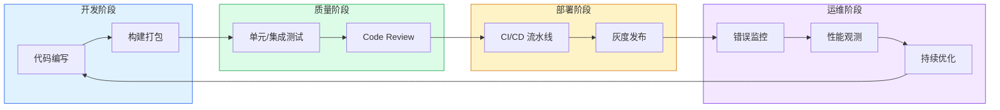

# 🏗️ 工程架构

构建工具、性能优化、测试体系、CI/CD、架构设计 — **资深前端 vs 初中级的分水岭**。共 18 个知识点，覆盖从开发到上线的全链路工程能力。

<DifficultyBadge level="beginner" /> 工具使用经验 · <DifficultyBadge level="intermediate" /> 理解原理与优化策略 · <DifficultyBadge level="advanced" /> 架构设计与工程决策

::: tip 💡 建议
资深前端面试中，工程能力考察比重可达 40%。不仅要会用工具，更要**理解设计取舍和演进逻辑**——为什么从 Webpack 到 Vite？为什么需要 Monorepo？
:::

---

## 🟢 入门（6 个）

掌握这些，你具备标准的前端工程化开发能力。

  <a href="./build-tools-evolution" class="card">
    <h3>构建工具演进 <Badge type="info" text="🔥高频" /></h3>
    
Grunt/Gulp → Webpack → Vite/Turbopack 的发展脉络

  </a>
  <a href="./webpack-core" class="card">
    <h3>Webpack 核心机制 <Badge type="info" text="🔥高频" /></h3>
    
Loader/Plugin、Tree Shaking、Code Splitting、HMR 原理

  </a>
  <a href="./vite-principles" class="card">
    <h3>Vite 原理与 HMR <Badge type="info" text="🔥高频" /></h3>
    
ESM、esbuild 预构建、Rollup 打包、毫秒级 HMR

  </a>
  <a href="./package-managers" class="card">
    <h3>包管理器对比 <Badge type="info" text="⭐中频" /></h3>
    
npm/yarn/pnpm 对比、依赖管理、lock 文件、Monorepo 支持

  </a>
  <a href="./css-engineering" class="card">
    <h3>CSS 工程化方案 <Badge type="info" text="⭐中频" /></h3>
    
CSS Modules、Tailwind CSS、CSS-in-JS、PostCSS 对比

  </a>
  <a href="./git-workflow" class="card">
    <h3>Git 工作流 <Badge type="info" text="⭐中频" /></h3>
    
Git Flow、GitHub Flow、Trunk Based、Commit 规范

  </a>

---

## 🟡 进阶（6 个）

这些是资深前端必备的工程优化能力。

  <a href="./performance-overview" class="card">
    <h3>性能优化全景 <Badge type="info" text="🔥高频" /></h3>
    
Core Web Vitals、RAIL 模型、性能指标测量与优化策略

  </a>
  <a href="./loading-optimization" class="card">
    <h3>加载优化策略 <Badge type="info" text="🔥高频" /></h3>
    
懒加载、预加载/预连接、CDN、HTTP/2/3、资源优先级

  </a>
  <a href="./rendering-optimization" class="card">
    <h3>渲染优化 <Badge type="info" text="🔥高频" /></h3>
    
虚拟列表、时间分片、避免布局抖动、GPU 加速

  </a>
  <a href="./bundle-optimization" class="card">
    <h3>包体积优化 <Badge type="info" text="⭐中频" /></h3>
    
分包策略、Tree Shaking 深度、CDN 外置、按需加载

  </a>
  <a href="./frontend-testing" class="card">
    <h3>前端测试体系 <Badge type="info" text="⭐中频" /></h3>
    
单元测试/组件测试/E2E、Vitest/Playwright/Cypress 选型

  </a>
  <a href="./ci-cd" class="card">
    <h3>CI/CD 搭建 <Badge type="info" text="⭐中频" /></h3>
    
GitHub Actions、自动化部署、环境管理、发布策略

  </a>

---

## 🔴 高级（6 个）

架构级别的工程能力，P7+ 面试的核心考察点。

  <a href="./micro-frontend" class="card">
    <h3>微前端实践 <Badge type="info" text="🔥高频" /></h3>
    
qiankun、Module Federation、Isomorphic Micro Apps、沙箱隔离

  </a>
  <a href="./monorepo" class="card">
    <h3>Monorepo 工程化 <Badge type="info" text="⭐中频" /></h3>
    
Turborepo/Nx/pnpm workspace、依赖管理、构建缓存

  </a>
  <a href="./architecture-design" class="card">
    <h3>前端架构设计 <Badge type="info" text="🔥高频" /></h3>
    
分层架构、领域驱动、模块化、可扩展性设计

  </a>
  <a href="./design-patterns" class="card">
    <h3>设计模式在前端 <Badge type="info" text="⭐中频" /></h3>
    
观察者/发布订阅、工厂、策略、代理模式在前端的应用

  </a>
  <a href="./error-monitoring" class="card">
    <h3>错误监控与可观测性 <Badge type="info" text="⭐中频" /></h3>
    
Sentry、SourceMap、性能监控、日志采集与分析

  </a>
  <a href="./refactoring-strategy" class="card">
    <h3>大型项目重构策略 <Badge type="info" text="⭐中频" /></h3>
    
渐进式重构、Strangler Pattern、代码迁移、质量保障

  </a>

