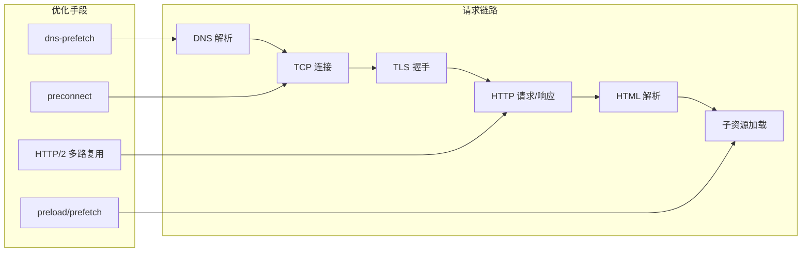
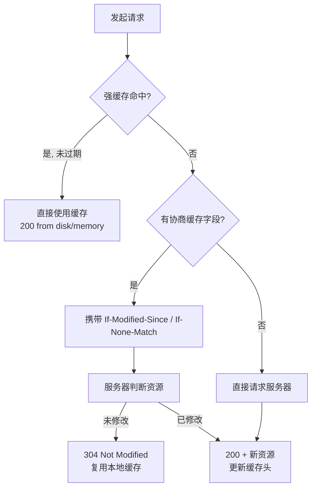

<DifficultyBadge level="intermediate" />

# 加载优化

## 一句话解释

加载优化的本质是**尽可能缩短从"用户输入 URL"到"关键内容呈现"的时间**，手段涵盖网络链路、资源优先级、缓存策略三个层面。

## 加载链路全景

从 DNS 到首屏渲染，每个环节都有对应的优化手段：



> **核心思想**：网络优化做"提前"（预解析、预连接、预加载），缓存优化做"减少"（少发请求、少传数据）。

## DNS 预解析

浏览器解析域名需要经过 DNS 查询（通常 20-120ms），可以提前执行以隐藏这部分耗时。

### dns-prefetch vs preconnect vs preload vs prefetch

| 属性 | 做的事 | 开销 | 适用场景 |
|------|--------|------|---------|
| `dns-prefetch` | 仅解析 DNS | 低 | 所有跨域资源 |
| `preconnect` | DNS + TCP + TLS 握手 | 高 | 首屏关键跨域源 |
| `preload` | 提前下载并缓存当前页资源 | 中 | 首屏必需、CSS 依赖 |
| `prefetch` | 空闲时下载未来页资源 | 低 | 下一跳页面资源 |

```html
<!-- 只会用到 DNS 的源 -->
<link rel="dns-prefetch" href="//static.example.com" />

<!-- 关键资源源：一次性完成连接建立 -->
<link rel="preconnect" href="//fonts.googleapis.com" crossorigin />
```

> **考点**：`preconnect` 只对 HTTPS 生效，且消耗浏览器"空闲连接预算"，**同一页面最多对 4-6 个域名**使用，滥用反而拖慢首屏。

## CDN 加速

CDN 解决两个问题：**物理距离**（就近节点）与 **源站压力**（静态资源卸载）。

- 静态资源（JS/CSS/图片）必须走 CDN，且文件名带内容指纹
- 动态接口走源站，可配合边缘计算（边缘函数）做轻量缓存
- 关键指标：**TTFB** 与 **缓存命中率（Hit Ratio）**

## HTTP/2 与 HTTP/3

### 协议特性对比

| 特性 | HTTP/1.1 | HTTP/2 | HTTP/3 |
|------|----------|--------|--------|
| 传输层 | TCP | TCP | UDP (QUIC) |
| 多路复用 | ❌（队头阻塞） | ✅ 单连接并发 | ✅ 连接间无阻塞 |
| 二进制分帧 | ❌ | ✅ | ✅ |
| 头部压缩 | ❌ | HPACK | QPACK |
| 连接建立 | 慢（多 RTT） | 快 | 0-RTT |
| 服务端推送 | ❌ | ✅（已废弃） | 遵循 HTTP/2 语义 |

> **2026 视角**：HTTP/2 已全面普及，HTTP/3 (QUIC) 在弱网与移动网络下优势明显（0-RTT 握手 + 无队头阻塞），主流 CDN 默认开启。

### HTTP/2 多路复用

多个请求在**单条 TCP 连接**上并发传输，解决了 HTTP/1.1 的"同源 6 连接上限"与队头阻塞：

```javascript
// HTTP/1.1 时代为减少请求数做的优化，HTTP/2 下反而有害
// ❌ 雪碧图合并小图：单图无法独立缓存
// ❌ 小图内联 data URI：加大 HTML 且无法缓存
// ✅ 正确姿势：小文件保持独立，靠多路复用并行加载 + 独立缓存

// "减少请求"的理念没消失，只是从"合并"变成"首屏优先 + 缓存复用"
```

### 服务端推送的兴衰

HTTP/2 Server Push 曾被视为优化利器，但 2022 年起 **Chrome 默认禁用**：

- 无法精确控制缓存，容易推送用户已有缓存的内容
- 与 preload 语义重叠，preload 更可控、缓存友好
- **2026 正确姿势：`103 Early Hints` + preload**，由服务端提前告知浏览器关键资源

## 资源优先级

```html
<!-- preload：声明高优先级，首屏关键资源 -->
<link rel="preload" href="/assets/font.woff2" as="font" type="font/woff2" crossorigin />

<!-- prefetch：低优先级，下一跳导航需要的资源 -->
<link rel="prefetch" href="/assets/next-page.js" as="script" />

<!-- prerender：整个页面预渲染（慎用，开销大） -->
<link rel="prerender" href="https://example.com/next" />
```

| 手段 | 优先级 | 时间点 | 典型场景 |
|------|--------|--------|---------|
| preload | 高 | 立即 | 首屏字体、首屏大图、CSS 依赖 |
| prefetch | 低 | 网络空闲 | 下一页 JS、图片 |
| prerender | 中 | 空闲 | 高概率下一跳页面 |
| preconnect | - | 立即 | 关键第三方源 |

> **考点**：`preload` 是**立即且最高优先级**，滥用会抢占首屏带宽（反让 LCP 资源变慢）；`prefetch` 只在**网络空闲**时执行。优先级从高到低：preload > 普通资源 > prefetch。

## 懒加载

### 图片懒加载

```html
<!-- ❌ 无懒加载：所有图片立即下载 -->


<!-- ✅ 原生懒加载：浏览器自动处理 -->


<!-- ✅ 更精细控制：IntersectionObserver 进入视口才加载 -->

```

```javascript
const io = new IntersectionObserver(entries => {
  entries.forEach(e => {
    if (e.isIntersecting) {
      const img = e.target
      img.src = img.dataset.src
      io.unobserve(img)
    }
  })
})
document.querySelectorAll('.lazy').forEach(el => io.observe(el))
```

> **注意点**：**首屏图片不要 lazy**（会延迟 LCP）；`iframe` 同样支持 `loading="lazy"`。

### 路由懒加载与组件懒加载

```javascript
// 路由级：Vue 3 + Vite
const About = () => import('@/views/About.vue')

// 组件级：React.lazy + Suspense
const HeavyChart = React.lazy(() => import('./HeavyChart'))

// 首屏必须渲染的组件不要 lazy，否则反而增加一次网络往返
```

## 关键 CSS 内联

CSS 是**渲染阻塞**资源。关键 CSS 内联到 HTML，非关键 CSS 异步加载：

```html
<!-- 内联关键 CSS：首屏样式立即可用，不阻塞渲染 -->
<style>
  .header { position: fixed; top: 0; }
</style>

<!-- 非关键 CSS 异步加载：media hack -->
<link rel="stylesheet" href="non-critical.css" media="print" onload="this.media='all'" />
```

> 实现工具：`critical`、`PurgeCSS`。2026 视角：**关键 CSS 抽取与内联在构建期完成**（Vite/Rolldown 插件），运行时无需 JS 参与。

## 字体加载优化

字体是 CLS 的隐形杀手。核心手段是 `font-display` 与子集化。

```css
@font-face {
  font-family: 'MyFont';
  src: url('/fonts/myfont.woff2') format('woff2');
  font-display: swap; /* FOIT → FOUT：先显示后备字体，加载后切换 */
}
```

| font-display | FOIT 隐藏期 | FOUT 后备期 | 适用 |
|--------------|------------|------------|------|
| block | 最长 3s | 无 | 图标字体 |
| swap | 0 | 无限 | 正文/品牌字体 |
| fallback | 0 | 约 3s | 大部分场景 |
| optional | 0 | 极短 | 弱网 |

> 配套优化：`unicode-range` 子集化（只加载用到的字形）、`preload` 字体、`size-adjust` 校准避免字体切换导致布局偏移。

## HTTP 缓存策略

缓存是"少发请求"的核心，分**强缓存**与**协商缓存**两级。



### 两级缓存对比

| 类型 | 响应头 | 触发机制 | 发请求? | 状态码 |
|------|--------|---------|--------|--------|
| 强缓存 | `Cache-Control: max-age=31536000` | 未过期 | ❌ | 200 (from cache) |
| 强缓存 | `Expires`（已废弃） | 未过期 | ❌ | 200 (from cache) |
| 协商缓存 | `ETag` / `If-None-Match` | 强缓存失效 | ✅ | 304 |
| 协商缓存 | `Last-Modified` / `If-Modified-Since` | 强缓存失效 | ✅ | 304 |

```javascript
// ✅ 最佳实践：immutable + 内容指纹，长期强缓存，永不回源
// index.a1b2c3.js → Cache-Control: public, max-age=31536000, immutable
// ❌ 错误：对 HTML 设置长时间强缓存 → 用户永远拿到旧页面
// index.html → Cache-Control: no-cache（每次都协商，内容不变返回 304）
```

> **2026 关键考点**：`immutable` 表示"内容不可变"，配合 **content hash 文件名** 实现"缓存永不失效 + 发版即时生效"——Hash 变 → 新文件名 → 新 URL → 自然绕过旧缓存。

## 面试问法

- 🔥 **dns-prefetch 和 preconnect 的区别？什么时候用哪个？**
  - `dns-prefetch` 只做 DNS 解析，开销最小；`preconnect` 额外做 TCP+TLS 握手，建立完整连接
  - 对每个跨域源先 `dns-prefetch`；对**首屏关键且确认会用的源**才 `preconnect`（有连接预算限制）
  - 例：第三方字体 CDN → preconnect；页面角落才用到的统计域名 → dns-prefetch

- 🔥 **preload 和 prefetch 的区别？**
  - `preload` 立即、高优先级加载当前页面必需资源；`prefetch` 空闲时低优先级加载未来页面资源
  - 选错反而伤性能：preload 滥用抢占首屏带宽；prefetch 应只在网络空闲时用
  - 对应场景：preload 首屏字体/首图，prefetch 下一页 JS

- 🔥 **HTTP/2 多路复用解决了什么问题？它如何影响资源合并策略？**
  - 解决 HTTP/1.1 的连接数限制（同源 6 个）与队头阻塞，单连接并发传输
  - 影响：雪碧图、小图内联等"减少请求"手段收益下降甚至有害（不可缓存、加大 HTML）
  - 现代策略：拆小文件、靠多路复用并行 + 独立缓存 + CDN 指纹

- 🔥 **强缓存与协商缓存的过程，以及如何配合使用？**
  - 强缓存：`Cache-Control: max-age`，未过期不发请求直接命中（浏览器磁盘/内存缓存）
  - 协商缓存：强缓存失效后携带 `If-None-Match`(ETag)/`If-Modified-Since`(Last-Modified)，服务端返回 304 或 200
  - 配合：HTML 用 `no-cache`（协商），带 hash 的静态资源用 `max-age=31536000, immutable`

- ⭐ **关键 CSS 内联的原理？有什么代价？**
  - CSS 默认渲染阻塞，内联进 HTML 让首屏样式立即生效，无需等 CSS 请求返回
  - 代价：增大 HTML 体积、无法独立缓存、构建复杂度上升 → 只内联首屏关键部分
  - 工具：critical、PurgeCSS、Vite critical 插件

- ⭐ **如何优化字体加载？为什么说字体是 CLS 杀手？**
  - `font-display: swap/fallback` 避免 FOIT；`unicode-range` 子集化减小体积；preload 字体
  - CLS 原因：字体切换瞬间新旧字体度量（宽度/高度）不同导致文字重排 → 用 `size-adjust`/`ascent-override` 校准或缩小后备字体差异
  - 终极方案：系统字体栈（`system-ui`）彻底告别网络字体

- ⭐ **懒加载有哪些实现方式？首屏图片为什么不能 lazy？**
  - 图片：原生 `loading="lazy"` 或 IntersectionObserver；路由/组件：动态 import
  - 首屏图片 lazy 会被降级为低优先级 → 延迟 LCP，得不偿失
  - IntersectionObserver 更精细（可控 threshold、预取距离），原生 lazy 简单但行为黑盒

## 💡 AI 辅助学习

> 用这个 Prompt 练加载优化：
> "你是一名前端性能专家。我的首屏情况：LCP 3.8s（首屏是一张大图 + web 字体）、HTML 未内联关键 CSS、引用了 3 个跨域源（字体 CDN、统计、广告）。请给出按优先级排序的优化方案，每项标注：采用的标签/HTTP 头、预期收益、实施成本。"

## 关联知识

- [性能优化全景](/engineering/performance-overview) — Core Web Vitals 与优化决策树
- [渲染优化](/engineering/rendering-optimization) — 首屏渲染与重排重绘
- [包体积优化](/engineering/bundle-optimization) — 体积变小，加载自然更快
- [浏览器渲染原理](/fundamentals/browser-rendering) — 渲染阻塞机制详解
- [Vite 原理](/engineering/vite-principles) — 现代构建工具与预构建
