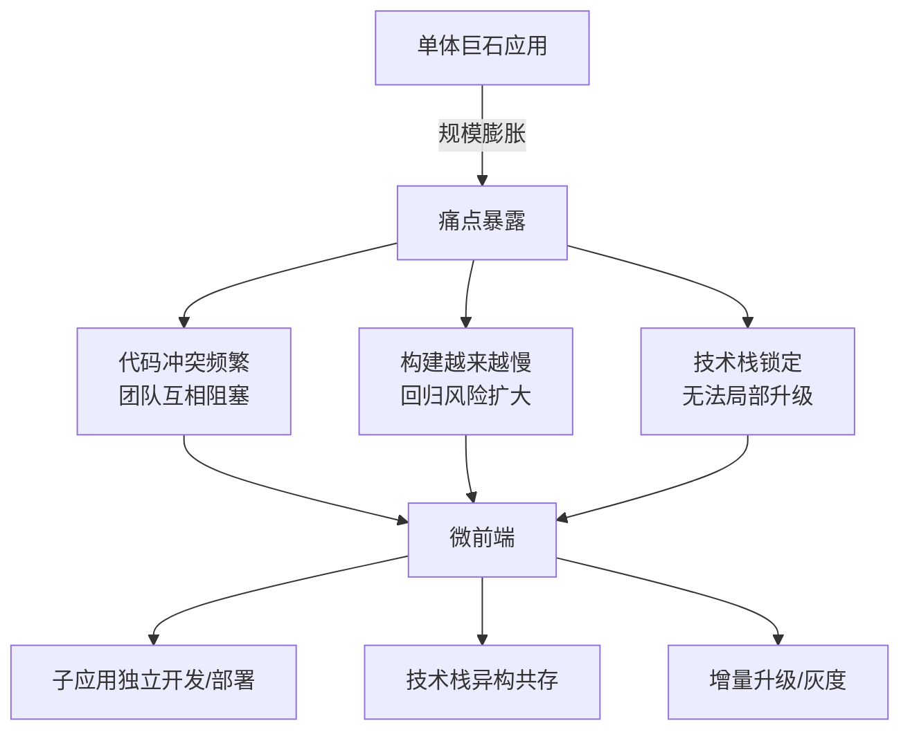
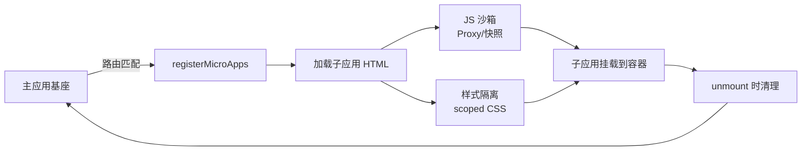
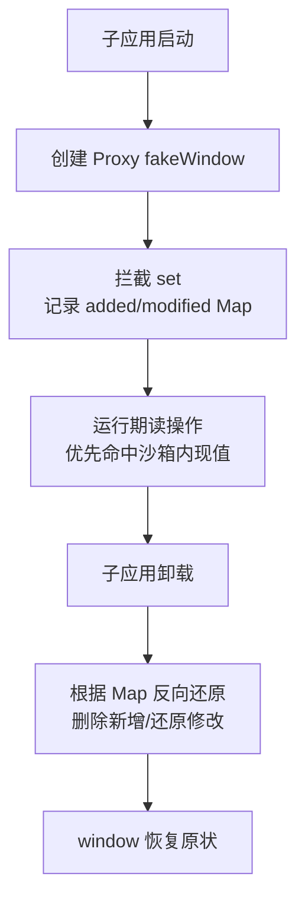
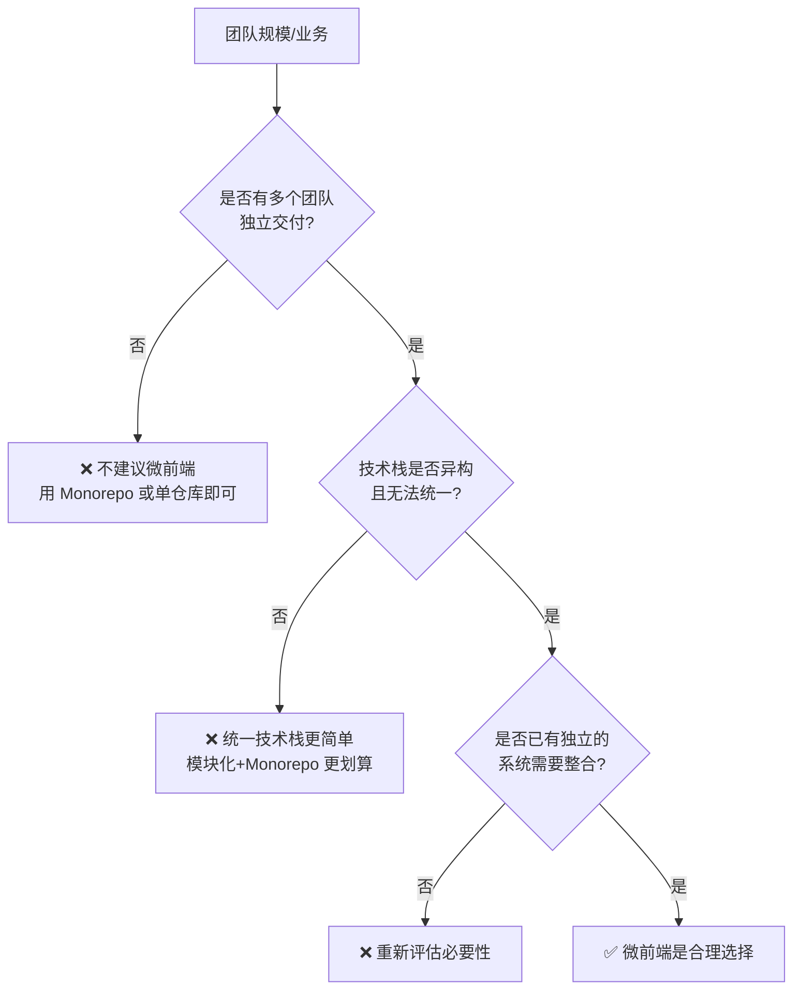

<DifficultyBadge level="advanced" />

# 微前端实践

## 一句话解释

微前端是将**单体前端应用拆分成多个可独立开发、独立部署、独立运行**的小应用的架构模式，由基座（主应用）统一编排与加载，解决大型团队协作与巨石应用难以维护的问题。

## 为什么需要微前端



> 核心矛盾：**组织的复杂度决定了软件的复杂度**。当多个团队同时在一个仓库/一个应用里协作时，微前端本质上是把"发布节奏"与"团队边界"对齐。

## 三大主流方案

### 一、iframe 方案（最原始，基本被淘汰）

**优点**：天然隔离（JS 上下文、DOM、样式完全隔离）、实现成本几乎为零。

**缺点**：

| 问题 | 具体表现 |
|------|---------|
| **通信困难** | 只能靠 `postMessage`，跨域场景双向通信繁琐 |
| **白屏闪烁** | 每次切换重新加载，浏览器刷新/前进后退体验割裂 |
| **无法共享资源** | JS/CSS 无法共享，重复下载，无 keep-alive 复用 |
| **SEO 不友好** | 搜索引擎无法索引 iframe 内容 |
| **布局受限** | iframe 大小难以与主应用自适应联动，弹窗/全屏等交互错位 |

> 结论：iframe 不是微前端的答案，但它的"隔离"思想被后续方案吸收（qiankun 沙箱就模拟了 iframe 的隔离效果而规避了通信/加载问题）。

### 二、qiankun 基座 + 沙箱（当前国内主流）

基座应用 + 路由驱动的子应用加载，核心是**运行时隔离**。



**技术要点**：

1. **JS 沙箱**：见下文专节
2. **样式隔离**：见下文专节
3. **应用通信**：见下文专节
4. **路由系统**：子应用基于主应用下发的前缀（`activeRule`）注册自己的路由
5. **生命周期**：子应用需要导出 `bootstrap / mount / unmount` 三个钩子，由基座统一调用

**特点**：对已有项目改造成本低（只需改造入口与打包配置），**不需要**子应用之间共享依赖即可运行。

### 三、Module Federation（模块联邦，Webpack 5 内置）

**编译期共享 + 运行时加载**，核心是"远程模块"：一个应用可以动态加载另一个构建产物的模块。

```javascript
// webpack.config.js — 主应用（远程引用方）
module.exports = {
  plugins: [
    new ModuleFederationPlugin({
      name: 'shell',
      remotes: {
        remoteApp: 'remoteApp@http://localhost:3001/remoteEntry.js',
      },
    }),
  ],
}

// webpack.config.js — 子应用（远程提供方）
module.exports = {
  plugins: [
    new ModuleFederationPlugin({
      name: 'remoteApp',
      exposes: {
        './Button': './src/Button',
        './store': './src/store',
      },
      shared: { react: { singleton: true }, 'react-dom': { singleton: true } },
    }),
  ],
}
```

```javascript
// 主应用中动态加载远程模块（运行时）
import('remoteApp/Button').then(({ default: RemoteButton }) => {
  // 使用远程 Button，React 依赖通过 shared 复用主应用的实例
})
```

**特点**：

- 支持**依赖共享**（`shared` + `singleton`），React/Vue 运行时只加载一份，体积更优
- 粒度是"模块"而非"应用"，**适合组件/业务模块的复用**，不一定需要独立部署
- 更利于**构建产物级解耦**，与框架无关（但生态多在 Webpack 5 / Rspack）

### 方案对比总表

| 维度 | iframe | qiankun | Module Federation |
|------|--------|---------|-------------------|
| 隔离方式 | 浏览器原生 | JS 沙箱 + scoped CSS | 无隔离（需靠 shared 约定） |
| 通信 | postMessage | 自定义事件/全局 store | 模块导入即共享 |
| 共享依赖 | 不可能 | 需 external 配置 | 原生支持（singleton） |
| 部署独立性 | 高 | 高 | 高 |
| 改造成本 | 极低 | 中 | 中高 |
| 适用场景 | 无（已被淘汰） | 业务系统集成、老项目改造 | 依赖共享、组件级复用、微前端+微服务协作 |

## JS 沙箱原理

### 快照沙箱（SnapshotSandbox）

用在**不支持 Proxy 的老浏览器**（IE），原理是保存和恢复全局 `window` 的属性快照。

```javascript
// 伪代码：激活时还原，失活时保存
class SnapshotSandbox {
  constructor() {
    this.modifiedPropsMap = {}
    this.addedPropsMap = {}
    this.originalPropsMap = {}
  }
  active() {
    // 遍历 window，把子应用运行期间的修改/新增记录并应用
    // 记录 window 上的全局污染（window.a = 1）与新增变量
  }
  inactive() {
    // 恢复 window：删除新增的，还原修改过的
  }
}
```

**缺点**：只能隔离 `window` 上的属性，**无法隔离**函数作用域、闭包；激活/失活要遍历整个 window，开销大；子应用运行期间修改会被"快照"保留。

### Proxy 沙箱（LegacySandbox / ProxySandbox）

现代浏览器用 `Proxy` 拦截 `window` 的**读写操作**，实现真正的"运行期隔离"。

```javascript
// 伪代码：qiankun Proxy 沙箱核心
function createSandbox(globalContext) {
  const addedPropsMap = new Map()   // 运行期间新增
  const modifiedPropsMap = new Map() // 运行期间修改
  const currentUpdatedPropsValueMap = new Map()

  const rawGlobalValueMap = new Map()
  const fakeWindow = new Proxy(globalContext, {
    get(target, key) {
      if (currentUpdatedPropsValueMap.has(key)) {
        return currentUpdatedPropsValueMap.get(key) // 优先返回沙箱内的修改
      }
      return target[key]
    },
    set(target, key, value) {
      if (!(key in target)) {
        addedPropsMap.set(key, value) // 新增属性记录，退出时删除
      } else if (target[key] !== value) {
        modifiedPropsMap.set(key, value) // 修改属性记录，退出时还原
      }
      currentUpdatedPropsValueMap.set(key, value)
      return true
    },
  })
  return { fakeWindow }
}
```

**关键点**：

- **三个 Map 记录差异**：新增（added）、修改（modified）、运行期现值（current），失活时只需反向还原，不需要遍历整个 window，性能远好于快照
- **子应用的 `window` 是 fakeWindow 的 proxy**，读写都被拦截，真正的全局对象不被动到
- 局限：**异步副作用无法完全隔离**，例如 `setTimeout` 回调里访问 `window` 仍可能拿到真实对象；`iframe` 能做的深层隔离（document、fetch 拦截）Proxy 沙箱做不到



## 样式隔离

| 方案 | 原理 | 优点 | 缺点 |
|------|------|------|------|
| **CSS 前缀（BEM/命名空间）** | 约定子应用所有类名加前缀（`.order-app-xxx`） | 零成本、无兼容问题 | 靠约定，易漏，主/子应用交叉污染靠人 |
| **scoped / CSS Modules** | 构建时给类名加 hash（`.order-app[data-v-xxx]`） | 自动化、子应用内部自洽 | 只能隔离子应用内部，无法防御子应用影响主应用之外的全局样式 |
| **Shadow DOM** | 将子应用 DOM 挂到 `attachShadow` 容器下 | 浏览器原生强隔离 | 与很多 UI 库（弹层挂 body）冲突、事件冒泡需 retarget、兼容性风险 |
| **qiankun 默认策略** | `scoped css`（给子应用样式加属性选择器）+ 运行时重写 | 兼顾兼容与自动化 | 动态插入的样式、行内样式、伪类选择器处理不完美 |

> 高频考点：**主应用样式不能污染子应用，子应用样式也不能反过来污染主应用**。qiankun 的做法是进入子应用时给其 `<style>` 统一加上 `[data-qiankun="appname"]` 属性选择器；但 `body {}` 这类全局选择器会被重写，动态插入的样式需要额外处理。

## 应用通信

1. **全局状态 / 共享 store**：主应用提供 `actions`（qiankun 的 `initGlobalState`），子应用订阅与派发
2. **自定义事件**：`window.dispatchEvent` + `window.addEventListener`，解耦、简单，适合低频通知
3. **路由参数**：通过 URL 传递参数（刷新不丢失，但只适合纯参数）
4. **props 下发**：基座 mount 时把 `props`（含主应用能力/API）传给子应用
5. **Module Federation 直接共享**：子应用直接 import 主应用导出的模块/实例

```javascript
// 主应用
import { initGlobalState } from 'qiankun'
const actions = initGlobalState({ user: { id: 1, name: 'Alice' } })
actions.onGlobalStateChange((state, prev) => console.log('changed', state))
actions.setGlobalState({ user: { id: 2, name: 'Bob' } }) // 广播给所有子应用

// 子应用导出
export async function mount(props) {
  props.setGlobalState({ token: 'xxx' })
  props.onGlobalStateChange((state) => render(state.user), true)
}
```

## 2026 视角：wujie（无界）与判断原则

### wujie 无界（腾讯）

用 **Web Components 容器（`<micro-app>` 标签）+ iframe 仅作 JS 运行容器** 的混合方案：

- **JS 隔离**：子应用代码跑在**隐藏 iframe** 里，天然隔离全局作用域，规避 Proxy 沙箱的"异步副作用漏网"问题
- **DOM/样式**：渲染到 Web Component 的 Shadow 下，但通过改造让弹层能挂到正确的层级
- **通信**：提供 `window.$wujie` 桥接，比纯 iframe 的 postMessage 好用得多
- **优势**：真正"隔离更彻底"，且不需要改造成 qiankun 的 `export lifecycle` 那一套，对老项目更友好

### 什么时候**不该**用微前端



**反模式清单**：

- 只有一个团队、一个产品线 → **不要**，Monorepo + 模块化足够
- 团队技术栈一致且可统一 → **不要**，微前端引入的运行期隔离/通信成本是净负担
- 子应用间大量共享状态、频繁互调 → 通信与同步成本爆炸，考虑单体或模块化
- 团队没有工程化基建（CI、监控、版本管理）→ 微前端会让复杂度失控
- 只是为了"炫技"或想一劳永逸 → 微前端**不解决**性能、也不解决架构本质问题

> P7 面试的加分答法：微前端是**组织架构的镜像**，先判断组织的协作模型（Conway's Law），再选方案；能用 Monorepo 解决的不用微前端，能用模块化解决的不用微前端。

## 面试问法

- 🔥 **为什么不用 iframe 做微前端？**
  - 通信只能 postMessage，跨域双向通信繁琐
  - 每次加载重复拉取资源，白屏、刷新体验割裂
  - 无法共享 JS/CSS 依赖，布局与弹窗等交互受限
  - 但 iframe 的"隔离"思想被沙箱方案吸收

- 🔥 **qiankun 的 JS 沙箱有几种？分别怎么实现？**
  - 快照沙箱：激活/失活时保存和恢复 window 属性，遍历开销大，仅用于不支持 Proxy 的老浏览器
  - Proxy 沙箱：拦截 window 读写，用 added/modified/current 三个 Map 记录差异，卸载时反向还原，性能好
  - 局限：异步副作用无法完全隔离，深层隔离需靠 iframe（wujie 思路）

- 🔥 **主应用和子应用样式冲突怎么办？**
  - 方案：CSS 前缀约定 / scoped CSS / CSS Modules / Shadow DOM
  - qiankun 默认：子应用样式注入 `[data-qiankun=appname]` 属性选择器
  - 兜底：动态样式、body 全局样式需额外处理或约定规范

- 🔥 **qiankun 和 Module Federation 怎么选？**
  - qiankun：应用级集成、老项目改造、运行时沙箱隔离，共享依赖要靠 external
  - Module Federation：模块级复用、构建产物级共享，依赖可以 singleton 复用，但不提供沙箱隔离
  - 二者可组合：MF 解决依赖共享，qiankun 解决应用编排

- ⭐ **微前端应用之间如何通信？**
  - initGlobalState 全局状态广播（qiankun）
  - 自定义事件（window.dispatchEvent）
  - props 下发、URL 路由参数
  - Module Federation 直接 import 共享模块

- ⭐ **什么是 wujie 无界，和 qiankun 区别？**
  - wujie 用 Web Components + 隐藏 iframe 做 JS 运行容器，隔离更彻底
  - 不需要改造子应用导出 lifecycle，老项目迁移成本低
  - 通信通过 window.\$wujie 桥接

- ⭐ **什么情况不应该用微前端？**
  - 单团队、技术栈统一 → 用 Monorepo/模块化
  - 子应用高度共享状态、频繁互调 → 通信成本爆炸
  - 没有成熟工程化基建 → 复杂度失控

## 💡 AI 辅助学习

> 用这个 Prompt 让 AI 帮你模拟微前端架构评审：
> "你是一位拥有 10 年经验的前端架构师。当前公司有 3 个后端服务、2 个前端团队（一个用 Vue3，一个用 React 18），都维护在同一个 git 仓库里，代码已经出现严重冲突和构建缓慢。请分别评估 Monorepo、qiankun 微前端、Module Federation 三种方案的利弊与落地成本，并给出推荐。重点说明：团队边界、隔离粒度、构建与部署策略、以及风险。"

## 关联知识

- [Monorepo 工程化](/engineering/monorepo) — 当不需要微前端时的另一种组织方式
- [前端架构设计](/engineering/architecture-design) — 分层、模块化、DDD 的架构基础
- [构建工具演进](/engineering/build-tools-evolution) — Webpack 5 与 Module Federation 的构建体系
- [错误监控与可观测性](/engineering/error-monitoring) — 微前端下的错误采集与跨应用追踪
- [Git 工作流](/engineering/git-workflow) — 多团队协作的分支与发布模型
