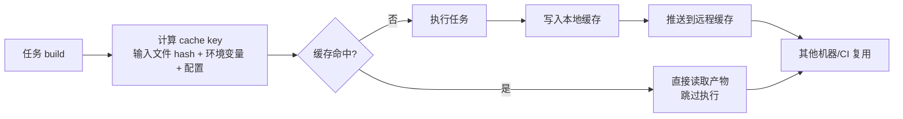
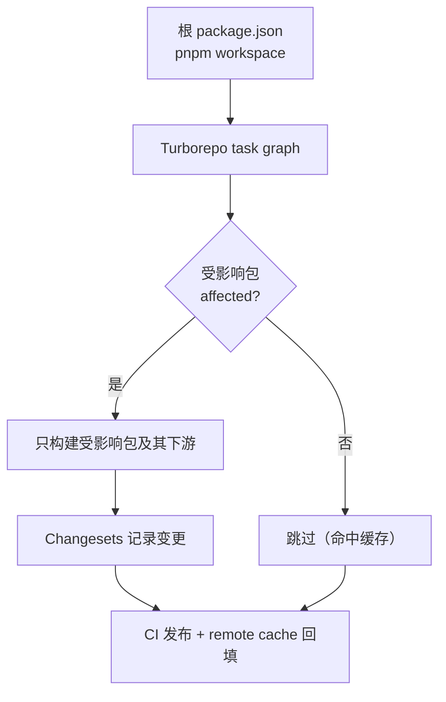

<DifficultyBadge level="advanced" />

# Monorepo 工程化

## 一句话解释

Monorepo 是**把多个项目/包的源码、配置、CI 流程放进同一个仓库**统一管理，配合 workspace 与构建缓存，在"共享代码"与"独立交付"之间找到平衡的工程实践。

## Monorepo vs Multirepo

| 维度 | Monorepo | Multirepo（多仓库） |
|------|----------|---------------------|
| 代码可见性 | 全部团队可见，跨包改代码方便 | 按权限隔离，跨仓库协作要提 PR 到对方仓库 |
| 依赖一致性 | 同一份 lockfile，版本冲突少 | 各仓库独立升级，容易出现版本漂移 |
| 原子提交 | 一次提交可同时修改多个包 | 需要多次提交 + 跨仓库联调发版 |
| 复用与重构 | 重构跨包自动化、安全 | 跨仓库重构靠 copy/paste 或发新版本 |
| 构建与缓存 | 共享缓存、按图增量构建 | 各仓库各自构建，重复劳动 |
| 风险 | 单仓库变大，工具链/权限/CI 需要更强治理 | 生态分散、无法统一管理 |
| 适用 | 强耦合多包、共享公共库、统一技术栈 | 弱耦合、独立团队独立发布、不同技术栈 |

> 一句话记法：**Monorepo 解决"改公共库要跨仓库发布"的痛苦，代价是仓库变大后的治理成本**。2026 年的主流认知是"默认 Monorepo，除非有强理由拆分"。

## 工具链能力对比

| 能力 | pnpm workspace | Turborepo | Nx |
|------|----------------|-----------|-----|
| 依赖安装与提升 | ✅ 核心（符号链接 + 内容寻址存储） | ❌（配合包管理器用） | ✅ |
| 任务编排 / 拓扑排序 | 部分（`--filter` 手动） | ✅ 核心（task graph） | ✅ 核心（project graph） |
| 增量构建缓存 | ❌ | ✅ 本地 + remote cache | ✅ 本地 + remote cache |
| 远程缓存（remote cache） | ❌ | ✅ Vercel 等托管 | ✅ Nx Cloud |
| 代码生成 / 工程化脚手架 | ❌ | 弱 | ✅ generators |
| 图可视化 / 依赖分析 | 弱 | 基础 | ✅ 强（affected 计算） |
| 侵入性 | 低（只管理依赖） | 中（约定 task 配置） | 高（插件化、全量接管） |

> 组合是最常见的：**pnpm 管依赖，Turborepo 管任务与缓存**。Nx 更重，适合需要迁移脚手架/代码生成的团队。

## 依赖管理与依赖提升

### 为什么要"提升"（hoisting）

早期 npm/yarn 的 node_modules 是**嵌套式**的：每个包把依赖装在自己目录下，导致同一依赖被安装多份、目录结构极深（Windows 路径长度问题）、版本冲突。

**扁平化提升**：npm v3 之后把依赖尽量放到顶层 `node_modules`，消除重复。但提升引入了**幽灵依赖（Phantom Dependency）**——你可以 import 一个没在 `package.json` 里声明的包，因为它恰好被提升到了顶层。

### pnpm 的解决方案：内容寻址存储 + 符号链接

```bash
# pnpm 的 node_modules 结构（简版）
node_modules/
  .pnpm/            # 真实文件全部在这里（内容寻址存储，全局共享一份）
  foo@1.0.0/node_modules/...
  bar@1.0.0/node_modules/...
  foo/              # 符号链接 -> .pnpm/foo@1.0.0/node_modules/foo
  bar/              # 符号链接 -> .pnpm/bar@1.0.0/node_modules/bar
```

- **内容寻址存储（Content-addressable store）**：同样的包版本在磁盘只存一份，跨项目共享，安装极快
- **符号链接**：`node_modules/foo` 是指向 `.pnpm` 真实文件的软链；包内部依赖也通过符号链接解析，**未被声明但被提升的包不可见**，杜绝幽灵依赖
- **strict peer deps**：默认严格检查 peer 依赖，减少隐式依赖问题

```bash
# 常见命令
pnpm add -w lodash            # 加到 workspace root
pnpm --filter @app/web add react  # 只给某包加依赖
pnpm --filter ...  --parallel run build
```

### workspace 通配符（pnpm-workspace.yaml）

```yaml
packages:
  - packages/*       # 业务包
  - apps/*           # 应用
  - '!packages/legacy/**'  # 排除历史遗留
```

## 构建缓存与任务编排

### Turborepo 缓存原理

Turborepo 为每个 task 计算**缓存键（cache key）**：由该任务**输入**决定——源码文件内容 hash、依赖的 task 输出、环境变量、配置等。命中缓存则直接复用产物，跳过执行。

```json
// turbo.json
{
  "$schema": "https://turbo.build/schema.json",
  "globalEnv": ["NODE_ENV", "CI"],
  "tasks": {
    "build": {
      "dependsOn": ["^build"],
      "inputs": ["$TURBO_DEFAULT$", "src/**", "!**/*.test.ts"],
      "outputs": ["dist/**"]
    },
    "test": {
      "dependsOn": ["^build"],
      "inputs": ["$TURBO_DEFAULT$", "src/**"],
      "outputs": []
    }
  }
}
```

关键概念：

- **task graph**：`dependsOn: ["^build"]` 表示"依赖我的那些包先 build"，Turborepo 自动做拓扑排序，可并行任务并发执行
- **inputs / outputs**：精确声明什么变了才重新跑、什么产物可被缓存，决定缓存命中率
- **cache key = 输入 hash**，任何输入变化（哪怕注释）都会使 key 变化、缓存失效

### Remote Cache（远程缓存）

```bash
# 本地缓存默认在 node_modules/.cache/turbo
# 远程缓存：Vercel Remote Cache / 自建（如 S3 后端）
npx turbo login  # 或配置环境变量 TURBO_REMOTE_CACHE_* 指向自建服务
npx turbo build
```

**价值**：CI 和本地共享同一份缓存——**开发机跑过一次的构建，CI 直接复用产物**，尤其对 Docker 构建、庞大依赖的项目收益巨大。远程缓存的命中也遵循同一套 cache key，跨环境确定性靠锁定的 lockfile + 输入 hash 保证。



## 版本管理与发布（Changesets）

```bash
pnpm add -D changesets
pnpm changeset init
# 修改代码后：
pnpm changeset           # 交互式选择影响包 + semver 级别（patch/minor/major）
pnpm changeset version   # 更新包版本 + 生成 CHANGELOG
pnpm changeset publish   # 发布到 npm 并打 git tag
```

- **Changesets 把版本号决策延迟到 merge 之后**：PR 里只附 `.changeset/*.md` 描述，避免在 PR 时锁定版本引发冲突
- **语义化版本（SemVer）**：`patch`（修复）、`minor`（新增向后兼容）、`major`（破坏性变更）
- 发布流程常配 `changesets/action` 在 CI 中：合并 PR 自动开一个"发布版本"的 PR

## Monorepo 落地坑

| 坑 | 表现 | 对策 |
|----|------|------|
| **幽灵依赖** | import 未声明的包能成功（被提升） | pnpm 符号链接 + 严格 peer deps + lint 检查 |
| **构建隔离不足** | 某包构建时"意外"用了兄弟包的源码 | 声明完整的 `dependencies`，用 `isolated`/严格 workspace 校验 |
| **循环依赖** | 包 A 依赖 B，B 又依赖 A | 分层架构约束 + 依赖图检测（Nx affected） |
| **版本漂移** | 各包 React 版本不一致 | 统一 `peerDependencies` + 升级策略（`manypkg` 检查） |
| **缓存失效过频** | 微小改动导致大范围重跑 | 精确 `inputs` 白名单，忽略非相关文件 |
| **仓库体积膨胀** | git 克隆越来越慢 | `.gitignore` 掉产物、拆分超大历史（浅克隆/稀疏检出） |
| **权限模型缺失** | 任何人对任何包都能改 | CODEOWNERS 按目录配置 review 职责 |

**构建隔离**是最容易忽略的：Monorepo 里包之间天然能互相 import，如果没约束，隐式依赖会悄悄发生，导致"本地能跑、CI 挂掉"。解决思路是**让每个包在自己的边界内构建**（严格声明依赖），Turborepo/Nx 的 task 依赖就是靠声明的依赖关系而不是"能 import 到"来编排的。

```javascript
// 幽灵依赖检测脚本（CI 里跑）：扫描源码 import，校验是否都在 package.json 声明过
const fs = require('fs')
const path = require('path')
const pkgDir = 'packages'

function scan(dir, declared) {
  const out = []
  for (const f of fs.readdirSync(dir)) {
    const full = path.join(dir, f)
    if (fs.statSync(full).isDirectory()) out.push(...scan(full, declared))
    else if (/\.(ts|js|tsx|jsx)$/.test(f)) {
      const src = fs.readFileSync(full, 'utf8')
      const imports = [...src.matchAll(/(?:from\s+|import\s+)['"]([^.'"][^'"]*)['"]/g)]
      for (const [, m] of imports) {
        if (!declared.has(m)) console.error(`❌ ${full} 使用了未声明的依赖: ${m}`)
      }
    }
  }
  return out
}

for (const pkg of fs.readdirSync(pkgDir)) {
  const { dependencies = {}, peerDependencies = {} } = require(path.join(process.cwd(), pkgDir, pkg, 'package.json'))
  scan(path.join(pkgDir, pkg, 'src'), new Set([...Object.keys(dependencies), ...Object.keys(peerDependencies)]))
}
```

```javascript
// Turborepo 程序化调用（package.json scripts 中跨包并行执行）
// 等价于命令行的 "turbo run build --filter=@org/web"
const { execSync } = require('child_process')
// 只构建被影响的包及其下游（affected），未受影响直接命中缓存
execSync('turbo run build --filter=...[HEAD]', { stdio: 'inherit' })
// --filter=...[HEAD] 表示"依赖了本轮变更的包"，是增量构建的核心语法
```



## 面试问法

- 🔥 **Monorepo 相比多仓库解决了什么问题？**
  - 跨包改代码原子提交、依赖一致性（同一 lockfile）
  - 公共库改造不用先发布再升级
  - 构建缓存与增量构建，CI 更快
  - 代价：仓库变大、权限与 CI 治理成本上升

- 🔥 **pnpm 为什么能避免幽灵依赖？**
  - 真实文件放 `.pnpm` 内容寻址存储，node_modules 顶层只有符号链接
  - 未声明的包不会被提升到可见位置，import 会失败
  - 严格 peer deps 进一步约束隐式依赖

- 🔥 **Turborepo 的缓存是怎么生效的？**
  - 为每个 task 计算 cache key：输入文件 hash + 环境变量 + 依赖 task 输出
  - inputs/outputs 声明决定命中范围，命中则跳过执行直接读产物
  - 本地 + remote cache 共享，CI 复用开发机缓存

- 🔥 **Turborepo 和 Nx 怎么选？**
  - Turborepo：轻量、专注任务编排 + 缓存，配合 pnpm 用
  - Nx：重型、带项目图/代码生成/插件系统，适合需要统一工程化平台的团队
  - 小团队推荐 Turborepo，大组织/多技术栈选 Nx

- ⭐ **Changesets 是怎么工作的？**
  - PR 里写 `.changeset` 描述，合并后再统一 version + publish
  - 延迟版本决策避免 PR 版本冲突，自动生成 CHANGELOG

- ⭐ **Monorepo 里包之间循环依赖怎么处理？**
  - 靠分层架构约束（依赖只能向下），用依赖图工具检测
  - 把公共依赖下沉到 core 层，避免双向耦合

- ⭐ **新项目要不要上 Monorepo？**
  - 有多个包要共享代码/统一管理就值得，单项目单应用可能过度设计
  - 结合团队规模与协作方式判断，避免"为了 Monorepo 而 Monorepo"

## 💡 AI 辅助学习

> 用这个 Prompt 让 AI 帮你设计 Monorepo 治理方案：
> "你是一位资深前端架构师。我们团队有 5 个前端应用（React/Vue 混合）、8 个公共包，计划从多仓库迁移到 pnpm + Turborepo 的 Monorepo。请输出一份迁移方案，包含：仓库目录结构、pnpm-workspace.yaml 与 turbo.json 配置要点、依赖与版本管理策略（Changesets）、CI 流水线设计（GitHub Actions + 远程缓存）、以及幽灵依赖和构建隔离的具体落地检查项。"

## 关联知识

- [微前端实践](/engineering/micro-frontend) — Monorepo 与微前端是两种组织复杂度的方案
- [前端架构设计](/engineering/architecture-design) — 包与模块的边界划分原则
- [构建工具演进](/engineering/build-tools-evolution) — 构建体系与缓存的基础
- [CI/CD 搭建](/engineering/ci-cd) — Monorepo 下 CI 的任务编排与发布
- [Git 工作流](/engineering/git-workflow) — Monorepo 的分支与 CODEOWNERS 治理
