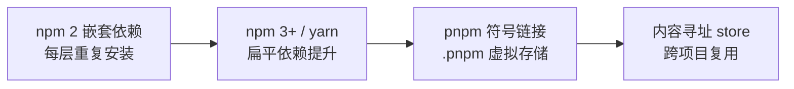
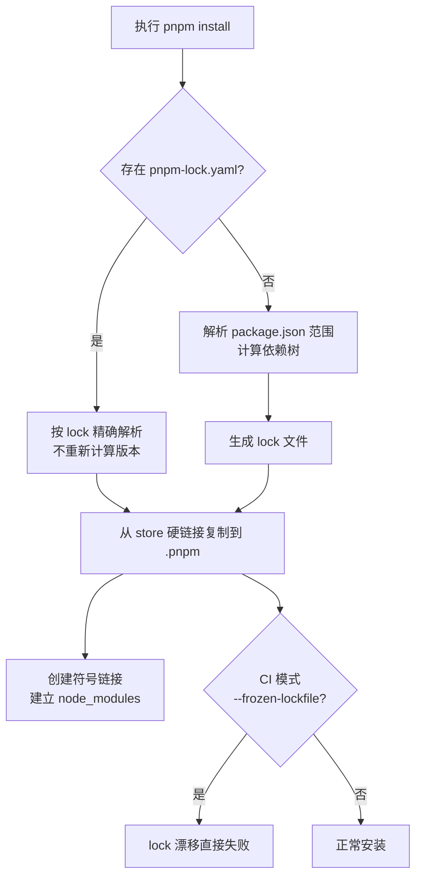

<DifficultyBadge level="medium" />

# 包管理器对比

## 一句话解释

包管理器的本质是解决"**依赖怎么解析、怎么存放、怎么保证可复现**"三个问题——npm 靠扁平化 + lock 文件，yarn 靠更快安装与锁定机制，pnpm 用内容寻址存储 + 符号链接实现了**省空间、快安装、无幽灵依赖**。

## node_modules 结构演进



| 结构 | 代表 | 优点 | 缺点 |
|------|------|------|------|
| **嵌套结构** | npm 2 | 每个包自带完整依赖，逻辑隔离 | 磁盘爆炸、安装慢、路径超长 |
| **扁平结构** | npm 3+ / yarn | 依赖提升到顶层，省空间 | **幽灵依赖**、版本冲突靠提升顺序 |
| **符号链接结构** | pnpm | 硬链接复用 store、不可访问未声明依赖 | 少数工具不兼容（如 file: 协议） |

```bash
# ❌ 嵌套结构（npm 2）—— 依赖重复安装
node_modules/
  a/
    node_modules/
      b/
        node_modules/
          c/   # c 被重复安装多份

# ✅ 扁平结构（npm 3+）—— 依赖提升，但有幽灵依赖风险
node_modules/
  a/
  b/
  c/

# ✅ pnpm —— 虚拟存储 + 硬链接
node_modules/
  .pnpm/          # 所有包的真实文件（硬链接自全局 store）
  a/              # 符号链接 → .pnpm/a@1.0.0/node_modules/a
```

## npm / yarn / pnpm 核心差异

| 维度 | npm | Yarn Classic | pnpm |
|------|-----|-------------|------|
| **安装速度** | 较慢（串行） | 快（并行） | **最快**（硬链接 + 并行） |
| **存储结构** | 扁平提升 | 扁平提升 | 内容寻址 store + 链接 |
| **磁盘占用** | 高（重复） | 高（重复） | **最低**（全局复用一份） |
| **幽灵依赖** | 有 | 有 | **没有**（严格隔离） |
| **lock 文件** | package-lock.json | yarn.lock | pnpm-lock.yaml |
| **Monorepo** | workspaces（一般） | workspaces | **最佳**（内置 workspace 协议） |
| **安全** | 中 | 中 | 高（未声明依赖不可访问） |

> 面试记忆点：**pnpm 的"非扁平结构"才是关键**——它把依赖放进 `.pnpm` 虚拟存储，node_modules 下只有声明的依赖 + 符号链接，所以 `require` 不到未声明的包（幽灵依赖被"物理"消灭）。

## lock 文件机制

lock 文件的目标是**可复现构建**：锁定每个依赖的精确版本和完整依赖树，保证不同机器/时间安装结果一致。



```yaml
# pnpm-lock.yaml（节选）—— 锁定精确版本与解析规则
lockfileVersion: '9.0'
settings:
  autoInstallPeers: true
importers:
  .:
    dependencies:
      vue:
        specifier: ^3.4.0
        version: 3.4.31
packages:
  vue@3.4.31:
    resolution: { integrity: sha512-xxx }
```

| 问题 | package-lock.json（npm） | yarn.lock（yarn） | pnpm-lock.yaml（pnpm） |
|------|------------------------|-------------------|------------------------|
| **格式** | JSON | 自定义文本 | YAML |
| **记录什么** | 版本 + 依赖树 + integrity | 版本 + 依赖树 | 版本 + 依赖树 + workspace |
| **手动修改** | 不推荐 | 不推荐 | 不推荐 |
| **是否进版本库** | ✅ 必须提交 | ✅ 必须提交 | ✅ 必须提交 |

```bash
# ✅ 正确做法：lock 文件进版本库，团队安装保持一致
git add package-lock.json  # 或 yarn.lock / pnpm-lock.yaml

# ❌ 错误做法：手动改 package.json 版本后不更新 lock
npm install   # 与 lock 冲突时会报 ERESOLVE 或悄悄改变
npm ci        # ✅ 严格按 lock 安装（CI 用这个，不用 install）
```

> 记忆点：**lock 文件保证"确定性（deterministic）"**。CI 里应该用 `npm ci` / `pnpm install --frozen-lockfile`，任何 lock 漂移直接失败，而不是"重新解析"。

## 幽灵依赖问题

**幽灵依赖（Phantom Dependencies）**：代码 import 了没有在 `package.json` 里声明的包，但因为扁平提升恰好"碰巧存在"。

```javascript
// ❌ 幽灵依赖：没有在 package.json 声明，却 require 了
const lodash = require('lodash') // 只在 node_modules 顶层恰好存在

// ✅ 正确做法：先声明再使用
// "dependencies": { "lodash": "^4.17.21" }
```

**为什么危险**：提升顺序变化、npm 版本升级、某个包不再依赖它，都会导致 `require` 直接报 `MODULE_NOT_FOUND`，且**线上才炸**。pnpm 通过符号链接结构在机制上杜绝了这个问题——每个包只能访问自己声明的依赖。

## pnpm 工作目录结构详解

理解 pnpm 的目录结构是面试高频细节：

```bash
# ✅ pnpm 的 node_modules 布局
node_modules/
  .pnpm/                       # 虚拟存储：所有包的真实文件（硬链接）
    lodash@4.17.21/
      node_modules/lodash/     # 真实文件
    react@18.3.1/
      node_modules/react/
  lodash/                      # 符号链接 → .pnpm/lodash@4.17.21/node_modules/lodash
  react/                       # 符号链接 → .pnpm/react@18.3.1/node_modules/react

# ✅ 全局内容寻址存储（macOS 默认）
~/Library/pnpm/store/v3/       # 所有项目共享，硬链接复制，省磁盘
```

| 概念 | 说明 | 解决的问题 |
|------|------|-----------|
| **store** | 全局内容寻址存储（按内容 hash 命名） | 跨项目只存一份 |
| **硬链接** | store 与 `.pnpm` 之间 | 复制快、不占额外磁盘 |
| **符号链接** | `.pnpm` 与顶层 `node_modules` 之间 | 只暴露声明的依赖 |
| **workspace 链接** | `workspace:*` 指向本地包 | monorepo 本地开发热链 |

> 硬链接 vs 符号链接：**硬链接是"同一份文件的另一个名字"**（占位几乎为零、删除一边不影响另一边数据）；**符号链接是"指向别处的快捷方式"**（指向 store 中的文件）。pnpm 两者都用：真实内容在 store，`.pnpm` 用硬链接，顶层用符号链接。

## Monorepo 支持

```yaml
# pnpm-workspace.yaml —— 定义 workspace
packages:
  - 'packages/*'
  - 'apps/*'
```

```bash
# ✅ pnpm workspace 原生支持（无需额外工具）
pnpm -F @app/web add @pkg/shared   # 向指定包添加依赖
pnpm install                        # 一键安装所有 workspace 依赖

# ✅ 本地包之间用 workspace:* 协议
# packages/shared/package.json
# { "name": "@pkg/shared", "version": "1.0.0" }
# apps/web 里： "@pkg/shared": "workspace:*"
```

| 能力 | npm workspaces | pnpm workspace |
|------|---------------|----------------|
| 链接本地包 | ✅ | ✅ |
| 一次性安装 | ✅ | ✅（并行 + 去重更优） |
| 过滤安装（只装某个包） | ❌ | ✅ `--filter` |
| 依赖去重 | 一般 | ✅ 硬链接共享 |
| 严格隔离 | ❌ | ✅ |

> 结合 [Monorepo 工程化](/engineering/monorepo) 一起看：pnpm 的符号链接结构天然适配 monorepo——**每个 workspace 包只看到自己的依赖，不存在跨包幽灵依赖**，配合 Turborepo 的缓存可以做极速 monorepo 构建。

## 面试问法

- 🔥 **pnpm 相比 npm 有什么优势？**
  - 三点：① **省空间**——内容寻址 store，所有项目硬链接共享一份包文件；② **快**——并行下载 + 硬链接复制，安装快；③ **安全**——符号链接隔离，消灭幽灵依赖，包只能访问自己声明的依赖。额外：Monorepo 支持最好，`--filter` 精准安装。常见追问：**为什么不直接用扁平结构？** 答幽灵依赖 + 依赖提升冲突。

- 🔥 **什么是幽灵依赖？怎么解决？**
  - 幽灵依赖 = 代码引用了 `package.json` 未声明的包，靠扁平提升"碰巧存在"。危害：npm 升级/依赖变更后提升顺序变化，线上 `MODULE_NOT_FOUND` 崩溃。解决：① 用 pnpm 从结构上禁止；② ESLint 的 `import/no-extraneous-dependencies` 拦截；③ 定期用工具扫描未声明依赖；④ lock 文件 + CI 严格校验。

- 🔥 **lock 文件是干嘛的？CI 里用 install 还是 ci？**
  - lock 文件锁定每个依赖的精确版本与依赖树，保证**可复现安装**，必须提交进版本库。CI 必须用 `npm ci`（或 `pnpm install --frozen-lockfile`）——严格按 lock 安装、删除 node_modules 重建、lock 与 package.json 不一致直接失败；用 `npm install` 会重新解析并可能悄悄改变依赖，违背可复现原则。

- ⭐ **yarn 和 npm 的主要区别？现在还用吗？**
  - 历史上 yarn 领先：离线缓存、并行安装、yarn.lock（比 package-lock 早）、更好的依赖解析。npm 5 后追赶（package-lock、离线缓存），两者功能已趋同。2026 视角：**新项目通常选 pnpm**（省空间 + 安全 + monorepo），yarn 的 Berry 版（Yarn 4）用 `.yarn/cache` + PnP 模式也值得一提——零 node_modules、更快，但兼容性要求高。面试答"npm/yarn 差别不大了，重点对比 npm 与 pnpm"即可。

- ⭐ **npm install 和 npm ci 的区别？**
  - `npm install` 依据 package.json + lock 重新解析，可能更新 lock；`npm ci` 严格按 lock 安装，**不会改动 lock、不会解析新版本**，且先清空 node_modules，速度更稳定。本地日常用 install，CI/发布必须用 ci。pnpm 对应 `pnpm install --frozen-lockfile`（CI 标准用法）。

- ⭐ **为什么要升级 npm 到 pnpm 时注意兼容性问题？**
  - 因为 pnpm 的非扁平结构改变了**文件系统布局**：依赖不在顶层、符号链接不可解析到未声明包。可能踩坑：① 构建工具若硬编码读取 node_modules 顶层（如某些老 webpack 配置）；② `file:` 协议、Electron/native 模块、部分脚本工具；③ postinstall 脚本里访问兄弟依赖。对策：升级前用 `pnpm import` 迁移 lock、跑通测试、必要时用 `shamefully-hoist` 或 `public-hoist-pattern` 白名单。

## 💡 AI 辅助学习

> 用这个 Prompt 让 AI 帮你诊断依赖问题：
> "我收到一个线上报错 `Cannot find module 'lodash'`，但本地开发正常。项目之前用 npm 装过、包在 package.json 里没有声明 lodash。请：1) 分析这种'幽灵依赖'问题在哪些情况下必然发生；2) 给出排查步骤（检查 lock、node_modules 结构、提升顺序）；3) 给出迁移到 pnpm 的 checklist（含 gitignore、lock 文件、CI 命令改动、已知兼容性坑）。请用中文。"

## 关联知识

- [Monorepo 工程化](/engineering/monorepo) — pnpm workspace + Turborepo 组合
- [构建工具演进](/engineering/build-tools-evolution) — 依赖解析在构建链中的位置
- [CI/CD 搭建](/engineering/ci-cd) — lock 文件与可复现构建
- [构建工具演进](/engineering/webpack-core) — node_modules 结构与 resolve 配置
- [前端测试体系](/engineering/frontend-testing) — 依赖管理与测试环境复现
