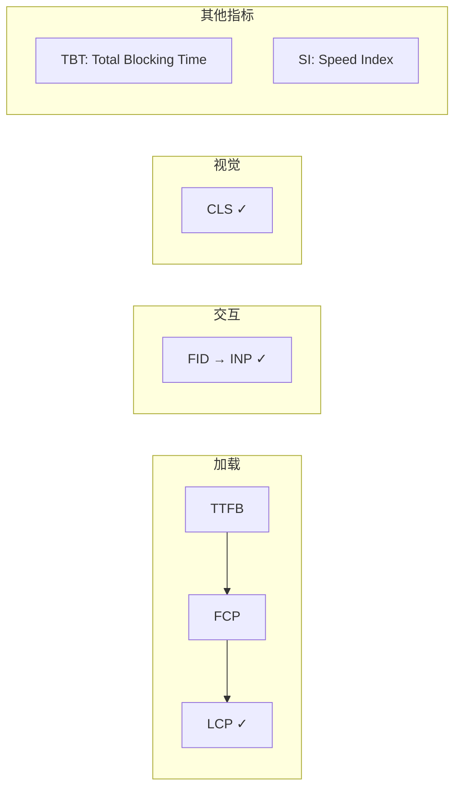
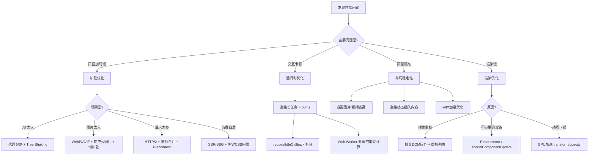
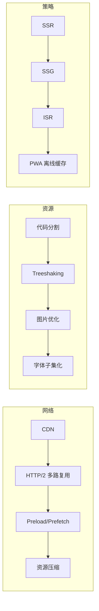
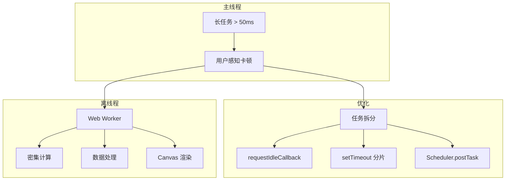

<DifficultyBadge level="intermediate" />

# 性能优化全景

## 一句话解释

前端性能优化的目标是在**网络加载、渲染速度、运行时流畅度**三个维度上，为用户提供最佳的体验。

## Core Web Vitals（核心网页指标）

Google 定义的三个核心指标，直接影响 SEO 排名：

### 指标总览

| 指标 | 全称 | 衡量什么 | 良好 | 需改善 | 差 |
|------|------|---------|------|--------|-----|
| **LCP** | Largest Contentful Paint | 最大内容绘制（加载速度） | ≤2.5s | ≤4.0s | >4.0s |
| **FID** | First Input Delay | 首次输入延迟（交互响应） | ≤100ms | ≤300ms | >300ms |
| **CLS** | Cumulative Layout Shift | 累计布局偏移（视觉稳定性） | ≤0.1 | ≤0.25 | >0.25 |

### INP 即将替代 FID

> 2024 年 3 月起，**INP (Interaction to Next Paint)** 正式替代 FID 成为 Core Web Vital。INP 衡量的是**页面所有交互的延迟**，而非仅首次。



## 性能优化决策树

看完指标后，怎么知道从哪下手？



## 四大优化领域

### 一、加载优化



#### 加载优化清单

| 优化项 | 影响指标 | 难度 | 收益 |
|--------|---------|------|------|
| CDN 加速静态资源 | TTFB, LCP | 低 | ⭐⭐⭐⭐⭐ |
| 图片 WebP/AVIF 格式 | LCP | 低 | ⭐⭐⭐⭐ |
| 关键 CSS 内联 | FCP, LCP | 中 | ⭐⭐⭐⭐ |
| 代码分割 + 懒加载 | LCP, TBT | 中 | ⭐⭐⭐⭐ |
| Preconnect + Preload | LCP | 低 | ⭐⭐⭐ |
| SSR/SSG | LCP, FCP | 高 | ⭐⭐⭐⭐⭐ |
| Service Worker 缓存 | 所有加载指标 | 中 | ⭐⭐⭐⭐ |

### 二、渲染优化

```javascript
// ❌ 频繁触发重排
const ul = document.getElementById('list')
for (let i = 0; i < 1000; i++) {
  ul.style.height = i + 'px'  // 每次循环都触发重排
  ul.appendChild(document.createElement('li'))  // 又触发
}

// ✅ 批量操作 + 虚拟 DOM
const fragment = document.createDocumentFragment()
for (let i = 0; i < 1000; i++) {
  const li = document.createElement('li')
  li.textContent = `Item ${i}`
  fragment.appendChild(li)
}
ul.appendChild(fragment)  // 一次重排
ul.style.height = '1000px'  // 一次重排
```

#### 强制同步布局（Forced Synchronous Layout）

```javascript
// ❌ 读到旧值 → 强制回流
element.style.width = '200px'
console.log(element.offsetHeight)  // 浏览器被迫立即回流

// ✅ 先读、再写
const height = element.offsetHeight
element.style.width = '200px'
element.style.height = height + 'px'
```

### 三、布局稳定性

布局偏移（CLS）是 Core Web Vitals 之一，直接影响用户体验和 SEO 排名。

```javascript
// ❌ 无尺寸图片：加载后撑开页面，导致后续内容下跳


// ✅ 显式设置宽高比，预留空间


// ✅ 或者用 CSS aspect-ratio
.card-image {
  aspect-ratio: 16 / 9;
  width: 100%;
  height: auto;
}
```

#### 常见 CLS 优化手段

| 优化项 | 说明 | 影响程度 |
|--------|------|---------|
| **设置图片/视频宽高** | 预留占位空间，避免加载后撑开页面 | ⭐⭐⭐⭐⭐ |
| **font-display: swap** | 文字后备字体先显示，避免 FOIT/布局跳动 | ⭐⭐⭐⭐ |
| **避免动态插入内容** | 不要在已有内容上方插入 DOM（如广告） | ⭐⭐⭐⭐⭐ |
| **使用 transform 做动画** | transform 只触发合成，不触发布局变化 | ⭐⭐⭐ |
| **预分配广告位/嵌入位** | 为第三方内容预留固定尺寸容器 | ⭐⭐⭐⭐ |

> **CLS ≤ 0.1** 才算良好。一个常见的"隐形杀手"是**字体加载**——无后备字体或后备字体尺寸差异大，会在字体切换时产生明显的布局偏移。

### 四、运行时优化



## 衡量工具

| 工具 | 用途 | 使用场景 |
|------|------|---------|
| **Lighthouse** | 自动化审计报告 | CI 流程、定期检查 |
| **Chrome DevTools Performance** | 录制分析运行时性能 | 定位卡顿原因 |
| **Web Vitals Library** | 真实用户指标采集 | RUM 监控 |
| **BundlePhobia** | 分析 npm 包体积 | 引入新依赖前检查 |

## 面试问法

- 🔥 **从输入 URL 到页面展示，性能优化可以在哪些环节做？**
  - DNS 预解析 → CDN → HTTP/2 → 资源压缩 → 关键 CSS 内联 → 图片优化 → 代码分割 → 缓存策略 → SSR
  - 回答时要分阶段：网络层面 → 资源加载 → 渲染过程 → 运行时
  
- 🔥 **LCP 优化有哪些手段？**
  - 确保最大元素（通常是大图/大标题）快速渲染
  - 优化图片：压缩、WebP、Preload、合适尺寸
  - 优化字体：font-display: swap、字体子集化
  - 减少首屏阻塞资源：内联关键 CSS、defer JS
  
- ⭐ **什么是 RAIL 模型？**
  - Response: 响应 < 100ms
  - Animation: 帧 < 16ms (60fps)
  - Idle: 利用空闲时间处理延迟任务
  - Load: 首屏加载 < 5s

- ⭐ **TBT 和 FID 的关系？**
  - TBT (Total Blocking Time) 是**实验室指标**，衡量主线程被长任务阻塞的总时间
  - FID/INP 是**真实用户指标**，衡量用户实际感受到的交互延迟
  - 关系：TBT 越低，FID/INP 通常越好

## 💡 AI 辅助学习

> 用这个 Prompt 让 AI 帮你诊断性能问题：
> "你是一个前端性能优化专家。我给你 Lighthouse 报告的关键数据（LCP: 4.2s, TBT: 350ms, CLS: 0.3），请分析问题根因并列出优先级排序的优化方案，每个方案标注预期收益和实施难度。"

## 关联知识

- [加载优化策略](/engineering/loading-optimization) — 代码分割、图片优化、缓存策略详解
- [渲染优化](/engineering/rendering-optimization) — 重排重绘、虚拟列表、GPU 加速
- [包体积优化](/engineering/bundle-optimization) — Tree Shaking、分包策略、动态导入
