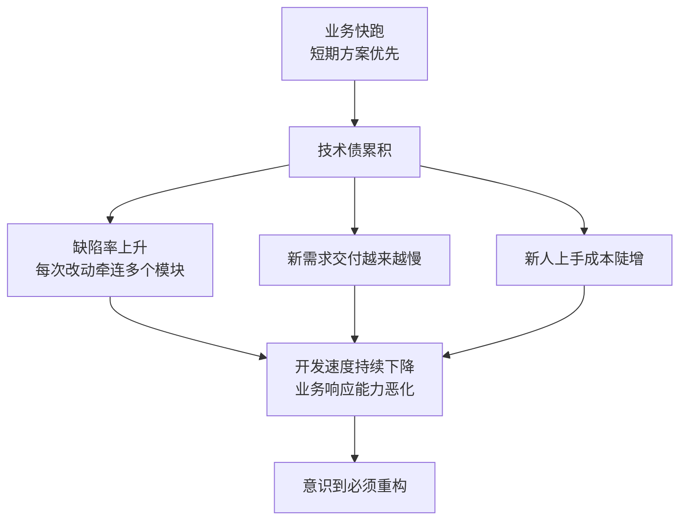
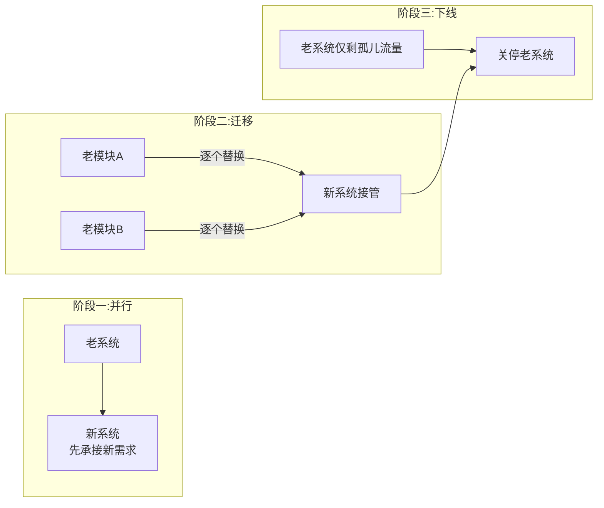
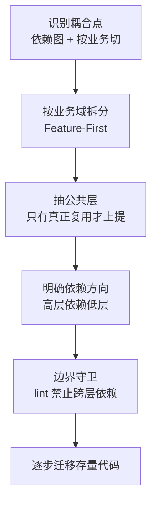

<DifficultyBadge level="advanced" />

# 大型项目重构策略

## 一句话解释

大型项目重构不是"推倒重来"，而是**在业务继续跑、风险可控的前提下，用渐进式手段（绞杀者模式）持续偿还技术债**，最终让系统的可维护性跟上业务速度。

## 为什么要重构（技术债）

技术债 = 为了短期交付速度而欠下的长期维护成本。**重构是给技术债付息/还本**。



**技术债的典型来源**：

| 来源 | 表现 |
|------|------|
| 需求赶工、绕过架构约束 | 组件里塞逻辑、到处全局变量 |
| 人手不足 / 多人乱改 | 重复代码、职责不清、命名混乱 |
| 技术栈老化 | 老框架停更、构建工具旧、无法利用新能力 |
| 文档缺失 / 人员流动 | 没人敢改的"黑箱"模块 |
| 测试缺失 | 改动没有安全网，回归靠手点 |

## Strangler Pattern（绞杀者模式）

**核心思想**：像藤蔓逐渐绞杀老树——**新功能用新架构做，老功能逐个迁移，最终替换掉整个老系统**，全程系统保持可用。



**落地的三个抓手**：

1. **路由/网关层拦截**：把部分 URL 的流量切到新应用（如 `/checkout/**` 走新结算系统），灰度比例逐步放大
2. **功能开关（Feature Flag）**：同一功能新旧实现并存，用 flag 控制切换，出问题秒回滚
3. **数据适配层**：新旧系统过渡期共用一套数据，通过适配器/同步机制保证一致性

> 面试加分：Strangler 的核心价值是"**切换不是一次性事件，而是可回滚的灰度过程**"，所以它要求新旧系统边界清晰、能共存。

## 重构时机与风险控制

### 什么时候该重构 vs 不该

| 该重构的信号 | 不该重构的信号 |
|-------------|---------------|
| 缺陷率持续上升、交付周期拉长 | 业务模式即将巨变，代码可能整体废弃 |
| 同一段逻辑散落多处、改不动 | 没有足够测试与监控，风险无安全网 |
| 技术栈停更、安全漏洞无法修复 | 核心团队流失、代码无人能评审 |
| 新需求被旧架构反复阻塞 | 纯为"技术洁癖"重构、无业务价值背书 |

### 风险控制清单

- **先建安全网**：重构前补充关键路径的单元/组件/E2E 测试，监控（错误率/性能）先上线
- **小步走**：每次 PR 只做"行为不变"的机械重构（改名、提取函数），行为变更单独一次
- **评审护航**：重构 PR 必须 review，且可运行的 smoke 流程保证核心链路可用
- **可回滚**：每次迁移对应一个可独立回滚的发布；Feature Flag 是回滚的保险
- **量化反馈**：用错误率、测试覆盖率、构建时长、交付周期跟踪重构是否"见效"

## 模块拆分策略

拆分的核心依据是**依赖与内聚**，而不是文件数量：



- **由外向内拆**：先拆页面/入口，再拆公共组件、业务逻辑、数据访问层
- **先定边界再搬代码**：画出模块边界（哪些属于这个业务域），再机械搬迁，避免边搬边重构
- **不要过度抽象**：抽公共层前先问"是否真被两处以上复用"，否则是"提前抽象"的坏味道
- **依赖方向唯一**：用 eslint 的 `import/no-restricted-paths` 等规则强制，让边界不靠自觉

## 代码迁移（老框架 → 新框架）

### Vue2 → Vue3 / React 16 → 18 通用策略

| 步骤 | 做法 |
|------|------|
| 1. 依赖升级前置 | 先把依赖升级到兼容新框架的版本，逐步逼近 |
| 2. 运行时兼容层 | Vue2.7 / React 17 过渡版本同时支持新旧特性，分批改 |
| 3. 渐进混装 | 微前端 / 组件级混装，新页面用新框架，老页面留在旧框架 |
| 4. 逐模块替换 | 每个模块替换后跑完整回归 + 灰度 |
| 5. 老代码下线 | 最后清理旧框架运行时与死代码 |

```javascript
// Vue2 → Vue3 迁移示例：Composition API 与 Options API 在同一项目共存期
import { defineComponent, ref, onMounted } from 'vue'
// 新代码用 Composition API
export default defineComponent({
  setup() {
    const users = ref([])
    onMounted(async () => { users.value = await api.getUsers() })
    return { users }
  },
})
// 老代码继续用 Options API，两者在 Vue3 中可共存，逐文件迁移
```

**迁移原则**：

- **行为等价优先**：先"照搬语义"迁移，别顺手重构逻辑，减少排错变量
- **测试先行**：迁移一个模块先锁定它的行为（测试/快照），迁移后对比
- **监控护航**：灰度期间盯错误率与性能，异常立即回滚
- **迁移顺序**：先低风险高价值（纯展示组件），再业务复杂模块，最后入口与全局

## 质量保障

重构最大的风险是"行为悄悄变了"，质量保障围绕"行为不变"展开：

| 手段 | 作用 |
|------|------|
| **测试金字塔** | 重构前补齐核心逻辑单元测试，给机械重构兜底 |
| **特性开关/灰度** | 新老实现并存，逐步放量，出问题可秒回滚 |
| **代码评审** | 每个重构 PR 明确标注"行为不变"，评审聚焦"是否等价" |
| **监控基线** | 重构前记录错误率/性能基线，重构后对比是否劣化 |
| **冒烟测试** | 核心用户路径（登录/下单/支付）在每次发版前验证 |
| **对拍测试** | 新旧实现输入相同、输出对比，自动化发现差异 |

```javascript
// 对拍测试：同一输入跑新旧实现，断言输出一致
test('重构后 getPrice 与旧实现等价', () => {
  const inputs = fixtures.prices // 一组代表性用例
  for (const input of inputs) {
    expect(newGetPrice(input)).toEqual(legacyGetPrice(input))
  }
})
```

```javascript
// 特性开关：新旧实现并存，用 flag 逐步放量，出问题秒回滚
const featureFlags = {
  newCheckout: getFlag('checkout.v2', { default: false, env: process.env.CHECKOUT_V2 === '1' }),
}
function CheckoutPage() {
  if (featureFlags.newCheckout) return <NewCheckout /> // 新结算，先给小流量
  return <LegacyCheckout /> // 老结算，兜底切换
}
```

### 重构反模式（踩过的坑）

| 反模式 | 后果 | 正确做法 |
|--------|------|---------|
| **大爆炸重构**（一次 PR 重写整个模块） | 无法评审、无法回滚、风险不可控 | Strangler 渐进替换，每次只动一小块 |
| **边迁移边改逻辑** | 出问题分不清是迁移还是改逻辑 | 先行为等价迁移，逻辑优化单独一次 |
| **无测试硬重构** | 行为漂移无人发现 | 先建安全网再动手 |
| **为重构而重构** | 代码换汤不换药、浪费成本 | 绑定一个明确的业务价值 |
| **过度抽象** | 抽象层反而增加理解成本 | 抽公共层前确认真的多处复用 |
| **忽略文档与交接** | 重构完没人会维护新结构 | 同步更新 README/架构说明 |

## 如何向业务方解释重构价值

业务方听不懂"技术债""架构"，要翻译成**他们关心的语言**：

| 技术语言 | 业务语言 |
|---------|---------|
| "重构支付模块，消除重复代码" | "以后改支付规则从 2 周缩短到 2 天" |
| "升级过时的技术栈" | "修复长期存在的安全风险，避免被攻击" |
| "补充测试，建立安全网" | "改功能不会再频繁引入线上 Bug，减少客诉" |
| "拆分巨石模块" | "多个团队可以并行开发，不再互相等" |
| "优化构建与部署" | "新功能上线更快，抢占市场时机" |

**沟通要点**：

1. **绑定业务目标**：重构必须与一个业务诉求绑定（更快的交付、更低的线上故障、新功能落地），而不是"顺手"
2. **给出量化预期**：当前痛点数字（上线延期 X 次、线上 Bug Y 个）→ 重构后目标
3. **不追求一次到位**：说明这是"渐进式、不停机、可回滚"，降低业务方对风险的恐惧
4. **用数据证明成效**：重构后用交付周期/缺陷率/发布频率的数据闭环，争取持续投入

## 面试问法

- 🔥 **什么是绞杀者模式（Strangler Pattern）？怎么落地？**
  - 新功能用新架构，老功能逐个迁移替换，全程不停机
  - 抓手：路由网关分流、Feature Flag、数据适配层
  - 核心价值：切换是可回滚的灰度过程

- 🔥 **重构前需要做哪些准备？**
  - 先建安全网：补测试、上监控（错误率/性能基线）
  - 明确边界：画出模块依赖，机械搬迁与行为重构分开
  - 制定小步走的 PR 节奏与评审机制

- 🔥 **Vue2 迁 Vue3 怎么渐进进行？**
  - 依赖升级前置，用 Vue2.7 兼容层过渡
  - 微前端/组件级混装，新老代码共存
  - 逐模块迁移，先低风险高价值，行为等价优先，灰度护航

- 🔥 **重构期间如何保证质量？**
  - 测试金字塔补齐 + 对拍测试验证行为等价
  - 特性开关灰度 + 可回滚
  - 监控基线对比 + 核心路径冒烟

- ⭐ **重构时哪些代码不值得重构？**
  - 即将废弃的业务模块
  - 无测试、无监控、无人能评审的核心黑箱
  - 为技术洁癖而重构、无业务价值背书的

- ⭐ **如何说服业务方支持重构？**
  - 把技术语言翻译成业务语言（交付速度、线上故障、安全风险）
  - 绑定业务目标、给量化预期、强调不停机可回滚

- ⭐ **模块拆分的原则是什么？**
  - 按业务域内聚划分（Feature-First），不是按文件数量
  - 先定边界再搬代码，依赖方向唯一并加 lint 守卫
  - 只有真正复用的才抽公共层

## 💡 AI 辅助学习

> 用这个 Prompt 让 AI 帮你制定重构计划：
> "你是一位资深前端架构师。我们有一个 300 个组件的 React 老项目，目录混乱（所有组件在 components 下）、无测试、状态全在全局 store，计划渐进重构为 Feature 分层 + 状态分层。请输出：1) 分阶段的重构路线图（每个阶段的产出物与验收标准）；2) 每个阶段对应的测试与监控保障措施；3) 如何用 Feature Flag 做新旧切换；4) 向业务方解释这个重构的一页纸话术（含量化预期）。"

## 关联知识

- [前端架构设计](/engineering/architecture-design) — 重构的目标架构蓝图
- [设计模式在前端](/engineering/design-patterns) — 用模式消除坏味道
- [错误监控与可观测性](/engineering/error-monitoring) — 重构期间的质量保障与监控基线
- [前端测试体系](/engineering/frontend-testing) — 重构的安全网
- [Monorepo 工程化](/engineering/monorepo) — 拆分多包时的组织方式
