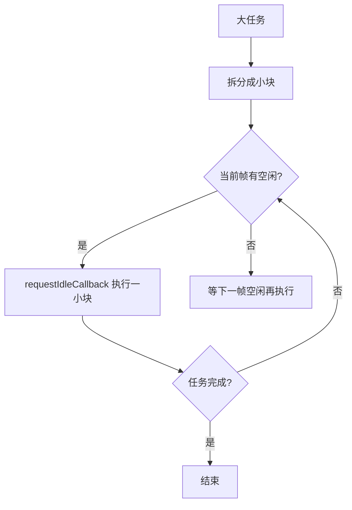

<DifficultyBadge level="intermediate" />

# 渲染优化

## 一句话解释

渲染优化的目标是**让页面在交互中保持 60fps 的流畅度**，核心是减少主线程上的重排、重绘与长任务。

## 渲染流水线

修改 DOM 属性后，浏览器走一条流水线：


| 操作 | 触发阶段 | 开销 |
|------|---------|------|
| `color` / `background-color` | Style → Paint → Composite | 中 |
| `width` / `left` / `top` / `margin` | Style → Layout → Paint → Composite | 高 |
| `transform` / `opacity` | 仅 Composite | 低 |

> **核心原则**：重排（Layout）最昂贵，重绘（Paint）次之，合成（Composite）最便宜。能用合成完成的动画，绝不要触发布局。

## 重排与重绘

### 触发条件

- **重排（Reflow/Layout）**：改变几何属性（宽高、margin、padding、font-size）、读取布局属性（`offsetWidth`、`getBoundingClientRect`）、增删 DOM、窗口 resize
- **重绘（Repaint）**：仅改变外观属性（颜色、阴影、可见性）且不影响布局

### 规避策略

```javascript
// ❌ 频繁触发重排
const ul = document.getElementById('list')
for (let i = 0; i < 1000; i++) {
  ul.style.height = i + 'px'  // 每次循环触发重排
  ul.appendChild(document.createElement('li'))
}

// ✅ 批量操作 + 文档碎片，一次重排
const fragment = document.createDocumentFragment()
for (let i = 0; i < 1000; i++) {
  const li = document.createElement('li')
  li.textContent = `Item ${i}`
  fragment.appendChild(li)
}
ul.appendChild(fragment)
ul.style.height = '1000px'
```

## 避免强制同步布局

读取布局属性会**强制浏览器立即执行尚未完成的重排**，读写在循环中交替会反复重排。

```javascript
// ❌ 读写交替：每次读取都强制立即重排
for (let i = 0; i < 1000; i++) {
  box.style.width = i + 'px'
  console.log(box.offsetWidth)  // 被迫立即重排
}

// ✅ 先批量读，再批量写
const widths = []
for (let i = 0; i < 1000; i++) widths.push(box.offsetWidth)
for (let i = 0; i < 1000; i++) box.style.width = widths[i] + 'px'
```

> 现代框架常用 **批处理（batching）**：React 对 state 更新做批处理；原生可用 `requestAnimationFrame` 或 CSS 变量把读与写分帧执行。

## 虚拟列表

长列表（聊天记录、无限滚动）一次性渲染成千上万节点，会因 DOM 过多导致重排与内存暴涨。虚拟列表只渲染**可视区域 + 缓冲区内**的节点。

### 核心实现要点

```javascript
// 虚拟列表核心逻辑：计算可视区渲染的起始与结束索引
function VirtualList({ items, itemHeight, viewportHeight, scrollTop }) {
  const bufferSize = 5
  const start = Math.max(0, Math.floor(scrollTop / itemHeight) - bufferSize)
  const end = Math.min(items.length, Math.ceil((scrollTop + viewportHeight) / itemHeight) + bufferSize)
  const visible = items.slice(start, end)

  return (
    <div style={{ height: viewportHeight, overflowY: 'auto' }}>
      <div style={{ height: items.length * itemHeight, position: 'relative' }}>
        {visible.map((item, i) => (
          <div key={item.id} style={{ position: 'absolute', top: (start + i) * itemHeight }}>
            {item.content}
          </div>
        ))}
      </div>
    </div>
  )
}
```

| 实现要点 | 说明 |
|---------|------|
| 固定高度 | 用 `scrollTop / itemHeight` 直接算出可视索引，O(1) |
| 动态高度 | 需预估高度 + 渲染后校正（itemHeight 缓存） |
| 容器占位 | 外层固定 total 高度撑起滚动条，避免浏览器卡死 |
| 绝对定位 | 每个可视项 `position: absolute; top = index * itemHeight` |
| 键盘/无障碍 | 保持 tabindex 与 aria 语义，避免焦点丢失 |

> **2026 视角**：第三方库 `react-window`、`@tanstack/react-virtual`（支持动态尺寸/虚拟网格）已非常成熟；React 生态有 `content-visibility: auto` 作为轻量替代，但无滚动条占位，长列表仍建议真虚拟化。

## 时间分片（requestIdleCallback）

长任务（>50ms）会阻塞主线程，导致掉帧与 INP 劣化。**时间分片**把大任务拆成小片，在每帧的空闲时间里执行。



```javascript
// ✅ 时间分片：分批渲染 10 万条数据
const total = 100000, batch = 1000, list = []
function process() {
  const start = performance.now()
  while (list.length < total && performance.now() - start < 16) {
    list.push(renderItem(list.length))
  }
  if (list.length < total) {
    requestIdleCallback(process, { timeout: 50 })  // 50ms 内必须执行
  }
}
requestIdleCallback(process)
```

> **注意**：`requestIdleCallback` 在 Safari 长期不支持（2025 年后已实现）。兼容方案：`MessageChannel` 或 `requestAnimationFrame` 手动实现"分片 + 让出"。

## GPU 加速

把动画元素提升为独立合成层，交给 GPU 处理，主线程只负责发起合成。

```javascript
// ❌ 用 left 做动画：每帧触发 Layout
el.style.left = x + 'px'

// ✅ 用 transform 做动画：仅触发合成
el.style.transform = `translateX(${x}px)`

// ✅ 同效果对比表
// left/top：Layout + Paint + Composite（主线程，卡顿）
// transform：仅 Composite（合成线程，流畅 60fps）
// opacity：仅 Composite（可配合 transition 做淡入淡出）
```

| 属性 | 触发阶段 | 是否交给 GPU |
|------|---------|-------------|
| `left` / `top` / `width` / `height` | Layout + Paint + Composite | ❌ 主线程 |
| `transform: translate/scale` | Composite | ✅ 合成线程 |
| `opacity` | Composite | ✅ 合成线程 |
| `filter` / `box-shadow`（动画） | Paint + Composite | ⚠️ 可能触发重绘 |

## will-change 的正确用法

`will-change` 提前告诉浏览器"该元素要动画了"，浏览器会提前创建合成层。但**用错反而更卡**。

```css
/* ❌ 滥用：每个元素都声明，创建过多图层，内存暴涨 */
* { will-change: transform; }

/* ✅ 在即将动画前开启，动画结束后移除 */
.box { will-change: transform; transition: transform 0.3s; }

/* ✅ 用 JS 按需开关 */
el.style.willChange = 'transform'
// 动画结束后
el.style.willChange = 'auto'
```

> **考点**：`will-change` 是"声明"，不是"开启"。它应作用在**即将动画的元素**上，数量一多图层增多反而降低合成效率（层爆炸）。

## 与 React 渲染优化关联

React 的虚拟 DOM 减少了不必要的 DOM 操作，但 JS 侧的 diff 与 re-render 仍是成本，需要配合 `memo`/`useMemo` 收敛：

```javascript
// ❌ 父组件每次渲染，子组件也跟着渲染
function Parent() {
  const [count, setCount] = useState(0)
  return <Child onClick={() => setCount(c => c + 1)} />
}

// ✅ memo + useCallback：只有 props 变化才重渲染子组件
const Child = memo(function Child({ onClick }) { ... })

function Parent() {
  const [count, setCount] = useState(0)
  const handleClick = useCallback(() => setCount(c => c + 1), [])
  return <Child onClick={handleClick} />
}
```

| 优化手段 | 解决的问题 | 适用 |
|---------|-----------|------|
| `React.memo` | 阻断组件因父级重渲染而重渲染 | 组件 props 浅比较稳定 |
| `useMemo` | 缓存昂贵计算/对象引用 | 传给 memo 子组件的引用稳定 |
| `useCallback` | 缓存函数引用 | 传给 memo 子组件的回调 |
| 合理拆分 state | 缩小重渲染范围 | state 粒度太粗导致大范围渲染 |
| `useDeferredValue` / `startTransition` | 降低高优先级更新的阻塞 | 搜索框/大列表输入 |

> **渲染优化统一思想**：无论原生 DOM 还是 React，优化对象都是**减少主线程工作**——原生减少重排重绘，React 减少 diff 与 re-render，两者可叠加理解。

## 面试问法

- 🔥 **什么是重排和重绘？哪些操作会触发重排？如何规避？**
  - 重排（Layout）计算元素几何位置，重绘（Paint）填充像素；改变几何属性、读取布局属性、增删 DOM、resize 都会触发重排
  - 规避：批量 DOM 操作（DocumentFragment）、先读后写、CSS 合并、class 切换代替逐条样式、离屏操作后插入
  - 口诀：**能改 class 不改 style，能改 transform 不改 left**

- 🔥 **虚拟列表的原理是什么？实现时有哪些坑？**
  - 只渲染可视区 + 缓冲区的节点，外层用总高度占位撑起滚动条，可视项绝对定位到对应 y 坐标
  - 坑：动态高度需要预估+校正；快速滚动闪烁要加大 buffer；要保证滚动到任意位置能快速计算起始索引；注意键盘焦点与无障碍
  - 库：react-window、@tanstack/react-virtual

- 🔥 **什么是强制同步布局（Forced Synchronous Layout）？**
  - 读取布局属性（offsetHeight、getBoundingClientRect）时，浏览器被迫中断渲染队列立即执行重排
  - 危害：循环中读写交替 → 每轮都强制重排，O(n²) 复杂度
  - 解决：先批量读再批量写，或用 rAF 分帧、CSS 变量解耦

- 🔥 **如何实现 60fps 动画？为什么推荐用 transform/opacity？**
  - 60fps = 每帧 16.6ms，动画逻辑必须在此时间内完成；`transform/opacity` 只触发合成，工作在合成线程，主线程被占用也不掉帧
  - 对比：`left/top` 每帧触发 Layout，主线程一忙就卡
  - 配合 `will-change` 提前建层、避免在动画中读取布局

- ⭐ **requestIdleCallback 是什么？有什么兼容问题？**
  - 在浏览器空闲时执行低优先级回调，`timeout` 参数兜底保证不被饿死
  - 兼容：Safari 长期未实现，需 MessageChannel/rAF 降级方案
  - 与 `requestAnimationFrame` 区别：rAF 在每帧渲染前执行，保证动画时序；rIC 在帧间空闲执行，适合后台数据填充

- ⭐ **will-change 为什么不能滥用？**
  - 它会让浏览器提前创建合成层，图层数量过多会导致内存占用暴涨与合成开销上升（层爆炸）
  - 正确用法：动画前临时声明、动画后移除，且只作用于即将动画的元素

- ⭐ **React.memo 与 useMemo 的区别？什么时候不值得用？**
  - `React.memo` 记忆组件（避免 props 未变时重渲染）；`useMemo` 记忆值（避免昂贵计算与引用不稳定）
  - 不值得用：props 每次都变、组件本身很轻、memo 比较成本高于重渲染成本时——无脑 memo 反而增加内存与对比开销
  - 现代 React 视角：优先用 state 下沉/组件拆分解决，memo 是最后手段

## 💡 AI 辅助学习

> 用这个 Prompt 练渲染优化：
> "你是一个 React 性能专家。我有一个表格页，数据 10 万行，滚动时卡顿、输入搜索框掉帧。请从渲染流水线、虚拟列表、React 重渲染三个层面分析，给出具体代码层面的优化方案，并说明每项优化针对的是 Layout/Paint 还是 re-render。"

## 关联知识

- [性能优化全景](/engineering/performance-overview) — Core Web Vitals 与优化决策树
- [加载优化](/engineering/loading-optimization) — 首屏更快，渲染压力更小
- [React 优化](/frameworks/react-optimization) — memo/useMemo/并发特性详解
- [浏览器渲染原理](/fundamentals/browser-rendering) — 渲染流程与合成层
- [浏览器重排重绘](/fundamentals/browser-reflow) — 布局流程底层原理
