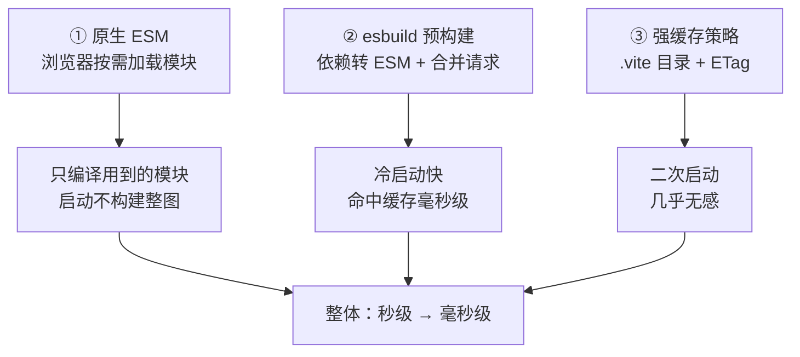
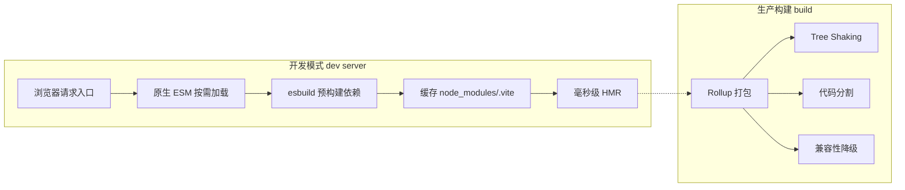
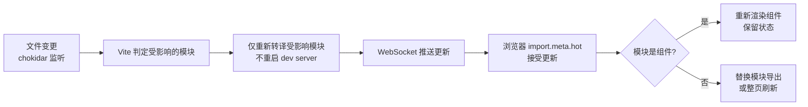
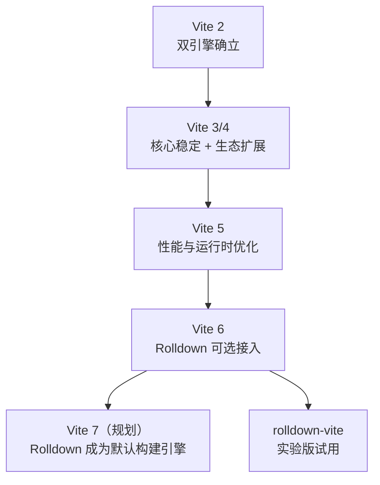

<DifficultyBadge level="beginner" />

# Vite 原理与 HMR

## 一句话解释

Vite 的核心理念是**"开发环境不打包"**：利用浏览器原生 ESM，把"全量构建"变成"按需编译单个模块"，再用 esbuild 预构建依赖 + 缓存，让冷启动和 HMR 从"秒级"降到"毫秒级"。

## 为什么快：三驾马车



| 手段 | 解决的问题 | 原理 |
|------|-----------|------|
| **原生 ESM** | 全量打包 | 浏览器 `import` 什么就请求什么，不构建依赖图 |
| **esbuild 预构建** | CJS 不兼容 + 请求数爆炸 | Go 写的 esbuild 把依赖合并成 ESM 并缓存 |
| **缓存策略** | 重复启动慢 | 依赖缓存 `node_modules/.vite` + 源码基于 http 缓存 |

## 开发/生产双引擎



> **为什么不直接用 esbuild 打包？** 因为生产需要**极致的产物质量**：tree shaking 深度、动态 import 分割、babel 插件生态、esbuild 的产物优化相对粗放。所以 Vite 定下"**dev=esbuild+ESM，build=Rollup**"的双引擎策略。

## 依赖预构建优化

```javascript
// vite.config.js
export default {
  optimizeDeps: {
    include: ['lodash', 'dayjs'], // 强制预构建（也可自动发现）
    exclude: ['@vue/compiler-sfc'], // 排除无需预构建的
  },
}
```

### 为什么 npm 依赖必须预构建

| 原因 | 说明 |
|------|------|
| **CJS 不兼容** | 多数 npm 包是 CommonJS，浏览器 ESM 无法 `import` |
| **请求数爆炸** | 一个包依赖几十个子包，直接加载会发起几百个请求 |
| **模块格式统一** | 把 CJS/UMD 统一转成 ESM，源码与依赖同构 |

> 记忆点：预构建结果缓存在 `node_modules/.vite`。**当 package.json 的依赖变化或 `vite.config` 的 optimizeDeps 改动时，缓存才会失效**——这也是开发时"改了配置没生效"的常见坑。

## 毫秒级 HMR 原理



```javascript
// ✅ HMR 接口：模块自己声明"如何热替换"
if (import.meta.hot) {
  import.meta.hot.accept('./foo.js', (newModule) => {
    newModule.render()
  })
}

// ❌ 错误：页面级模块不接受 HMR
// 如果模块根节点不支持 accept，则链式向上找，都不支持就整页刷新
```

### Vite HMR vs Webpack HMR

| 维度 | Vite | Webpack |
|------|------|---------|
| **更新单位** | 单个 ESM 模块（精确失效） | 受影响模块 + 依赖该模块的 chunk |
| **是否需要重编译** | 仅转译 1 个文件 | 需要重新构建相关模块图 |
| **路径** | WebSocket 直接推模块代码 | 生成 patch JSON + 模块代码 |
| **大项目表现** | 模块越多相对越快 | 模块越多越慢 |
| **对 HMR 接口** | `import.meta.hot` | `module.hot` |

> 核心记忆点：**Webpack 的 HMR 是"更新包含被改模块的 chunk"，Vite 的 HMR 是"更新被改的单个模块"**——这正是 Vite 在大项目上 HMR 依然毫秒级的原因。

## Vite 5/6 与 Rolldown 进展



| 版本 | 关键变化 | 意义 |
|------|---------|------|
| **Vite 5** | Node 18+、`define` 调整、底层升级 | 稳定基线，生态成熟 |
| **Vite 6** | 环境 API、Rolldown 可选 | 向"双引擎统一"过渡 |
| **Rolldown** | Rust 重写 Rollup | 生产构建速度提升一个量级，API 兼容 |
| **oxc 相关** | 用 oxc 加速 JS/TS 转译 | 进一步替换 esbuild 的能力 |

> 2026 记忆点：Vite 的路线图是**用 Rolldown 统一开发/生产引擎**——开发时用 Rolldown 的按需编译替代纯 esbuild，生产时用 Rolldown 替代 Rollup，最终一个 Rust 引擎吃掉全链路。面试提到"Vite 未来方向"时答这个即可。

## 特殊路径与常见坑

Vite 内部会给模块加上特殊前缀，面试中看懂这些路径 = 真懂 Vite：

```javascript
// 浏览器 Network 面板常见的 Vite 请求
// ?import             ESM 转换后的模块（区别于原始资源）
// /@fs/               Vite 把磁盘文件暴露给浏览器（文件系统限定）
// /@id/               内部模块 id（如 virtual:xxx）
// /@vite/             Vite 自身运行时模块
// /src/xxx.vue?vue&type=style  SFC 的样式子模块
import.meta.hot
```

| 现象 | 原因 | 解决 |
|------|------|------|
| 改了 package.json 依赖不生效 | 依赖缓存 `.vite` 未失效 | 删 `node_modules/.vite` 重启 |
| 依赖升级后 HMR 失效 | 预构建缓存与新版本不匹配 | `vite --force` 强制重新预构建 |
| ESM 报 `Uncaught SyntaxError` | 源码里用了浏览器不支持的语法 | 装对应转换插件（@vitejs/plugin-legacy 或编译 TS） |
| `optimizeDeps.exclude` 用错 | 该依赖仍被 CJS 引入 | 确认 exclude 依赖无 CJS 传递 |

```javascript
// vite.config.js —— 覆盖默认 cacheDir / 强制预构建
export default defineConfig({
  cacheDir: 'node_modules/.vite',
  server: { force: true }, // 等价于命令行 vite --force
})
```

### 冷启动 vs 热启动

| 概念 | 含义 | 何时触发 |
|------|------|---------|
| **冷启动（cold start）** | 无缓存，需要预构建依赖 | 首次启动 / `.vite` 缓存被删 |
| **热启动（warm start）** | 命中依赖缓存 + http 强缓存 | 日常重启 dev server |
| **依赖重构建** | 依赖变化触发重新预构建 | 新增依赖 / `vite --force` |

> 记忆点：**"秒级启动"通常指热启动**。冷启动要跑一次 esbuild 预构建，大依赖（如上百个包）可能花几秒到几十秒——这也是为什么 Vite 推荐把 `node_modules/.vite` 提交进忽略清单但不要频繁清理。

## 面试问法

- 🔥 **Vite 为什么比 Webpack 快？** 
  - 三个层面：① **按需加载**：开发不打包，浏览器 ESM 只请求用到的模块，Webpack 启动就要构建整张依赖图；② **esbuild 预构建**：用 Go 写的 esbuild 预构建依赖并缓存，冷启动快；③ **缓存**：依赖缓存 `.vite` + 源码 http 强缓存，二次启动毫秒级。注意区分"开发快"和"生产快"——生产 Vite 走 Rollup，速度不占优。

- 🔥 **为什么 Vite 开发用 esbuild，生产却用 Rollup？**
  - 开发要的是"**够用 + 快**"：esbuild 转译和预构建都极快，产物不做极致优化也没关系（浏览器直接跑 ESM）；生产要的是"**产物质量**"：tree shaking 深度、code splitting、按需加载、插件生态（如 @vitejs/plugin-legacy 做降级），这些 esbuild 做不到或不如 Rollup。一句话：**快是开发诉求，优化是生产诉求**。

- 🔥 **Vite 的 HMR 原理是什么？为什么能毫秒级？**
  - chokidar 监听文件变更 → 只对受影响模块做转译（esbuild/原生）→ WebSocket 把模块代码和更新边界推给浏览器 → 浏览器按 `import.meta.hot` 声明执行替换。毫秒级的原因：**更新粒度是单个模块而非整个 chunk**，且源码转换极快、无需重跑依赖图。模块未声明 accept 时沿导入链向上找，都不支持则整页刷新。

- ⭐ **什么是依赖预构建？为什么要预构建？**
  - 预构建 = 启动时用 esbuild 把 node_modules 的依赖转成统一 ESM 并合并，缓存到 `.vite`。原因：① CJS 包浏览器不能直接 import，需转 ESM；② 依赖间的深层 import 会造成大量 HTTP 请求，需合并成一个文件；③ 统一源码与依赖的模块格式，避免重复实例化（如 react 被加载两份）。改动依赖或 optimizeDeps 后需删缓存重启。

- ⭐ **Vite 对老浏览器和 SSR 支持如何？**
  - 生产可配合 `@vitejs/plugin-legacy` 生成 SystemJS 降级产物支持 IE11/老浏览器；开发模式仍要求现代浏览器（原生 ESM）。SSR 支持成熟（`ssrLoadModule`、`createServer`），常用于 Vite + Vue/Nuxt/React SSR。面试可强调：**Vite 面向现代浏览器优先，兼容性是生产期的降级策略，不是开发期的默认能力**。

- ⭐ **Rolldown 是什么？和 esbuild 什么关系？**
  - Rolldown 是 **Rust 重写的 Rollup**，目标是"Rollup 的 API 兼容 + esbuild 级速度"，用来统一 Vite 的双引擎（替换 dev 的 esbuild 打包部分和 build 的 Rollup）。它与 esbuild 不是替代而是借鉴：esbuild 证明 Go 并行加速可行，Rolldown 用 Rust + Oxc 生态在打包优化上更彻底。当前可试用 `rolldown-vite`，后续将成为 Vite 默认引擎。

## 💡 AI 辅助学习

> 用这个 Prompt 让 AI 帮你理解 Vite 内部：
> "假设你要给一个 Vue 3 + Vite 团队做技术分享。请用'浏览器视角'讲清一次完整的开发流程：1) 浏览器请求 http://localhost:5173 后发生了什么（index.html → main.js → SFC → 依赖预构建）；2) 中间 `node_modules/.vite`、`?import`、`/@fs/`、`/@id/` 这些特殊路径分别是什么；3) 配一个 10 分钟 HMR 讲解的结构化大纲。请用中文，结合真实代码路径。"

## 关联知识

- [构建工具演进](/engineering/build-tools-evolution) — Vite 在演进脉络中的位置与 2026 格局
- [Webpack 核心机制](/engineering/webpack-core) — Loader/Plugin、HMR 对比参考
- [包体积优化](/engineering/bundle-optimization) — Vite 生产构建与产物优化
- [Monorepo 工程化](/engineering/monorepo) — Vite + pnpm workspace 组合实践
- [CI/CD 搭建](/engineering/ci-cd) — Vite build 在流水线中的应用
