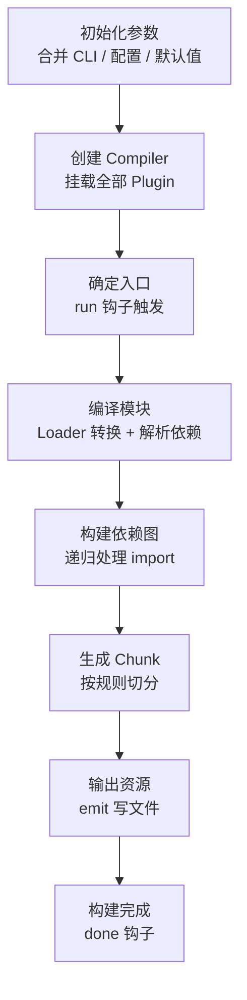
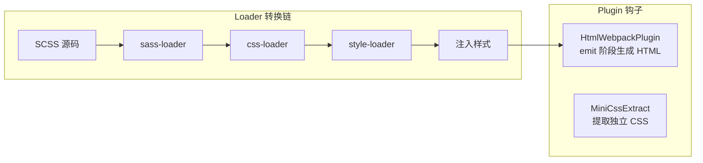
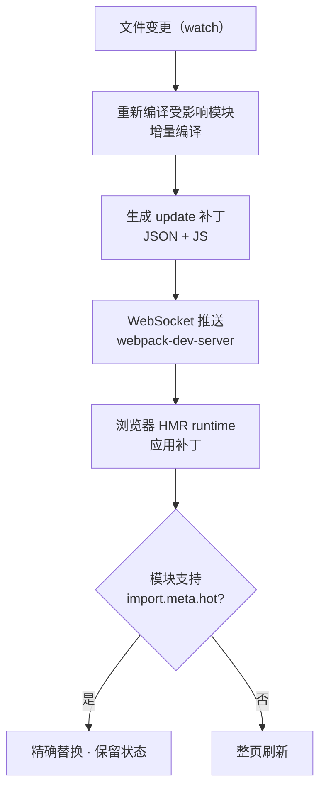

<DifficultyBadge level="beginner" />

# Webpack 核心机制

## 一句话解释

Webpack 是一个**基于依赖图的模块打包器**：从入口出发递归解析所有模块，用 Loader 转换资源、用 Plugin 扩展生命周期，最终把依赖图切分成若干 chunk 输出到浏览器。

## Webpack 完整构建流程



| 阶段 | 关键对象 | 做什么 | 对应钩子 |
|------|---------|--------|---------|
| **初始化** | `Compiler` | 解析配置、挂载插件 | 无（实例化） |
| **编译** | `Compilation` | 从入口递归解析模块 | `run` / `compile` |
| **构建模块** | `NormalModule` | 按 Loader 链转换源码、收集依赖 | `buildModule` |
| **生成 chunk** | `Chunk` | 依据 splitChunks/入口切分 | `optimizeChunks` |
| **输出** | `Compiler` | 生成 assets、写文件 | `emit` / `afterEmit` |

> 面试记忆点：**Loader 是函数式转换（前一个的产物是后一个的输入），Plugin 是事件订阅（在 hook 上挂回调）**。一句话区分二者：**Loader 只关心"一个文件怎么变"，Plugin 关心"整个构建过程在哪个时机做什么"。**

## Loader 机制

Loader 是**纯函数**，输入源文件内容/代码，输出转换后的 JS。按 `use` 数组**从右到左**执行。

```javascript
// ✅ Loader 本质：导出转换函数
module.exports = function (source) {
  // 把 markdown 转成 JS 模块
  return `export default ${JSON.stringify(source)}`
}
module.exports.raw = true  // 以 Buffer 接收，处理二进制

// ❌ 错误理解：认为 loader 能异步等待浏览器 API
// Loader 运行在 Node 环境，无法访问 window/document
```

```javascript
// webpack.config.js — Loader 链
module.exports = {
  module: {
    rules: [
      {
        test: /\.scss$/,
        use: [
          'style-loader', // ③ 把 CSS 注入 <style>
          {
            loader: 'css-loader', // ② 解析 @import/url 生成 CSS 模块
            options: { modules: true },
          },
          'sass-loader', // ① 最右先执行：scss → css
        ],
      },
    ],
  },
}
```

### Loader 与 Plugin 的对比

| 维度 | Loader | Plugin |
|------|--------|--------|
| **作用对象** | 单个资源文件 | 整个构建过程 / Compiler |
| **执行时机** | 模块转换阶段 | 任意生命周期钩子 |
| **本质** | 纯函数（入→出） | 类 + 订阅 hook |
| **职责** | 语法转换、资源处理 | 打包优化、静态资源拷贝、HTML 注入 |
| **例子** | babel-loader、css-loader | HtmlWebpackPlugin、MiniCssExtractPlugin |



## Tree Shaking 原理与条件

Tree Shaking 依赖 **ESM 的静态结构**（import/export 在顶层、名字确定），构建时分析模块间引用关系，把"未使用"的导出从产物中删除。

```javascript
// ✅ 可被摇掉：ESM 静态导出
import { add } from './math' // math 里没用到的 sub，会被摇掉
// ❌ 不可被摇掉：CommonJS 动态导出
const math = require('./math') // require 是运行时执行，无法静态分析

// 一个常见反例 —— 副作用函数无法摇掉
// eslint-disable-next-line no-unused-vars
import './polyfill'  // 保留（有副作用）
```

### Tree Shaking 生效的 4 个条件

| 条件 | 说明 |
|------|------|
| **必须 ESM** | `import/export` 静态语法，不能用 `require` |
| **配置 `sideEffects: false`** | 告诉 Webpack 该包无副作用，可安全摇掉 |
| **模块代码无副作用** | 顶层不要写 console.log、赋值等 |
| **生产模式** | 开启 `mode: 'production'` + `optimization.usedExports` |

```javascript
// webpack.config.js
module.exports = {
  mode: 'production', // 自动开启 tree shaking + minify
  optimization: {
    usedExports: true, // 标记并移除未使用导出
    sideEffects: true, // 配合 package.json 的 sideEffects 字段
  },
}
```

## Code Splitting 代码分割

代码分割把一个大 bundle 拆成多个 chunk，让首屏只加载用到的代码。

```javascript
// ✅ 按需加载：动态 import → 自动生成独立 chunk
const Login = () => import(/* webpackChunkName: 'login' */ './Login.vue')

// ✅ 手动拆分共享依赖（splitChunks）
module.exports = {
  optimization: {
    splitChunks: {
      cacheGroups: {
        vendor: {
          test: /node_modules/,
          name: 'vendor',
          chunks: 'all', // initial / async / all
        },
      },
    },
  },
}
```

### 三种拆包方式对比

| 方式 | 触发时机 | 典型场景 | 优点 | 缺点 |
|------|---------|---------|------|------|
| **entry 多入口** | 配置时 | 多页面应用 | 结构清晰 | 共享代码重复 |
| **动态 import** | 运行时 | 路由懒加载、按需组件 | 精准按需 | 加载延迟（需 Loading） |
| **splitChunks** | 构建时 | vendor 抽离、公共模块 | 缓存复用、并发加载 | 配置需调优 |

## HMR 热更新原理



> 关键点：HMR 不是"快"，而是"**准**"——只更新受影响模块、保留组件状态。若模块未声明 `module.hot.accept`，则退化为整页刷新。

## Module Federation 简介

Module Federation（webpack 5）让**不同构建产物在运行时互相共享模块**，是微前端的另一种形态。

```javascript
// 远端（Remote）—— 暴露模块
module.exports = {
  plugins: [
    new ModuleFederationPlugin({
      name: 'appRemote',
      filename: 'remoteEntry.js',
      exposes: { './Header': './src/Header.js' },
      shared: { react: { singleton: true } },
    }),
  ],
}

// 宿主（Host）—— 消费远端模块
module.exports = {
  plugins: [
    new ModuleFederationPlugin({
      remotes: { appRemote: 'appRemote@http://cdn/app/remoteEntry.js' },
    }),
  ],
}
```

> 与 qiankun（应用级加载 + 沙箱）相比，Module Federation 是**模块级共享 + 运行时解析依赖**，更适合"同技术栈多团队协作"；更全面的对比见 [微前端实践](/engineering/micro-frontend)。

## 面试问法

- 🔥 **Loader 和 Plugin 的区别？**
  - Loader 是**文件转换器**：处理单个模块，按 `use` 从右到左执行，纯函数式。Plugin 是**构建生命周期扩展**：订阅 Compiler/Compilation 的钩子（如 emit、done），能做 Loader 做不了的事（拷贝静态资源、提取 CSS、注入 HTML、BundleAnalyzer 分析）。一句话：**Loader 管"文件怎么变成模块"，Plugin 管"构建过程做哪些事"。**

- 🔥 **Webpack 打包流程讲讲？**
  - 初始化参数 → 创建 Compiler 并挂载插件 → 确定入口触发 run → 递归构建模块（Loader 转换 + 收集依赖）→ 形成依赖图 → 生成 chunk → emit 输出文件。要记住 Compiler 是"全程导演"、Compilation 是"一次编译的现场"，每次文件变更重新编译会生成新的 Compilation。

- 🔥 **Tree Shaking 的原理？为什么有些库摇不掉？**
  - 原理：ESM 静态分析——解析模块导入导出关系，标记未使用导出并在 minify 阶段删除。摇不掉的原因：① 用了 CJS（require 运行时执行）；② 包的 `sideEffects` 未声明 false，Webpack 保守保留；③ 顶层代码有副作用（IIFE、console）；④ 用了字符串方式访问（动态属性）。对策：换 ESM 版本包、配置 `sideEffects`、用 babel 插件标记 pure 注释。

- 🔥 **HMR 是怎么实现的？**
  - 文件变更 → dev server 增量编译受影响模块 → 生成 patch（JSON manifest + 模块代码）→ WebSocket 推给浏览器 → HMR runtime 根据 manifest 更新模块 → 模块声明了 `module.hot.accept` 则原地替换（保留状态），否则整页刷新。相比 Vite 的 HMR 核心差异是：Vite 按 ESM 边界精确失效、无需打包整图，速度更快。

- ⭐ **Code Splitting 有哪些方式？什么时候用 splitChunks？**
  - 三种：入口多页、动态 import（路由级）、splitChunks 抽公共/第三方库。抽 vendor 的意义是**利用浏览器缓存**——业务代码频繁更新但 vendor 不变，CDN 命中缓存。拆太细会导致请求数暴涨，通常用 `cacheGroups` + 体积阈值（如 `minSize: 20000`）平衡。

- ⭐ **Module Federation 和 qiankun 的区别？**
  - Module Federation 是**模块级**共享，webpack 5 原生支持，运行时通过 remoteEntry.js 解析依赖，适合同栈多团队、组件/工具共享；qiankun 是**应用级**加载 + JS/CSS 沙箱隔离，兼容不同技术栈、独立部署。MF 更轻、无沙箱开销，但要求同框架与安全边界管理。

## 💡 AI 辅助学习

> 用这个 Prompt 让 AI 帮你排查打包问题：
> "你是一名 Webpack 性能专家。我的项目构建耗时 90 秒、产物 3MB、首屏白屏。请：1) 用 speed-measure-webpack-plugin 的典型输出分析瓶颈；2) 给出 loader 范围精确（include/exclude）、cache-loader/thread-loader、splitChunks、CDN 外置、Tree Shaking 的优化清单；3) 对每项标注预期收益与改造风险，按优先级排序。请用中文回答。"

## 关联知识

- [构建工具演进](/engineering/build-tools-evolution) — Webpack 在演进脉络中的位置
- [Vite 原理与 HMR](/engineering/vite-principles) — ESM 按需加载 vs Webpack 全量打包
- [包体积优化](/engineering/bundle-optimization) — Tree Shaking 深度、分包与 CDN 外置
- [微前端实践](/engineering/micro-frontend) — Module Federation 与 qiankun 对比
- [CI/CD 搭建](/engineering/ci-cd) — 构建在流水线中的环节
