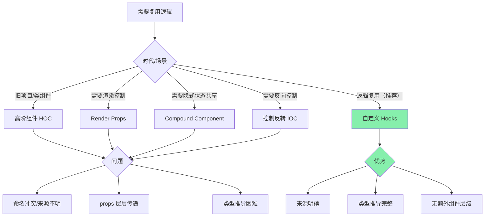
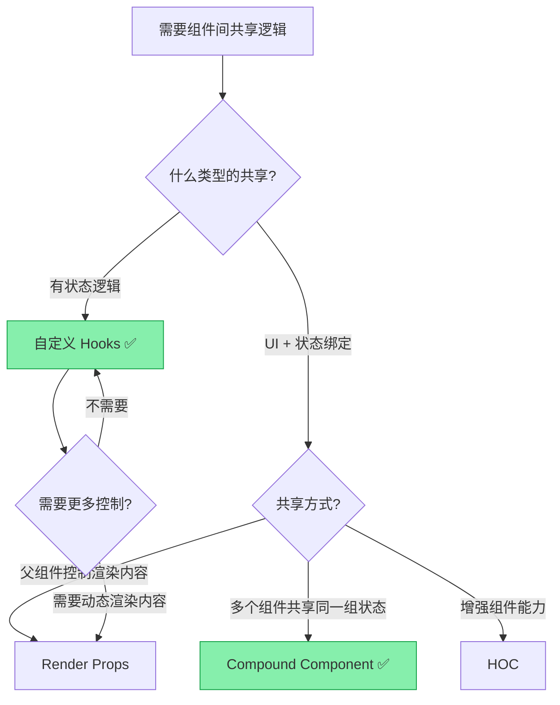
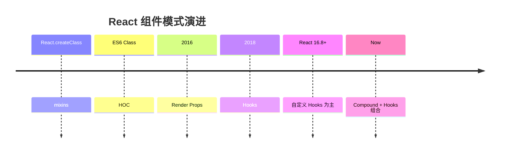

<DifficultyBadge level="intermediate" />

# 组件设计模式

## 一句话解释

组件设计模式是**解决"组件之间怎么共享逻辑和状态"的经典方案**——从 mixin 到 HOC、从 render props 到 Hooks，每一种模式解决特定场景的问题，也带着自己的 tradeoff。

## 核心流程



## 深入理解

### 1. 高阶组件 HOC

HOC 是一个函数，接受一个组件，返回一个增强后的新组件。

```javascript
// HOC：给组件添加日志功能
function withLogger(WrappedComponent) {
  return function EnhancedComponent(props) {
    useEffect(() => {
      console.log(`${WrappedComponent.name} mounted`, props)
      return () => console.log(`${WrappedComponent.name} unmounted`)
    }, [])
    
    return <WrappedComponent {...props} />
  }
}

// 使用
const UserWithLog = withLogger(UserProfile)
```

**经典 HOC 示例：**

```javascript
// withLoading — 自动添加加载态
function withLoading(WrappedComponent) {
  return function Enhanced({ loading, ...props }) {
    if (loading) return <Spinner />
    return <WrappedComponent {...props} />
  }
}

// withAuth — 权限控制
function withAuth(WrappedComponent) {
  return function Enhanced(props) {
    const user = useUser()
    if (!user) return <Redirect to="/login" />
    if (!user.hasPermission(props.requiredPermission)) {
      return <Forbidden />
    }
    return <WrappedComponent {...props} user={user} />
  }
}
```

**HOC 的问题：**
- **props 来源不明**：`<UserWithLog />` 的 props 哪些是 HOC 注入的？看不出来
- **命名冲突**：多个 HOC 可能注入同名 props
- **难以类型推导**：复杂 HOC 组合的类型很麻烦
- **额外嵌套**：React DevTools 中 HOC 层层包裹

### 2. Render Props

通过一个函数 prop 让父组件控制子组件的渲染内容：

```javascript
// Render Props 模式
function MouseTracker({ render }) {
  const [position, setPosition] = useState({ x: 0, y: 0 })
  
  useEffect(() => {
    function handleMouseMove(e) {
      setPosition({ x: e.clientX, y: e.clientY })
    }
    window.addEventListener('mousemove', handleMouseMove)
    return () => window.removeEventListener('mousemove', handleMouseMove)
  }, [])
  
  return render(position)  // 让父组件决定怎么渲染
}

// 使用
function App() {
  return (
    <MouseTracker
      render={({ x, y }) => (
        <div>
          鼠标位置：{x}, {y}
          {/* 可以在这里做任何事 */}
        </div>
      )}
    />
  )
}
```

**Render Props vs HOC：**

| 对比 | HOC | Render Props |
|------|-----|-------------|
| 数据来源 | props 注入 | render 函数参数 |
| 来源清晰度 | ❌ 来源不明 | ✅ 来自 render 参数 |
| 命名冲突 | ❌ 可能冲突 | ✅ 解构时可重命名 |
| 类型推导 | ❌ 复杂 | ✅ 较简单 |
| 嵌套可读性 | ❌ 多层包裹 | ❌ 嵌套回调 |

### 3. Compound Component — 复合组件

一组组件共享隐式状态，不通过 props 传递，而是通过 Context：

```javascript
// 复合组件：Select + Option
import { createContext, useContext, useState } from 'react'

// 1. 创建 Context
const SelectContext = createContext<{
  value: string
  onChange: (value: string) => void
} | null>(null)

// 2. 主组件
function Select({ value, onChange, children }) {
  const [open, setOpen] = useState(false)
  
  return (
    <SelectContext.Provider value={{ value, onChange }}>
      <div className="select">
        <button onClick={() => setOpen(!open)}>
          {value || '请选择'}
        </button>
        {open && <div className="options">{children}</div>}
      </div>
    </SelectContext.Provider>
  )
}

// 3. 子组件
function Option({ value, children }) {
  const ctx = useContext(SelectContext)
  const isSelected = ctx?.value === value
  
  return (
    <div
      className={`option ${isSelected ? 'selected' : ''}`}
      onClick={() => ctx?.onChange(value)}
    >
      {children}
    </div>
  )
}

// 把 Option 挂在 Select 下
Select.Option = Option

// 使用
function App() {
  const [city, setCity] = useState('')
  
  return (
    <Select value={city} onChange={setCity}>
      <Select.Option value="beijing">北京</Select.Option>
      <Select.Option value="shanghai">上海</Select.Option>
      <Select.Option value="shenzhen">深圳</Select.Option>
    </Select>
  )
}
```

**Compound Component 的优势：**
- **隐式状态共享**：状态通过 Context 传递，子组件无需手动接收
- **灵活的组合**：用户可以自由组合子组件
- **干净的 API**：父组件只关心 value/onChange，不关心内部实现

**React 生态中的例子：**
- `<select>` / `<option>`（原生 HTML）
- `<table>` / `<tr>` / `<td>`
- Radix UI / Reach UI 的很多组件

### 4. 控制反转（IoC）

通过"把控制权交给使用者"来实现高度可定制：

```javascript
// 表格组件：让使用者控制每一列的渲染
interface Column<T> {
  title: string
  dataIndex?: keyof T
  render?: (value: any, record: T, index: number) => ReactNode
}

function Table<T extends Record<string, any>>({
  columns,
  dataSource
}: {
  columns: Column<T>[]
  dataSource: T[]
}) {
  return (
    <table>
      <thead>
        <tr>
          {columns.map(col => <th key={col.title}>{col.title}</th>)}
        </tr>
      </thead>
      <tbody>
        {dataSource.map((record, index) => (
          <tr key={index}>
            {columns.map(col => (
              <td key={col.title}>
                {col.render
                  ? col.render(record[col.dataIndex!], record, index)
                  : record[col.dataIndex!]
                }
              </td>
            ))}
          </tr>
        ))}
      </tbody>
    </table>
  )
}

// 使用：完全控制列的渲染
const columns = [
  { title: '姓名', dataIndex: 'name' },
  { title: '年龄', dataIndex: 'age' },
  {
    title: '操作',
    render: (_, record) => (
      <button onClick={() => handleEdit(record.id)}>编辑</button>
    )
  }
]
```

### 5. 各种模式的选型



**选型建议：**

| 场景 | 推荐模式 | 原因 |
|------|---------|------|
| 复用有状态的逻辑 | **自定义 Hooks** | 来源明确、类型完整、无嵌套 |
| 一组组件共享隐式状态 | **Compound Component** | API 简洁、使用灵活 |
| 需要动态控制渲染 | **Render Props** | 灵活度高 |
| 包装/增强能力 | **HOC** | 适合类组件、已有大量 HOC 的旧项目 |
| 高度可定制组件 | **控制反转** | 表格、表单等需要定制的场景 |

### 6. 模式演进



- **mixin**（已废弃）：来源不明、命名冲突 → 被 HOC 替代
- **HOC**（适用于类组件）：props 来源不明、嵌套层级深
- **Render Props**：解决了来源问题，但回调嵌套不美观
- **自定义 Hooks**（推荐）：最清晰的来源、完整类型推导、无额外嵌套

## 面试问法

- 🔥 **HOC 和 Render Props 有什么区别？各有什么问题？**
  - HOC：包装注入 props，来源不明，命名冲突
  - Render Props：通过 render 函数参数传递，来源清晰
  - 共同问题：嵌套、类型推导复杂
  - 现代 React 推荐用自定义 Hooks 替代两者

- 🔥 **Compound Component 是什么？适合什么场景？**
  - 一组组件共享隐式状态（通过 Context）
  - 适合：Select/Option、Tabs/Panel、Accordion/Item
  - 优势：API 简洁、使用灵活、类型安全

- ⭐ **自定义 Hooks 如何替代 HOC？**
  - HOC 注入 props → Hook 返回值解构
  - HOC 嵌套 → Hook 自由组合
  - HOC 来源不明 → Hook 返回值有明确变量名
  - 不需要改组件结构，不增加包装层级

- ⭐ **控制反转模式在前端组件中怎么用？**
  - 组件定义框架和流程，使用者控制具体渲染
  - 典型例子：Table 的 render 函数、Form 的自定义验证

## 💡 AI 辅助学习

> 用这个 Prompt 练习模式识别：
> "你是 React 组件设计专家。我给你一段组件代码，请分析它使用了什么设计模式（HOC/Render Props/Compound/Hooks），然后指出这个模式在当前场景是否合适，并给出优化建议。
> 
> 我第一个例子：一个 Tabs 组件，用 Render Props 实现了 Tab 切换，但每次切换都重渲染所有 Tab 内容。请分析。"

## 关联知识

- [React 核心概念](./react-core) — 组件基础
- [React Hooks 大全](./react-hooks) — Hooks 基础
- [自定义 Hooks 设计](./custom-hooks) — Hook 模式详解
