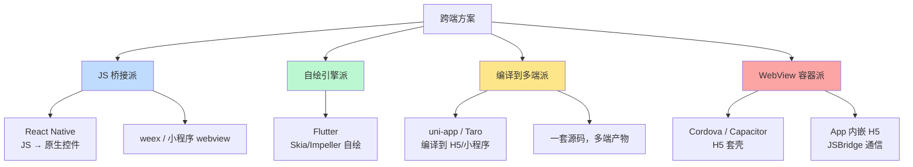
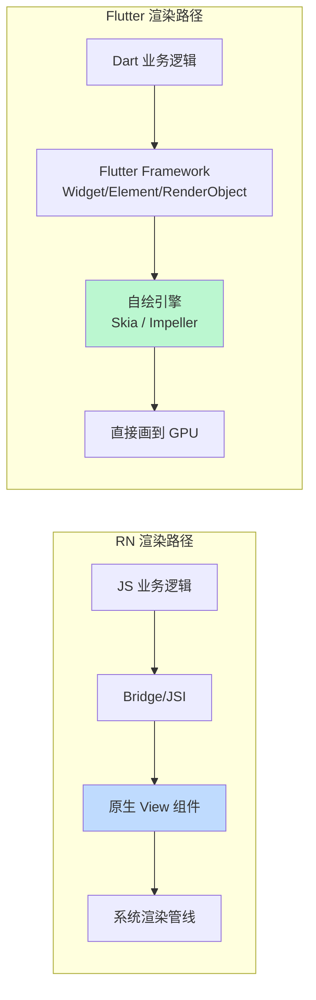
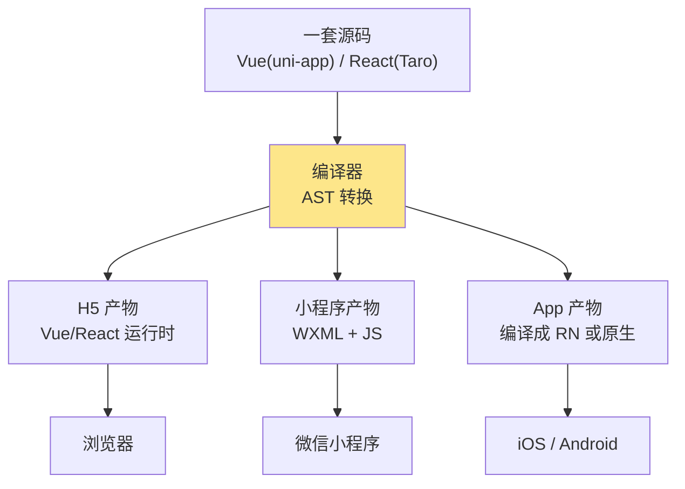
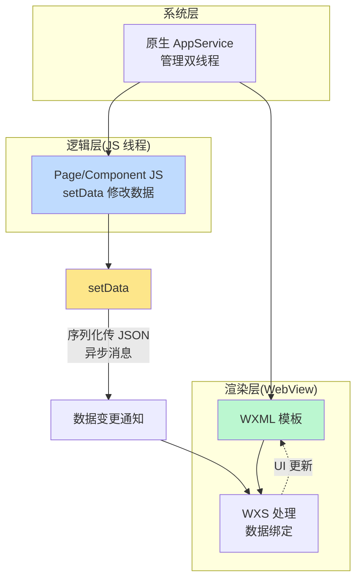
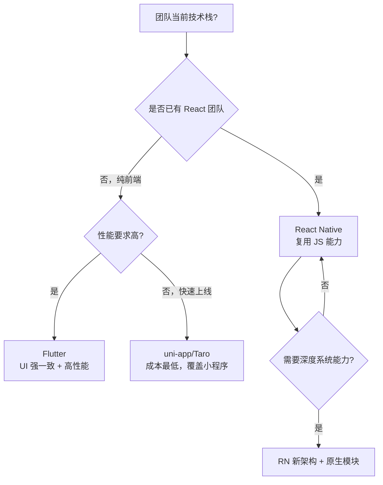

<DifficultyBadge level="advanced" />

# 跨端方案对比

## 一句话解释

跨端开发的本质是**"一份业务逻辑 + 多端渲染"**：JS 桥接派（React Native）把 JS 渲染到原生控件，自绘引擎派（Flutter）把 Dart 画到自己的 Canvas，编译派（uni-app/Taro）把代码翻译成各端语言，WebView 派用浏览器内核当渲染器——四派思路不同，选型取决于团队技术栈和性能要求。

## 跨端方案分类



## 深入理解

### 1. React Native：架构演进与新架构

RN 的核心模型是 **JS 线程 ↔ Bridge（异步消息）↔ 原生线程**。老架构的痛点就是 **Bridge**：JS 与原生只能通过**异步 JSON 序列化消息**通信，无法共享内存、无法同步调用，首屏性能与复杂手势体验受限。

| 对比维度 | 老架构（Bridge） | 新架构（New Architecture） |
|---------|-----------------|---------------------------|
| 通信方式 | 异步 JSON 序列化消息 | **JSI（JavaScript Interface）** 同步调用，共享内存 |
| 组件渲染 | JS 生成 shadow tree → 原生视图 | **Fabric**：C++ 统一渲染，优先级调度（like React Scheduler） |
| 原生模块 | 异步 RCTBridge 注册 | **TurboModules**：按需懒加载 + 类型安全 |
| 手势/事件 | 异步事件循环，延迟高 | **事件优先级 + 同步响应**，跟手 |
| 互操作性 | JS 与原生 API 割裂 | C++ 层共享，性能提升明显 |

```javascript
// 新架构：TurboModule —— 通过 codegen 生成的类型安全模块
import { TurboModule, TurboModuleRegistry } from 'react-native'

export interface Spec extends TurboModule {
  multiply(a: number, b: number): Promise<number>
}

export default TurboModuleRegistry.getEnforcing<Spec>('SampleTurboModule')
```

**为什么新架构重要（面试考点）：**
- JSI 让 JS 能直接持有并调用 C++/原生对象，省去每次序列化，**getImage 等高频调用大幅提速**
- Fabric 复用了 React 的**并发特性（可中断渲染）**，列表滚动时渲染任务可让位
- 纯 JS 层基本无感迁移，但底层渲染彻底重写

### 2. Flutter：自绘引擎的本质差异

Flutter 用 **Dart + Skia（2.x 前）/ Impeller（3.x+）** 在**自己的 Canvas 上绘制每一个像素**，UI 组件不是原生控件，而是 Flutter 渲染引擎画出来的。



**Flutter 与 RN 的本质区别：**

| 维度 | Flutter | React Native |
|------|---------|--------------|
| 语言 | Dart | JavaScript/TypeScript |
| 渲染 | 自绘（Skia/Impeller），UI 与系统控件无关 | 桥接原生控件，受系统 UI 影响 |
| 一致性 | 各平台 UI 像素级一致 | 随平台系统 UI 风格走 |
| 性能瓶颈 | 无 Bridge，直接 GPU 绘制，动画流畅 | JSI 后大幅改善，但仍跨语言 |
| 包体积 | 相对较大（含引擎） | 中等 |
| 生态 | Dart 生态较小 | JS 生态巨大 |
| 适合 | 高性能 + 强一致 UI | 复用团队 JS 能力 + 原生生态 |

> **面试关键句**：Flutter 是"**画出** UI"，RN 是"**组合原生** UI"。前者跨端一致性强但偏离系统原生质感，后者贴合原生但一致性依赖各端实现。

### 3. uni-app / Taro：编译到多端

**思想**：写一套 Vue/React 代码，编译器把源码翻译成各端可运行的产物（H5、微信/支付宝小程序、App）。



| 编译目标 | 产物 | 关键适配 |
|---------|------|---------|
| H5 | 标准 Vue/React 应用 | 用 Vue3/React 运行时直接渲染 |
| 微信小程序 | WXML + WXSS + JS 分包 | 把模板语法编译成 WXML，条件编译处理差异 |
| App（uni-app） | 可编译为原生 / nvue（类 Weex） | 运行时层做 JSBridge 适配 |
| 鸿蒙/快应用 | 对应端产物 | 条件编译 + 运行时适配层 |

```vue
<!-- Taro/uni-app 的条件编译：一套代码按端裁剪 -->
<!-- #ifdef MP-WEIXIN -->
<view class="wx-style">小程序专属样式</view>
<!-- #endif -->

<!-- #ifdef H5 -->
<div class="h5-style">H5 专属结构</div>
<!-- #endif -->
```

> **核心代价（面试必答）**：编译派能跨端，但**平台差异只能靠"条件编译 + 运行时垫片"补**。越是重度使用某端独有能力（如小程序原生组件、RN 原生模块），跨端一致性越差；且编译器需持续跟随各端更新，有一定"追版本"风险。

### 4. 小程序原理：双线程模型

小程序（微信）采用 **双线程模型**：逻辑层（JS 线程）与渲染层（WebView/WXML 渲染线程）分离。



**关键点：**
- **setData 是唯一的通信通道**：逻辑层数据 → 序列化 → 传到渲染层 → 更新 WXML。数据量大或调用频繁 = 性能瓶颈
- 逻辑层不能直接操作 DOM（没有 DOM/BOM API），天然隔离 → 安全性好但灵活度低
- WXML 编译：模板被编译成可执行的渲染指令，配合 WXSS 样式，事件由系统层转发
- 小程序页面的渲染层通常是多个 WebView（页面级），逻辑层是单一 JS 线程

```javascript
// setData 的性能问题：频繁/大数据量传输
Page({
  data: { list: [] },
  onScroll() {
    // ❌ 每次滚动都 setData 大对象，序列化开销大
    this.setData({ list: hugeList })
    // ✅ 只传变化的部分，或按需截断/节流
  }
})
```

### 5. WebView 容器方案

Cordova/Capacitor（混合 App）与"App 内嵌 H5"是**成本最低**的跨端方案：

| 优点 | 缺点 |
|------|------|
| 一套 H5 全端复用，成本最低 | 首屏依赖 WebView 加载，体验一般 |
| 前端技术栈直接可用 | 复杂交互/长列表性能弱于原生 |
| 热更新天然支持 | JSBridge 通信有性能与兼容成本 |
| 天然跨 iOS/Android/小程序 WebView | 系统 WebView 差异需适配 |

```javascript
// JSBridge 通信示例
// 原生调 JS
webView.evaluateJavaScript('window.onNativeMessage(' + JSON.stringify(data) + ')')
// JS 调原生
window.webkit?.messageHandlers?.native?.postMessage(payload)   // iOS
window.NativeBridge?.postMessage?.(payload)                    // Android 注入
```

### 6. 全方案对比与选型决策

| 方案 | 性能 | UI 一致性 | 生态/人才 | 开发成本 | 团队技术栈要求 |
|------|------|----------|----------|---------|---------------|
| **React Native** | 中上（新架构大幅提升） | 中（贴合原生） | JS/TS 生态巨大 | 中 | React 团队最佳适配 |
| **Flutter** | 高（自绘 GPU 渲染） | 高（像素级一致） | Dart 生态较小 | 中 | 需要学 Dart，前端可过渡 |
| **uni-app/Taro** | 中（受各端限制） | 中 | 中文生态丰富 | 低（复用前端栈） | Vue/React 即可 |
| **小程序原生** | 中（setData 瓶颈） | 高（端内一致） | 端内生态 | 低 | 特定端语法 |
| **WebView** | 低-中 | 低 | Web 生态 | 最低 | 纯前端即可 |
| **原生开发** | 最高 | 最高 | 各端原生生态 | 最高 | 双端原生团队 |

**选型决策流程（面试回答套路）：**



> **面试提示**：跨端没有银弹。面试官想听的是"你能说清每种方案的**本质代价**"，而不是"XX 最好"。选型三问：**① 团队技术栈在哪？② 性能/一致性的底线在哪？③ 目标端有多少？**（仅 H5 + 小程序 → uni-app/Taro；三端 App → RN/Flutter）

## 面试问法

- 🔥 **React Native 新架构相比旧架构解决了什么问题？**
  - 旧架构 Bridge 异步序列化通信：无法同步调用、内存不共享、性能受限
  - JSI 同步调用 + 共享内存；Fabric 统一 C++ 渲染支持优先级调度；TurboModules 懒加载原生模块
  - 高频调用和手势跟手度显著提升

- 🔥 **Flutter 和 React Native 的本质区别是什么？**
  - Flutter 自绘：Dart + Skia/Impeller 自己画 UI，与系统控件无关，跨端像素级一致
  - RN 桥接：JS 渲染到原生控件，贴合系统 UI，但一致性依赖各端
  - 性能：Flutter 直接 GPU 绘制更可控；生态/人才：RN 复用 JS 生态更强

- ⭐ **uni-app / Taro 是怎么做到"一套代码多端运行"的？有什么代价？**
  - 编译期 AST 转换 + 条件编译 + 运行时垫片适配各端
  - 代价：平台独有能力需条件编译兜底，越深度使用跨端一致性越差，编译器需跟随各端更新

- ⭐ **小程序为什么用双线程模型？setData 为什么是性能瓶颈？**
  - 逻辑层与渲染层分离，避免逻辑线程阻塞 UI，同时隔离 DOM 提高安全
  - setData 是唯一通信通道，需序列化 JSON 跨线程传输；数据大/频率高 = 开销大
  - 优化：只传 diff 数据、节流、把计算放渲染层（WXS）

- ⭐ **WebView 混合 App 和原生 App 的优缺点？**
  - WebView：成本最低、热更新、跨端复用；首屏慢、复杂交互性能弱
  - 原生：性能最强、系统能力最强；双端两套代码、成本最高

- ⭐ **给一个项目你会怎么选跨端方案？**
  - 先看团队栈（React → RN，Vue → uni-app）；再看目标端（含小程序 → 编译派）；最后看性能/一致性的硬性要求（高 → Flutter）
  - 能用一句"技术栈 + 目标端 + 性能底线"讲清决策逻辑

## 💡 AI 辅助学习

> 用这个 Prompt 深化跨端理解：
> "你是一个资深移动端架构师。请给我一个真实的跨端选型案例：某团队 8 人、React 技术栈，需要同时上线 iOS/Android App 和微信小程序，性能要求为'列表滚动 60fps、首屏 3s 内'。请给出：① 推荐方案及理由；② 各候选方案（RN/Flutter/uni-app/Taro/WebView）在此场景的取舍表；③ 如果选了 RN，小程序端怎么处理。用表格和决策树呈现。"

## 关联知识

- [React 源码解读](./react-source) — RN 复用 React 的并发渲染模型
- [Vue 3 源码解读](./vue-source) — uni-app 编译产物的运行时基础
- [框架对比与选型](./framework-comparison) — 前端框架选择的一般方法论
- [架构设计](/engineering/architecture-design) — 多端架构的统一设计思路
