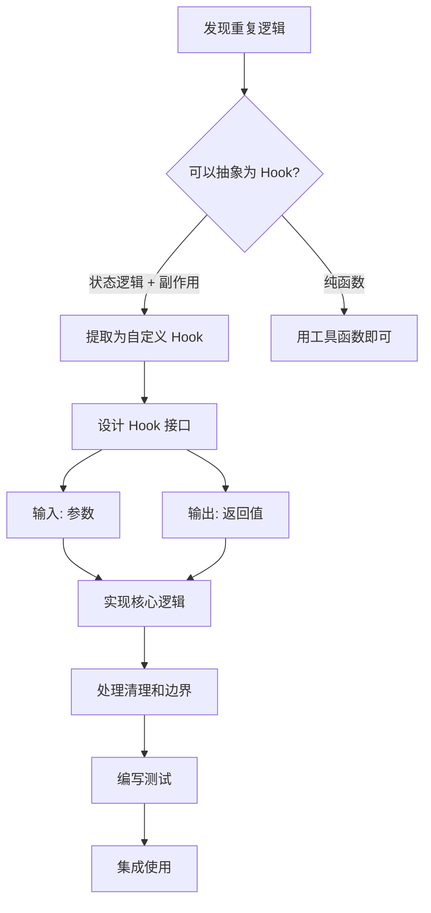
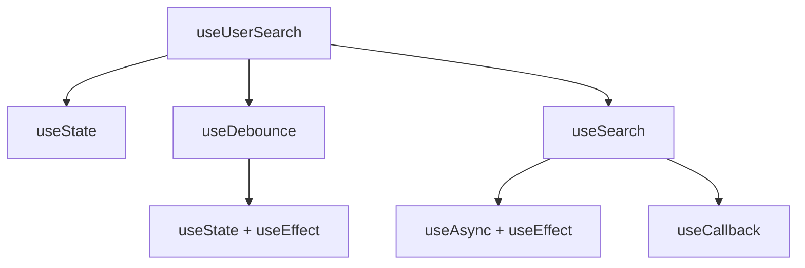

<DifficultyBadge level="intermediate" />

# 自定义 Hooks 设计

## 一句话解释

自定义 Hooks 是 React 的**逻辑复用单元**——把有状态的逻辑抽成可复用的函数，让组件更干净、逻辑更独立、测试更方便。

## 核心流程



## 深入理解

### 1. 什么时候需要自定义 Hook？

```javascript
// ❌ 重复逻辑：两个组件都需要管理 localStorage
function ComponentA() {
  const [value, setValue] = useState(() => {
    return JSON.parse(localStorage.getItem('key-a')) ?? ''
  })
  
  useEffect(() => {
    localStorage.setItem('key-a', JSON.stringify(value))
  }, [value])
  
  // ...
}

function ComponentB() {
  const [value, setValue] = useState(() => {
    return JSON.parse(localStorage.getItem('key-b')) ?? ''
  })
  
  useEffect(() => {
    localStorage.setItem('key-b', JSON.stringify(value))
  }, [value])
  
  // ...
}
```

```javascript
// ✅ 抽成自定义 Hook
function useLocalStorage<T>(key: string, initialValue: T) {
  const [value, setValue] = useState<T>(() => {
    const stored = localStorage.getItem(key)
    return stored ? JSON.parse(stored) : initialValue
  })
  
  useEffect(() => {
    localStorage.setItem(key, JSON.stringify(value))
  }, [key, value])
  
  return [value, setValue] as const
}

// 使用
function ComponentA() {
  const [value, setValue] = useLocalStorage('key-a', '')
}

function ComponentB() {
  const [value, setValue] = useLocalStorage('key-b', '')
}
```

**适合抽成 Hook 的场景：**
- 多个组件使用相同的**状态 + 副作用**组合
- 状态管理逻辑复杂，想从组件中分离
- 需要独立测试的逻辑
- 想给团队复用的一组功能

### 2. Hook 设计原则

**原则一：单一职责**

```javascript
// ❌ 一个 Hook 做太多事
function useUserManager() {
  const [user, setUser] = useState(null)
  const [loading, setLoading] = useState(false)
  const [error, setError] = useState(null)
  const [permissions, setPermissions] = useState([])
  
  // 加载用户、加载权限、更新用户……
}

// ✅ 拆成多个
function useUser(id) { /* 只管理用户数据 */ }
function usePermissions(role) { /* 只管理权限 */ }
```

**原则二：接口清晰**

```javascript
// ❌ 返回值不确定
function useData(url) {
  // 有时返回数据，有时返回错误，使用者要自己判断
}

// ✅ 明确的结构化返回值
function useData<T>(url: string): {
  data: T | null
  loading: boolean
  error: Error | null
  refetch: () => void
} {
  // ...
}
```

**原则三：处理清理和边界**

```javascript
function useWindowSize() {
  const [size, setSize] = useState({ width: 0, height: 0 })
  
  useEffect(() => {
    // ✅ 处理 SSR（window 可能不存在）
    if (typeof window === 'undefined') return
    
    function handleResize() {
      setSize({ width: window.innerWidth, height: window.innerHeight })
    }
    
    handleResize()  // 初始化
    window.addEventListener('resize', handleResize)
    
    return () => window.removeEventListener('resize', handleResize)
    // ✅ 清理函数：卸载时移除事件监听
  }, [])
  
  return size
}
```

### 3. 常见场景 Hook 示例

**场景一：useDebounce — 防抖**

```javascript
import { useState, useEffect } from 'react'

function useDebounce<T>(value: T, delay: number): T {
  const [debouncedValue, setDebouncedValue] = useState(value)
  
  useEffect(() => {
    const timer = setTimeout(() => {
      setDebouncedValue(value)
    }, delay)
    
    return () => clearTimeout(timer)  // value 或 delay 变化时清除
  }, [value, delay])
  
  return debouncedValue
}

// 使用：搜索输入防抖
function Search() {
  const [query, setQuery] = useState('')
  const debouncedQuery = useDebounce(query, 300)
  
  useEffect(() => {
    if (debouncedQuery) {
      searchAPI(debouncedQuery)
    }
  }, [debouncedQuery])
}
```

**场景二：useAsync — 异步操作**

```javascript
import { useState, useCallback } from 'react'

interface AsyncState<T> {
  data: T | null
  loading: boolean
  error: Error | null
}

function useAsync<T>(asyncFn: () => Promise<T>) {
  const [state, setState] = useState<AsyncState<T>>({
    data: null,
    loading: false,
    error: null
  })
  
  const execute = useCallback(async () => {
    setState({ data: null, loading: true, error: null })
    
    try {
      const data = await asyncFn()
      setState({ data, loading: false, error: null })
    } catch (error) {
      setState({ data: null, loading: false, error: error as Error })
    }
  }, [asyncFn])
  
  return { ...state, execute }
}

// 使用
function UserProfile({ userId }) {
  const { data, loading, error, execute } = useAsync(
    () => fetch(`/api/users/${userId}`).then(r => r.json())
  )
  
  useEffect(() => { execute() }, [userId])
  
  if (loading) return <Spinner />
  if (error) return <Error message={error.message} />
  return <User data={data} />
}
```

**场景三：useIntersectionObserver — 可见性检测**

```javascript
import { useRef, useState, useEffect } from 'react'

function useIntersectionObserver(
  options?: IntersectionObserverInit
): [React.RefObject<HTMLElement | null>, boolean] {
  const ref = useRef<HTMLElement | null>(null)
  const [isIntersecting, setIsIntersecting] = useState(false)
  
  useEffect(() => {
    const element = ref.current
    if (!element) return
    
    const observer = new IntersectionObserver(([entry]) => {
      setIsIntersecting(entry.isIntersecting)
    }, options)
    
    observer.observe(element)
    return () => observer.disconnect()
  }, [options?.threshold, options?.rootMargin])
  
  return [ref, isIntersecting]
}

// 使用：图片懒加载
function LazyImage({ src, alt }: { src: string; alt: string }) {
  const [ref, isVisible] = useIntersectionObserver({ threshold: 0.1 })
  
  return (
    <div ref={ref}>
      {isVisible
        ? 
        : <Placeholder />
      }
    </div>
  )
}
```

### 4. Hook 组合模式

自定义 Hook 可以调用其他 Hook——**组合是自定义 Hook 最强大的特性**：

```javascript
// 组合多个 Hook 实现更复杂的功能
function useUserSearch() {
  const [query, setQuery] = useState('')
  const debouncedQuery = useDebounce(query, 300)  // 复用 useDebounce
  const results = useSearch('/api/users', debouncedQuery)  // 复用 useSearch
  
  return {
    query,
    setQuery,
    ...results
  }
}
```



### 5. Hook 测试

```javascript
// useDebounce.test.ts
import { renderHook, act } from '@testing-library/react'
import { useDebounce } from './useDebounce'

describe('useDebounce', () => {
  beforeEach(() => {
    vi.useFakeTimers()
  })
  
  afterEach(() => {
    vi.useRealTimers()
  })
  
  it('should return initial value immediately', () => {
    const { result } = renderHook(() => useDebounce('hello', 300))
    expect(result.current).toBe('hello')
  })
  
  it('should debounce value changes', () => {
    const { result, rerender } = renderHook(
      ({ value }) => useDebounce(value, 300),
      { initialProps: { value: 'hello' } }
    )
    
    // 改变值，但还没到延迟时间
    rerender({ value: 'world' })
    expect(result.current).toBe('hello')  // 还是旧值
    
    // 快进 300ms
    act(() => { vi.advanceTimersByTime(300) })
    expect(result.current).toBe('world')  // 新值生效
  })
  
  it('should cancel previous timer on rapid changes', () => {
    const { result, rerender } = renderHook(
      ({ value }) => useDebounce(value, 300),
      { initialProps: { value: 'a' } }
    )
    
    rerender({ value: 'ab' })
    act(() => { vi.advanceTimersByTime(100) })  // 只过了 100ms
    
    rerender({ value: 'abc' })
    act(() => { vi.advanceTimersByTime(300) })
    
    expect(result.current).toBe('abc')  // 只触发最后一次
  })
})
```

## 面试问法

- 🔥 **什么时候应该把逻辑抽成自定义 Hook？**
  - 多个组件共享相同状态逻辑时
  - 副作用逻辑复杂，想从组件中分离时
  - 需要独立测试逻辑时

- ⭐ **自定义 Hook 的设计原则？**
  - 单一职责：一个 Hook 只做一件事
  - 接口清晰：明确的输入和返回值结构
  - 处理边界：清理函数、SSR、错误处理

- ⭐ **Hook 组合模式怎么用？**
  - 自定义 Hook 内部可以调用其他 Hook
  - 从简单 Hook 组合成复杂 Hook
  - 类似函数的组合，但是针对有状态的逻辑

## 💡 AI 辅助学习

> 用这个 Prompt 练习设计自定义 Hook：
> "你是一个 React 高级工程师。请帮我 Review 这个自定义 Hook 设计：
> ```typescript
> function useUserData(userId: string) {
>   const [user, setUser] = useState(null)
>   const [posts, setPosts] = useState([])
>   const [loading, setLoading] = useState(false)
>   
>   useEffect(() => {
>     setLoading(true)
>     Promise.all([
>       fetch(`/api/users/${userId}`).then(r => r.json()),
>       fetch(`/api/users/${userId}/posts`).then(r => r.json())
>     ]).then(([userData, postsData]) => {
>       setUser(userData)
>       setPosts(postsData)
>       setLoading(false)
>     })
>   }, [userId])
>   
>   return { user, posts, loading }
> }
> ```
> 请分析这个 Hook 的问题，并给出改进方案。"

## 关联知识

- [React Hooks 大全](./react-hooks) — Hooks 基础用法
- [组件设计模式](./component-patterns) — 组件级设计模式
- [React 渲染优化](./react-optimization) — 性能优化
