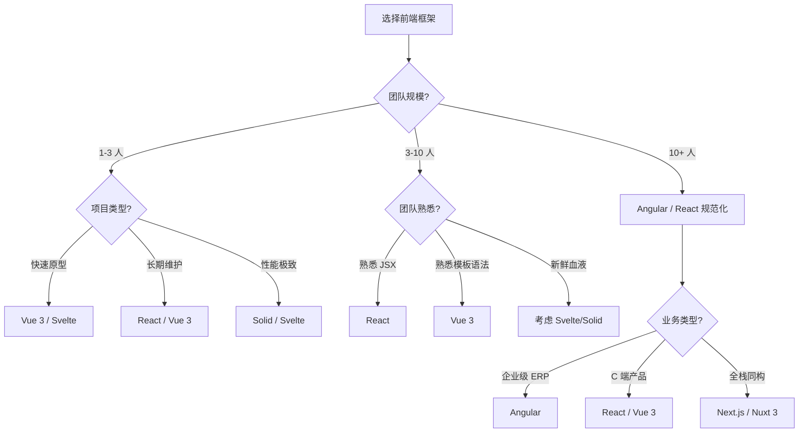

<DifficultyBadge level="beginner" />

# 框架对比与选型

## 一句话解释

没有"最好的框架"，只有**最适合团队和项目的框架**——选型考量的核心是：生态成熟度、团队技术栈、性能需求、项目生命周期。

## 主流框架设计哲学

```mermaid
flowchart TD
    subgraph React[React: 库而非框架]
        A1[UI = fn(state)] --> A2[纯 JS 灵活度高]
        A2 --> A3[选型成本在开发者]
        A3 --> A4[你需要自己搭路由/状态管理/构建]
    end
    subgraph Vue[Vue: 渐进式框架]
        B1[渐进式: 从页面到应用] --> B2[官方路由+状态管理]
        B2 --> B3[学习曲线平缓]
        B3 --> B4[适合团队技术栈差异大的场景]
    end
    subgraph Angular[Angular: 全家桶]
        C1[模块化 + DI + RxJS] --> C2[强规范约束]
        C2 --> C3[适合大型企业级项目]
        C3 --> C4[团队需要 discipline]
    end
    subgraph New[新兴框架]
        D1[Svelte: 编译时框架] --> D2[无 VDOM]
        E1[Solid: 细粒度响应式] --> E2[性能极致]
    end

    style React fill:#e0f2fe,stroke:#2563eb
    style Vue fill:#dcfce7,stroke:#16a34a
    style Angular fill:#fef3c7,stroke:#d97706
    style New fill:#f3e8ff,stroke:#7c3aed
```

## 核心对比

| 维度 | React 18 | Vue 3 | Angular 17 | Svelte 5 | Solid |
|------|---------|-------|------------|----------|-------|
| **作者** | Meta | Evan You | Google | Rich Harris | Ryan Carniato |
| **类型** | UI 库 | 渐进式框架 | 全栈框架 | 编译时框架 | 响应式库 |
| **模板** | JSX | SFC (`.vue`) | TypeScript + HTML | `.svelte` | JSX |
| **响应式** | 状态 + VDOM Diff | Proxy + VDOM | Zone.js + Change Detection | 编译时 + 无 VDOM | Signal + 无 VDOM |
| **状态管理** | 社区方案 | Pinia (官方) | RxJS + Services | stores (内置) | Signal 原生 |
| **路由** | React Router | Vue Router (官方) | Angular Router (内置) | svelte-spa-router | 社区 |
| **SSR** | Next.js / Remix | Nuxt 3 | Angular Universal | SvelteKit | SolidStart |
| **学习曲线** | 🟡 中 | 🟢 低 | 🔴 高 | 🟢 低 | 🟡 中 |
| **包体积** | ~42KB | ~33KB | ~140KB+ | ~5KB (编译后) | ~8KB |
| **性能** | ⭐⭐⭐ | ⭐⭐⭐⭐ | ⭐⭐⭐ | ⭐⭐⭐⭐⭐ | ⭐⭐⭐⭐⭐ |
| **生态成熟度** | ⭐⭐⭐⭐⭐ | ⭐⭐⭐⭐ | ⭐⭐⭐ | ⭐⭐ | ⭐⭐ |

## 关键差异深入

### 1. 响应式方案对比

```javascript
// React: 状态 + VDOM
const [count, setCount] = useState(0)
setCount(count + 1)  // 触发整个组件树的 VDOM Diff

// Vue 3: Proxy 拦截 + VDOM
const count = ref(0)
count.value++  // Proxy 拦截，精确到组件级别的更新

// Solid: Signal 细粒度响应式
const [count, setCount] = createSignal(0)
setCount(count() + 1)  // 直接更新使用 count() 的 DOM 节点
```

| 框架 | 更新粒度 | 是否需要 VDOM | 运行时开销 |
|------|---------|--------------|-----------|
| React | 组件级（从根或触发点） | 是 | VDOM Diff |
| Vue 3 | 组件级（精确追踪依赖） | 是（但优化后 Diff 轻量） | Proxy + VDOM |
| Angular | 组件级（从根检查） | 否 | Zone.js 脏检查 |
| Svelte | 编译时精确到节点 | 否 | 几乎无 |
| Solid | 精确到 DOM 节点 | 否 | 近乎零 |

### 2. 数据流模式

```mermaid
flowchart LR
    subgraph React
        A1[单向数据流] --> B1[Props 从上到下]
        B1 --> C1[setState / dispatch 逆向上报]
    end
    subgraph Vue
        A2[v-model 双向绑定] --> B2[响应式自动追踪]
        B2 --> C2[父子组件自动同步]
    end
    subgraph Angular
        A3[双向绑定 + RxJS] --> B3[( ) 输入 / 事件输出]
        B3 --> C3[可观察数据流]
    end
```

### 3. 选型决策树



## 面试问法

- 🔥 **React 和 Vue 3 的核心区别是什么？**
  - 设计哲学：React 是库（灵活度高/选型自由）vs Vue 是框架（渐进式/官方方案）
  - 响应式：React 不可变状态 + VDOM vs Vue 可变数据 + Proxy 追踪
  - 模板：JSX（JS 驱动）vs SFC（HTML 增强）
  - 状态管理：社区方案 vs 官方 Pinia

- 🔥 **你觉得哪个框架好？为什么？**
  - 没有绝对的好坏，取决于团队和项目
  - 如果是面试，回答："我主要用 React，但对 Vue 3 也有深入了解。选型时会考量生态、团队、性能需求……"

- ⭐ **为什么 Svelte/Solid 不需要 VDOM？**
  - 它们在编译阶段就能确定哪些变量影响哪些 DOM 节点
  - 运行时直接更新对应节点，不需要 VDOM Diff
  - 代价：编译时分析增加了构建复杂度，动态场景（如动态列表）可能需要额外处理

## 💡 AI 辅助学习

> 用这个 Prompt 让 AI 帮你模拟框架选型面试：
> "你是一个 CTO，要为公司的新项目选择前端框架。团队 8 人，5 人熟悉 React，3 人熟悉 Vue。项目是一个面向用户的 SaaS 平台，预计维护 3-5 年。
> 请提问我 3 个关于框架选型的问题，我来回答，你给出评价和建议。"

## 关联知识

- [React 核心概念](./react-core) — React 设计哲学
- [Vue 3 核心概念](./vue-core) — Vue 3 设计哲学
- [状态管理方案对比](./state-management) — 各框架状态管理方案
