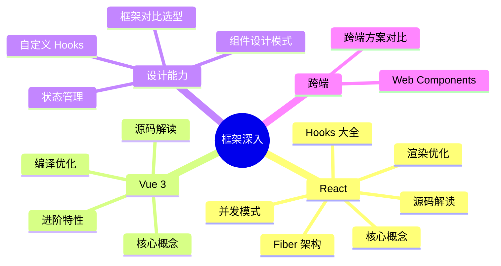

# ⚛️ 框架深入

React、Vue 3、组件设计、跨端方案 — **面试中的重头戏**，中高级岗位 60%+ 的技术面时间都在考察框架理解深度。共 16 个知识点，从使用到源码逐步深入。

<DifficultyBadge level="beginner" /> 框架使用经验 · <DifficultyBadge level="intermediate" /> 理解原理与优化 · <DifficultyBadge level="advanced" /> 源码与架构设计

::: tip 💡 建议
不管你的主力框架是什么，**React 和 Vue 的核心机制都要了解**——面试中经常交叉考察你对框架设计哲学的理解。
:::

---

## 🟢 入门（6 个）

掌握这些，你能熟练使用主流框架进行开发。

  <a href="./react-core" class="card">
    <h3>React 核心概念 <Badge type="info" text="🔥高频" /></h3>
    
JSX、虚拟 DOM、组件生命周期、单向数据流

  </a>
  <a href="./react-hooks" class="card">
    <h3>React Hooks 大全 <Badge type="info" text="🔥高频" /></h3>
    
useState/useEffect/useRef/useMemo/useCallback/自定义 Hooks

  </a>
  <a href="./vue-core" class="card">
    <h3>Vue 3 核心概念 <Badge type="info" text="🔥高频" /></h3>
    
Composition API、ref/reactive、生命周期、模板语法

  </a>
  <a href="./vue-advanced" class="card">
    <h3>Vue 3 进阶特性 <Badge type="info" text="⭐中频" /></h3>
    
Suspense、Teleport、自定义指令、插件系统

  </a>
  <a href="./framework-comparison" class="card">
    <h3>框架对比与选型 <Badge type="info" text="🔥高频" /></h3>
    
React vs Vue vs Angular vs Svelte vs Solid 设计哲学差异

  </a>
  <a href="./state-management" class="card">
    <h3>状态管理方案对比 <Badge type="info" text="🔥高频" /></h3>
    
Redux/Zustand/Pinia/Jotai/Recoil 选型指南

  </a>

---

## 🟡 进阶（6 个）

理解框架的底层机制，让你在优化和排查问题时游刃有余。

  <a href="./react-fiber" class="card">
    <h3>React Fiber 架构 <Badge type="info" text="🔥高频" /></h3>
    
协调算法、Fiber 树结构、双缓冲、任务调度

  </a>
  <a href="./react-optimization" class="card">
    <h3>React 渲染优化 <Badge type="info" text="🔥高频" /></h3>
    
React.memo、useMemo、useCallback、bailout 机制

  </a>
  <a href="./react-concurrent" class="card">
    <h3>React 并发模式 <Badge type="info" text="⭐中频" /></h3>
    
Transition、Suspense、useDeferredValue、并发渲染

  </a>
  <a href="./vue-compile-optimize" class="card">
    <h3>Vue 3 编译优化 <Badge type="info" text="⭐中频" /></h3>
    
PatchFlag、Tree Shaking、静态提升、Block Tree

  </a>
  <a href="./custom-hooks" class="card">
    <h3>自定义 Hooks 设计 <Badge type="info" text="⭐中频" /></h3>
    
Hook 组合模式、抽象粒度、测试策略、常见场景封装

  </a>
  <a href="./component-patterns" class="card">
    <h3>组件设计模式 <Badge type="info" text="🔥高频" /></h3>
    
render props、HOC、Compound Component、控制反转

  </a>

---

## 🔴 高级（4 个）

P7+ 面试的"分水岭"知识点，考察对框架本质的理解。

  <a href="./react-source" class="card">
    <h3>React 源码解读 <Badge type="info" text="⭐中频" /></h3>
    
createRoot、beginWork/completeWork、commit 阶段、Hooks 链表

  </a>
  <a href="./vue-source" class="card">
    <h3>Vue 3 源码解读 <Badge type="info" text="⭐中频" /></h3>
    
响应式系统、依赖追踪、渲染器、编译器

  </a>
  <a href="./cross-platform" class="card">
    <h3>跨端方案对比 <Badge type="info" text="📌了解" /></h3>
    
React Native、Flutter、Taro、uni-app 原理对比

  </a>
  <a href="./web-components" class="card">
    <h3>Web Components <Badge type="info" text="📌了解" /></h3>
    
Custom Elements、Shadow DOM、HTML Templates、浏览器原生组件

  </a>

