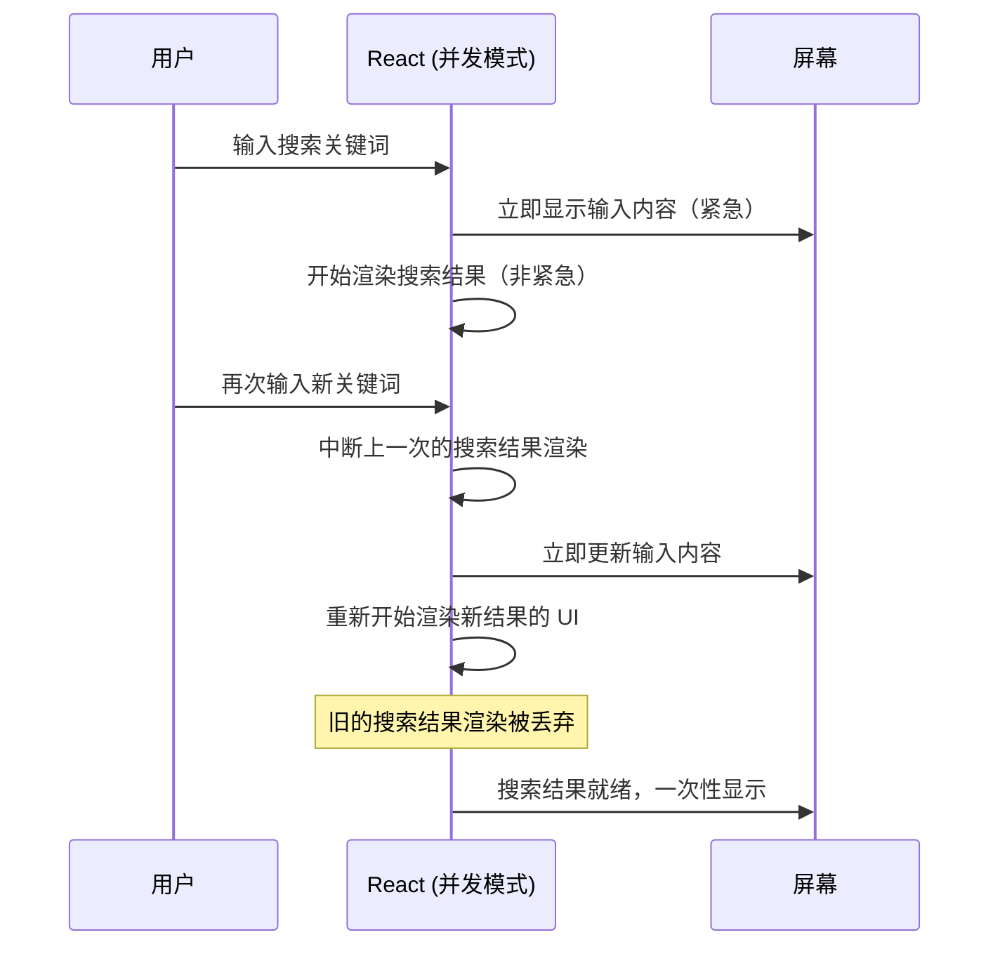
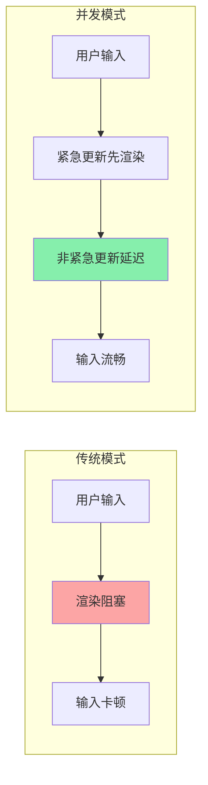

<DifficultyBadge level="intermediate" />

# React 并发模式

## 一句话解释

React 并发模式让 React **能同时准备多个版本的 UI**——高优先级的更新（用户输入）优先处理，低优先级的更新（搜索结果）可以"等一下"，不会阻塞用户操作。

## 核心流程



## 深入理解

### 1. 什么是并发模式？

并发模式不是"让渲染变快"，而是**让 React 能"中断"和"恢复"渲染工作**。

```javascript
// 没有并发：一个更新开始了就不能停
setQuery('a')
// 开始渲染→花费 500ms→渲染完成
// 用户想输入 'ab'，但被卡住了

setQuery('ab')  // 等上面的渲染完才能开始
```

```javascript
// 有并发：低优先级渲染可中断
const [query, setQuery] = useState('')
const [searchResults, setSearchResults] = useState([])

// 紧急：输入框的值要立即显示
setQuery('a')  // 立即执行

// 非紧急：搜索结果可以等一下
startTransition(() => {
  setSearchResults(filterData('a'))
})

// 用户此时输入 'ab'
setQuery('ab')  // 立即执行，中断上面的搜索结果渲染
startTransition(() => {
  setSearchResults(filterData('ab'))  // 重新开始
})
```

### 2. startTransition — 标记非紧急更新

```javascript
import { startTransition, useState } from 'react'

function SearchPage() {
  const [query, setQuery] = useState('')
  const [results, setResults] = useState([])
  
  function handleInput(e) {
    // 紧急：更新输入框
    setQuery(e.target.value)
    
    // 非紧急：更新搜索结果（可以被中断）
    startTransition(() => {
      setResults(search(e.target.value))
    })
  }
  
  // useTransition 还能读取 pending 状态
  const [isPending, startTransition] = useTransition()
  
  return (
    <div>
      <input value={query} onChange={handleInput} />
      {isPending && <Spinner />}  {/* 过渡期间显示加载态 */}
      <Results data={results} />
    </div>
  )
}
```

| API | 用途 | 特点 |
|-----|------|------|
| `startTransition(callback)` | 标记回调内的更新为非紧急 | 可被更高优先级更新打断 |
| `useTransition()` | 返回 [isPending, startTransition] | 提供过渡期间的状态 |

**什么场景用 Transition：**
- 输入搜索 → 更新列表（列表可以等一下）
- 切换 Tab → 加载 Tab 内容
- 提交表单 → 显示确认页
- 任何**不需要即时反馈**的 UI 更新

### 3. useDeferredValue — 延迟一个值

```javascript
import { useDeferredValue, useState } from 'react'

function SearchPage({ data }) {
  const [query, setQuery] = useState('')
  
  // query 会立即更新，deferredQuery 会"滞后"
  const deferredQuery = useDeferredValue(query)
  
  // 根据 deferredQuery 计算（可能比较慢）
  const results = useMemo(() => {
    return data.filter(item => item.includes(deferredQuery))
  }, [deferredQuery, data])
  
  return (
    <div>
      <input
        value={query}
        onChange={e => setQuery(e.target.value)}
      />
      <Results list={results} />
    </div>
  )
}
```

**useDeferredValue vs startTransition：**

| 对比 | startTransition | useDeferredValue |
|------|----------------|-----------------|
| 使用方式 | 包裹 setState | 包裹状态值 |
| 适用场景 | 你有控制权的地方 | 你无法修改 setState（如 props 传下来的值） |
| 本质 | 标记更新优先级 | 延迟值的更新 |
| 效果 | 类似 | 类似 |

### 4. Suspense + 并发模式

Suspense 在并发模式下更强大——可以**避免"加载闪烁"**：

```javascript
import { Suspense, startTransition } from 'react'

function Page() {
  const [tab, setTab] = useState('profile')
  
  function switchTab(nextTab) {
    startTransition(() => {
      setTab(nextTab)
    })
  }
  
  return (
    <div>
      <button onClick={() => switchTab('profile')}>Profile</button>
      <button onClick={() => switchTab('dashboard')}>Dashboard</button>
      
      <Suspense fallback={<Spinner />}>
        {tab === 'profile' ? <ProfilePage /> : <DashboardPage />}
      </Suspense>
    </div>
  )
}
```

**并发模式 + Suspense 的效果：**
1. 用户点击 Tab → UI 不会立即切换到新 Tab → 旧 Tab 内容继续显示
2. React 在后台等待新 Tab 的数据
3. 数据就绪后 → "瞬间"切换到新 Tab（没有 loading 态）
4. 避免**加载闪烁**（loading → 显示 → loading → 显示）

### 5. 并发模式的实际收益



| 场景 | 传统 React | 并发模式 |
|------|-----------|---------|
| 输入框实时搜索 | 每次输入都触发列表重渲染 → 卡顿 | 输入优先，搜索结果渲染可中断 |
| Tab 切换 | 切换→加载数据→显示 | 旧 Tab 保持显示→数据就绪→瞬间切换 |
| 大列表过滤 | 过滤条件变化→全量重渲染 | 过滤过程可中断，新输入优先 |
| 表单提交后跳转 | 提交→阻塞→跳转 | 过渡动画先行，逻辑在后台执行 |

### 6. 常见误区

```javascript
// ❌ 过度使用：简单计算不需要 Transition
startTransition(() => {
  setCount(count + 1)
})  // 没必要，简单的 setState 不阻塞

// ✅ 合理使用：计算量大的 UI 更新
startTransition(() => {
  setFilteredList(heavyComputation(largeList, filter))
})

// ❌ 不能控制异步操作
startTransition(async () => {
  const data = await fetch('/api/data')
  setData(data)
})  // Transition 包装的是 setState，不是异步操作
```

**Transition 的作用范围：**
- 只影响 `setState` 的**渲染优先级**
- 不影响异步请求本身
- 如果 update 很快（< 10ms），Transition 不会延迟它

## 面试问法

- 🔥 **React 并发模式是什么？解决了什么问题？**
  - 让渲染可中断：高优先级更新（用户输入）优先，低优先级（搜索结果）可延迟
  - 解决的问题：大型页面中每次更新都不可中断导致的卡顿

- ⭐ **startTransition 和 useDeferredValue 的区别？**
  - startTransition：包裹 setState，标记为非紧急更新
  - useDeferredValue：延迟一个值，用于你无法控制 setState 的地方
  - 本质相同，使用方式不同

- ⭐ **Suspense + 并发模式的效果是什么？**
  - 避免加载闪烁：旧 UI 保持到新内容就绪，然后瞬间切换
  - 比传统 loading → 内容 的体验更流畅

- ⭐ **并发模式一定能提升性能吗？**
  - 不提升"渲染速度"，提升的是"感知性能"——用户操作的响应速度
  - 适合计算量大、更新频繁的场景
  - 简单页面不需要用

## 💡 AI 辅助学习

> 用这个 Prompt 理解并发模式：
> "请用餐厅🍽️的比喻来解释 React 并发模式：
> - 传统模式 = 一个厨师做完一道菜才能做下一道（即使后面的客人只是要杯水）
> - 并发模式 = 厨师可以停下耗时的炖菜，先给另一个客人倒水……
> 请基于这个比喻详细解释 startTransition、useDeferredValue、Suspense 的角色。"

## 关联知识

- [React Fiber 架构](./react-fiber) — 并发模式的基础
- [React 渲染优化](./react-optimization) — 渲染优化对比
- [React 源码解读](./react-source) — 深入并发实现
