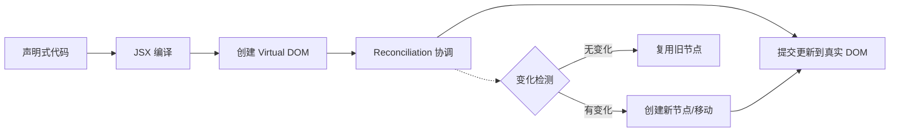
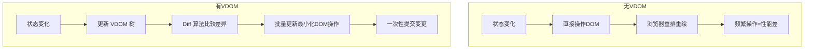
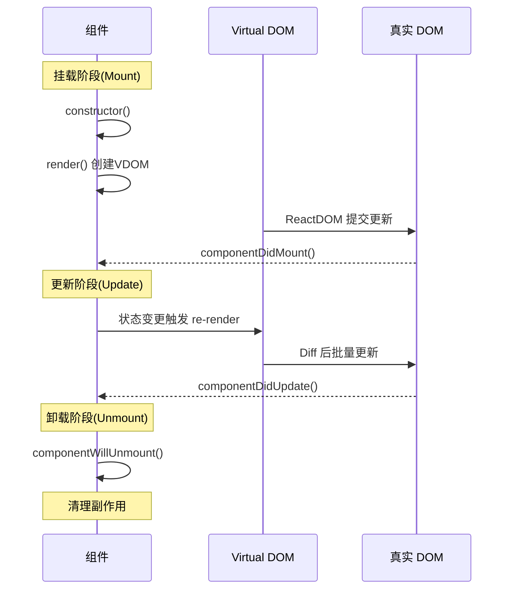
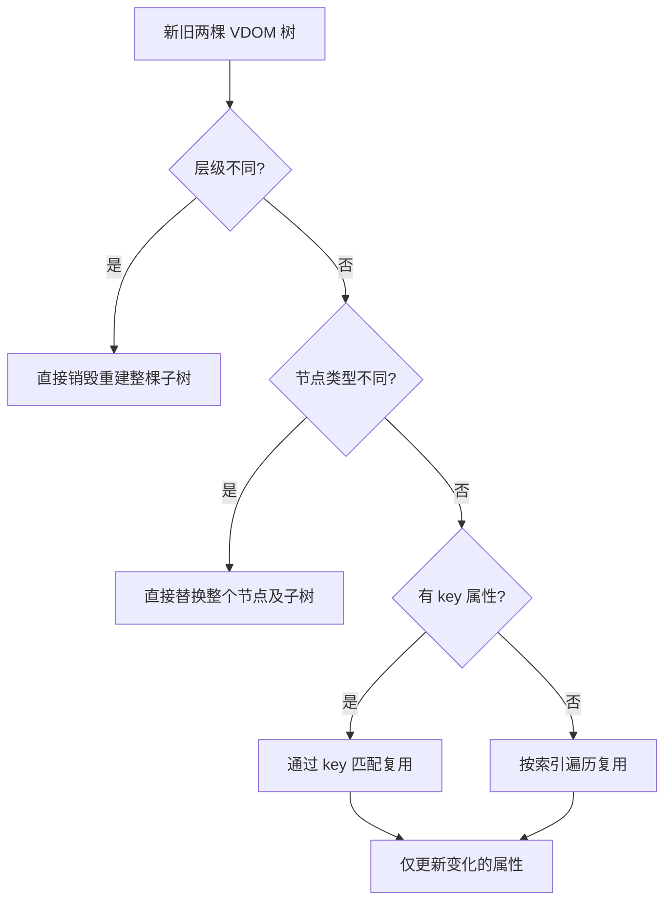
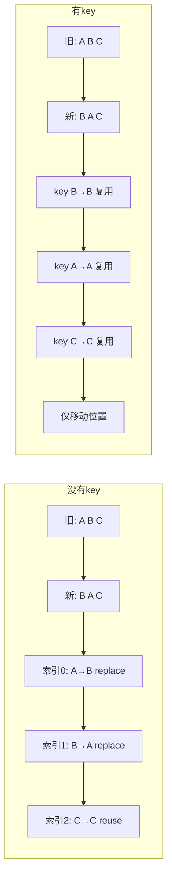

<DifficultyBadge level="beginner" />

# React 核心概念

## 一句话解释

React 是一个**声明式 UI 库**——你描述"UI 应该长什么样"，React 负责"怎么高效更新它"。

## 核心流程



## 三大核心理念

### 1. 声明式（Declarative）

**命令式 vs 声明式：**

```javascript
// ❌ 命令式：告诉"怎么做"
const ul = document.getElementById('list')
const li = document.createElement('li')
li.textContent = 'item'
ul.appendChild(li)

// ✅ 声明式：告诉"要什么"
function List({ items }) {
  return (
    <ul id="list">
      {items.map(item => <li key={item}>{item}</li>)}
    </ul>
  )
}
```

### 2. Virtual DOM

Virtual DOM 是一个**轻量级的 JS 对象树**，是真实 DOM 的"虚拟副本"。

```javascript
// Virtual DOM 节点 ≈ 一个普通对象
const vnode = {
  type: 'div',
  props: { className: 'container' },
  children: [
    { type: 'h1', props: {}, children: ['Hello'] }
  ]
}
```

**为什么需要 Virtual DOM？**



> Virtual DOM 不是"比原生 DOM 快"，而是**保证在任意场景下都能提供可接受的性能**，同时让你不用手动操作 DOM。

### 3. 组件生命周期

React 组件的生命周期分为三个阶段：



#### Hooks 时代对应关系

| 类组件 | Hooks 替代 | 执行时机 |
|--------|-----------|---------|
| `constructor` | `useState` 初始值 / `useMemo` | 首次渲染 |
| `componentDidMount` | `useEffect(fn, [])` | 首次渲染后 |
| `componentDidUpdate` | `useEffect(fn, [deps])` | 依赖变化后 |
| `componentWillUnmount` | `useEffect(() => fn, [])` 的清理函数 | 卸载前 |
| `shouldComponentUpdate` | `React.memo` / `useMemo` | 重渲染前 |
| `getDerivedStateFromProps` | 直接在渲染中计算 | 每次渲染 |

```javascript
function LifecycleDemo({ id }) {
  // Mount + Update: 每次渲染都执行
  useEffect(() => {
    console.log('每次渲染后执行')

    // 清理函数 = componentWillUnmount
    return () => console.log('清理上一次 effect')
  })

  // Mount 时执行一次
  useEffect(() => {
    fetchData(id)
  }, []) // 空依赖 = 仅 mount 时执行

  // 依赖变化时执行
  useEffect(() => {
    console.log('id 变化了:', id)
  }, [id])

  return <div>{id}</div>
}
```

## Diff 算法核心策略

React 的 Diff 算法基于三个假设，**确保时间复杂度从 O(n³) 降到 O(n)**：



**三条策略：**
1. **层级比较**：只做同层比较，跨层级移动 = 销毁重建
2. **类型比较**：节点类型不同直接替换，不继续比较子树
3. **Key 优化**：通过 `key` 标识节点身份，实现最小化移动

### Key 的重要性

```javascript
// ❌ 没有 key — 按索引复用，可能导致状态错乱
{items.map((item, index) => <Item data={item} />)}

// ✅ 有稳定的 key — React 能准确识别每个节点
{items.map(item => <Item key={item.id} data={item} />)}
```



## 面试问法

- 🔥 **Virtual DOM 是什么？比直接操作 DOM 快吗？**
  - Virtual DOM ≈ 内存中的 JS 对象树，通过 Diff 最小化 DOM 操作
  - 不是更快，而是保证**可接受的性能** + **开发体验** + **跨平台能力**
  
- 🔥 **React 组件生命周期有哪些？Hooks 如何对应？**
  - 三阶段：Mount(挂载) → Update(更新) → Unmount(卸载)
  - Hooks: `useEffect` 及其依赖数组可组合模拟所有生命周期
  
- ⭐ **Diff 算法的三条策略是什么？**
  - 同层比较 + 类型判断 + Key 优化
  
- ⭐ **为什么列表渲染需要 key？可以用 index 吗？**
  - 帮助 React 识别节点身份，实现最小化 DOM 操作
  - 列表不变 + 纯展示 = index 可接受；有增删改 = 必须用稳定 id

## 💡 AI 辅助学习

> 用这个 Prompt 让 AI 帮你理解 React 渲染流程：
> "我是一名前端开发者，正在复习 React 核心概念。请模拟 React 从状态更新到 DOM 渲染的完整过程，包含：触发更新 → 调度 → 协调(Diff) → 提交 → 渲染，用比喻帮我理解。"

## 关联知识

- [React Hooks 大全](/frameworks/react-hooks) — 常用 Hooks 原理与最佳实践
- [React Fiber 架构](/frameworks/react-fiber) — Fiber 调度机制详细解析
- [React 渲染优化](/frameworks/react-optimization) — 避免不必要的重渲染
