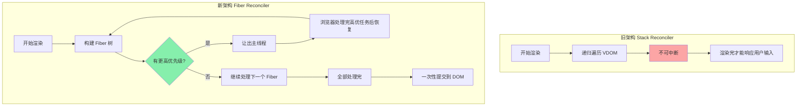
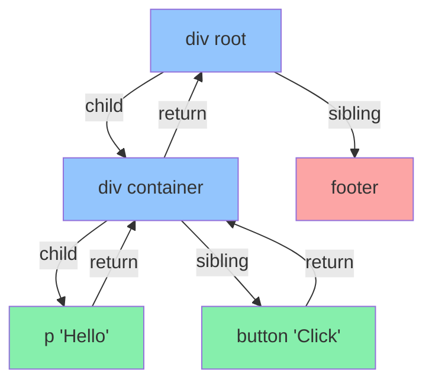
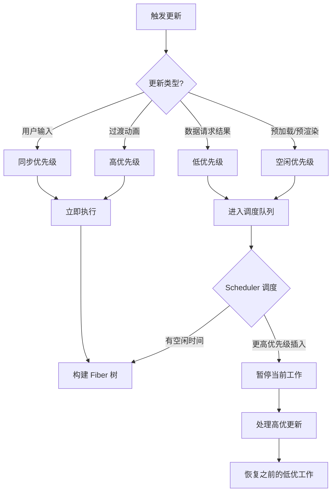

<DifficultyBadge level="intermediate" />

# React Fiber 架构

## 一句话解释

Fiber 是 React 16 引入的**新协调引擎**——它将渲染拆成可中断的小单元，让 React 能在渲染过程中暂停、让位给更高优先级的任务（如用户输入），从而解决大型页面卡顿问题。

## 核心流程



## 深入理解

### 1. 为什么需要 Fiber？

React 15 的 Stack Reconciler 是**递归同步**的——一旦开始渲染，就会一口气遍历完整棵 VDOM 树，期间无法中断。这在大型页面上会导致：

- 渲染耗时 > 16ms → 掉帧 → 页面卡顿
- 用户输入无法及时响应
- 动画卡顿

```javascript
// 伪代码：Stack Reconciler（递归，不可中断）
function render(node) {
  if (node.type === 'div') {
    // 处理这个节点
    updateDOM(node)
    // 递归处理子节点
    node.children.forEach(child => render(child))
  }
}
// 一旦调用 render，中间无法暂停
```

Fiber 将递归改为**链表遍历**，每个节点是一个 Fiber 节点，可以中途暂停和恢复。

```javascript
// 伪代码：Fiber Reconciler（链表，可中断）
function workLoop(deadline) {
  let shouldYield = false
  
  while (nextUnitOfWork && !shouldYield) {
    nextUnitOfWork = performUnitOfWork(nextUnitOfWork)
    shouldYield = deadline.timeRemaining() < 1  // 没时间了就暂停
  }
  
  if (nextUnitOfWork) {
    requestIdleCallback(workLoop)  // 下次空闲继续
  }
}
```

### 2. Fiber 节点结构

每个 Fiber 节点对应一个 React 元素，但额外携带了链表指针：

```typescript
interface Fiber {
  // 类型信息
  type: 'div' | 'span' | FunctionComponent | ...
  key: string | null
  
  // 链表指针（核心）
  child: Fiber | null       // 指向第一个子节点
  sibling: Fiber | null     // 指向下一个兄弟节点
  return: Fiber | null      // 指向父节点（处理完后返回）
  
  // 双缓冲
  alternate: Fiber | null   // 指向 workInProgress 树中对应的节点
  
  // 状态
  pendingProps: any
  memoizedProps: any
  memoizedState: any        // Hooks 链表
  
  // 副作用
  flags: Flags              // 标记增/删/改
  nextEffect: Fiber | null  // 副作用链表
}
```

**Fiber 树的遍历顺序：**



遍历顺序：**先深度走到叶子 → 走兄弟 → 返回父节点继续**
```
div(root) → div(container) → p → (p 无子/兄弟，return 到 div)
→ button → (button 无子/兄弟，return 到 div)
→ (div 无兄弟，return 到 root)
→ footer → (footer 无子/兄弟，return 到 root)
→ 完成
```

### 3. 双缓冲机制

Fiber 用两棵树来管理渲染状态：

| 树 | 说明 |
|------|------|
| **current** | 当前屏幕上显示的内容对应的 Fiber 树 |
| **workInProgress** | 正在构建的"下一帧" Fiber 树 |

```
current (正在显示)        workInProgress (正在构建)
     Fiber A                  Fiber A' (alternate)
     /    \                   /    \
  Fiber B Fiber C         Fiber B' Fiber C'
```

**工作流程：**
1. 状态变化 → 在 workInProgress 树上执行协调
2. workInProgress 从 current 克隆（通过 `alternate` 指针复用）
3. 协调过程中 workInProgress 不断更新，current 不变
4. 协调完成 → `commitRoot()` → workInProgress 变成 current
5. 旧的 current 变成新的 workInProgress（复用）

> 双缓冲的优势：**用户永远不会看到"半渲染"的状态**——要么看到完整的 current，要么看到完整的下一帧。

### 4. 任务调度与优先级



**React 的优先级级别（从高到低）：**

| 优先级 | 对应场景 | 说明 |
|--------|---------|------|
| `Immediate` | 用户输入、点击 | 同步执行，不能中断 |
| `UserBlocking` | 悬停、滚动 | 需要快速响应，允许微中断 |
| `Normal` | 普通更新、数据请求 | 正常优先级 |
| `Low` | 分析上报、日志 | 可以延迟 |
| `Idle` | 预渲染、预加载 | 浏览器空闲时处理 |

### 5. Reconcilation 过程

Fiber 的协调分为两个阶段：

**Render 阶段（可中断）：**
- 遍历 Fiber 树，找出所有变更
- 为需要增/删/改的节点打上 `flags` 标记
- 构建 Effect List
- 这个阶段可以中断、恢复、甚至放弃

**Commit 阶段（不可中断）：**
- 拿到 Render 阶段的 Effect List
- 一口气执行所有 DOM 操作
- 触发 `useLayoutEffect`（同步）
- 触发 `useEffect`（异步）
- 这个阶段一旦开始就必须执行完毕

```javascript
// 伪代码：Render 阶段（可中断）
function performUnitOfWork(fiber) {
  // 处理当前 Fiber，判断是否需要变更
  reconcileChildren(fiber)
  
  // 返回下一个要处理的 Fiber
  if (fiber.child) return fiber.child      // 优先子节点
  while (fiber) {
    if (fiber.sibling) return fiber.sibling // 然后兄弟节点
    fiber = fiber.return                   // 都没有就返回父节点
  }
}

// 伪代码：Commit 阶段（不可中断）
function commitRoot() {
  // 一次性执行所有 DOM 操作
  let effect = finishedWork.nextEffect
  while (effect) {
    if (effect.flags & Placement) {
      // 插入节点
    } else if (effect.flags & Update) {
      // 更新节点
    } else if (effect.flags & Deletion) {
      // 删除节点
    }
    effect = effect.nextEffect
  }
}
```

## 面试问法

- 🔥 **React Fiber 解决了什么问题？**
  - 解决 Stack Reconciler 递归不可中断的问题
  - 实现增量渲染：渲染过程可中断、可恢复、可放弃
  - 让用户输入和动画能优先响应，避免卡顿

- 🔥 **Fiber 的双缓冲是什么？**
  - current 树显示当前 UI，workInProgress 树构建下一帧
  - commit 后两棵树的角色互换
  - 优势：用户不会看到半渲染状态

- ⭐ **Fiber 的调度机制怎么工作的？**
  - 不同更新有不同优先级（Immediate > UserBlocking > Normal > Low > Idle）
  - Scheduler 根据剩余时间决定是否让出主线程
  - 高优先级更新可以打断低优先级的渲染工作

- ⭐ **Render 阶段和 Commit 阶段的区别？**
  - Render：可中断，找出变更，打标记
  - Commit：不可中断，一次性执行 DOM 操作
  - Commit 中执行 useLayoutEffect（同步），useEffect 在之后异步执行

## 💡 AI 辅助学习

> 用这个 Prompt 深入理解 Fiber：
> "你是一个 React 核心贡献者。请用开车🚗的比喻来解释 React Fiber 架构：Stack Reconciler 像是没有红绿灯的路口——所有车同时通过，大堵车时谁也动不了。Fiber 像是装了智能红绿灯……请完成这个比喻，详细解释 Fiber 的双缓冲和调度机制。"

## 关联知识

- [React 核心概念](./react-core) — JSX、VDOM、生命周期
- [React Hooks 大全](./react-hooks) — Hooks 与 Fiber 的关系
- [React 渲染优化](./react-optimization) — 避免不必要的重渲染
