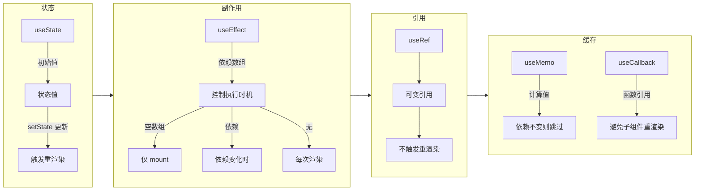

<DifficultyBadge level="beginner" />

# React Hooks 大全

## 一句话解释

Hooks 让你在**函数组件里"钩入"React 的特性**——状态管理、副作用、引用、缓存——不用写 class，组件更简洁。

## 核心流程



## 深入理解

### 1. useState — 状态管理

```javascript
const [count, setCount] = useState(0)

// 三种更新方式
setCount(1)                 // 直接设置
setCount(prev => prev + 1)  // 函数式更新（推荐：下一个值依赖前一个时）
setCount(1)                  // 对象/数组需传新引用
```

**关键规则：**
- 状态更新是**异步**的——多次 `setCount` 在同一个渲染周期内会被批量处理
- 状态更新触发**重渲染**，组件函数重新执行
- 使用对象/数组时，必须传**新引用**，不能直接修改

```javascript
// ❌ 不会触发重渲染
const [user, setUser] = useState({ name: 'Alice' })
user.name = 'Bob'        // 直接修改了状态对象
setUser(user)             // 引用没变，React 认为没变化

// ✅ 创建新对象
setUser({ ...user, name: 'Bob' })
```

### 2. useEffect — 副作用管理

```javascript
// 三种执行时机
useEffect(() => {
  console.log('每次渲染后执行')
})  // 无依赖：每次渲染都执行

useEffect(() => {
  fetchData(id)
}, [])  // 空依赖：仅在 mount 时执行一次（类似 componentDidMount）

useEffect(() => {
  console.log('id 变了:', id)
}, [id])  // 有依赖：依赖变化时执行（类似 componentDidUpdate）

// 清理函数（类似 componentWillUnmount）
useEffect(() => {
  const timer = setInterval(() => tick(), 1000)
  return () => clearInterval(timer)  // 卸载前清理 / 下次 effect 前清理
}, [])
```

| 依赖数组 | 执行时机 | 典型场景 |
|---------|---------|---------|
| 无 | 每次渲染后 | 调试日志 |
| `[]` | 仅 mount | 数据请求、事件绑定 |
| `[a, b]` | a 或 b 变化时 | 响应式数据同步 |

**⚠️ 常见坑：闭包陷阱**

```javascript
function Counter() {
  const [count, setCount] = useState(0)

  useEffect(() => {
    const timer = setInterval(() => {
      setCount(count + 1)    // ❌ count 始终是 0（闭包捕获了初始值）
    }, 1000)
    return () => clearInterval(timer)
  }, [])

  // ✅ 用函数式更新修复
  useEffect(() => {
    const timer = setInterval(() => {
      setCount(prev => prev + 1)  // 不依赖外部变量
    }, 1000)
    return () => clearInterval(timer)
  }, [])
}
```

### 3. useRef — 引用

```javascript
// 用法一：DOM 引用
const inputRef = useRef(null)

useEffect(() => {
  inputRef.current.focus()  // mount 后自动聚焦
}, [])

return <input ref={inputRef} />

// 用法二：存储可变值（不触发重渲染）
const renderCount = useRef(0)
renderCount.current += 1    // 组件每渲染一次 +1，但组件不会因此重渲染
```

| useState | useRef |
|----------|--------|
| 更新触发重渲染 | 更新不触发重渲染 |
| 异步更新 | 同步更新 |
| 适合 UI 状态 | 适合 DOM 引用 / 可变值 / 旧值保留 |

### 4. useMemo & useCallback — 性能优化

```javascript
// useMemo：缓存计算结果
const sortedList = useMemo(() => {
  return items.sort((a, b) => a.name.localeCompare(b.name))
}, [items])  // 只有 items 变化时才重新计算

// useCallback：缓存函数引用
const handleClick = useCallback(() => {
  setCount(prev => prev + 1)
}, [])  // 只有依赖变化时才创建新函数
```

| 特性 | useMemo | useCallback |
|------|---------|-------------|
| 返回 | 缓存的值 | 缓存的函数 |
| 等价 | `useMemo(() => fn, deps)` | `useCallback(fn, deps)` |
| 场景 | 避免重复计算 | 配合 `React.memo` 避免子组件重渲染 |
| 滥用风险 | 增加内存占用 | 增加内存占用 |

**⚠️ 不要过早优化**：只有发现性能问题时才用。大部分场景不需要 `useMemo` / `useCallback`。

### 5. 自定义 Hooks — 逻辑复用

```javascript
// 自定义 Hook：管理在线状态
function useOnlineStatus() {
  const [isOnline, setIsOnline] = useState(navigator.onLine)

  useEffect(() => {
    const handleOnline = () => setIsOnline(true)
    const handleOffline = () => setIsOnline(false)

    window.addEventListener('online', handleOnline)
    window.addEventListener('offline', handleOffline)
    return () => {
      window.removeEventListener('online', handleOnline)
      window.removeEventListener('offline', handleOffline)
    }
  }, [])

  return isOnline
}

// 使用
function StatusBar() {
  const isOnline = useOnlineStatus()
  return <div>{isOnline ? '✅ 在线' : '❌ 离线'}</div>
}
```

**自定义 Hooks 设计原则：**
- 以 `use` 开头（React 约定）
- 内部可以使用其他 Hooks
- 一个 Hook 只做一件事
- 返回值用解构或对象，方便使用者

## 面试问法

- 🔥 **useEffect 的依赖数组怎么用？空数组和没有依赖有什么区别？**
  - 空数组 = mount 时执行一次；无依赖 = 每次渲染后都执行；有依赖 = 依赖变化时执行
  - 关键点：**依赖数组不是"触发条件"，而是"同步声明"**——告诉 React"这个 effect 依赖什么值"

- 🔥 **useRef 和 useState 有什么区别？什么时候用 ref？**
  - useState 更新触发重渲染，useRef 更新不触发
  - ref 适合：DOM 引用、计时器 ID、不需要展示在 UI 上的可变值

- ⭐ **useMemo 和 useCallback 为什么要用？什么时候不用？**
  - 避免重复计算 + 保持引用稳定性
  - 不用：简单计算、基本类型值、组件不复杂时

- ⭐ **为什么 Hooks 不能写在条件判断里？**
  - React 依赖**调用顺序**来关联状态——每次渲染必须按相同顺序调用相同 Hooks
  - 条件判断会破坏调用顺序，导致状态错乱

## 💡 AI 辅助学习

> 用这个 Prompt 让 AI 帮你练习 Hooks：
> "我是一个 React 开发者，正在复习 Hooks 面试题。请出 5 道关于 useEffect 闭包陷阱的代码题，每道题给出代码，让我判断输出，然后给出详细分析。难度从简单到复杂递增。"

## 关联知识

- [React 核心概念](./react-core) — JSX、VDOM、生命周期
- [React Fiber 架构](./react-fiber) — 调度机制详解
- [React 渲染优化](./react-optimization) — 避免不必要的重渲染
